# Simple Database - using append-only log and Hash index

Let's say we have two bash functions
- `db_set key value` stores `key` and `value` in the database
- `db_get key` to get the value

The underlying storage format is simple: 
    - a text file where each line contains a key-value pair, separated by a comma
    - Every call to `db_set` appends to the end of the file
    - So, if we update the key-value several times, the old versions of the value are not overwritten
        - the latest value will be at the later end of the file

The `db_set` function has pretty good performance for something so simple - appending to a file is pretty quick
    - This append only data-file is called a _log_

OTOH, `db_get` has terrible performance
    - basically loop through the whole database and find the last occurrence
    - thus `O(n)`

In order to find the value of a particular key, we need a different structure called an _index_
- An index is additional structure that is derived from the primary data.
- Many databases allow you to add and remove custom indexes
- Adding indexes does not affect the content of the database, it only affects the performance of queries
- Well-chosen indexes speeds up queries, 
- but every index slows down _writes_

### Hash Index

Keep an in-memory hash map where every key is mapped to a byte offset in the data file - the location at which the value can be found

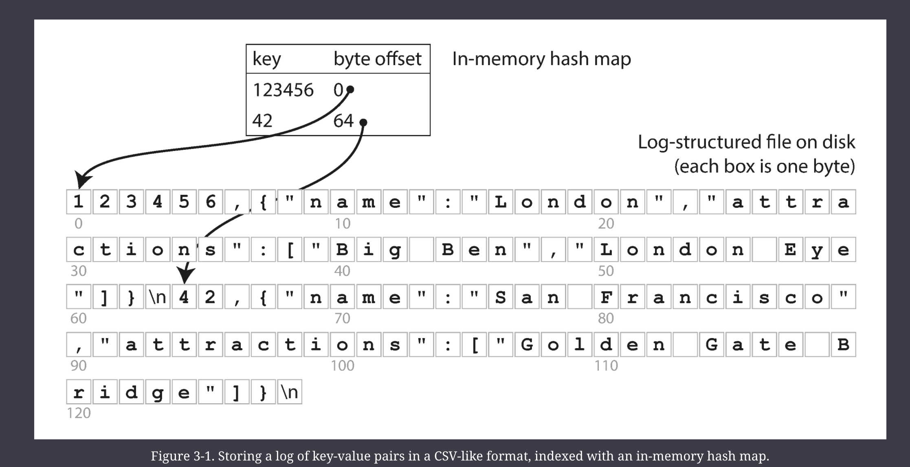

The hashmap is kept in memory/RAM

This type of index is used in BitCask (storage engine in Riak)

A storage engine like BitCask is well suited to the situations where the value for each key is updated frequently
- e.g. The key might be the URL of a cat video, and the value might be the number of times it has been played (incremented every time someone hits the play button)
- In this kind of workload, there are a lot of writes, but there are not too many distinct keys
    - You have a large number of writes per key, but it's feasilbe to keep all keys in memory

### Segments

Question: If we always append to a file, how do we avoid eventually running out of disk space
- A good solution is to break the log into segments of a certain size by closing a segment file when it reaches a certain size
    - and making subsequent writes to a new segment
- We can then perform *compaction* on these segments
- Compaction means throwing away duplicate keys in the log, and keeping only the most recent update for each key

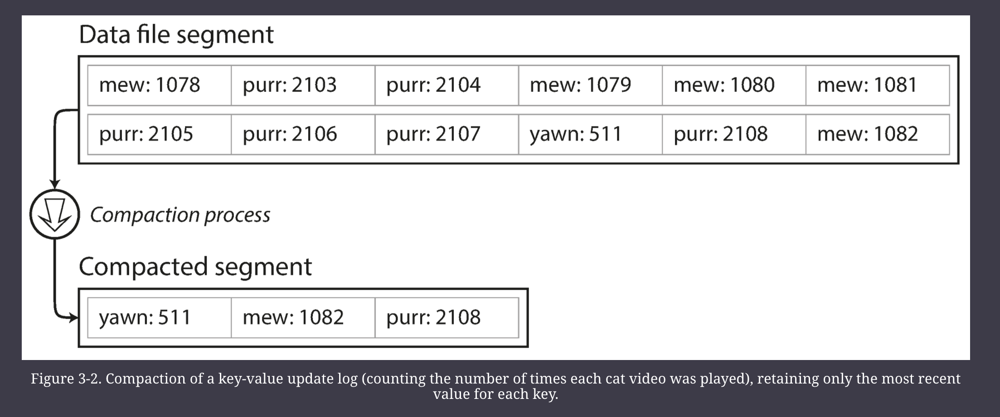

Since compaction often makes segments much smaller (assuming that a key is over-written within one segment), we can also merge several segments together at the same time as performing the compaction
- Segments are never modified after they have been written (immutable)
- so the merged segment is written to a new file
- Thus, merging and compaction can be done using a background thread
    - while we continue to serve the read requests using the old segment files
    - and write requests to the latest segment files
- After the merging process is complete, we switch read requests to the new merged segments 
- and then delete the old segment files

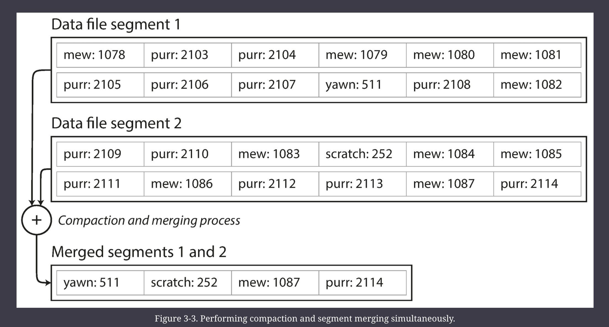

Each segment has its own in-memory hash table, mapping keys to the file offsets.
- In order to find the value for a key, we first check the most recent segment’s hash map; 
- if the key is not present we check the second-most-recent segment, and so on. 
- The merging process keeps the number of segments small, so lookups don’t need to check many hash maps.

### Issues and solutions 

Some issues and how they are solved: 
- File Format
    - the log often uses binary format (first encodes the length of a string in bytes, followed by raw strings)
- Deleting records
    - to delete a key, we append a special deletion record (called a tombstone)
    - when log segments are merged, the tombstones tell the merging process to discard any previous values for the deleted keys
- Crash Recovery
    - if the database is restarted, the in-memory hash maps are lost
    - We could generate the hash maps again, but that is slow
    - BitCask speeds up recovery by storing a snapshot of each segment's hashmap on disk
- Partially Written records
    - The database may crash at any time, including half-way through appending a record of the log
    - BitCask includes checksums to prevent that
- Concurrency Control
    - a common implementation is to have one writer thread, since appends are in a strictly sequential order
- The hash table must fit in memory, so if you have a very large number of keys, you’re out of luck
    - you could maintain a hash map on disk, but unfortunately it is difficult to make an on-disk hash map perform well.
- Range queries are not efficient
    - e.g., to scan over all keys between `kitty00000` and `kitty99999`, we'd have to look up each key individually in the hash maps

—

# SSTables

In SSTables, the sequence of key-value pairs in log-structured storage is sorted by key
- This is called Sorted String Table
- as opposed to the previous section where key-value pairs are just appended to the log without sorting.

With this format, we cannot append new KV pairs to the segment immediately, since writes can occur in any order.

### Advantages

1. Merging segments is simple and efficient, even if the files are bigger than the available memory
    - you start reading the input files side by side, look at the first key in each file, copy the lowest key (according to the sort order) to the output file, and repeat. This produces a new merged segment file, also sorted by key.
    - When multiple segments contain the same key, we can keep the value from the most recent segment and discard the values in older segments.
2. We no longer need to keep an index for ALL keys to find a particular key
    - e.g. looking for key `handiwork` in the diagram below, we know it must exist between the known offsets for `handbag` and `handsome`
  
  
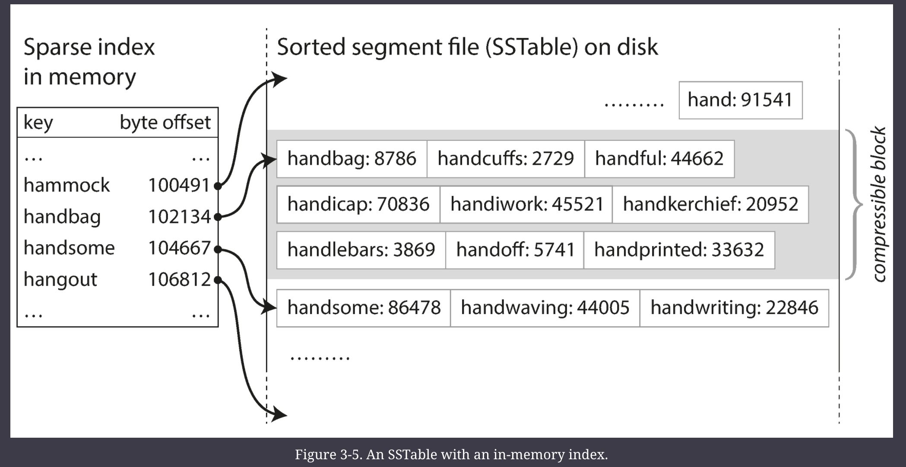

3. Since read requests need to scan over several key-value pairs in the requested range anyway, it is possible to group those records into a block and compress it before writing it to disk (indicated by the shaded area in the above figure). Each entry of the sparse in-memory index then points at the start of a compressed block. Besides saving disk space, compression also reduces the I/O bandwidth use.

### Constructing and maintaining SSTables

There are plenty of DS we can use to maintain an SSTable in memory - like red-black tree or AVL tree
    - With these DS, you can insert keys in any order and read them back in sorted order

The Storage engine works as follows:
- When a write comes in, add it to an in-memory balanced tree DS, called a _memtable_
- When the _memtable_ gets bigger than some threshold, typically a few MBs, write it out to a disk as an SSTable
    - This can be done efficiently because the tree already maintains the key value pairs sorted by key.
- In order to serve a read request
    - first try to find the key in _memtable_ 
    - then in the most recent on-disk segment
    - then in the next older one and so on
- From time to time, run a merging and compaction process in the background to combine segment files and to discard overwritten or deleted values

This scheme works very well. It only suffers from one problem: 
- if the database crashes, the most recent writes (which are in the memtable but not yet written out to disk) are lost. 
- In order to avoid that problem, we can keep a separate log on disk to which every write is immediately appended, just like in the previous section. 
- That log is not in sorted order, but that doesn’t matter, because its only purpose is to restore the memtable after a crash. 
- Every time the memtable is written out to an SSTable, the corresponding log can be discarded.

### LSM Tree

Log-Structured Merge Tree

Storage engines that are based on the principle of merging and compacting sorted files are called LSM Storage

#### LSM Tree vs SST

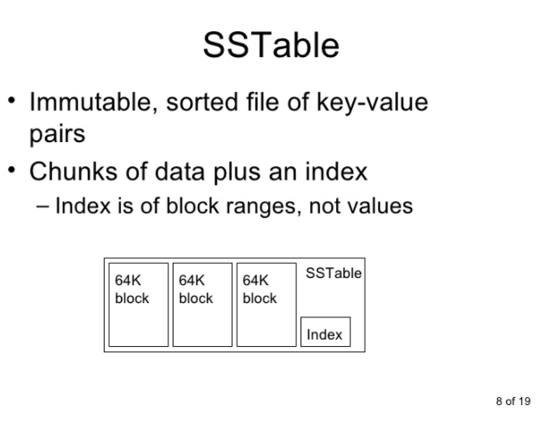

https://en.wikipedia.org/wiki/Log-structured_merge-tree

https://stackoverflow.com/questions/58168809/what-is-the-differences-between-the-term-sstable-and-lsm-tree

https://etcnotes.com/posts/sstable-and-lsm/

Even though there are many subtleties, the basic idea of LSM-trees—keeping a cascade of SSTables that are merged in the background—is simple and effective. Even when the dataset is much bigger than the available memory it continues to work well. Since data is stored in sorted order, you can efficiently perform range queries (scanning all keys above some minimum and up to some maximum), and because the disk writes are sequential the LSM-tree can support remarkably high write throughput.

—

## B Trees

B-Trees are another way to index key-value pairs as opposed  to the log-structured indexes discussed previously.

B-trees keep key-value pairs sorted by key, which allows efficient key-value lookups and range queries. But that’s where the similarity ends: B-trees have a very different design philosophy.

The log-structured indexes we saw earlier break the database down into variable-size _segments_, typically several megabytes or more in size, and always write a segment sequentially. 
- By contrast, B-trees break the database down into fixed-size _blocks_ or _pages_, traditionally 4 KB in size (sometimes bigger) 
- and read or write one page at a time. 
- This design corresponds more closely to the underlying hardware, as disks are also arranged in fixed-size blocks.

Each page can be identified using an address or location, which allows one page to refer to another—similar to a pointer, but on disk instead of in memory. 
- We can use these page references to construct a tree of pages, as illustrated below

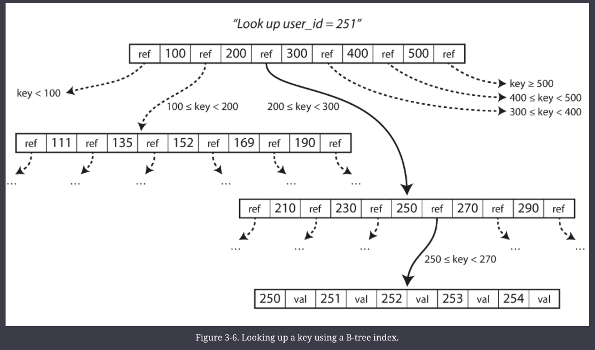

One page is designated as the *root* of the B-tree; 
- whenever you want to look up a key in the index, you start here. 
- The page contains several keys and references to child pages. 
- Each child is responsible for a continuous range of keys, and the keys between the references indicate where the boundaries between those ranges lie.

The number of references to child pages in one page of the B-tree is called the _branching factor_.
- 6 in the above diagram
-  In practice, the branching factor depends on the amount of space required to store the page references and the range boundaries
-  but typically it is several hundred.

If you want to update the value for an existing key in a B-tree
- you search for the leaf page containing that key, change the value in that page, and write the page back to disk (any references to that page remain valid). 

If you want to add a new key, you need to find the page whose range encompasses the new key and add it to that page. 
- If there isn’t enough free space in the page to accommodate the new key, it is split into two half-full pages, and the parent page is updated to account for the new subdivision of key ranges

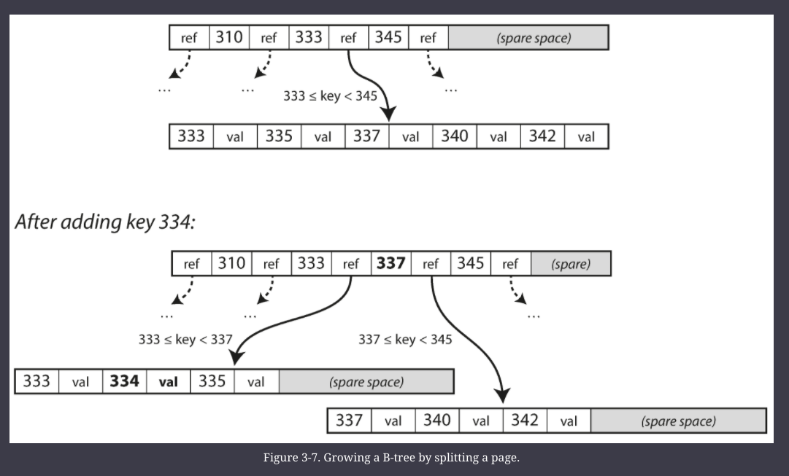

This algorithm ensures that the tree remains _balanced_: 
- a B-tree with _n_ keys always has a depth of _O_(log _n_). 
- Most databases can fit into a B-tree that is three or four levels deep, so you don’t need to follow many page references to find the page you are looking for.
- A four-level tree of 4 KB pages with a branching factor of 500 can store up to 250 TB.

#### Making B Trees Reliable 

The basic underlying write operation of a B-tree is to overwrite a page on disk with new data. It is assumed that the overwrite does not change the location of the page; i.e., all references to that page remain intact when the page is overwritten.

If you split a page because an insertion caused it to be overfull, you need to write the two pages that were split, and also overwrite their parent page to update the references to the two child pages. 
- This is a dangerous operation, because if the database crashes after only some of the pages have been written, you end up with a corrupted index (e.g., there may be an _orphan_ page that is not a child of any parent).
- In order to make the database resilient to crashes, it is common for B-tree implementations to include an additional data structure on disk: a **write-ahead log** (WAL, also known as a _redo log_). 
    - This is an append-only file to which every B-tree modification must be written before it can be applied to the pages of the tree itself. 
    - When the database comes back up after a crash, this log is used to restore the B-tree back to a consistent state

Careful Concurrency control is required - since multiple threads acting on B-Tree may leave it in inconsistent state (because B-Tree are mutable as opposed to LSM)
- This is typically done by protecting the Tree's DS with _latches_ (light weight locks)
- Log-structured approaches are simpler in this regard, because they do all the merging in the background without interfering with incoming queries and atomically swap old segments for new segments from time to time.

#### Optimizations

- Instead of WAL, some DBs use copy-on-write scheme
    - a modified page is written to a different location, and a new version of the parent pages in the tree is created, pointing at the new location
    - This approach is useful for concurrency control
- We can save space in pages by not storing the entire key, but abbreviating it.
    - Especially in pages on the interior of the tree, keys only need to provide enough information to act as boundaries between key ranges. 
    - Packing more keys into a page allows the tree to have a higher branching factor, and thus fewer levels.
- Pages can be placed anywhere on the disk
    - but that requires many disk seeks
    - another option is to lay out the leaf pages in a sequential order on disk
    - But then it becomes difficult to maintain this order as the tree grows
- Add additional pointers
    - e.g. each leaf page may have references to its siblings to the left and right

#### Comparing LST Trees and B-Trees

LSM-trees are typically faster for writes, whereas B-trees are thought to be faster for reads.
- Reads are typically slower on LSM-trees because they have to check several different data structures and SSTables at different stages of compaction.

**Write Amplification**
- happens when on write to the DB results in multiple writes to the disk over the course of the database's lifetime
    - It is of particular concern on SSD, which can only overwrite blocks a limited number of times before wearing out
- In write-heavy applications, the performance bottleneck might be the rate at which the database can write to disk. 
    - In this case, write amplification has a direct performance cost: the more that a storage engine writes to disk, the fewer writes per second it can handle within the available disk bandwidth.

###### Advantages of LSM Trees

A B-Tree must write every piece of data twice: once to the WAL, and once to the tree page itself (and perhaps again as pages are split)
- There is also overhead from having to write an entire page at a time, even if only a few bytes in that page changed.
- Some storage engines even overwrite the same page twice in order to avoid ending up with a partially updated page in the event of a power failure

Log-structured indexes also rewrite data multiple times due to repeated compaction and merging of SSTables.
- LSM-trees are typically able to sustain higher write throughput than B-trees, partly because they sometimes have lower write amplification 
- (although this depends on the storage engine configuration and workload)
- and partly because they sequentially write compact SSTable files rather than having to overwrite several pages in the tree

LSM-trees are typically able to sustain higher write throughput than B-trees, partly because they sometimes have lower write amplification (although this depends on the storage engine configuration and workload), and partly because they sequentially write compact SSTable files rather than having to overwrite several pages in the tree 

LSM-trees can be compressed better, and thus often produce smaller files on disk than B-trees. 
- B-tree storage engines leave some disk space unused due to fragmentation: 
    - when a page is split or when a row cannot fit into an existing page, some space in a page remains unused. 
- Since LSM-trees are not page-oriented and periodically rewrite SSTables to remove fragmentation, they have lower storage overheads, especially when using leveled compaction

###### Downsides of LSM Trees

A downside of log-structured storage is that the compaction process can sometimes interfere with the performance of ongoing reads and writes.
- disks have limited resources, so it can easily happen that a request needs to wait while the disk finishes an expensive compaction operation.

Another issue with compaction arises at high write throughput: the disk’s finite write bandwidth needs to be shared between the initial write (logging and flushing a memtable to disk) and the compaction threads running in the background.
- When writing to an empty database, the full disk bandwidth can be used for the initial write, but the bigger the database gets, the more disk bandwidth is required for compaction.

An advantage of B-trees is that each key exists in exactly one place in the index
- whereas a log-structured storage engine may have multiple copies of the same key in different segments. 
- This aspect makes B-trees attractive in databases that want to offer strong transactional semantics: 
    - in many relational databases, transaction isolation is implemented using locks on ranges of keys, and in a B-tree index, those locks can be directly attached to the tree

— 

### Clustered Index

The key in an index is the thing that queries search for, but the value can be one of two things: 
1. it could be the actual row (document, vertex) in question
2. or it could be a reference to the row stored elsewhere. 
    - In the latter case, the place where rows are stored is known as a heap file
    - and it stores data in no particular order (it may be append-only, or it may keep track of deleted rows in order to overwrite them with new data later). 
    - The heap file approach is common because it avoids duplicating data when multiple secondary indexes are present: 
    - each index just references a location in the heap file, and the actual data is kept in one place.

In some situations, the extra hop from the index to the heap file is too much of a performance penalty for reads, so it can be desirable to store the indexed row directly within an index. This is known as a _clustered index_.
 - For example, in MySQL’s InnoDB storage engine, the primary key of a table is always a clustered index, and secondary indexes refer to the primary key (rather than a heap file location)
 - In SQL Server, you can specify one clustered index per table

A compromise between a clustered index (storing all row data within the index) and a nonclustered index (storing only references to the data within the index) is known as a _covering index_ or _index with included columns_, which stores _some_ of a table’s columns within the index

### Multi-column indexes

The indexes discussed so far only map a single key to a value. That is not sufficient if we need to query multiple columns of a table (or multiple fields in a document) simultaneously.

The most common type of multi-column index is called a _concatenated index_, which simply combines several fields into one key by appending one column to another (the index definition specifies in which order the fields are concatenated). 
- This is like an old-fashioned paper phone book, which provides an index from (_lastname_, _firstname_) to phone number.

Multi-dimensional indexes are a more general way of querying several columns at once, which is particularly important for geospatial data.

On an ecommerce website you could use a three-dimensional index on the dimensions (_red_, _green_, _blue_) to search for products in a certain range of colors, or in a database of weather observations you could have a two-dimensional index on (_date_, _temperature_) in order to efficiently search for all the observations during the year

### In-Memory DBs

Compared to main memory, disks are awkward to deal with. 

With both magnetic disks and SSDs, data on disk needs to be laid out carefully if you want good performance on reads and writes. 

However, we tolerate this awkwardness because disks have two significant advantages: 
1. they are durable (their contents are not lost if the power is turned off)
2. and they have a lower cost per gigabyte than RAM.

As RAM becomes cheaper, the cost-per-gigabyte argument is eroded.

**Counterintuitively, the performance advantage of in-memory databases is not due to the fact that they don’t need to read from disk.** 
- Even a disk-based storage engine may never need to read from disk if you have enough memory, because the operating system caches recently used disk blocks in memory anyway. 
- Rather, they can be faster because they can avoid the overheads of encoding in-memory data structures in a form that can be written to disk

Besides performance, another interesting area for in-memory databases is providing data models that are difficult to implement with disk-based indexes. 
- For example, Redis offers a database-like interface to various data structures such as priority queues and sets.

—

## Analytics (OLAP) & Data Warehousing

Even though databases started being used for many different kinds of data—comments on blog posts, actions in a game, contacts in an address book, etc.—the basic access pattern remained similar to processing business transactions.
- the access pattern became known as _online transaction processing_ (OLTP).

However, databases also started being increasingly used for _data analytics_, which has very different access patterns.

For example, if your data is a table of sales transactions, then analytic queries might be:
* What was the total revenue of each of our stores in January?
* How many more bananas than usual did we sell during our latest promotion?    
* Which brand of baby food is most often purchased together with brand X diapers?

In order to differentiate this pattern of using databases from transaction processing, it has been called _online analytic processing_ (OLAP)

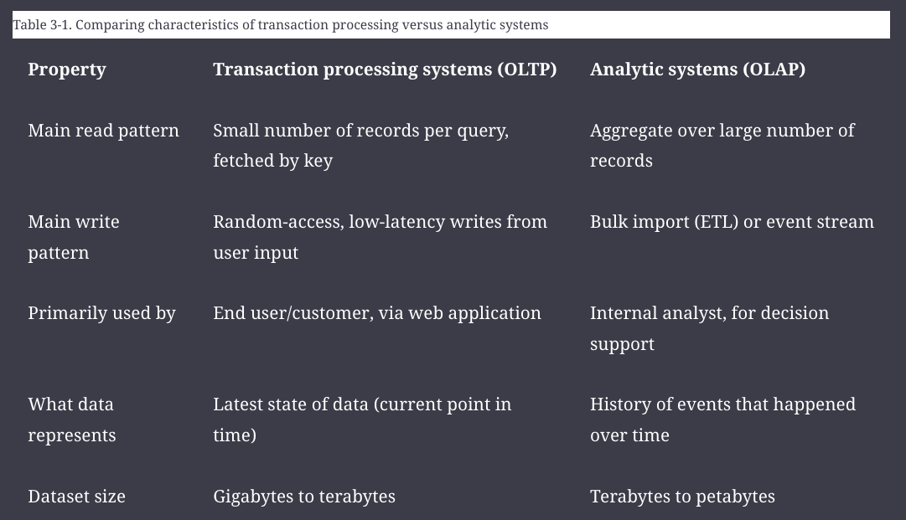

A _data warehouse_ is a separate database that analysts can query to their hearts’ content, without affecting OLTP operations

The data warehouse contains a read-only copy of the data in all the various OLTP systems in the company. 
- Data is extracted from OLTP databases (using either a periodic data dump or a continuous stream of updates)
    - transformed into an analysis-friendly schema
    - cleaned up
    - and then loaded into the data warehouse. 
- This process of getting data into the warehouse is known as _Extract–Transform–Load_ (ETL)

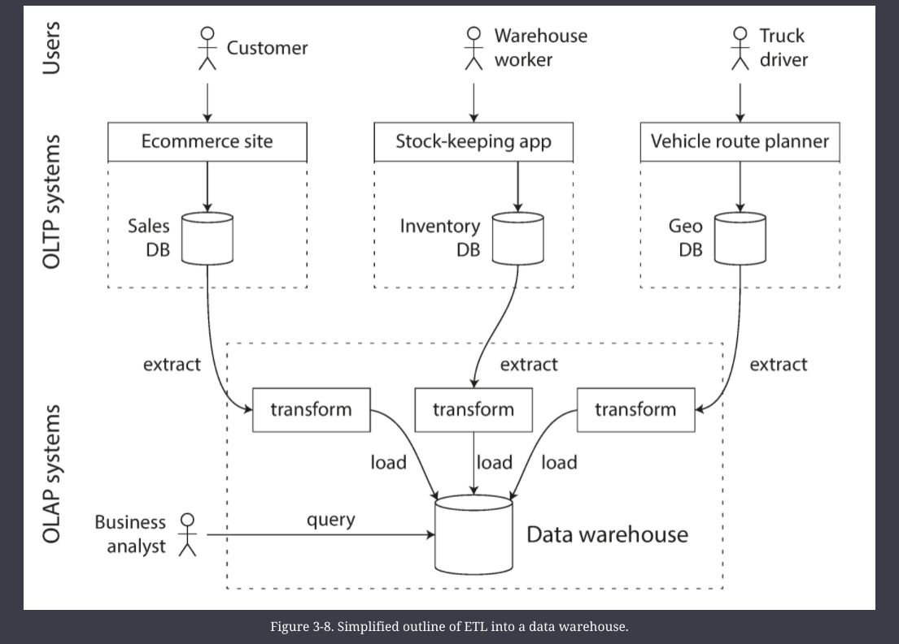

### Star Schema for Analytics

Many data warehouses are used in fairly formulaic stype, known as star schema (aka dimensional modelling).

The figure below shows a data warehouse that might be found at a grocery retailer. 
- At the center of the schema is a so-called _fact table_ (in this example, it is called `fact_sales`). 
- Each row of the fact table represents an event that occurred at a particular time (here, each row represents a customer’s purchase of a product). 
- If we were analyzing website traffic rather than retail sales, each row might represent a page view or a click by a user.

Some of the columns in the fact table are attributes, such as the price at which the product was sold and the cost of buying it from the supplier (allowing the profit margin to be calculated). 
- Other columns in the fact table are foreign key references to other tables, called _dimension tables_. 
- As each row in the fact table represents an event, the dimensions represent the _who_, _what_, _where_, _when_, _how_, and _why_ of the event.
- Even date and time are often represented using dimension tables, because this allows additional information about dates (such as public holidays) to be encoded, allowing queries to differentiate between sales on holidays and non-holidays.

A variation of this template is known as the _snowflake schema_, where dimensions are further broken down into subdimensions.

In a typical data warehouse, tables are often very wide: 
- fact tables often have over 100 columns, sometimes several hundred 
- Dimension tables can also be very wide, as they include all the metadata that may be relevant for analysis

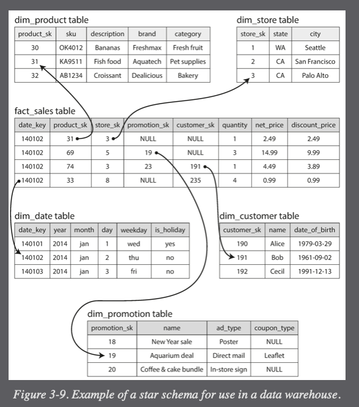

—

## Column-Oriented Storage

Although fact tables are often over 100 columns wide, a typical data warehouse query only accesses 4 or 5 of them at one time (`"SELECT *"` queries are rarely needed for analytics)

The idea behind column-oriented storage is simple: don't store all the values from one row together, but store all the values from each column together instead.
    - Column-oriented storage is used for easier OLAP
- If each column is stored in a separate file, a query only needs to read and parse those columns that are used in that query, which can save a lot of work.

#### Example

The query below accesses a large number of rows (every occurrence of someone buying fruit or candy during the 2013 calendar year), but it only needs to access three columns of the `fact_sales` table: `date_key`, `product_sk`, and `quantity`. The query ignores all other columns.

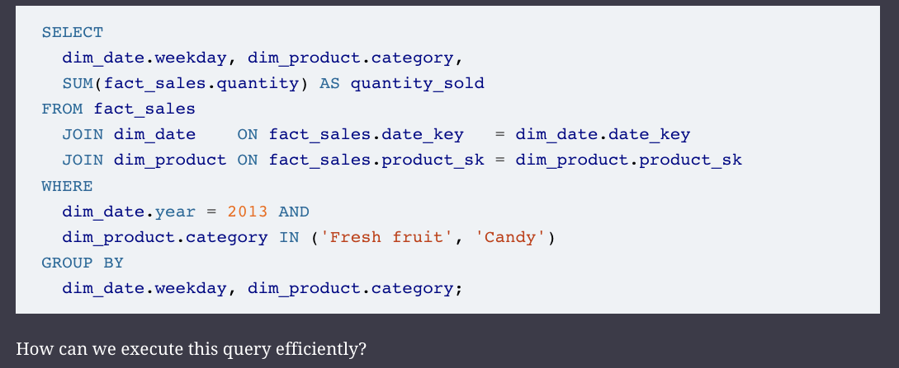

In most OLTP databases, storage is laid out in a _row-oriented_ fashion: 
- all the values from one row of a table are stored next to each other. 
- Document databases are similar: an entire document is typically stored as one contiguous sequence of bytes.

In order to process the query above:
- you may have indexes on `fact_sales.date_key` and/or `fact_sales.product_sk` that tell the storage engine where to find all the sales for a particular date or for a particular product. 
- But then, a row-oriented storage engine still needs to load all of those rows (each consisting of over 100 attributes) from disk into memory, parse them, and filter out those that don’t meet the required conditions. 
- That can take a long time.

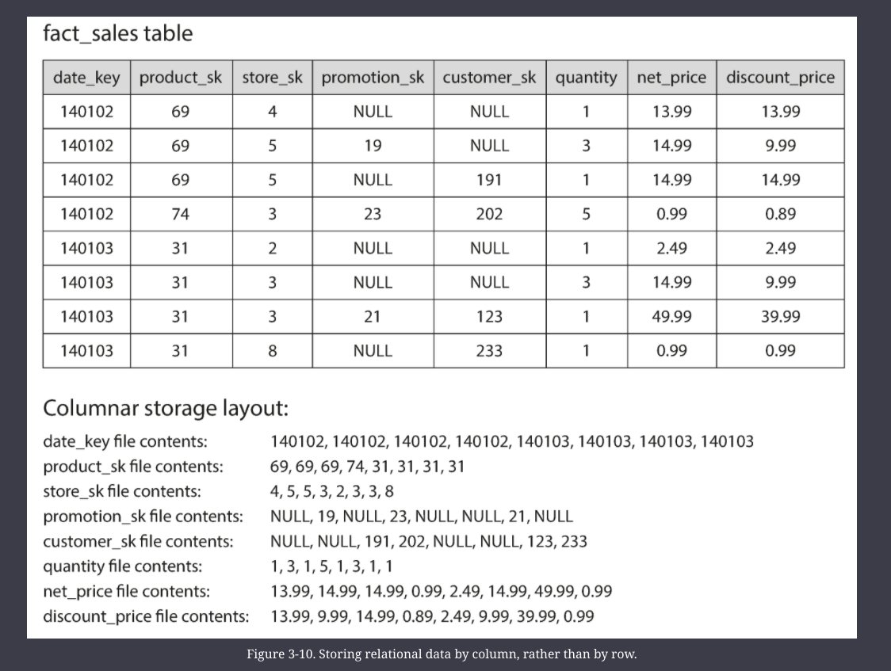

The column-oriented storage layout relies on each column file containing the rows in the same order. Thus, if you need to reassemble an entire row, you can take the 23rd entry from each of the individual column files and put them together to form the 23rd row of the table.

### Column Compression

Besides only loading those columns from disk that are required for a query, we can further reduce the demands on disk throughput by compressing data. Fortunately, column-oriented storage often lends itself very well to compression.

Depending on the data in the column, different compression techniques can be used. One technique that is particularly effective in data warehouses is _bitmap encoding_. 
    - Looking at the data above, it looks quite repetitive, which lends itself to compression using these techniques

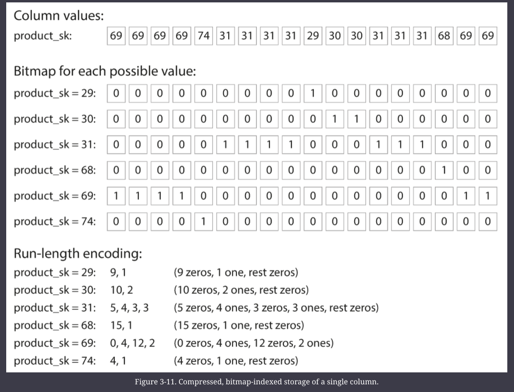

Often, the number of distinct values in a column is small compared to the number of rows 
- (for example, a retailer may have billions of sales transactions, but only 100,000 distinct products). 
- We can now take a column with _n_ distinct values and turn it into _n_ separate bitmaps: 
    - one bitmap for each distinct value, with one bit for each row. 
    - The bit is 1 if the row has that value, and 0 if not.

If _n_ is very small (for example, a _country_ column may have approximately 200 distinct values), those bitmaps can be stored with one bit per row. 
- But if _n_ is bigger, there will be a lot of zeros in most of the bitmaps (we say that they are _sparse_). 
- In that case, the bitmaps can additionally be run-length encoded, as shown in the above figure. 
- This can make the encoding of a column remarkably compact.

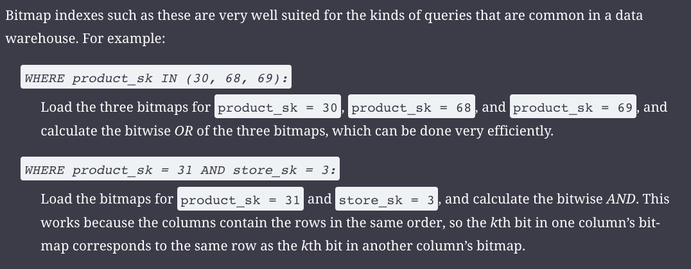

Operators, such as the bitwise _AND_ and _OR_ described previously, can be designed to operate on such chunks of compressed column data directly. This technique is known as _vectorized processing_

### Sort Order in Column Storage

We can choose to impose an order as we store the rows, and use that as an indexing mechanism.

Note that it wouldn’t make sense to sort each column independently, because then we would no longer know which items in the columns belong to the same row. 
- We can only reconstruct a row because we know that the _k_th item in one column belongs to the same row as the _k_th item in another column.
- Rather, the data needs to be sorted an entire row at a time, even though it is stored by column. 
- A second column can determine the sort order of any rows that have the same value in the first column.

Another advantage of sorted order is that it can help with compression of columns. If the primary sort column does not have many distinct values, then after sorting, it will have long sequences where the same value is repeated many times in a row.

### Writing to Column-Oriented Storage

Column-oriented storage, compression, and sorting all help to make those read queries faster. However, they have the downside of making writes more difficult.

An update-in-place approach, like B-trees use, is not possible with compressed columns. 
- If you wanted to insert a row in the middle of a sorted table, you would most likely have to rewrite all the column files. 
- As rows are identified by their position within a column, the insertion has to update all columns consistently.

Fortunately, we have already seen a solution, LSM Trees
- All writes first go to an in-memory store, where they are added to a sorted structure and prepared for writing to disk. 
- It doesn’t matter whether the in-memory store is row-oriented or column-oriented. When enough writes have accumulated, they are merged with the column files on disk and written to new files in bulk.

Queries need to examine both the column data on disk and the recent writes in memory, and combine the two. 
- However, the query optimizer hides this distinction from the user. 
- From an analyst’s point of view, data that has been modified with inserts, updates, or deletes is immediately reflected in subsequent queries.

### Materialized Views

Data warehouse queries often involve an aggregate function, such as COUNT, SUM, AVG, MIN, or MAX in SQL. 
- If the same aggregates are used by many different queries, it can be wasteful to crunch through the raw data every time. 
- Why not cache some of the counts or sums that queries use most often?

One way of creating such a cache is a materialized view. In a relational data model, it is often defined like a standard (virtual) view: a table-like object whose contents are the results of some query. 
- The difference is that a materialized view is an actual copy of the query results, written to disk
- whereas a virtual view is just a shortcut for writing queries. 
- When you read from a virtual view, the SQL engine expands it into the view’s underlying query on the fly and then processes the expanded query.