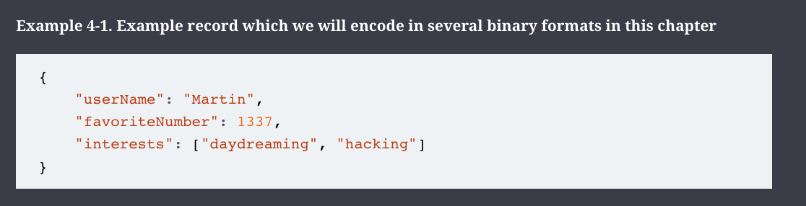
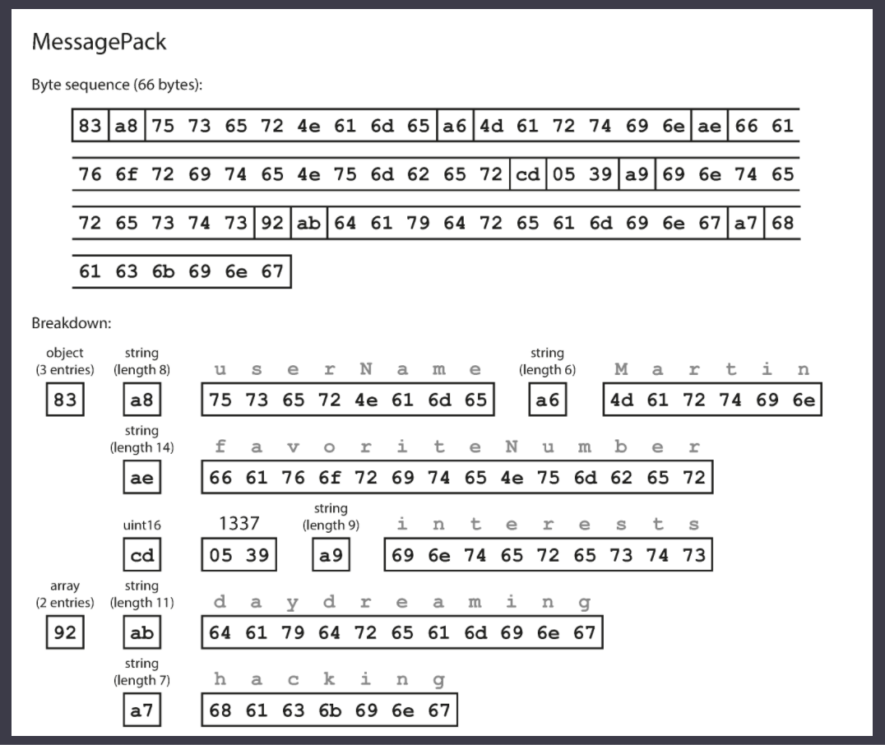
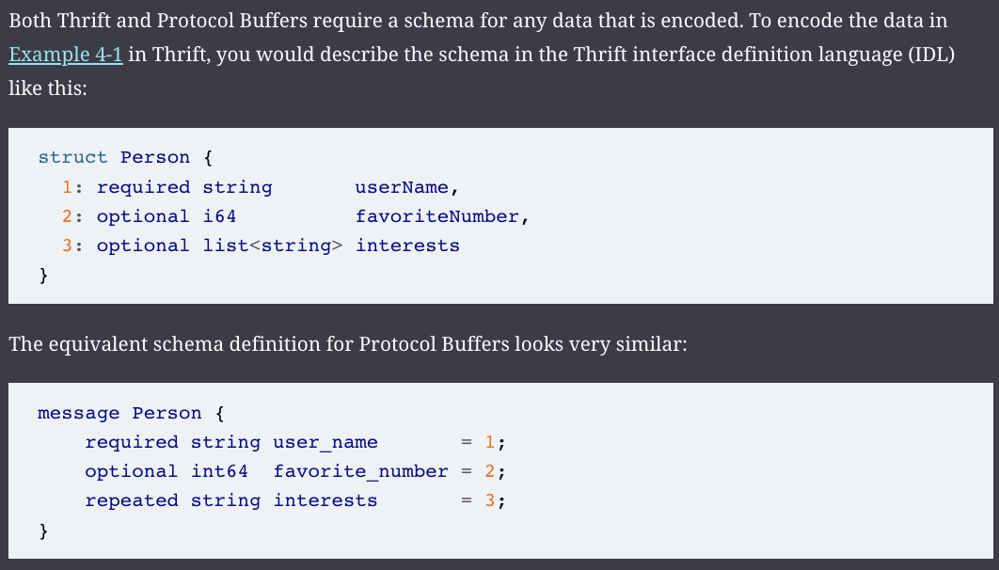
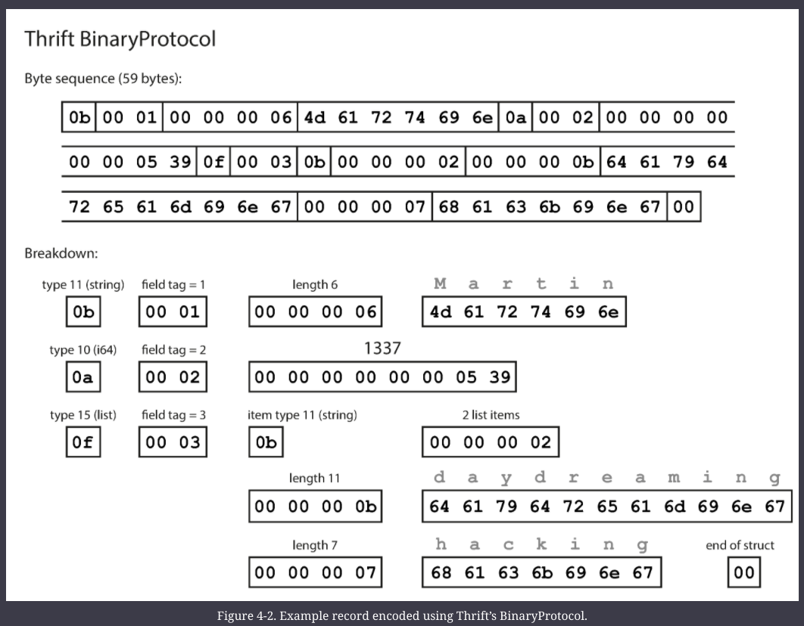
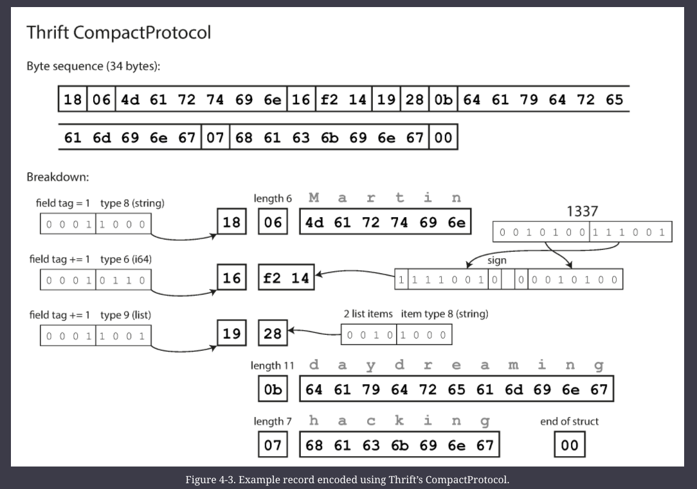
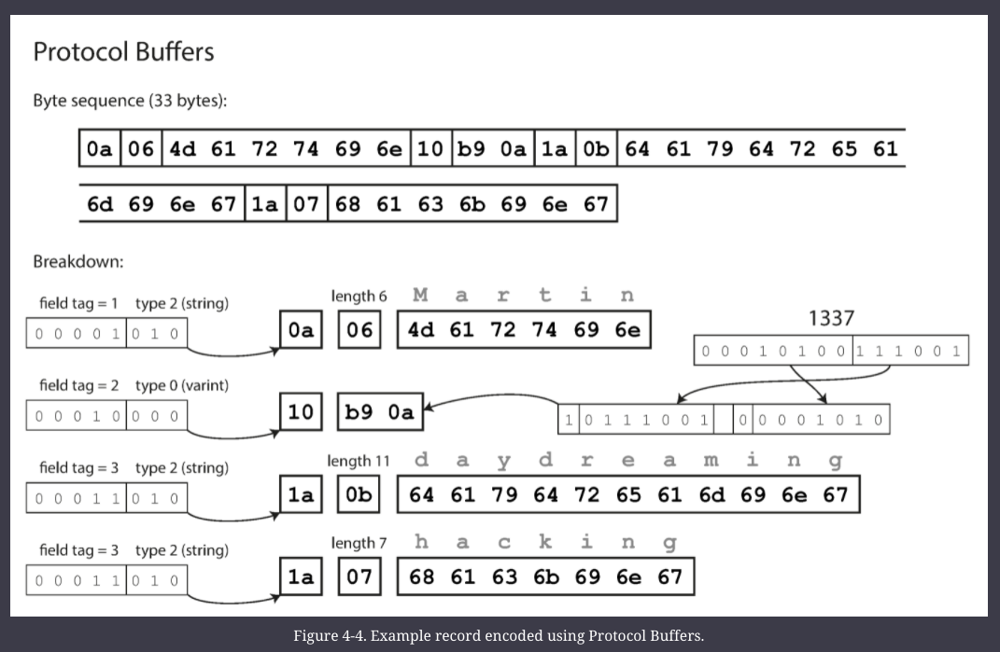
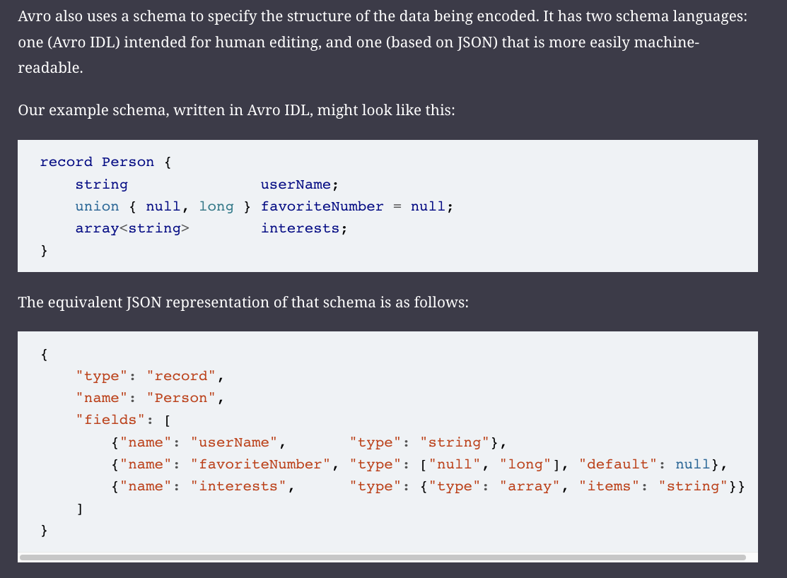
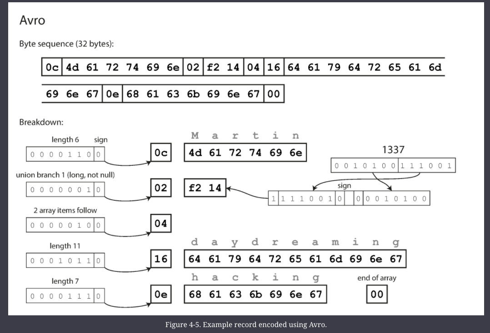
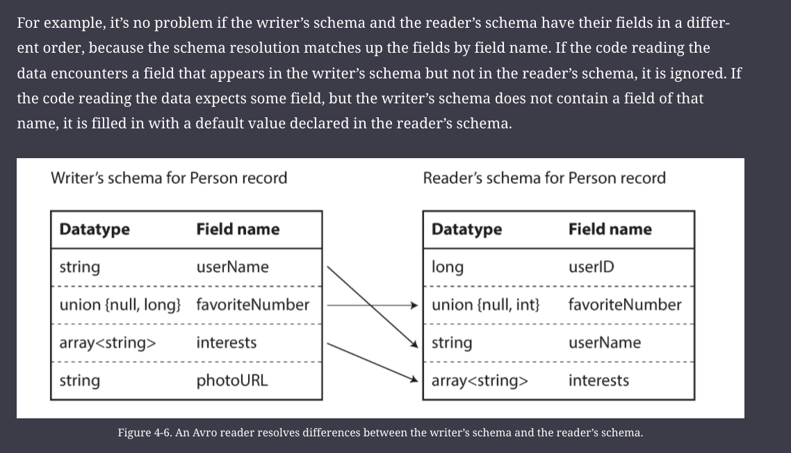
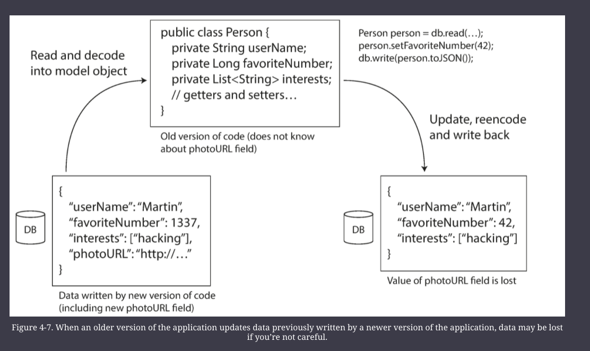

# Encoding & Evolution

In most cases, a change to an application’s features also requires a change to data that it stores: perhaps a new field or record type needs to be captured, or perhaps existing data needs to be presented in a new way.

Relational databases generally assume that all data in the database conforms to one schema: although that schema can be changed (through schema migrations; i.e., `ALTER` statements), there is exactly one schema in force at any one point in time. By contrast, schema-on-read (“schemaless”) databases don’t enforce a schema, so the database can contain a mixture of older and newer data formats written at different times

When a data format or schema changes, a corresponding change to application code often needs to happen 
    - (for example, you add a new field to a record, and the application code starts reading and writing that field). 
    - However, in a large application, code changes often cannot happen instantaneously:

* With server-side applications you may want to perform a _rolling upgrade_ (also known as a _staged rollout_), deploying the new version to a few nodes at a time, checking whether the new version is running smoothly, and gradually working your way through all the nodes. 
    - This allows new versions to be deployed without service downtime, and thus encourages more frequent releases and better evolvability.
    
* With client-side applications you’re at the mercy of the user, who may not install the update for some time.

#### Backward & Forward Compatibility

This means that old and new versions of the code, and old and new data formats, may potentially all coexist in the system at the same time. In order for the system to continue running smoothly, we need to maintain compatibility in both directions:

* Backward compatibility
    - Newer code can read data that was written by older code.

* Forward compatibility
    - Older code can read data that was written by newer code.

Backward compatibility is normally not hard to achieve: 
- as author of the newer code, you know the format of data written by older code, and so you can explicitly handle it (if necessary by simply keeping the old code to read the old data). 

Forward compatibility can be trickier, because it requires older code to ignore additions made by a newer version of the code.

## Formats of Encoding Data

Programs usually work with data in (at least) two different representations:

1.  In memory, data is kept in objects, structs, lists, arrays, hash tables, trees, and so on. 
    - These data structures are optimized for efficient access and manipulation by the CPU (typically using pointers).
    
2.  When you want to write data to a file or send it over the network, you have to encode it as some kind of self-contained sequence of bytes (for example, a JSON document). 
    - Since a pointer wouldn’t make sense to any other process, this sequence-of-bytes representation looks quite different from the data structures that are normally used in memory.

Thus, we need some kind of translation between the two representations. 

The translation from the in-memory representation to a byte sequence is called _encoding_ (also known as _serialization_ or _marshalling_), and the reverse is called _decoding_ (_parsing_, _deserialization_, _unmarshalling_).

#### JSON, XML, CSV & Binary Variants

JSON, XML, and CSV are textual formats, and thus somewhat human-readable (although the syntax is a popular topic of debate). 

Besides the superficial syntactic issues, they also have some subtle problems:

- There is a lot of ambiguity around the encoding of numbers. In XML and CSV, you cannot distinguish between a number and a string that happens to consist of digits (except by referring to an external schema). JSON distinguishes strings and numbers, but it doesn’t distinguish integers and floating-point numbers, and it doesn’t specify a precision.
    - This is a problem when dealing with large numbers; for example, integers greater than 253 cannot be exactly represented in an IEEE 754 double-precision floating-point number, so such numbers become inaccurate when parsed in a language that uses floating-point numbers
- JSON and XML have good support for Unicode character strings (i.e., human-readable text), but they don’t support binary strings (sequences of bytes without a character encoding). 
    - Binary strings are a useful feature, so people get around this limitation by encoding the binary data as text using Base64. 
    - The schema is then used to indicate that the value should be interpreted as Base64-encoded. This works, but it’s somewhat hacky and increases the data size by 33%.
- There is optional schema support for both XML and JSON. 
    - These schema languages are quite powerful, and thus quite complicated to learn and implement. 
    - Use of XML schemas is fairly widespread, but many JSON-based tools don’t bother using schemas.
- CSV does not have any schema, so it is up to the application to define the meaning of each row and column
    - CSV is also a quite vague format (what happens if a value contains a comma or a newline character?).

###### Binary Encodings

JSON is less verbose than XML, but both still use a lot of space compared to binary formats. This observation led to the development of a profusion of binary encodings for JSON (MessagePack, BSON, BJSON, UBJSON, BISON, and Smile, to name a few) and for XML (WBXML and Fast Infoset, for example). These formats have been adopted in various niches, but none of them are as widely adopted as the textual versions of JSON and XML.

(Figure 4.1)

The first few bytes, when encoding with MessagePack, are as follows:

1.  The first byte, `0x83`, indicates that what follows is an object (top four bits = `0x80`) with three fields (bottom four bits = `0x03`). (In case you’re wondering what happens if an object has more than 15 fields, so that the number of fields doesn’t fit in four bits, it then gets a different type indicator, and the number of fields is encoded in two or four bytes.)
    
2.  The second byte, `0xa8`, indicates that what follows is a string (top four bits = `0xa0`) that is eight bytes long (bottom four bits = `0x08`).
    
3.  The next eight bytes are the field name `userName` in ASCII. Since the length was indicated previously, there’s no need for any marker to tell us where the string ends (or any escaping).
    
4.  The next seven bytes encode the six-letter string value `Martin` with a prefix `0xa6`, and so on.
    

The binary encoding is 66 bytes long, which is only a little less than the 81 bytes taken by the textual JSON encoding (with whitespace removed). All the binary encodings of JSON are similar in this regard. It’s not clear whether such a small space reduction (and perhaps a speedup in parsing) is worth the loss of human-readability.

#### Thrift & Protocol Buffers

Apache Thrift and Protocol Buffers (protobuf) are binary encoding libraries that are based on the same principle. Protocol Buffers was originally developed at Google, Thrift was originally developed at Facebook, and both were made open source in 2007–08.

The big difference compared to [Figure 4-1](https://learning.oreilly.com/library/view/designing-data-intensive-applications/9781491903063/ch04.html#fig_encoding_messagepack) is that there are no field names (`userName`, `favoriteNumber`, `interests`). Instead, the encoded data contains _field tags_, which are numbers (`1`, `2`, and `3`). Those are the numbers that appear in the schema definition. Field tags are like aliases for fields—they are a compact way of saying what field we’re talking about, without having to spell out the field name.

The Thrift CompactProtocol encoding is semantically equivalent to BinaryProtocol, but as you can see below, it packs the same information into only 34 bytes.
- It does this by packing the field type and tag number into a single byte, and by using variable-length integers. 
- Rather than using a full eight bytes for the number 1337, it is encoded in two bytes, with the top bit of each byte used to indicate whether there are still more bytes to come. 
- This means numbers between –64 and 63 are encoded in one byte, numbers between –8192 and 8191 are encoded in two bytes, etc. Bigger numbers use more bytes.
 
 
 
 Protocol Buffers fits the same record in 33 bytes. (gRPC uses protobuf)
 

 
 One detail to note: in the schemas shown earlier, each field was marked either `required` or `optional`, but this makes no difference to how the field is encoded (nothing in the binary data indicates whether a field was required). The difference is simply that `required` enables a runtime check that fails if the field is not set, which can be useful for catching bugs.
 
 
 ###### Field Tags & Schema Evolution
 
 How do Thrift and Protocol Buffers handle schema changes while keeping backward and forward compatibility?
 
 As you can see from the examples, an encoded record is just the concatenation of its encoded fields. Each field is identified by its tag number (the numbers `1`, `2`, `3` in the sample schemas) and annotated with a datatype (e.g., string or integer). 
 - If a field value is not set, it is simply omitted from the encoded record. 
 - From this you can see that field tags are critical to the meaning of the encoded data. 
 - You can change the name of a field in the schema, since the encoded data never refers to field names, but you cannot change a field’s tag, since that would make all existing encoded data invalid.

You can add new fields to the schema, provided that you give each field a new tag number. 
- If old code (which doesn’t know about the new tag numbers you added) tries to read data written by new code, including a new field with a tag number it doesn’t recognize, it can simply ignore that field. 
- The datatype annotation allows the parser to determine how many bytes it needs to skip. This maintains forward compatibility: old code can read records that were written by new code.

What about backward compatibility? 
- As long as each field has a unique tag number, new code can always read old data, because the tag numbers still have the same meaning. 
- The only detail is that if you add a new field, you cannot make it required. 
- If you were to add a field and make it required, that check would fail if new code reads data written by old code, because the old code will not have written the new field that you added. 
- Therefore, to maintain backward compatibility, every field you add after the initial deployment of the schema must be optional or have a default value.

Removing a field is just like adding a field, with backward and forward compatibility concerns reversed. 
- That means you can only remove a field that is optional (a required field can never be removed), and you can never use the same tag number again (because you may still have data written somewhere that includes the old tag number, and that field must be ignored by new code).

#### Apache Avro

Note that there are no tag numbers in the schema

If you examine the byte sequence, you can see that there is nothing to identify fields or their datatypes. The encoding simply consists of values concatenated together. A string is just a length prefix followed by UTF-8 bytes, but there’s nothing in the encoded data that tells you that it is a string. It could just as well be an integer, or something else entirely. An integer is encoded using a variable-length encoding (the same as Thrift’s CompactProtocol).

To parse the binary data, you go through the fields in the order that they appear in the schema and use the schema to tell you the datatype of each field. 
- This means that the binary data can only be decoded correctly if the code reading the data is using the _exact same schema_ as the code that wrote the data. 
- Any mismatch in the schema between the reader and the writer would mean incorrectly decoded data.

###### Avro's Schema evolution: Writer's Schema & the Reader's Schema

With Avro, when an application wants to encode some data (to write it to a file or database, to send it over the network, etc.), it encodes the data using whatever version of the schema it knows about—for example, that schema may be compiled into the application. This is known as the _writer’s schema_.

When an application wants to decode some data (read it from a file or database, receive it from the network, etc.), it is expecting the data to be in some schema, which is known as the _reader’s schema_. That is the schema the application code is relying on—code may have been generated from that schema during the application’s build process.

The key idea with Avro is that the writer’s schema and the reader’s schema _don’t have to be the same_—they only need to be compatible. 
- When data is decoded (read), the Avro library resolves the differences by looking at the writer’s schema and the reader’s schema side by side and translating the data from the writer’s schema into the reader’s schema.

QUESTION: How does the reader know the writer’s schema with which a particular piece of data was encoded?

- Large Files: 
    - the writer of the file can just include the writer's schema once at the beginning of the file. Avro specifies a file format
- Database with individually written records
    - include a version number at the beginning of every encoded record, and to keep a list of schema versions in your db
    - A reader can fetch a record, extract the version number, and then fetch the writer’s schema for that version number from the database.
- Sending records over a network connection
    - When two processes are communicating over a bidirectional network connection, they can negotiate the schema version on connection setup and then use that schema for the lifetime of the connection.

One advantage of Avro’s approach, compared to Protocol Buffers and Thrift, is that the schema doesn’t contain any tag numbers. But why is this important? What’s the problem with keeping a couple of numbers in the schema?

The difference is that Avro is friendlier to _dynamically generated_ schemas.

#### Merits of Schemas

We can see that although textual data formats such as JSON, XML, and CSV are widespread, binary encodings based on schemas are also a viable option. 

They have a number of nice properties:
* They can be much more compact than the various “binary JSON” variants, since they can omit field names from the encoded data.
* The schema is a valuable form of documentation, and because the schema is required for decoding, you can be sure that it is up to date (whereas manually maintained documentation may easily diverge from reality).    
* Keeping a database of schemas allows you to check forward and backward compatibility of schema changes, before anything is deployed.
* For users of statically typed programming languages, the ability to generate code from the schema is useful, since it enables type checking at compile time.
    
In summary, schema evolution allows the same kind of flexibility as schemaless/schema-on-read JSON databases provide.

—

## Models of Dataflow

Compatibility is a relationship between one process that encodes the data, and another process that decodes it.

That’s a fairly abstract idea—there are many ways data can flow from one process to another. Who encodes the data, and who decodes it?

Some ways how data flows through process
1. via databases
2. via service calls
3. via async message passing

### Dataflow through Databases

In a database, the process that writes to the database encodes the data, and the process that reads from the database decodes it. There may just be a single process accessing the database, in which case the reader is simply a later version of the same process—in that case you can think of storing something in the database as _sending a message to your future self_.

Backward compatibility is clearly necessary here; otherwise your future self won’t be able to decode what you previously wrote.

In general, it’s common for several different processes to be accessing a database at the same time. Those processes might be several different applications or services, or they may simply be several instances of the same service (running in parallel for scalability or fault tolerance). 

Either way, in an environment where the application is changing, it is likely that some processes accessing the database will be running newer code and some will be running older code—for example because a new version is currently being deployed in a rolling upgrade, so some instances have been updated while others haven’t yet.

This means that a value in the database may be written by a _newer_ version of the code, and subsequently read by an _older_ version of the code that is still running. Thus, forward compatibility is also often required for databases.

### Data flow though services: REST and RPC

When HTTP is used as the underlying protocol for talking to the service, it is called a _web service_.

1.  A client application running on a user’s device (e.g., a native app on a mobile device, or JavaScript web app using Ajax) making requests to a service over HTTP. These requests typically go over the public internet.
2.  One service making requests to another service owned by the same organization, often located within the same datacenter, as part of a service-oriented/microservices architecture. (Software that supports this kind of use case is sometimes called _middleware_.)    
3.  One service making requests to a service owned by a different organization, usually via the internet. This is used for data exchange between different organizations’ backend systems. This category includes public APIs provided by online services, such as credit card processing systems, or OAuth for shared access to user data.

There are two popular approaches to web services: _REST_ and _SOAP_. They are almost diametrically opposed in terms of philosophy.

REST is not a protocol, but rather a design philosophy that builds upon the principles of HTTP.

By contrast, SOAP is an XML-based protocol for making network API requests.

#### RPC

The RPC model tries to make a request to a remote network service look the same as calling a function or method in your programming language, within the same process (this abstraction is called _location transparency_). 

Examples: 
    1. Enterprise JavaBeans (EJB)
    2. Java's Remote Method Invocation (RMI)
    3. Distributed Component Object Model (DCOM) - Microsoft

Although RPC seems convenient at first, the approach is fundamentally flawed:

- A local function call is predictable and either succeeds or fails, depending only on parameters that are under your control. A network request is unpredictable: the request or response may be lost due to a network problem, or the remote machine may be slow or unavailable, and such problems are entirely outside of your control. Network problems are common, so you have to anticipate them, for example by retrying a failed request.
- A local function call either returns a result, or throws an exception, or never returns (because it goes into an infinite loop or the process crashes). A network request has another possible outcome: it may return without a result, due to a _timeout_. In that case, you simply don’t know what happened: if you don’t get a response from the remote service, you have no way of knowing whether the request got through or not.
- If you retry a failed network request, it could happen that the previous request actually got through, and only the response was lost. In that case, retrying will cause the action to be performed multiple times, unless you build a mechanism for deduplication (_idempotence_) into the protocol. Local function calls don’t have this problem.
- When you call a local function, you can efficiently pass it references (pointers) to objects in local memory. When you make a network request, all those parameters need to be encoded into a sequence of bytes that can be sent over the network. That’s okay if the parameters are primitives like numbers or strings, but quickly becomes problematic with larger objects.
- The client and the service may be implemented in different programming languages, so the RPC framework must translate datatypes from one language into another. This can end up ugly, since not all languages have the same types

Custom RPC protocols with a binary encoding format can achieve better performance than something generic like JSON over REST. However, a RESTful API has other significant advantages: it is good for experimentation and debugging (you can simply make requests to it using a web browser or the command-line tool `curl`, without any code generation or software installation), it is supported by all mainstream programming languages and platforms, and there is a vast ecosystem of tools available (servers, caches, load balancers, proxies, firewalls, monitoring, debugging tools, testing tools, etc.).

For these reasons, REST seems to be the predominant style for public APIs. The main focus of RPC frameworks is on requests between services owned by the same organization, typically within the same datacenter.

###### evolution for RPC 

Compared to data flowing through databases (as described in the last section), we can make a simplifying assumption in the case of dataflow through services: it is reasonable to assume that all the servers will be updated first, and all the clients second. 

Thus, you only need backward compatibility on requests, and forward compatibility on responses.

The backward and forward compatibility properties of an RPC scheme are inherited from whatever encoding it uses:

* Thrift, gRPC (Protocol Buffers), and Avro RPC can be evolved according to the compatibility rules of the respective encoding format.
    
* In SOAP, requests and responses are specified with XML schemas. These can be evolved, but there are some subtle pitfalls \[[47](https://learning.oreilly.com/library/view/designing-data-intensive-applications/9781491903063/ch04.html#Narayan2007vg)\].
    
* RESTful APIs most commonly use JSON (without a formally specified schema) for responses, and JSON or URI-encoded/form-encoded request parameters for requests. Adding optional request parameters and adding new fields to response objects are usually considered changes that maintain compatibility.

### Message Passing Dataflow

_asynchronous message-passing_ systems, are somewhere between RPC and databases. 
- They are similar to RPC in that a client’s request (usually called a _message_) is delivered to another process with low latency. 
- They are similar to databases in that the message is not sent via a direct network connection, but goes via an intermediary called a _message broker_ (also called a _message queue_ or _message-oriented middleware_), which stores the message temporarily.

Using a message broker has several advantages compared to direct RPC:

* It can act as a buffer if the recipient is unavailable or overloaded, and thus improve system reliability.    
* It can automatically redeliver messages to a process that has crashed, and thus prevent messages from being lost.    
* It avoids the sender needing to know the IP address and port number of the recipient (which is particularly useful in a cloud deployment where virtual machines often come and go).    
* It allows one message to be sent to several recipients.    
* It logically decouples the sender from the recipient (the sender just publishes messages and doesn’t care who consumes them).

However, a difference compared to RPC is that message-passing communication is usually one-way: a sender normally doesn’t expect to receive a reply to its messages.

###### Message brokers

Commercial Enterprise: 
    - TIBCO
    - IBM WebSphere
    - webMethods 
Open Source
    - RabbitMQ
    - ActiveMQ
    - HornetMQ
    - NATS
    - Apache Kafka

Message brokers typically don’t enforce any particular data model—a message is just a sequence of bytes with some metadata, so you can use any encoding format. If the encoding is backward and forward compatible, you have the greatest flexibility to change publishers and consumers independently and deploy them in any order.

###### Distributed Actor frameworks

The _actor model_ is a programming model for concurrency in a single process. Rather than dealing directly with threads (and the associated problems of race conditions, locking, and deadlock), logic is encapsulated in _actors_. 
- Each actor typically represents one client or entity, it may have some local state (which is not shared with any other actor), and it communicates with other actors by sending and receiving asynchronous messages. 
- Message delivery is not guaranteed: in certain error scenarios, messages will be lost.
- Since each actor processes only one message at a time, it doesn’t need to worry about threads, and each actor can be scheduled independently by the framework.

In _distributed actor frameworks_, this programming model is used to scale an application across multiple nodes. 
- The same message-passing mechanism is used, no matter whether the sender and recipient are on the same node or different nodes. 
- If they are on different nodes, the message is transparently encoded into a byte sequence, sent over the network, and decoded on the other side.

A distributed actor framework essentially integrates a message broker and the actor programming model into a single framework. 
- However, if you want to perform rolling upgrades of your actor-based application, you still have to worry about forward and backward compatibility, as messages may be sent from a node running the new version to a node running the old version, and vice versa.

Three popular distributed actor frameworks handle message encoding as follows:

* _Akka_ uses Java’s built-in serialization by default, which does not provide forward or backward compatibility. However, you can replace it with something like Protocol Buffers, and thus gain the ability to do rolling upgrades.    
* _Orleans_ supports rolling upgrades using its own versioning mechanism. It allows new actor methods to be defined (that is, new types of incoming message that an actor can process) while maintaining backward compatibility, provided that existing methods are not changed.
* In _Erlang OTP_ it is surprisingly hard to make changes to record schemas (despite the system having many features designed for high availability); 
    - rolling upgrades are possible but need to be planned carefully. 
    - An experimental new `maps` datatype (a JSON-like structure, introduced in Erlang R17 in 2014) may make this easier in the future.