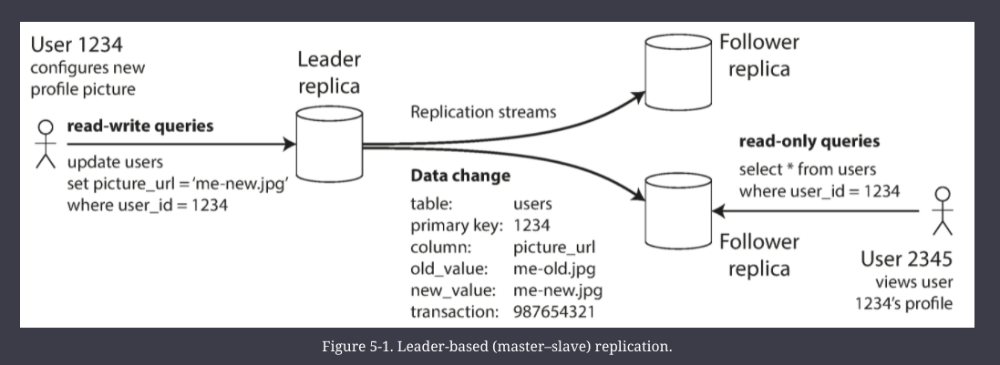
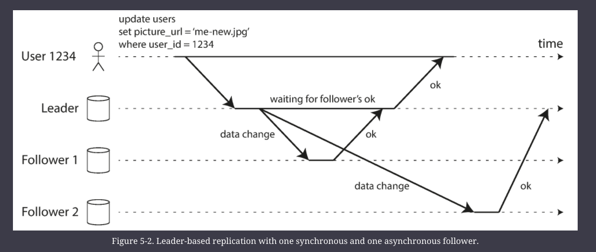

# Replication

_Replication_ means keeping a copy of the same data on multiple machines that are connected via a network.

There are various reasons why you might want to distribute a database across multiple machines:

- Scalability
    - If your data volume, read load, or write load grows bigger than a single machine can handle, you can potentially spread the load across multiple machines.
- Fault tolerance/high availability
    - If your application needs to continue working even if one machine (or several machines, or the network, or an entire datacenter) goes down, you can use multiple machines to give you redundancy. When one fails, another one can take over.
- Latency
    - If you have users around the world, you might want to have servers at various locations worldwide so that each user can be served from a datacenter that is geographically close to them. That avoids the users having to wait for network packets to travel halfway around the world.

## Scaling 

#### _Vertical Scaling_ or _Scaling up_ or _shared-memory architecture_ 

Many CPUs, RAM chips and disks are joined together under one OS. All the components can be treated as a single machine.

#### _shared-disk_

Use several machines with independent CPUs and RAM, but stores data on an array of disks that is shared between the machines, which are connected via a fast network. Used for data warehousing workloads.

#### _shared-nothing_

(sometimes called _horizontal scaling_ or _scaling out_) each machine or virtual machine running the database software is called a _node_.

Each node uses its CPUs, RAM, and disks independently. 

Any coordination between nodes is done at the software level, using a conventional network.

## Replication vs Partitioning 

Replication - Keeping a copy of the same data on several different nodes, potentially in different locations.

Partitioning - Splitting a big database into smaller subsets called _partitions_ so that different partitions can be assigned to different nodes (also known as _sharding_)

—

## Replication algorithms

All of the difficulty in replication lies in handling _changes_ to replicated data.

There are 3 popular algos

1. Single leader 
2. Multi leader
3. leaderless

### Leaders & Followers

Every write to the database needs to be processed by every replica; otherwise, the replicas would no longer contain the same data. 

The most common solution for this is called _leader-based replication_ (also known as _active/passive_ or _master–slave replication_)

1.  One of the replicas is designated the _leader_ (also known as _master_ or _primary_). When clients want to write to the database, they must send their requests to the leader, which first writes the new data to its local storage.
    
2.  The other replicas are known as _followers_ (_read replicas_, _slaves_, _secondaries_, or _hot standbys_).[i](https://learning.oreilly.com/library/view/designing-data-intensive-applications/9781491903063/ch05.html#idm45085120629984) Whenever the leader writes new data to its local storage, it also sends the data change to all of its followers as part of a _replication log_ or _change stream_.

3.  When a client wants to read from the database, it can query either the leader or any of the followers. However, writes are only accepted on the leader

### Synchoronous vs Async Replication

In the above diagram: 
- the replication to follower 1 is _synchronous_: 
    - the leader waits until follower 1 has confirmed that it received the write before reporting success to the user, and before making the write visible to other clients. 
- The replication to follower 2 is _asynchronous_: 
    - the leader sends the message, but doesn’t wait for a response from the follower.

The advantage of synchronous replication is that: 
- the follower is guaranteed to have an up-to-date copy of the data that is consistent with the leader. 
    - If the leader suddenly fails, we can be sure that the data is still available on the follower. 
 
The disadvantage is that if the synchronous follower doesn’t respond (because it has crashed, or there is a network fault, or for any other reason), the write cannot be processed. The leader must block all writes and wait until the synchronous replica is available again.

For that reason, it is impracticable for all followers to be synchronous: any one node outage would cause the whole system to grind to a halt.
- In practice, if you enable synchronous replication on a database, it usually means that _one_ of the followers is synchronous, and the others are asynchronous
- If the synchronous follower becomes unavailable or slow, one of the asynchronous followers is made synchronous. 
- This guarantees that you have an up-to-date copy of the data on at least two nodes: the leader and one synchronous follower. 
- This configuration is sometimes also called _semi-synchronous_

Often, leader-based replication is configured to be completely asynchronous. 
- In this case, if the leader fails and is not recoverable, any writes that have not yet been replicated to followers are lost. 
- This means that a write is not guaranteed to be durable, even if it has been confirmed to the client. 

However, a fully asynchronous configuration has the advantage that the leader can continue processing writes, even if all of its followers have fallen behind.

### Setting up new Followers

The practical steps of setting up a follower vary significantly by database.
    - automated vs multi-step workflow manually performed by admins

Simply copying the data from the leader to the new follower is not sufficient (since the data is always in flux)

You could make the files on disk consistent by locking the database (making it unavailable for writes), but that would go against our goal of high availability. Fortunately, setting up a follower can usually be done without downtime.

Conceptually, the process looks like this:

1.  Take a consistent snapshot of the leader’s database at some point in time—if possible, without taking a lock on the entire database. 
2.  Copy the snapshot to the new follower node.
3.  The follower connects to the leader and requests all the data changes that have happened since the snapshot was taken. This requires that the snapshot is associated with an exact position in the leader’s replication log. That position has various names: for example, PostgreSQL calls it the _log sequence number_, and MySQL calls it the _binlog coordinates_.
4.  When the follower has processed the backlog of data changes since the snapshot, we say it has _caught up_. It can now continue to process data changes from the leader as they happen.

### Handling node outages

Any node (leader or follower) can go down, Our goal is to keep the system as a whole running despite individual node failures. 

#### Follower Failure - Catchup Recovery

On its local disk, each follower keeps a log of the data changes it has received from the leader. 

If a follower crashes and is restarted, or if the network between the leader and the follower is temporarily interrupted, the follower can recover quite easily: from its log.

It knows the last transaction that was processed before the fault occurred. Thus, the follower can connect to the leader and request all the data changes that occurred during the time when the follower was disconnected. 

When it has applied these changes, it has caught up to the leader and can continue receiving a stream of data changes as before.

#### Leader failure 

Handling the failure of leader in single-leader replication is tricky.

When the leader fails: 
    - one of the followers need to be promoted to be the new leader
    - clients need to be reconfigured to send theor writes to the new leader
    - and other followers need to start consuming data changes from the new leader

^ this process is called _failover_

Things that can go wrong during failover: 
- if async replication is used, new leader may not have received all the writes from the old leader before it died.
    - this could lead to missing or conflicting writes if the new leader comes back online
    - usually the conflicting writes are discarded, which may violate client's durability expectations
- Discarding writes is especially dangerous if other storage systems outside of the database need to be coordinated with the database contents.
    - Happened with github, when new leader wrote new primary keys, but redis cache was not updated. [link](https://learning.oreilly.com/library/view/designing-data-intensive-applications/9781491903063/ch05.html#Newland2012tw)
- _Split Brain_ , when two leaders believe they are both leaders. 
    - If both leaders accept writes, and there is not system of resolving conflicts, this could lead to data loss or corruption
- Deciding the timeout before the leader is declared dead
    - If too short, could lead to many failovers
    - A longer timeout means a longer time needed to recover data

There are no easy solutions to these problems. For this reason, some operations teams prefer to perform failovers manually, even if the software supports automatic failover.

### Implementation of Replication Logs 

1. Statement-based Replication
2. Write-ahead log (WAL) Shipping
3. Logical (row-based) log replication
4. Trigger-based replication

#### 1. Statement-Based Replication 

Statement-based replication was used in MySQL before version 5.1.

The leader logs every write request (_statement_) that it executes and sends that statement log to its followers. 
- For a relational database, this means that every `INSERT`, `UPDATE`, or `DELETE` statement is forwarded to followers, and each follower parses and executes that SQL statement as if it had been received from a client.

Sounds reasonable, but faces many problems, but there are so many edge cases that other replication methods are preferred.
- Any statement that calls a nondeterministic function, such as `NOW()` to get the current date and time or `RAND()` to get a random number, is likely to generate a different value on each replica
- If statements use an autoincrementing column, or if they depend on the existing data in the database (e.g., `UPDATE … WHERE _<some condition>_`), they must be executed in exactly the same order on each replica, or else they may have a different effect. 
    - This can be limiting when there are multiple concurrently executing transactions.
- Statements that have side effects (e.g., triggers, stored procedures, user-defined functions) may result in different side effects occurring on each replica, unless the side effects are absolutely deterministic.

#### 2. WAL Shipping

Besides keeping its own log and writing the log to disk, the leader also sends the same log across the network to its followers. When the follower processes this log, it builds a copy of the exact same data structures as found on the leader.

This method of replication is used in PostgreSQL and Oracle.

The main disadvantage is that the log describes the data on a very low level: 
- a WAL contains details of which bytes were changed in which disk blocks. 
- This makes replication closely coupled to the storage engine. If the database changes its storage format from one version to another, it is typically not possible to run different versions of the database software on the leader and the followers.

That may seem like a minor implementation detail, but it can have a big operational impact.

#### 3. Logical (row-based) log replication

An alternative is to use different log formats for replication and for the storage engine, which allows the replication log to be decoupled from the storage engine internals. 

This kind of replication log is called a _logical log_, to distinguish it from the storage engine’s (_physical_) data representation.

A logical log for a relational database is usually a sequence of records describing writes to database tables at the granularity of a row:

* For an inserted row, the log contains the new values of all columns.
* For a deleted row, the log contains enough information to uniquely identify the row that was deleted. Typically this would be the primary key, but if there is no primary key on the table, the old values of all columns need to be logged.
* For an updated row, the log contains enough information to uniquely identify the updated row, and the new values of all columns (or at least the new values of all columns that changed).

A transaction that modifies several rows generates several such log records, followed by a record indicating that the transaction was committed.

Since a logical log is decoupled from the storage engine internals, it can more easily be kept backward compatible, allowing the leader and the follower to run different versions of the database software, or even different storage engines.

A logical log format is also easier for external applications to parse. This aspect is useful if you want to send the contents of a database to an external system, such as a data warehouse for offline analysis, or for building custom indexes and caches. This technique is called _Change Data Capture_

#### 4. Trigger-based replication

The replication approaches described so far are implemented by the database system, without involving any application code. In many cases, that’s what you want—but there are some circumstances where more flexibility is needed. For example, if you want to only replicate a subset of the data, or want to replicate from one kind of database to another, or if you need conflict resolution logic then you may need to move replication up to the application layer.

One alternative is to use features that are available in many relational databases: _triggers_ and _stored procedures_.

A _trigger_ lets you register custom application code that is automatically executed when a data change (write transaction) occurs in a database system. 
- The trigger has the opportunity to log this change into a separate table, from which it can be read by an external process. That external process can then apply any necessary application logic and replicate the data change to another system.

Trigger-based replication typically has greater overheads than other replication methods, and is more prone to bugs and limitations than the database’s built-in replication. However, it can nevertheless be useful due to its flexibility.

—

## Problems with Replication Lag

