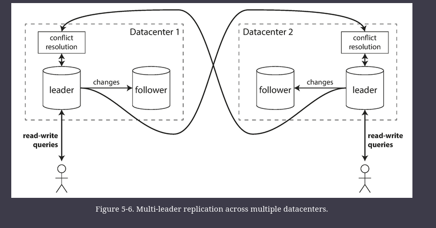
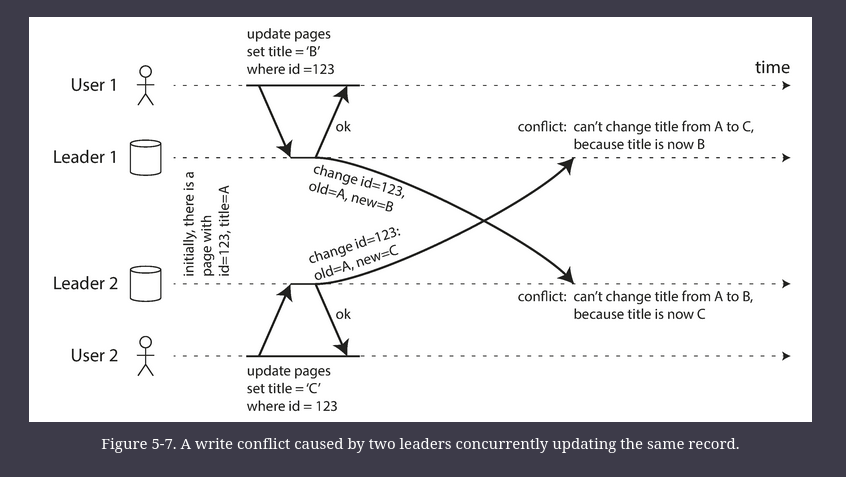
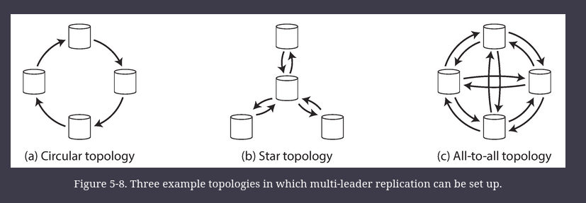
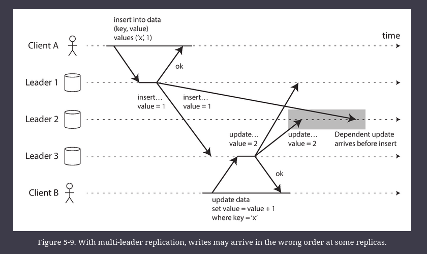

# Multi Leader Replication

A natural extension of the leader-based replication model is to allow more than one node to accept writes. 

Replication still happens in the same way: each node that processes a write must forward that data change to all the other nodes.

## Use Cases for Multi-Leader Replication

It rarely makes sense to use a multi-leader setup within a single datacenter, because the benefits rarely outweigh the added complexity.

However, there are some situations in which this configuration is reasonable.

1. Multi-datacenter operation
2. Clients with offline operation
3. Collaborative editing

### Multi-datacenter operation

With a normal leader-based replication setup, the leader has to be in _one_ of the datacenters, and all writes must go through that datacenter.

In a multi-leader configuration, you can have a leader in _each_ datacenter.

Within each datacenter, regular leader–follower replication is used; between datacenters, each datacenter’s leader replicates its changes to the leaders in other datacenters.

Comparison of Single vs Multi leader configuration in multi-datacenter: 

|                                 | Single                                                                                                                                                                                                  | Multi                                                                                                                                                                                                                               |
|---------------------------------|---------------------------------------------------------------------------------------------------------------------------------------------------------------------------------------------------------|-------------------------------------------------------------------------------------------------------------------------------------------------------------------------------------------------------------------------------------|
| Performance                     | Every write must go over the internet to the datacenter with the leader. This can add significant latency to writes and might contravene the purpose of having multiple datacenters in the first place. | Every write can be processed in the local datacenter and is replicated asynchronously to the other datacenters. Thus, the inter-datacenter network delay is hidden from users, which means the perceived performance may be better. |
| Tolerance of datacenter outages | if the datacenter with the leader fails, failover can promote a follower in another datacenter to be leader.                                                                                            | Each datacenter can continue operating independently of the others, and replication catches up when the failed datacenter comes back online.                                                                                        |
| Tolerance of network problems   | is very sensitive to problems in inter-datacenter link, because writes are made synchronously over this link.                                                                                           |  with asynchronous replication can usually tolerate network problems better: a temporary network interruption does not prevent writes being processed.                                                                              |

### 2. Clients with offline operation

consider the calendar apps on your mobile phone, your laptop, and other devices. You need to be able to see your meetings (make read requests) and enter new meetings (make write requests) at any time, regardless of whether your device currently has an internet connection. If you make any changes while you are offline, they need to be synced with a server and your other devices when the device is next online.

In this case, every device has a local database that acts as a leader (it accepts write requests), and there is an asynchronous multi-leader replication process (sync) between the replicas of your calendar on all of your devices. The replication lag may be hours or even days, depending on when you have internet access available.

From an architectural point of view, this setup is essentially the same as multi-leader replication between datacenters, taken to the extreme: each device is a “datacenter,” and the network connection between them is extremely unreliable. As the rich history of broken calendar sync implementations demonstrates, multi-leader replication is a tricky thing to get right.

### 3. Collaborative editing

_Real-time collaborative editing_ applications allow several people to edit a document simultaneously.
 - For example, Google Docs

We don’t usually think of collaborative editing as a database replication problem, but it has a lot in common with the previously mentioned offline editing use case.

When one user edits a document, the changes are instantly applied to their local replica (the state of the document in their web browser or client application) and asynchronously replicated to the server and any other users who are editing the same document.

If you want to guarantee that there will be no editing conflicts, the application must obtain a lock on the document before a user can edit it. If another user wants to edit the same document, they first have to wait until the first user has committed their changes and released the lock. This collaboration model is equivalent to single-leader replication with transactions on the leader.

However, for faster collaboration, you may want to make the unit of change very small (e.g., a single keystroke) and avoid locking. This approach allows multiple users to edit simultaneously, but it also brings all the challenges of multi-leader replication, including requiring conflict resolution.

## Handling Write Conflicts

The biggest problem with multi-leader replication is that write conflicts can occur, which means that conflict resolution is required.

For example, consider a wiki page that is simultaneously being edited by two users, as shown in Figure below. This problem does not occur in a single-leader database.

### Synchronous versus asynchronous conflict detection

Sync conflict detection is when we wait for all the followers to be updated before letting the user know of changes.
- Loses the main advantage of multi-leader replication though
- And might as well use single-leader replication

### Conflict avoidance

The simplest strategy for dealing with conflicts is to avoid them: if the application can ensure that all writes for a particular record go through the same leader, then conflicts cannot occur. 
- Since many implementations of multi-leader replication handle conflicts quite poorly, avoiding conflicts is a frequently recommended approach

For example, in an application where a user can edit their own data, you can ensure that requests from a particular user are always routed to the same datacenter and use the leader in that datacenter for reading and writing. 
- Different users may have different “home” datacenters (perhaps picked based on geographic proximity to the user), but from any one user’s point of view the configuration is essentially single-leader.

But, if the user moves to a different location, or one datacenter has failed
- In these situation, conflict avoidance breaks down, and you have to deal with the possibility of concurrent writes on different leaders.

### Converging toward a consistent state

A single-leader database applies writes in a sequential order: if there are several updates to the same field, the last write determines the final value of the field.

In a multi-leader configuration, there is no defined ordering of writes, so it’s not clear what the final value should be.

The database must resolve the conflict in a _convergent_ way, which means that all replicas must arrive at the same final value when all changes have been replicated.

Ways of achieving convergent conflict resolution: 
- Give each write a unique ID (e.g., a timestamp, a long random number, a UUID, or a hash of the key and value), pick the write with the highest ID as the _winner_, and throw away the other writes. If a timestamp is used, this technique is known as _last write wins_ (LWW). Although this approach is popular, it is dangerously prone to data loss.
- Give each replica a unique ID, and let writes that originated at a higher-numbered replica always take precedence over writes that originated at a lower-numbered replica. This approach also implies data loss.
- Somehow merge the values together—e.g., order them alphabetically and then concatenate them (In figure above, the final value is something like "B/C")
- Record the conflict in an explicit data structure that preserves all information, and write application code that resolves the conflict at some later time (perhaps by prompting the user).

### Custom conflict resolution logic

Most multi-leader replication tools let you write conflict resolution logic using application code. That code may be executed on write or on read:

On write

As soon as the database system detects a conflict in the log of replicated changes, it calls the conflict handler. This handler typically cannot prompt a user—it runs in a background process and it must execute quickly.

On read

When a conflict is detected, all the conflicting writes are stored. The next time the data is read, these multiple versions of the data are returned to the application. The application may prompt the user or automatically resolve the conflict, and write the result back to the database. CouchDB works this way, for example.

Note that conflict resolution usually applies at the level of an individual row or document, not for an entire transaction. 
- Thus, if you have a transaction that atomically makes several different writes, each write is still considered separately for the purposes of conflict resolution.

### What is a conflict?

Some kinds of conflict can be more subtle to detect. 

For example, consider a meeting room booking system: 
- it tracks which room is booked by which group of people at which time. 
- This application needs to ensure that each room is only booked by one group of people at any one time (i.e., there must not be any overlapping bookings for the same room). 
- In this case, a conflict may arise if two different bookings are created for the same room at the same time. 
- Even if the application checks availability before allowing a user to make a booking, there can be a conflict if the two bookings are made on two different leaders.

The above problem has not quick ready-made answer.

## Multi-Leader Replication Topologies

A _replication topology_ describes the communication paths along which writes are propagated from one node to another. If you have two leaders, like in Figure above, there is only one plausible topology: leader 1 must send all of its writes to leader 2, and vice versa. 

With more than two leaders, various different topologies are possible.

The most general topology is all-to-all.

In circular and star topologies, a write may need to pass through several nodes before it reaches all replicas. Therefore, nodes need to forward data changes they receive from other nodes. 
- To prevent infinite replication loops, each node is given a unique identifier, and in the replication log, each write is tagged with the identifiers of all the nodes it has passed through

A problem with circular and star topologies is that if just one node fails, it can interrupt the flow of replication messages between other nodes, causing them to be unable to communicate until the node is fixed. 
- The topology could be reconfigured to work around the failed node, but in most deployments such reconfiguration would have to be done manually. 

The fault tolerance of a more densely connected topology (such as all-to-all) is better because it allows messages to travel along different paths, avoiding a single point of failure.
- On the other hand, all-to-all topologies can have issues too. In particular, some network links may be faster than others (e.g., due to network congestion), with the result that some replication messages may “overtake” others

This is a problem of causality, similar to the one we saw in Consistent Prefix Reads.

Simply attaching a timestamp to every write is not sufficient, because clocks cannot be trusted to be sufficiently in sync to correctly order these events at leader 2

To order these events correctly, a technique called _version vectors_ can be used.