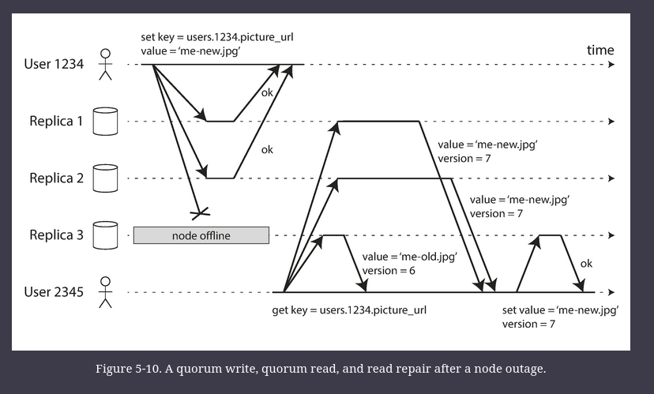
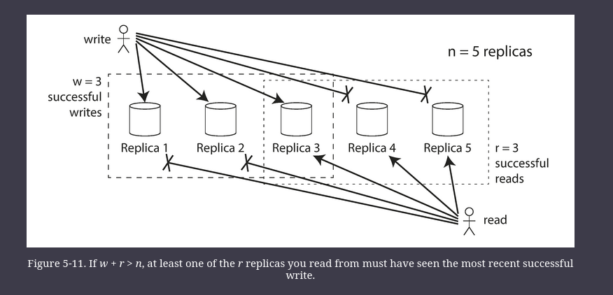
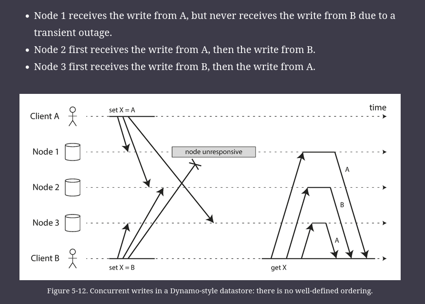
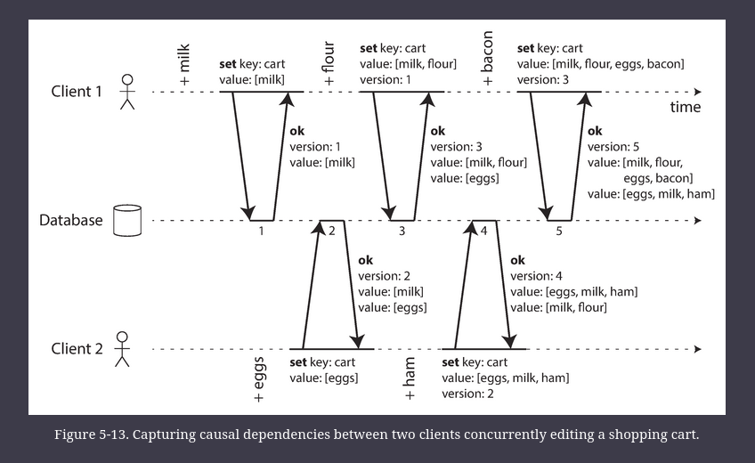
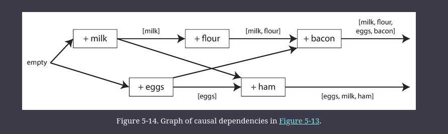

# Leaderless Replication

Some data storage systems take a different approach, abandoning the concept of a leader and allowing any replica to directly accept writes from clients. 

Some of the earliest replicated data systems were leaderless, but the idea was mostly forgotten during the era of dominance of relational databases. 
- It once again became a fashionable architecture for databases after Amazon used it for its in-house _Dynamo_ system

In some leaderless implementations, the client directly sends its writes to several replicas, while in others, a coordinator node does this on behalf of the client. 
- However, unlike a leader database, that coordinator does not enforce a particular ordering of writes. 
- As we shall see, this difference in design has profound consequences for the way the database is used.

## Writing to the Database When a Node Is Down

Imagine you have a database with three replicas, and one of the replicas is currently unavailable—perhaps it is being rebooted to install a system update. In a leader-based configuration, if you want to continue processing writes, you may need to perform a failover

On the other hand, in a leaderless configuration, failover does not exist.

In the above diagram, The client simply ignores the fact that one of the replicas missed the write.

When a client reads from the database, it doesn’t just send its request to one replica: _read requests are also sent to several nodes in parallel_. The client may get different responses from different nodes; i.e., the up-to-date value from one node and a stale value from another. Version numbers are used to determine which value is newer.

### Read repair and anti-entropy

The replication system should ensure that eventually all the data is copied to every replica. After an unavailable node comes back online, how does it catch up on the writes that it missed?

Two mechanisms are often used in Dynamo-style datastores:

##### Read repair

When a client makes a read from several nodes in parallel, it can detect any stale responses. For example, in above Figure, user 2345 gets a version 6 value from replica 3 and a version 7 value from replicas 1 and 2. The client sees that replica 3 has a stale value and writes the newer value back to that replica. This approach works well for values that are frequently read.

##### Anti-entropy process

In addition, some datastores have a background process that constantly looks for differences in the data between replicas and copies any missing data from one replica to another. Unlike the replication log in leader-based replication, this _anti-entropy process_ does not copy writes in any particular order, and there may be a significant delay before data is copied.

### Quorums for reading and writing

In the example of above Figure, we considered the write to be successful even though it was only processed on two out of three replicas. What if only one out of three replicas accepted the write? How far can we push this?

If we know that every successful write is guaranteed to be present on at least two out of three replicas, that means at most one replica can be stale. Thus, if we read from at least two replicas, we can be sure that at least one of the two is up to date. If the third replica is down or slow to respond, reads can nevertheless continue returning an up-to-date value.

If you have $n$ replicas, and you choose $w$ and $r$ such that $w + r > n$, you can generally expect every read to return the most recent value written for a key. This is the case because the set of nodes to which you’ve written and the set of nodes from which you’ve read must overlap. That is, among the nodes you read there must be at least one node with the latest value.

More generally, if there are $n$ replicas, every write must be confirmed by $w$ nodes to be considered successful, and we must query at least $r$ nodes for each read. 
- (In our example, $n$ = 3, $w$ = 2, $r$ = 2.) 
- As long as $w + r > n$ , we expect to get an up-to-date value when reading, because at least one of the $r$ nodes we’re reading from must be up to date. 
- Reads and writes that obey these $r$ and $w$ values are called _quorum_ reads and writes 
- You can think of $r$ and $w$ as the minimum number of votes required for the read or write to be valid.

In Dynamo-style databases, the parameters $n$, $w$, and $r$ are typically configurable. 
- A common choice is to make $n$ an odd number (typically 3 or 5) and to set $w$ = $r$ = ($n$ + 1) / 2 (rounded up).
- However, you can vary the numbers as you see fit. 
- For example, a workload with few writes and many reads may benefit from setting $w$ = $n$ and $r$ = 1.
    - This makes reads faster, but has the disadvantage that just one failed node causes all database writes to fail.

There may be more than $n$ nodes in the cluster, but any given value is stored only on $n$ nodes. This allows the dataset to be partitioned, supporting datasets that are larger than you can fit on one node.

The quorum condition, $w + r > n$ , allows the system to tolerate unavailable nodes as follows:

- If $w < n$, we can still process writes if a node is unavailable.
- If $r < n$, we can still process reads if a node is unavailable.
- With $n$ = 3, $w$ = 2, $r$ = 2 we can tolerate one unavailable node.
- With $n$ = 5, $w$ = 3, $r$ = 3 we can tolerate two unavailable nodes. This case is illustrated in Figure below.
- Normally, reads and writes are always sent to all $n$ replicas in parallel. The parameters $w$ and $r$ determine how many nodes we wait for—i.e., how many of the $n$ nodes need to report success before we consider the read or write to be successful.
- If fewer than the required w or r nodes are available, writes or reads return an error. 

## Sloppy Quorums and Hinted Handoff

Databases with appropriately configured quorums can tolerate the failure of individual nodes without the need for failover. 
- They can also tolerate individual nodes going slow (e.g. due to overload), because requests don’t have to wait for all $n$ nodes to respond—they can return when $w$ or $r$ nodes have responded. 
- These characteristics make databases with leaderless replication appealing for use cases that require high availability and low latency, and that can tolerate occasional stale reads.

However, quorums (as described so far) are not as fault-tolerant as they could be. 
- A network interruption can easily cut off a client from a large number of database nodes. 
- Although those nodes are alive, and other clients may be able to connect to them, to a client that is cut off from the database nodes, they might as well be dead. 
- In this situation, it’s likely that fewer than $w$ or $r$ reachable nodes remain, so the client can no longer reach a quorum.

In a large cluster (with significantly more than $n$ nodes) it’s likely that the client can connect to _some_ database nodes during the network interruption, just not to the nodes that it needs to assemble a quorum for a particular value. In that case, database designers face a trade-off:

- Is it better to return errors to all requests for which we cannot reach a quorum of $w$ or $r$ nodes?
- Or should we accept writes anyway, and write them to some nodes that are reachable but aren’t among the $n$ nodes on which the value usually lives?

The latter is known as a _sloppy quorum_ : 
- writes and reads still require $w$ and $r$ successful responses, but those may include nodes that are not among the designated $n$ “home” nodes for a value. 
- By analogy, if you lock yourself out of your house, you may knock on the neighbor’s door and ask whether you may stay on their couch temporarily.

Once the network interruption is fixed, any writes that one node temporarily accepted on behalf of another node are sent to the appropriate “home” nodes. This is called _hinted handoff_. (Once you find the keys to your house again, your neighbor politely asks you to get off their couch and go home.)

Sloppy quorums are particularly useful for increasing write availability: as long as _any_ $w$ nodes are available, the database can accept writes. However, this means that even when $w + r > n$, you cannot be sure to read the latest value for a key, because the latest value may have been temporarily written to some nodes outside of $n$.

Thus, a sloppy quorum actually isn’t a quorum at all in the traditional sense. 
- It’s only an assurance of durability, namely that the data is stored on $w$ nodes somewhere. 
- There is no guarantee that a read of $r$ nodes will see it until the hinted handoff has completed.

### Multi-datacenter operation

Leaderless replication is also suitable for multi-datacenter operation, since it is designed to tolerate conflicting concurrent writes, network interruptions, and latency spikes.

## Detecting Concurrent Writes

Conflicts will occur even if strict quorums are used.

The problem is that events may arrive in a different order at different nodes, due to variable network delays and partial failures. For example, Figure below shows two clients, A and B, simultaneously writing to a key _X_ in a three-node datastore:

If each node simply overwrote the value for a key whenever it received a write request from a client, the nodes would become permanently inconsistent, as shown by the final _get_ request in above Figure

In order to become eventually consistent, the replicas should converge toward the same value. How do they do that?

### Last write wins (discarding concurrent writes)

One approach for achieving eventual convergence is to declare that each replica need only store the most “recent” value and allow “older” values to be overwritten and discarded. Then, as long as we have some way of unambiguously determining which write is more “recent,” and every write is eventually copied to every replica, the replicas will eventually converge to the same value.

In above figure, neither client knew about the other one when it sent its write requests to the database nodes, so it’s not clear which one happened first. In fact, it doesn’t really make sense to say that either happened “first”: we say the writes are _concurrent_, so their order is undefined.

Even though the writes don’t have a natural ordering, we can force an arbitrary order on them. For example, we can attach a timestamp to each write, pick the biggest timestamp as the most “recent,” and discard any writes with an earlier timestamp. This conflict resolution algorithm, called _last write wins_ (LWW),

LWW achieves the goal of eventual convergence, but at the cost of durability: if there are several concurrent writes to the same key, even if they were all reported as successful to the client (because they were written to _w_ replicas), only one of the writes will survive and the others will be silently discarded. Moreover, LWW may even drop writes that are not concurrent.

The only safe way of using a database with LWW is to ensure that a key is only written once and thereafter treated as immutable, thus avoiding any concurrent updates to the same key. For example, a recommended way of using Cassandra is to use a UUID as the key, thus giving each write operation a unique key

### The “happens-before” relationship and concurrency

An operation A _happens before_ another operation B if B knows about A, or depends on A, or builds upon A in some way. Whether one operation happens before another operation is the key to defining what concurrency means. In fact, we can simply say that two operations are _concurrent_ if neither happens before the other (i.e., neither knows about the other)

Thus, whenever you have two operations A and B, there are three possibilities: either A happened before B, or B happened before A, or A and B are concurrent. What we need is an algorithm to tell us whether two operations are concurrent or not. If one operation happened before another, the later operation should overwrite the earlier operation, but if the operations are concurrent, we have a conflict that needs to be resolved.

##### Concurrency, Time, and Relativity
It may seem that two operations should be called concurrent if they occur “at the same time”—but in fact, it is not important whether they literally overlap in time. Because of problems with clocks in distributed systems, it is actually quite difficult to tell whether two things happened at exactly the same time

For defining concurrency, exact time doesn’t matter: we simply call two operations concurrent if they are both unaware of each other, regardless of the physical time at which they occurred. People sometimes make a connection between this principle and the special theory of relativity in physics, which introduced the idea that information cannot travel faster than the speed of light. Consequently, two events that occur some distance apart cannot possibly affect each other if the time between the events is shorter than the time it takes light to travel the distance between them.

In computer systems, two operations might be concurrent even though the speed of light would in principle have allowed one operation to affect the other. For example, if the network was slow or interrupted at the time, two operations can occur some time apart and still be concurrent, because the network problems prevented one operation from being able to know about the other.

---

### Capturing the happens-before relationship

Let’s look at an algorithm that determines whether two operations are concurrent, or whether one happened before another. To keep things simple, let’s start with a database that has only one replica. Once we have worked out how to do this on a single replica, we can generalize the approach to a leaderless database with multiple replicas.

Figure above shows two clients concurrently adding items to the same shopping cart. (If that example strikes you as too inane, imagine instead two air traffic controllers concurrently adding aircraft to the sector they are tracking.) Initially, the cart is empty. Between them, the clients make five writes to the database:

1. Client 1 adds `milk` to the cart. This is the first write to that key, so the server successfully stores it and assigns it version 1. The server also echoes the value back to the client, along with the version number.
2. Client 2 adds `eggs` to the cart, not knowing that client 1 concurrently added `milk` (client 2 thought that its `eggs` were the only item in the cart). 
    - The server assigns version 2 to this write, and stores `eggs` and `milk` as two separate values. 
    - It then returns _both_ values to the client, along with the version number of 2.
3. Client 1, oblivious to client 2’s write, wants to add `flour` to the cart, so it thinks the current cart contents should be `[milk, flour]`. 
    - It sends this value to the server, along with the version number 1 that the server gave client 1 previously. 
    - The server can tell from the version number that the write of `[milk, flour]` supersedes the prior value of `[milk]` but that it is concurrent with `[eggs]`. 
    - Thus, the server assigns version 3 to `[milk, flour]`, overwrites the version 1 value `[milk]`, but keeps the version 2 value `[eggs]` and returns both remaining values to the client.
4. Meanwhile, client 2 wants to add `ham` to the cart, unaware that client 1 just added `flour`. 
     - Client 2 received the two values `[milk]` and `[eggs]` from the server in the last response, so the client now merges those values and adds `ham` to form a new value, `[eggs, milk, ham]`. 
     - It sends that value to the server, along with the previous version number 2. The server detects that version 2 overwrites `[eggs]` but is concurrent with `[milk, flour]`, so the two remaining values are `[milk, flour]` with version 3, and `[eggs, milk, ham]` with version 4.
5. Finally, client 1 wants to add `bacon`. It previously received `[milk, flour]` and `[eggs]` from the server at version 3, so it merges those, adds `bacon`, and sends the final value `[milk, flour, eggs, bacon]` to the server, along with the version number 3. 
      - This overwrites `[milk, flour]` (note that `[eggs]` was already overwritten in the last step) but is concurrent with `[eggs, milk, ham]`, so the server keeps those two concurrent values.

The dataflow between the operations in Figure above is illustrated graphically in Figure below. 

The arrows indicate which operation _happened before_ which other operation, in the sense that the later operation _knew about_ or _depended on_ the earlier one. In this example, the clients are never fully up to date with the data on the server, since there is always another operation going on concurrently. But old versions of the value do get overwritten eventually, and no writes are lost.

Note that the server can determine whether two operations are concurrent by looking at the version numbers—it does not need to interpret the value itself (so the value could be any data structure). The algorithm works as follows:

- The server maintains a version number for every key, increments the version number every time that key is written, and stores the new version number along with the value written.
- When a client reads a key, the server returns all values that have not been overwritten, as well as the latest version number. A client must read a key before writing.
- When a client writes a key, it must include the version number from the prior read, and it must merge together all values that it received in the prior read. (The response from a write request can be like a read, returning all current values, which allows us to chain several writes like in the shopping cart example.)
- When the server receives a write with a particular version number, it can overwrite all values with that version number or below (since it knows that they have been merged into the new value), but it must keep all values with a higher version number (because those values are concurrent with the incoming write).
- When a write includes the version number from a prior read, that tells us which previous state the write is based on. If you make a write without including a version number, it is concurrent with all other writes, so it will not overwrite anything—it will just be returned as one of the values on subsequent reads.

### Merging concurrently written values

This algorithm ensures that no data is silently dropped, but it unfortunately requires that the clients do some extra work: if several operations happen concurrently, clients have to clean up afterward by merging the concurrently written values. Riak calls these concurrent values siblings.

Merging sibling values is essentially the same problem as conflict resolution in multi-leader replication.  A simple approach is to just pick one of the values based on a version number or timestamp (last write wins), but that implies losing data. So, you may need to do something more intelligent in application code.

With the example of a shopping cart, a reasonable approach to merging siblings is to just take the union. In Figure 5-14, the two final siblings are [milk, flour, eggs, bacon] and [eggs, milk, ham]; note that milk and eggs appear in both, even though they were each only written once. The merged value might be something like [milk, flour, eggs, bacon, ham], without duplicates.

However, if you want to allow people to also remove things from their carts, and not just add things, then taking the union of siblings may not yield the right result: if you merge two sibling carts and an item has been removed in only one of them, then the removed item will reappear in the union of the siblings. To prevent this problem, an item cannot simply be deleted from the database when it is removed; instead, the system must leave a marker with an appropriate version number to indicate that the item has been removed when merging siblings. Such a deletion marker is known as a tombstone. \

As merging siblings in application code is complex and error-prone, there are some efforts to design data structures that can perform this merging automatically,
- For example: CRDTs

### Version vectors

The example in [Figure 5-13](https://learning.oreilly.com/library/view/designing-data-intensive-applications/9781491903063/ch05.html#fig_replication_causality_single) used only a single replica. How does the algorithm change when there are multiple replicas, but no leader?

[Figure 5-13](https://learning.oreilly.com/library/view/designing-data-intensive-applications/9781491903063/ch05.html#fig_replication_causality_single) uses a single version number to capture dependencies between operations, but that is not sufficient when there are multiple replicas accepting writes concurrently. Instead, we need to use a version number _per replica_ as well as per key. Each replica increments its own version number when processing a write, and also keeps track of the version numbers it has seen from each of the other replicas. This information indicates which values to overwrite and which values to keep as siblings.

The collection of version numbers from all the replicas is called a _version vector_.

A few variants of this idea are in use, but the most interesting is probably the _dotted version vector_.

Like the version numbers in [Figure 5-13](https://learning.oreilly.com/library/view/designing-data-intensive-applications/9781491903063/ch05.html#fig_replication_causality_single), version vectors are sent from the database replicas to clients when values are read, and need to be sent back to the database when a value is subsequently written. (Riak encodes the version vector as a string that it calls _causal context_.) The version vector allows the database to distinguish between overwrites and concurrent writes.