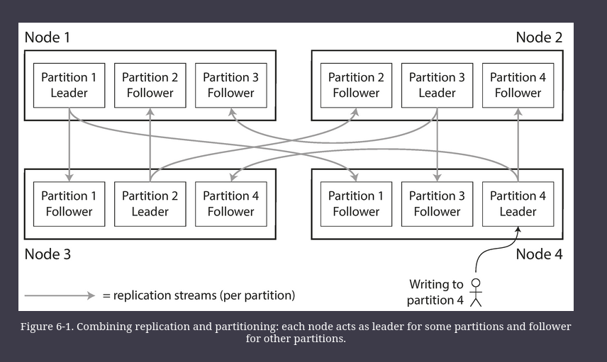
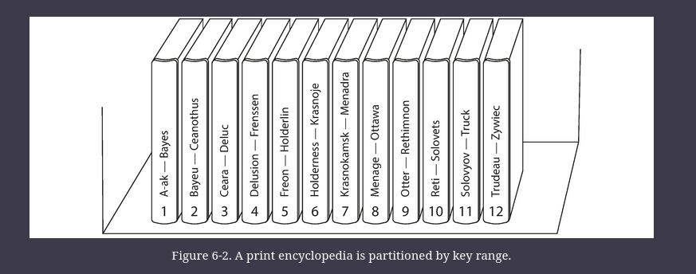
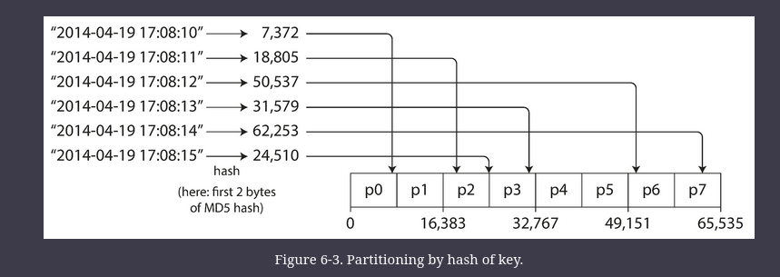
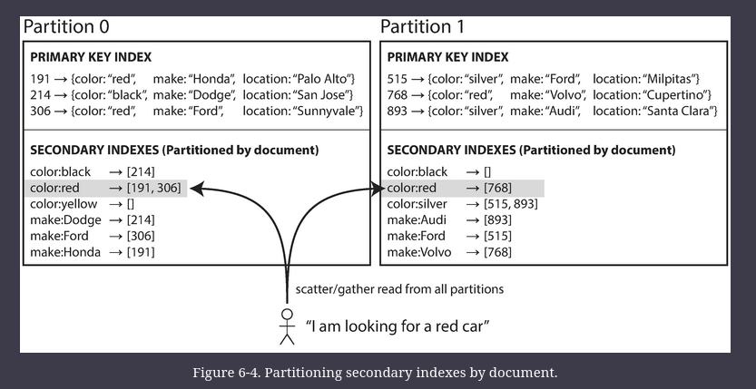
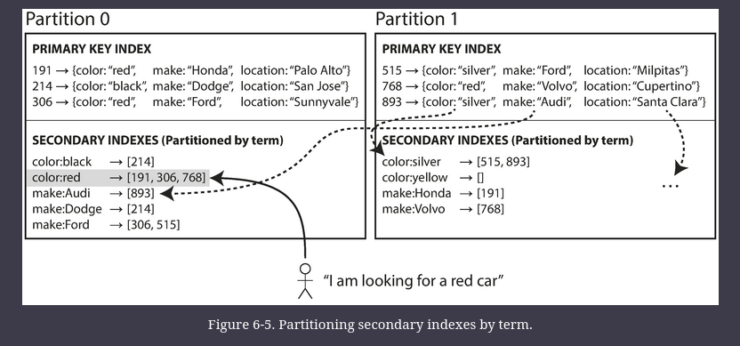
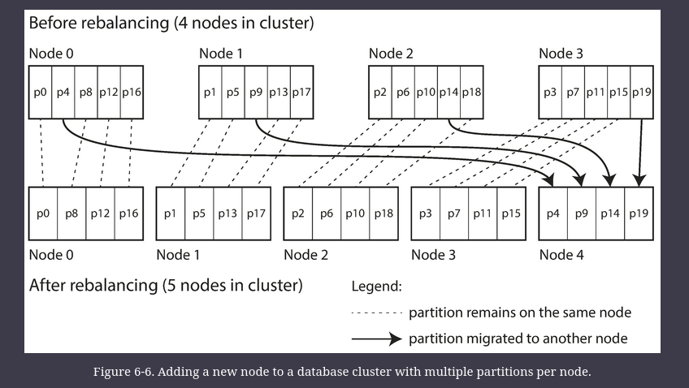
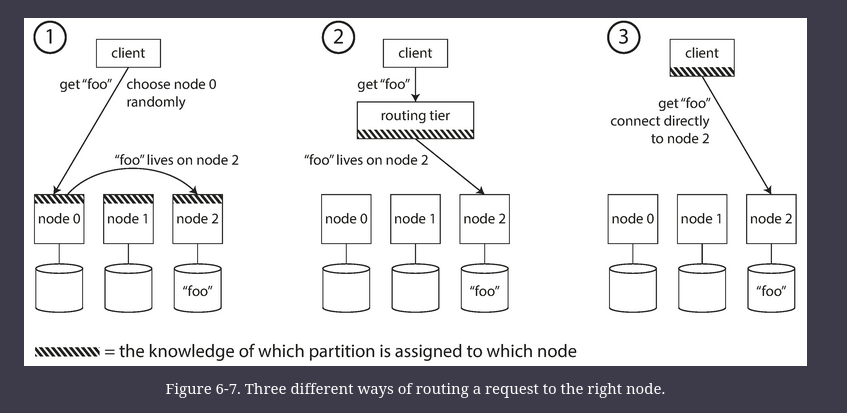
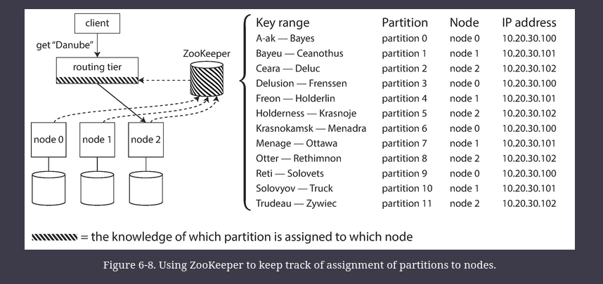

# Partitioning

For very large datasets, or very high query throughput, Replication is not sufficient, we need to break the data up into partitions, also called sharding.

Normally, partitions are defined in such a way that each piece of data (each record, row, or document) belongs to exactly one partition.

The main reason for wanting to partition data is _scalability_. Different partitions can be placed on different nodes in a shared-nothing cluster.
- Thus, a large dataset can be distributed across many disks, and the query load can be distributed across many processors.
- For queries that operate on a single partition, each node can independently execute the queries for its own partition, so query throughput can be scaled by adding more nodes. 
- Large, complex queries can potentially be parallelized across many nodes, although this gets significantly harder.

# Partitioning and Replication

Partitioning is usually combined with replication so that copies of each partition are stored on multiple nodes.
- This means that, even though each record belongs to exactly one partition, it may still be stored on several different nodes for fault tolerance.

A node may store more than one partition. If a leader–follower replication model is used, the combination of partitioning and replication can look like figure below:
- Each partition’s leader is assigned to one node, and its followers are assigned to other nodes. Each node may be the leader for some partitions and a follower for other partitions.
- The choice of partitioning scheme is mostly independent of the choice of replication scheme

# Partitioning of Key-Value Data

Our goal with partitioning is to spread the data and the query load evenly across nodes.

If the partitioning is unfair, so that some partitions have more data or queries than others, we call it _skewed_. The presence of skew makes partitioning much less effective.

A partition with disproportionately high load is called a _hot spot_.

The simplest approach for avoiding hot spots would be to assign records to nodes randomly. That would distribute the data quite evenly across the nodes, but it has a big disadvantage: when you’re trying to read a particular item, you have no way of knowing which node it is on, so you have to query all nodes in parallel.

## Partitioning by Key Range

One way of partitioning is to assign a continuous range of keys (from some minimum to some maximum) to each partition, like the volumes of a paper encyclopedia.

If you know the boundaries between the ranges, you can easily determine which partition contains a given key. If you also know which partition is assigned to which node, then you can make your request directly to the appropriate node (or, in the case of the encyclopedia, pick the correct book off the shelf).

The ranges of keys are not necessarily evenly spaced, because your data may not be evenly distributed.
- e.g. more data for A & B, compared to T-Z

Within each partition, we can keep keys in sorted order.
- This has the advantage that range scans are easy, and you can treat the key as a concatenated index in order to fetch several related records in one query
- For example, consider an application that stores data from a network of sensors, where the key is the timestamp of the measurement (year-month-day-hour-minute-second). 
    - Range scans are very useful in this case, because they let you easily fetch, say, all the readings from a particular month.

However, the downside of key range partitioning is that certain access patterns can lead to hot spots. 
- If the key is a timestamp, then the partitions correspond to ranges of time—e.g., one partition per day. 
- Unfortunately, because we write data from the sensors to the database as the measurements happen, all the writes end up going to the same partition (the one for today), so that partition can be overloaded with writes while others sit idle

To avoid this problem in the sensor database, you need to use something other than the timestamp as the first element of the key. 
- For example, you could prefix each timestamp with the sensor name so that the partitioning is first by sensor name and then by time. 
- Assuming you have many sensors active at the same time, the write load will end up more evenly spread across the partitions. Now, when you want to fetch the values of multiple sensors within a time range, you need to perform a separate range query for each sensor name.

## Partitioning by Hash of Key

Because of this risk of skew and hot spots, many distributed datastores use a hash function to determine the partition for a given key.

A good hash function takes skewed data and makes it uniformly distributed.
- For partitioning purposes, the hash function need not be cryptographically strong

Once you have a suitable hash function for keys, you can assign each partition a range of hashes (rather than a range of keys), and every key whose hash falls within a partition’s range will be stored in that partition.

Unfortunately however, by using the hash of the key for partitioning _we lose a nice property of key-range partitioning_: the ability to do efficient range queries.
- Keys that were once adjacent are now scattered across all the partitions, so their sort order is lost.
- In MongoDB, if you have enabled hash-based sharding mode, any range query has to be sent to all partitions

Cassandra achieves a compromise between the two partitioning strategies.
- A table in Cassandra can be declared with a _compound primary key_ consisting of several columns. 
- Only the first part of that key is hashed to determine the partition, but the other columns are used as a _concatenated index_ for sorting the data in Cassandra’s SSTables. 
- A query therefore cannot search for a range of values within the first column of a compound key, but if it specifies a fixed value for the first column, it can perform an efficient range scan over the other columns of the key.

The concatenated index approach enables an elegant data model for one-to-many relationships. 
- For example, on a social media site, one user may post many updates. If the primary key for updates is chosen to be `(user_id, update_timestamp)`, then you can efficiently retrieve all updates made by a particular user within some time interval, sorted by timestamp. 
- Different users may be stored on different partitions, but within each user, the updates are stored ordered by timestamp on a single partition.

## Skewed Workloads and Relieving Hot Spots

Hashing a key to determine its partition can help reduce hot spots. However, it can’t avoid them entirely
- all reads/writes could be directed to the same partition, in extreme case, like a celebrity user with millions of followers publishing something

Today, most data systems are not able to automatically compensate for such a highly skewed workload, so it’s the responsibility of the application to reduce the skew. 
- For example, if one key is known to be very hot, a simple technique is to add a random number to the beginning or end of the key. Just a two-digit decimal random number would split the writes to the key evenly across 100 different keys, allowing those keys to be distributed to different partitions.
- However, having split the writes across different keys, any reads now have to do additional work, as they have to read the data from all 100 keys and combine it.

# Partitioning and Secondary Indexes

The situation becomes more complicated if secondary indexes are involved.
- A secondary index usually doesn’t identify a record uniquely but rather is a way of searching for occurrences of a particular value

Secondary indexes are the bread and butter of relational databases, and they are common in document databases too

The problem with secondary indexes is that they don’t map neatly to partitions. 

There are two main approaches to partitioning a database with secondary indexes: 
1. document-based partitioning (Local Index)
2. term-based partitioning (Global Index)

Running Example: imagine you are operating a website for selling used cars. 
- Each listing has a unique ID—call it the _document ID_—and you partition the database by the document ID (for example, IDs 0 to 499 in partition 0, IDs 500 to 999 in partition 1, etc.).

You want to let users search for cars, allowing them to filter by color and by make, so you need a secondary index on `color` and `make`

## Partitioning Secondary Indexes by Document aka Local Index

In this indexing approach, each partition is completely separate: each partition maintains its own secondary indexes, covering only the documents in that partition. 
- It doesn’t care what data is stored in other partitions. 
- Whenever you write to the database—to add, remove, or update a document—you only need to deal with the partition that contains the document ID that you are writing. 
- For that reason, a document-partitioned index is also known as a _local index_

However, reading from a document-partitioned index requires care: unless you have done something special with the document IDs, there is no reason why all the cars with a particular color or a particular make would be in the same partition. In figure above red cars appear in both partition 0 and partition 1.

Therefore, if you want to search for red cars, you need to send the query to _all_ partitions, and combine all the results you get back.
- This approach to querying a partitioned database is sometimes known as _scatter/gather_, and it can make read queries on secondary indexes quite expensive.

## Partitioning Secondary Indexes by Term

Rather than each partition having its own secondary index (a _local index_), we can construct a _global index_ that covers data in all partitions. However, we can’t just store that index on one node, since it would likely become a bottleneck and defeat the purpose of partitioning. A global index must also be partitioned, but it can be partitioned differently from the primary key index.

Figure below illustrates this: red cars from all partitions appear under `color:red` in the index, but the index is partitioned so that colors starting with the letters _a_ to _r_ appear in partition 0 and colors starting with _s_ to _z_ appear in partition 1.

We call this kind of index _term-partitioned_, because the term we’re looking for determines the partition of the index. Here, a term would be `color:red`.

We can partition the global index by the term (useful for range scans), or by the hash of the term (more even distribution of load)

The advantage of a global (term-partitioned) index over a document-partitioned index is that it can make reads more efficient: rather than doing scatter/gather over all partitions, a client only needs to make a request to the partition containing the term that it wants. 

However, the downside of a global index is that writes are slower and more complicated, because a write to a single document may now affect multiple partitions of the index (every term in the document might be on a different partition, on a different node).

In practice, updates to global secondary indexes are often asynchronous. that is, if you read the index shortly after a write, the change you just made may not yet be reflected in the index). For example, **Amazon DynamoDB** states that its global secondary indexes are updated within a fraction of a second in normal circumstances, but may experience longer propagation delays in cases of faults in the infrastructure

---

# Rebalancing Partitions

The process of moving load from one node in the cluster to another is called _rebalancing_.

No matter which partitioning scheme is used, rebalancing is usually expected to meet some minimum requirements:

* After rebalancing, the load (data storage, read and write requests) should be shared fairly between the nodes in the cluster.
* While rebalancing is happening, the database should continue accepting reads and writes.  
* No more data than necessary should be moved between nodes, to make rebalancing fast and to minimize the network and disk I/O load.

## Strategies for Rebalancing

### How not to do it: hash mod N

When partitioning by hash of a key, the `mod` function is not recommended, why?

The problem with the _mod N_ approach is that if the number of nodes _N_ changes, most of the keys will need to be moved from one node to another. 
- For example, say _hash_(_key_) = 123456\. If you initially have 10 nodes, that key starts out on node 6 (because 123456 _mod_ 10 = 6). 
- When you grow to 11 nodes, the key needs to move to node 3 (123456 _mod_ 11 = 3), and when you grow to 12 nodes, it needs to move to node 0 (123456 _mod_ 12 = 0). 
- Such frequent moves make rebalancing excessively expensive.

### Fixed number of partitions

Fortunately, there is a fairly simple solution: create many more partitions than there are nodes, and assign several partitions to each node. 
- For example, a database running on a cluster of 10 nodes may be split into 1,000 partitions from the outset so that approximately 100 partitions are assigned to each node.

Now, if a node is added to the cluster, the new node can _steal_ a few partitions from every existing node until partitions are fairly distributed once again. This process is illustrated in Figure below. 
- If a node is removed from the cluster, the same happens in reverse.

Only entire partitions are moved between nodes. The number of partitions does not change, nor does the assignment of keys to partitions. The only thing that changes is the assignment of partitions to nodes. This change of assignment is not immediate—it takes some time to transfer a large amount of data over the network—so the old assignment of partitions is used for any reads and writes that happen while the transfer is in progress.

In this configuration, the number of partitions is usually fixed when the database is first set up and not changed afterward.

### Dynamic partitioning

For databases that use key range partitioning, a fixed number of partitions with fixed boundaries would be very inconvenient: if you got the boundaries wrong, you could end up with all of the data in one partition and all of the other partitions empty.

For that reason, key range–partitioned databases such as HBase and RethinkDB create partitions dynamically. When a partition grows to exceed a configured size (on HBase, the default is 10 GB), it is split into two partitions so that approximately half of the data ends up on each side of the split. (Reverse if lots of data is deleted).

Each partition is assigned to one node, and each node can handle multiple partitions, like in the case of a fixed number of partitions. After a large partition has been split, one of its two halves can be transferred to another node in order to balance the load.

However, a caveat is that an empty database starts off with a single partition, since there is no _a priori_ information about where to draw the partition boundaries. While the dataset is small—until it hits the point at which the first partition is split—all writes have to be processed by a single node while the other nodes sit idle. To mitigate this issue, HBase and MongoDB allow an initial set of partitions to be configured on an empty database (this is called _pre-splitting_). In the case of key-range partitioning, pre-splitting requires that you already know what the key distribution is going to look like.

Dynamic partitioning is not only suitable for key range–partitioned data, but can equally well be used with hash-partitioned data.

### Partitioning proportionally to nodes

This option is to make the number of partitions proportional to the number of nodes—in other words, to have a fixed number of partitions _per node_

In this case, the size of each partition grows proportionally to the dataset size while the number of nodes remains unchanged, but when you increase the number of nodes, the partitions become smaller again. Since a larger data volume generally requires a larger number of nodes to store, this approach also keeps the size of each partition fairly stable.

When a new node joins the cluster, it randomly chooses a fixed number of existing partitions to split, and then takes ownership of one half of each of those split partitions while leaving the other half of each partition in place.

## Operations: Automatic or Manual Rebalancing

Rebalancing is an expensive operation, because it requires rerouting requests and moving a large amount of data from one node to another.

 If it is not done carefully, this process can overload the network or the nodes and harm the performance of other requests while the rebalancing is in progress.

Fully automated rebalancing can be convenient, because there is less operational work to do for normal maintenance. However, it can be unpredictable.

For that reason, it can be a good thing to have a human in the loop for rebalancing. It’s slower than a fully automatic process, but it can help prevent operational surprises.

---

# Request Routing

One we have our partitions, if the client wants to read or write a key "foo", which IP address and port number do they need to connect to?

The above problem is an instance of a more general problem called _service discovery_, which is not limited to databases.

Few approaches: 

1. Allow clients to contact any node (e.g., via a round-robin load balancer).
2. Send all requests from clients to a routing tier first, which determines the node that should handle each request and forwards it accordingly. This routing tier does not itself handle any requests; it only acts as a partition-aware load balancer.
3. Require that clients be aware of the partitioning and the assignment of partitions to nodes. In this case, a client can connect directly to the appropriate node, without any intermediary.

In all cases, the key problem is: how does the component making the routing decision (which may be one of the nodes, or the routing tier, or the client) learn about changes in the assignment of partitions to nodes?

Many distributed data systems rely on a separate coordination service such as ZooKeeper to keep track of this cluster metadata.

When using a routing tier or when sending requests to a random node, clients still need to find the IP addresses to connect to. These are not as fast-changing as the assignment of partitions to nodes, so it is often sufficient to use DNS for this purpose.