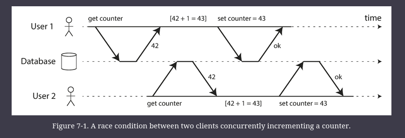
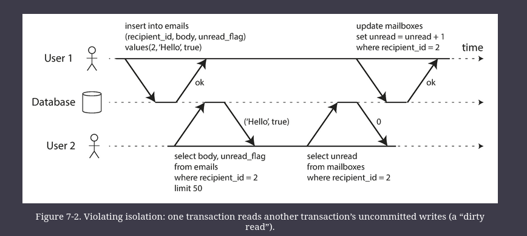
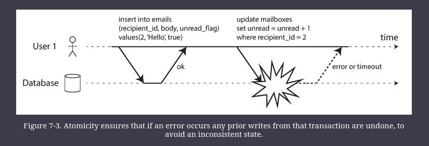
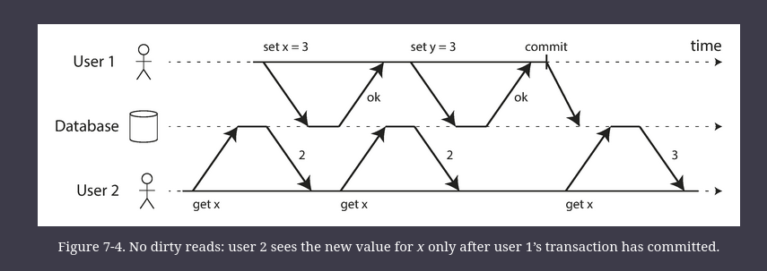
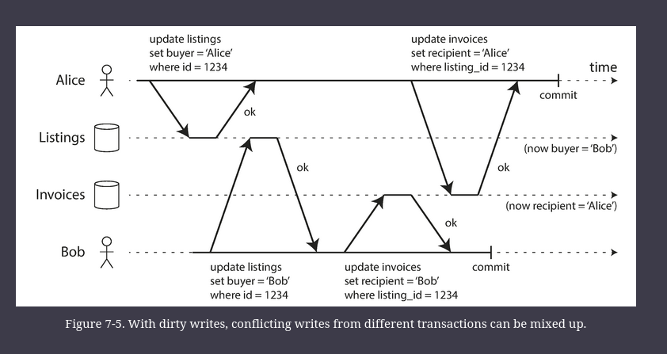
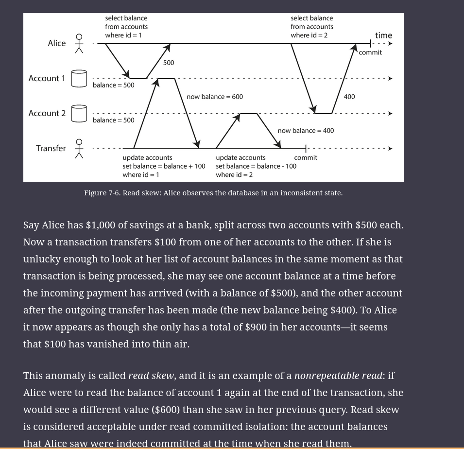

# Transactions

A transaction is a way for an application to group several reads and writes together into a logical unit. 

Conceptually, all the reads and writes in a transaction are executed as one operation: either the entire transaction succeeds (_commit_) or it fails (_abort_, _rollback_).

Almost all relational databases today, and some nonrelational databases, support transactions.

## The Meaning of ACID

The safety guarantees provided by transactions are often described by the well-known acronym _ACID_, which stands for _Atomicity_, _Consistency_, _Isolation_, and _Durability_.

However, in practice, one database’s implementation of ACID does not equal another’s implementation.
- e.g. there is a lot of ambiguity around the definition of _isolation_

### Atomicity

In general, _atomic_ refers to something that cannot be broken down into smaller parts.

The word means similar but subtly different things in different branches of computing. 
- For example, in multi-threaded programming, if one thread executes an atomic operation, that means there is no way that another thread could see the half-finished result of the operation. 
    - The system can only be in the state it was before the operation or after the operation, not something in between.

By contrast, in the context of ACID, atomicity is _not_ about concurrency. 
- It does not describe what happens if several processes try to access the same data at the same time, because that is covered under the letter _I_, for _isolation_

Rather, ACID atomicity describes what happens if a client wants to make several writes, but a fault occurs after some of the writes have been processed, for example, a process crashes, a network connection is interrupted, a disk becomes full, or some integrity constraint is violated.  
- If the writes are grouped together into an atomic transaction, and the transaction cannot be completed (_committed_) due to a fault, then the transaction is _aborted_ and the database must discard or undo any writes it has made so far in that transaction.
- if a transaction was aborted, the application can be sure that it didn’t change anything, so it can safely be retried.

### Consistency

The idea of ACID consistency is that you have certain statements about your data (_invariants_) that must always be true—for example, in an accounting system, credits and debits across all accounts must always be balanced. 
- If a transaction starts with a database that is valid according to these invariants, and any writes during the transaction preserve the validity, then you can be sure that the invariants are always satisfied.

However, this idea of consistency depends on the application’s notion of invariants, and it’s the application’s responsibility to define its transactions correctly so that they preserve consistency. 
- This is not something that the database can guarantee

Atomicity, isolation, and durability are properties of the database, whereas consistency (in the ACID sense) is a property of the application.
- Thus, the letter C does not really belong in ACID

### Isolation

Most databases are accessed by several clients at the same time. That is no problem if they are reading and writing different parts of the database, but if they are accessing the same database records, you can run into concurrency problems (race conditions).

_Isolation_ in the sense of ACID means that concurrently executing transactions are isolated from each other: they cannot step on each other’s toes.

The classic database textbooks formalize isolation as _serializability_, which means that each transaction can pretend that it is the only transaction running on the entire database. The database ensures that when the transactions have committed, the result is the same as if they had run _serially_ (one after another), even though in reality they may have run concurrently.

However, in practice, serializable isolation is rarely used, because it carries a performance penalty.



### Durability

The purpose of a database system is to provide a safe place where data can be stored without fear of losing it. _Durability_ is the promise that once a transaction has committed successfully, any data it has written will not be forgotten, even if there is a hardware fault or the database crashes.

In a single-node database, durability typically means that the data has been written to nonvolatile storage such as a hard drive or SSD. It usually also involves a write-ahead log or similar, which allows recovery in the event that the data structures on disk are corrupted. 

In a replicated database, durability may mean that the data has been successfully copied to some number of nodes.

In order to provide a durability guarantee, a database must wait until these writes or replications are complete before reporting a transaction as successfully committed.

Perfect durability does not exist: if all your hard disks and all your backups are destroyed at the same time, there’s obviously nothing your database can do to save you.

## Single-Object and Multi-Object Operations

_multi-object transactions_ are often needed if several pieces of data need to be kept in sync.

example: 

```sql
SELECT COUNT(*) FROM emails WHERE recipient_id = 2 AND unread_flag = true
```

The above query could be slow, so let's say we add a field to act as a counter.
- Every time an email comes/mark as read, we increment/decrement the counter

In the figure below, user-2 experiences an anomaly. 
-  Isolation would have prevented this issue by ensuring that user 2 sees either both the inserted email and the updated counter, or neither, but not an inconsistent halfway point.



Figure below illustrates the need for atomicity: if an error occurs somewhere over the course of the transaction, the contents of the mailbox and the unread counter might become out of sync. 
- In an atomic transaction, if the update to the counter fails, the transaction is aborted and the inserted email is rolled back.




**Multi-object transactions require some way of determining which read and write operations belong to the same transaction. **
- In relational databases, that is typically done based on the client’s TCP connection to the database server: on any particular connection, everything between a `BEGIN TRANSACTION` and a `COMMIT` statement is considered to be part of the same transaction.

On the other hand, many nonrelational databases don’t have such a way of grouping operations together. 
- Even if there is a multi-object API (for example, a key-value store may have a _multi-put_ operation that updates several keys in one operation), that doesn’t necessarily mean it has transaction semantics: the command may succeed for some keys and fail for others, leaving the database in a partially updated state.

### Single-object writes

Atomicity and isolation also apply when a single object is being changed. For example, imagine you are writing a 20 KB JSON document to a database, and something bad/concurrent happens (network conn interrupted, power failure, another client reads that document)

Those issues would be incredibly confusing, so storage engines almost universally aim to provide atomicity and isolation on the level of a single object (such as a key-value pair) on one node.

Atomicity can be implemented using a log for crash recovery (See chapter 3, making B-Trees reliable), and isolation can be implemented using a lock on each object (allowing only one thread to access an object at any one time).

Single-object operations are not transactions in the usual sense of the word.

### The need for multi-object transactions

But do we need multi-object transactions at all? Would it be possible to implement any application with only a key-value data model and single-object operations?

- In a relational data model, a row in one table often has a foreign key reference to a row in another table. (Similarly, in a graph-like data model, a vertex has edges to other vertices.) Multi-object transactions allow you to ensure that these references remain valid
- When denormalized information needs to be updated in a document data model, you need to update several documents in one go. Transactions are very useful in this situation to prevent denormalized data from going out of sync.
- In databases with secondary indexes (almost everything except pure key-value stores), the indexes also need to be updated every time you change a value.

### Handling errors and aborts

A key feature of a transaction is that it can be aborted and safely retried if an error occurred. ACID databases are based on this philosophy: if the database is in danger of violating its guarantee of atomicity, isolation, or durability, it would rather abandon the transaction entirely than allow it to remain half-finished.


# Weak Isolation Levels

If two transactions don’t touch the same data, they can safely be run in parallel, because neither depends on the other. Concurrency issues (race conditions) only come into play when one transaction reads data that is concurrently modified by another transaction, or when two transactions try to simultaneously modify the same data.

Concurrency bugs are hard to find by testing, because such bugs are only triggered when you get unlucky with the timing. Such timing issues might occur very rarely, and are usually difficult to reproduce.

Databases have long tried to hide concurrency issues from application developers by providing _transaction isolation_. 

In theory, isolation should make your life easier by letting you pretend that no concurrency is happening: _serializable_ isolation means that the database guarantees that transactions have the same effect as if they ran _serially_ (i.e., one at a time, without any concurrency).

In practice, isolation is unfortunately not that simple. Serializable isolation has a performance cost, and many databases don’t want to pay that price. 
- It’s therefore common for systems to use weaker levels of isolation, which protect against _some_ concurrency issues, but not all. 
- Those levels of isolation are much harder to understand, and they can lead to subtle bugs, but they are nevertheless used in practice

Even many popular relational database systems (which are usually considered “ACID”) use weak isolation, so they wouldn’t necessarily have prevented these bugs (substantial loss of money, investigation by financial auditors, customer data corruption) from occurring.

Various isolation levels: 

## Read Committed

The most basic level of transaction isolation is _read committed_.  

It makes two guarantees:
1.  When reading from the database, you will only see data that has been committed (no _dirty reads_).   
2.  When writing to the database, you will only overwrite data that has been committed (no _dirty writes_).

### No dirty reads

Happens if another transaction can see the uncommitted changes of a transaction.

Useful to prevent dirtry reads: 
- coz a transaction may see partial updates by another transaction
- coz a transaction may read data that is aborted/rolled back by another transaction



### No dirty writes

Happends when a transaction modifies the uncommitted part of a previous transaction.

Avoids some kind of concurrency problems: 
- prevents bad outcome when a transaction updates multiple objects
- however, read committed does not prevent race conditions b/w two counter increments (as shown in figure below)



### Implementing read committed

Dirty writes are prevented using Locks, and the same locks can be used to prevent Dirtry reads. 

However, waiting for lock to be released for reads and writes can slow down a DB. 

Therefore, most DBs prevent dirty reads by remembering both old committed value & the new value (figure 7-4 above)

## Snapshot Isolation and Repeatable Read

Even after read committed isolation, we may still have concurrency bugs. 
-e.g. non-repeatable reads (read skew is an example of non-repeatable reads)

e.g. figure below: 



_Snapshot isolation_ is the most common solution to this problem. 
- The idea is that each transaction reads from a _consistent snapshot_ of the database—that is, the transaction sees all the data that was committed in the database at the start of the transaction. 
- Even if the data is subsequently changed by another transaction, each transaction sees only the old data from that particular point in time.