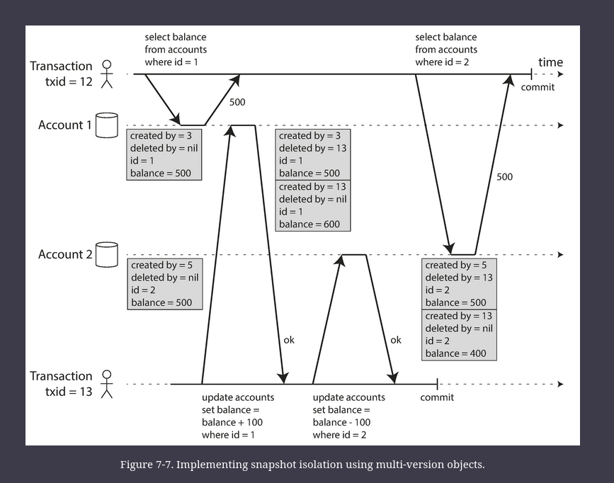
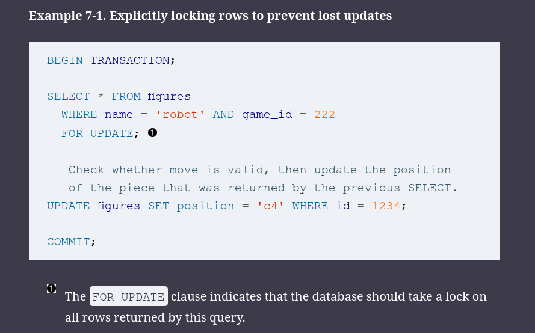
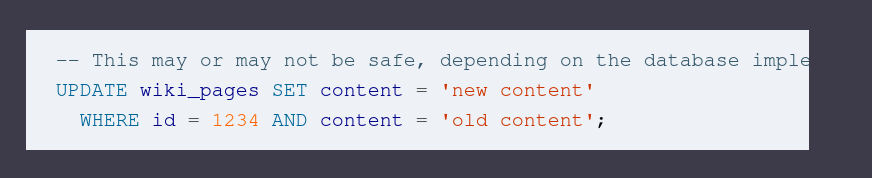
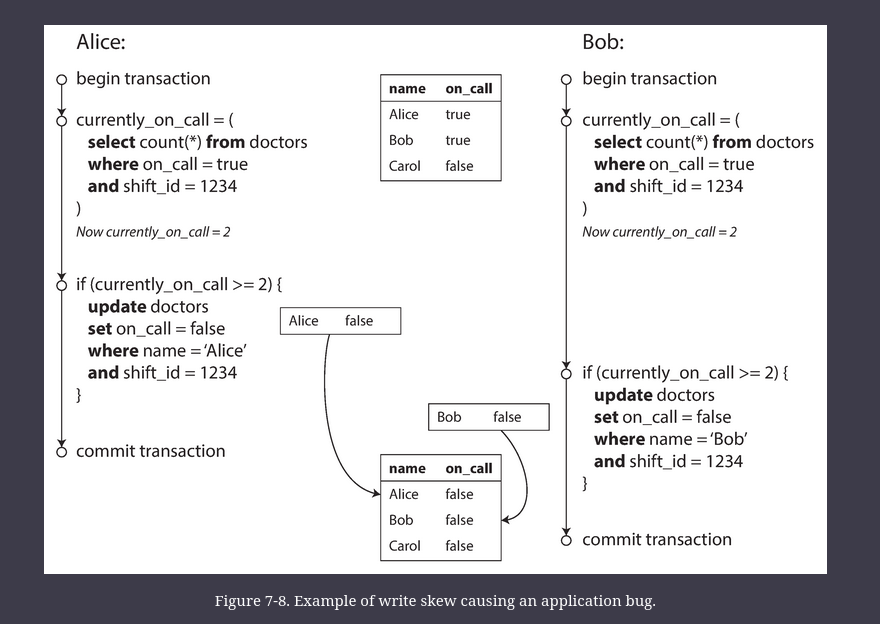
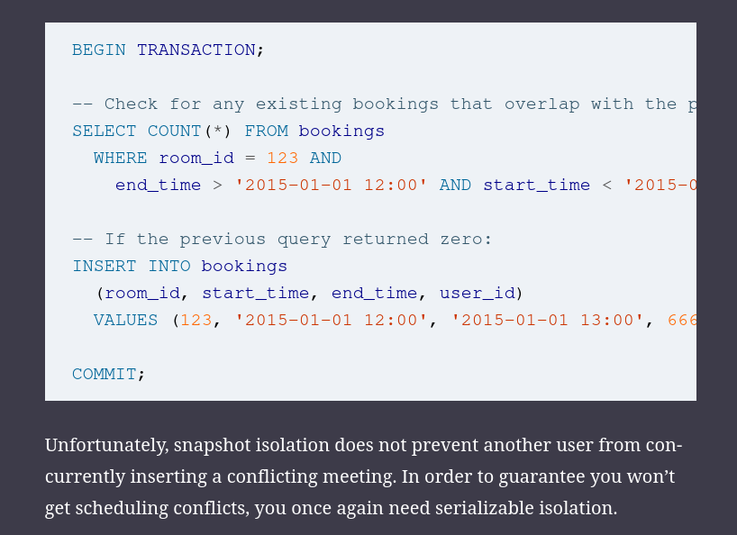

# Transactions

A transaction is a way for an application to group several reads and writes together into a logical unit. 

Conceptually, all the reads and writes in a transaction are executed as one operation: either the entire transaction succeeds (_commit_) or it fails (_abort_, _rollback_).

Almost all relational databases today, and some nonrelational databases, support transactions.

## The Meaning of ACID

The safety guarantees provided by transactions are often described by the well-known acronym _ACID_, which stands for _Atomicity_, _Consistency_, _Isolation_, and _Durability_.

However, in practice, one database’s implementation of ACID does not equal another’s implementation.
- e.g. there is a lot of ambiguity around the definition of _isolation_

### Atomicity

In general, _atomic_ refers to something that cannot be broken down into smaller parts.

The word means similar but subtly different things in different branches of computing. 
- For example, in multi-threaded programming, if one thread executes an atomic operation, that means there is no way that another thread could see the half-finished result of the operation. 
    - The system can only be in the state it was before the operation or after the operation, not something in between.

By contrast, in the context of ACID, atomicity is _not_ about concurrency. 
- It does not describe what happens if several processes try to access the same data at the same time, because that is covered under the letter _I_, for _isolation_

Rather, ACID atomicity describes what happens if a client wants to make several writes, but a fault occurs after some of the writes have been processed, for example, a process crashes, a network connection is interrupted, a disk becomes full, or some integrity constraint is violated.  
- If the writes are grouped together into an atomic transaction, and the transaction cannot be completed (_committed_) due to a fault, then the transaction is _aborted_ and the database must discard or undo any writes it has made so far in that transaction.
- if a transaction was aborted, the application can be sure that it didn’t change anything, so it can safely be retried.

### Consistency

The idea of ACID consistency is that you have certain statements about your data (_invariants_) that must always be true—for example, in an accounting system, credits and debits across all accounts must always be balanced. 
- If a transaction starts with a database that is valid according to these invariants, and any writes during the transaction preserve the validity, then you can be sure that the invariants are always satisfied.

However, this idea of consistency depends on the application’s notion of invariants, and it’s the application’s responsibility to define its transactions correctly so that they preserve consistency. 
- This is not something that the database can guarantee

Atomicity, isolation, and durability are properties of the database, whereas consistency (in the ACID sense) is a property of the application.
- Thus, the letter C does not really belong in ACID

### Isolation

Most databases are accessed by several clients at the same time. That is no problem if they are reading and writing different parts of the database, but if they are accessing the same database records, you can run into concurrency problems (race conditions).

_Isolation_ in the sense of ACID means that concurrently executing transactions are isolated from each other: they cannot step on each other’s toes.

The classic database textbooks formalize isolation as _serializability_, which means that each transaction can pretend that it is the only transaction running on the entire database. The database ensures that when the transactions have committed, the result is the same as if they had run _serially_ (one after another), even though in reality they may have run concurrently.

However, in practice, serializable isolation is rarely used, because it carries a performance penalty.


### Durability

The purpose of a database system is to provide a safe place where data can be stored without fear of losing it. _Durability_ is the promise that once a transaction has committed successfully, any data it has written will not be forgotten, even if there is a hardware fault or the database crashes.

In a single-node database, durability typically means that the data has been written to nonvolatile storage such as a hard drive or SSD. It usually also involves a write-ahead log or similar, which allows recovery in the event that the data structures on disk are corrupted. 

In a replicated database, durability may mean that the data has been successfully copied to some number of nodes.

In order to provide a durability guarantee, a database must wait until these writes or replications are complete before reporting a transaction as successfully committed.

Perfect durability does not exist: if all your hard disks and all your backups are destroyed at the same time, there’s obviously nothing your database can do to save you.

---

## Single-Object and Multi-Object Operations

_multi-object transactions_ are often needed if several pieces of data need to be kept in sync.

example: 

```sql
SELECT COUNT(*) FROM emails WHERE recipient_id = 2 AND unread_flag = true
```

The above query could be slow, so let's say we add a field to act as a counter.
- Every time an email comes/mark as read, we increment/decrement the counter

In the figure below, user-2 experiences an anomaly. 
-  Isolation would have prevented this issue by ensuring that user 2 sees either both the inserted email and the updated counter, or neither, but not an inconsistent halfway point.


Figure below illustrates the need for atomicity: if an error occurs somewhere over the course of the transaction, the contents of the mailbox and the unread counter might become out of sync. 
- In an atomic transaction, if the update to the counter fails, the transaction is aborted and the inserted email is rolled back.


**Multi-object transactions require some way of determining which read and write operations belong to the same transaction. **
- In relational databases, that is typically done based on the client’s TCP connection to the database server: on any particular connection, everything between a `BEGIN TRANSACTION` and a `COMMIT` statement is considered to be part of the same transaction.

On the other hand, many nonrelational databases don’t have such a way of grouping operations together. 
- Even if there is a multi-object API (for example, a key-value store may have a _multi-put_ operation that updates several keys in one operation), that doesn’t necessarily mean it has transaction semantics: the command may succeed for some keys and fail for others, leaving the database in a partially updated state.

### Single-object writes

Atomicity and isolation also apply when a single object is being changed. For example, imagine you are writing a 20 KB JSON document to a database, and something bad/concurrent happens (network conn interrupted, power failure, another client reads that document)

Those issues would be incredibly confusing, so storage engines almost universally aim to provide atomicity and isolation on the level of a single object (such as a key-value pair) on one node.

Atomicity can be implemented using a log for crash recovery (See chapter 3, making B-Trees reliable), and isolation can be implemented using a lock on each object (allowing only one thread to access an object at any one time).

Single-object operations are not transactions in the usual sense of the word.

### The need for multi-object transactions

But do we need multi-object transactions at all? Would it be possible to implement any application with only a key-value data model and single-object operations?

- In a relational data model, a row in one table often has a foreign key reference to a row in another table. (Similarly, in a graph-like data model, a vertex has edges to other vertices.) Multi-object transactions allow you to ensure that these references remain valid
- When denormalized information needs to be updated in a document data model, you need to update several documents in one go. Transactions are very useful in this situation to prevent denormalized data from going out of sync.
- In databases with secondary indexes (almost everything except pure key-value stores), the indexes also need to be updated every time you change a value.

### Handling errors and aborts

A key feature of a transaction is that it can be aborted and safely retried if an error occurred. ACID databases are based on this philosophy: if the database is in danger of violating its guarantee of atomicity, isolation, or durability, it would rather abandon the transaction entirely than allow it to remain half-finished.

---

# Weak Isolation Levels

If two transactions don’t touch the same data, they can safely be run in parallel, because neither depends on the other. Concurrency issues (race conditions) only come into play when one transaction reads data that is concurrently modified by another transaction, or when two transactions try to simultaneously modify the same data.

Concurrency bugs are hard to find by testing, because such bugs are only triggered when you get unlucky with the timing. Such timing issues might occur very rarely, and are usually difficult to reproduce.

Databases have long tried to hide concurrency issues from application developers by providing _transaction isolation_. 

In theory, isolation should make your life easier by letting you pretend that no concurrency is happening: _serializable_ isolation means that the database guarantees that transactions have the same effect as if they ran _serially_ (i.e., one at a time, without any concurrency).

In practice, isolation is unfortunately not that simple. Serializable isolation has a performance cost, and many databases don’t want to pay that price. 
- It’s therefore common for systems to use weaker levels of isolation, which protect against _some_ concurrency issues, but not all. 
- Those levels of isolation are much harder to understand, and they can lead to subtle bugs, but they are nevertheless used in practice

Even many popular relational database systems (which are usually considered “ACID”) use weak isolation, so they wouldn’t necessarily have prevented these bugs (substantial loss of money, investigation by financial auditors, customer data corruption) from occurring.

Various isolation levels: 

## Read Committed

The most basic level of transaction isolation is _read committed_.  

It makes two guarantees:
1.  When reading from the database, you will only see data that has been committed (no _dirty reads_).   
2.  When writing to the database, you will only overwrite data that has been committed (no _dirty writes_).

### No dirty reads

Happens if another transaction can see the uncommitted changes of a transaction.

Useful to prevent dirtry reads: 
- coz a transaction may see partial updates by another transaction
- coz a transaction may read data that is aborted/rolled back by another transaction


### No dirty writes

Happends when a transaction modifies the uncommitted part of a previous transaction.

Avoids some kind of concurrency problems: 
- prevents bad outcome when a transaction updates multiple objects
- however, read committed does not prevent race conditions b/w two counter increments (as shown in figure below)


### Implementing read committed

Dirty writes are prevented using Locks, and the same locks can be used to prevent Dirtry reads. 

However, waiting for lock to be released for reads and writes can slow down a DB. 

Therefore, most DBs prevent dirty reads by remembering both old committed value & the new value (figure 7-4 above)

## Snapshot Isolation and Repeatable Read

Even after read committed isolation, we may still have concurrency bugs. 
-e.g. non-repeatable reads (read skew is an example of non-repeatable reads)

e.g. figure below: 


While Alice will see her correct balance eventually, other situations where read-skew is a problem: 
- Backups
    - while a DB is being backed-up, writes continue to happen, thus the backup may become inconsistent.
- Long running Analytic queries may return non-sensical data if the underlying data changes

_Snapshot isolation_ is the most common solution to read-skew:
- The idea is that each transaction reads from a _consistent snapshot_ of the database—that is, the transaction sees all the data that was committed in the database at the start of the transaction. 
- Even if the data is subsequently changed by another transaction, each transaction sees only the old data from that particular point in time.

### Implementing snapshot isolation

A key principle of snapshot isolation is _readers never block writers, and writers never block readers_

Dirty writes are still prevented with Locks. 

However, reads do not require any locks
- The DB keeps different committed version of objects
- this technique is called **multi-version concurrency control (MVCC)**



Each row in a table has a `created_by` field, containing the ID of the transaction that inserted this row into the table. Moreover, each row has a `deleted_by` field, which is initially empty. If a transaction deletes a row, the row isn’t actually deleted from the database, but it is marked for deletion by setting the `deleted_by` field to the ID of the transaction that requested the deletion. At some later time, when it is certain that no transaction can any longer access the deleted data, a garbage collection process in the database removes any rows marked for deletion and frees their space.

An update is internally translated into a delete and a create. For example, in [Figure 7-7] transaction 13 deducts $100 from account 2, changing the balance from $500 to $400. The `accounts` table now actually contains two rows for account 2: a row with a balance of $500 which was marked as deleted by transaction 13, and a row with a balance of $400 which was created by transaction 13.

An object is visible if both of the following conditions are true:
* At the time when the reader’s transaction started, the transaction that created the object had already committed.
* The object is not marked for deletion, or if it is, the transaction that requested deletion had not yet committed at the time when the reader’s transaction started.
  
A long-running transaction may continue using a snapshot for a long time, continuing to read values that (from other transactions’ point of view) have long been overwritten or deleted. By never updating values in place but instead creating a new version every time a value is changed, the database can provide a consistent snapshot while incurring only a small overhead.

Many databases that implement snapshot isolation call it by different names. In Oracle it is called _serializable_, and in PostgreSQL and MySQL it is called _repeatable read_.
- The reason for this naming confusion is that the SQL standard doesn’t have the concept of snapshot isolation, because the standard is based on System R’s 1975 definition of isolation levels, and snapshot isolation hadn’t yet been invented then.

## Preventing Lost Updates

In addition to dirty writes, another problem that can occur b/w concurrently writing transactions is **lost updates**

The lost update problem can occur if an application reads some value from the database, modifies it, and writes back the modified value (a _read-modify-write cycle_). 
- If two transactions do this concurrently, one of the modifications can be lost

This pattern occurs in various scenarios, e.g.: 
- Incrementing a counter or updating an account balance (requires reading the current value, calculating the new value, and writing back the updated value)
- Making a local change to a complex value, e.g., adding an element to a list within a JSON document
- Two users editing a wiki page at the same time

Solutions: 

1. Atomic write operations
2. explicit locking
3. auto detecting lost updates
4. compare-and-set

### Atomic write operations

Many databases provide atomic update operations, which remove the need to implement read-modify-write cycles in application code. They are usually the best solution if your code can be expressed in terms of those operations.

For example, the following instruction is concurrency-safe in most relational databases:
```sql
UPDATE counters SET value = value + 1 WHERE key = 'foo';
```

Atomic operations are usually implemented by taking an exclusive lock on the object when it is read so that no other transaction can read it until the update has been applied. This technique is sometimes known as _cursor stability_ . Another option is to simply force all atomic operations to be executed on a single thread.

### Explicit locking

Instead of the DB, the application can do the locking.



### Automatically detecting lost updates

Some DBs can automatically detect lost update scenarios.

An advantage of this approach is that databases can perform this check efficiently in conjunction with snapshot isolation.

### Compare-and-set

The purpose of this operation is to avoid lost updates by allowing an update to happen only if the value has not changed since you last read it.



### Conflict resolution and replication

A common approach in multi-leader or leaderless replicated databases is to allow concurrent writes to create several conflicting versions of a value (also known as _siblings_), and to use application code or special data structures to resolve and merge these versions after the fact.

---

## Write Skew and Phantoms

A transaction reads something, makes a decision based on the value it saw, and writes the decision to the database. However, by the time the write is made, the premise of the decision is no longer true.

Scenario below: at least one doctor has to be on-call, on-call cannot be empty. Yet, after Alice and Bob's transactions, on-call count is zero



You can think of write skew as a generalization of the lost update problem. Write skew can occur if two transactions read the same objects, and then update some of those objects (different transactions may update different objects). In the special case where different transactions update the same object, you get a dirty write or lost update anomaly (depending on the timing).

Other examples of write-skew: 

- Meeting room booking system


- Multiplayer game
    - two players attempt to move two different figures to the same position on the board
- Claiming a username
    - not safe under snapshot isolation, but a unique constraint is a simple satisfactory solution
- Preventing double-spending
    - A service that allows users to spend money or points needs to check that a user doesn’t spend more than they have.

All of these examples follow a similar pattern:

1.  A `SELECT` query checks whether some requirement is satisfied by searching for rows that match some search condition (there are at least two doctors on call, there are no existing bookings for that room at that time, the position on the board doesn’t already have another figure on it, the username isn’t already taken, there is still money in the account).
2.  Depending on the result of the first query, the application code decides how to continue (perhaps to go ahead with the operation, or perhaps to report an error to the user and abort).
3.  If the application decides to go ahead, it makes a write (`INSERT`, `UPDATE`, or `DELETE`) to the database and commits the transaction.
    
    The effect of this write changes the precondition of the decision of step 2. In other words, if you were to repeat the `SELECT` query from step 1 after committing the write, you would get a different result, because the write changed the set of rows matching the search condition (there is now one fewer doctor on call, the meeting room is now booked for that time, the position on the board is now taken by the figure that was moved, the username is now taken, there is now less money in the account).
    
This effect, where a write in one transaction changes the result of a search query in another transaction, is called a _phantom_

Snapshot isolation avoids phantoms in read-only queries, but in read-write transactions like the examples we discussed, phantoms can lead to particularly tricky cases of write skew.

Solutions:
1. Materializing conflicts
2. Serializability

### Materializing conflicts

If the problem of phantoms is that there is no object to which we can attach the locks, perhaps we can artificially introduce a lock object into the database?

Materializing Conflicts is **an approach that turns a Phantom into a lock conflict on a concrete set of rows in the database**. It avoids transactions taking incorrect decisions based on non-existent data by materializing objects or rows that the transactions need to fight over.

Does not fully resolve phantoms.

---

# Serializability