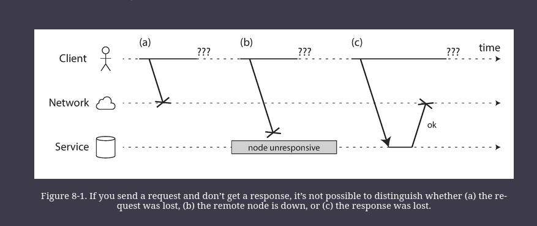
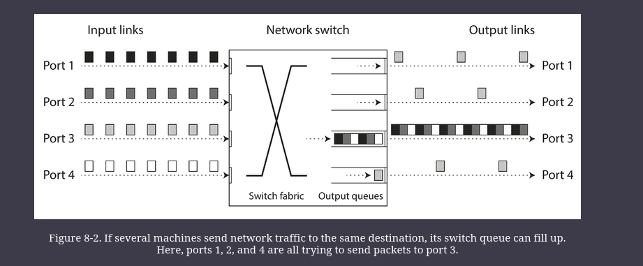

# Problems with Distributed Systems

When you are writing a program on a single computer, it normally behaves in a fairly predictable way: either it works or it doesn’t. It is _Deterministic_

When you are writing software that runs on several computers, connected by a network, the situation is fundamentally different. In distributed systems, we are no longer operating in an idealized system model—we have no choice but to confront the messy reality of the physical world.

In a distributed system, there may well be some parts of the system that are broken in some unpredictable way, even though other parts of the system are working fine. This is known as a _partial failure_. The difficulty is that partial failures are _nondeterministic_

If we want to make distributed systems work, we must accept the possibility of partial failure and build fault-tolerance mechanisms into the software. In other words, we need to build a reliable system from unreliable components.

# Unreliable Networks

The internet and most internal networks in datacenters (often Ethernet) are _asynchronous packet networks_. In this kind of network, one node can send a message (a packet) to another node, but the network gives no guarantees as to when it will arrive, or whether it will arrive at all.

The usual way of handling this issue is a _timeout_: after some time you give up waiting and assume that the response is not going to arrive. However, when a timeout occurs, you still don’t know whether the remote node got your request or not (and if the request is still queued somewhere, it may still be delivered to the recipient, even if the sender has given up on it).

## Network Faults in Practice

Even if network faults are rare in your environment, the fact that faults _can_ occur means that your software needs to be able to handle them. Whenever any communication happens over a network, it may fail—there is no way around it.

Handling network faults doesn’t necessarily mean _tolerating_ them: if your network is normally fairly reliable, a valid approach may be to simply show an error message to users while your network is experiencing problems. However, you do need to know how your software reacts to network problems and ensure that the system can recover from them.   It may make sense to deliberately trigger network problems and test the system’s response (this is the idea behind Chaos Monkey)

## Detecting Faults

Unfortunately, the uncertainty about the network makes it difficult to tell whether a node is working or not. In some specific circumstances you might get some feedback to explicitly tell you that something is not working:

- If we are able to reach the node, but no process is listening on the destination port, the OS will close or refuse TCP connection by sending `RST` or `FIN` packet in reply
- if the node process crashed but the OS is still running, a script can be used to notify other nodes about the crash
- can query mgmt interface of the n/w switches in a datcenter to detect link failures. Ruled out if we are connecting via the internet
- If the router detects that the IP address is unreachable, it may send bac ICMP Destination Unreachable packet.

We can add retries at the application level, wait for a timeout to elapse, and eventually declare a node dead if we don't hear back within the timeout

## Timeouts and Unbounded Delays

If a timeout is the only sure way of detecting a fault, then how long should the timeout be? There is unfortunately no simple answer.

A long timeout means a long wait until a node is declared dead (and during this time, users may have to wait or see error messages). A short timeout detects faults faster, but carries a higher risk of incorrectly declaring a node dead when in fact it has only suffered a temporary slowdown (e.g., due to a load spike on the node or the network).

Imagine a fictitious system with a network that guaranteed a maximum delay for packets—every packet is either delivered within some time _d_, or it is lost, but delivery never takes longer than _d_. Furthermore, assume that you can guarantee that a non-failed node always handles a request within some time _r_. In this case, you could guarantee that every successful request receives a response within time 2_d_ + _r_—and if you don’t receive a response within that time, you know that either the network or the remote node is not working. If this was true, 2_d_ + _r_ would be a reasonable timeout to use.

Unfortunately, most systems we work with have neither of those guarantees: asynchronous networks have _unbounded delays_ (that is, they try to deliver packets as quickly as possible, but there is no upper limit on the time it may take for a packet to arrive), and most server implementations cannot guarantee that they can handle requests within some maximum time

### Network congestion and queueing

Queuing can happen at the destination, but can also happen on the sender (called congestion avoidance or backpressure).

TCP considers a packet to be lost if it is not acknowledged within some timeout (which is calculated from observed round-trip times), and lost packets are automatically retransmitted.

All of these factors contribute to the variability of network delays.

## Synchronous Versus Asynchronous Networks

Variable delays in networks are not a law of nature, but simply the result of a cost/benefit trade-off, between _packet switching_ vs _circuit switching_ as seen in telephone lines.

A circuit is a fixed amount of reserved bandwidth which nobody else can use while the circuit is established, whereas the packets of a TCP connection opportunistically use whatever network bandwidth is available.

A network using circuits is called Synchronous
- in sync n/ws the max end-2-end latency of the n/w is fixed
- called _bounded delay_

Packet switching is optimized for _bursty traffic_.
    - that's why used by internet

A wire b/w telephone lines is divided in a static way
- e.g. if a wire can carry 10k simultaneous calls, and we are the only caller, our bandwidth is fixed and still the same
- Provides latency Guaranteesm but is costly

In contrast, the internet shares n/w bandwidth dynamically
- Senders push and jostle with each other to get their packets over the wire as quickly as possible, and the network switches decide which packet to send
- Provides better utilization, so it is cheaper, but then has variable delays

# Unreliable Clocks

Each machine on the network has its own clock, which is an actual hardware device: usually a quartz crystal oscillator. 

These devices are not perfectly accurate, so each machine has its own notion of time, which may be slightly faster or slower than on other machines. 

It is possible to synchronize clocks to some degree: the most commonly used mechanism is the Network Time Protocol (NTP), which allows the computer clock to be adjusted according to the time reported by a group of servers. 
- The servers in turn get their time from a more accurate time source, such as a GPS receiver.

## Monotonic vs Time-of-Day Clocks

Time-of-day: return the current date and time according to some calendar
- e.g. `clock_gettime(CLOCL_REALTIME)` on linux
- `System.currentTimeMillis()` in Java

Time-of-day clocks are usually synchronized with NTP, which means that a timestamp from one machine (ideally) means the same as a timestamp on another machine.

A monotonic clock is suitable for measuring a duration (time interval), such as a timeout or a service’s response time: `clock_gettime(CLOCK_MONOTONIC)` on Linux and `System.nanoTime()` in Java are monotonic clocks.

You can check the value of the monotonic clock at one point in time, do something, and then check the clock again at a later time. The difference between the two values tells you how much time elapsed between the two checks. 

In a distributed system, using a monotonic clock for measuring elapsed time (e.g., timeouts) is usually fine, because it doesn’t assume any synchronization between different nodes’ clocks and is not sensitive to slight inaccuracies of measurement.

