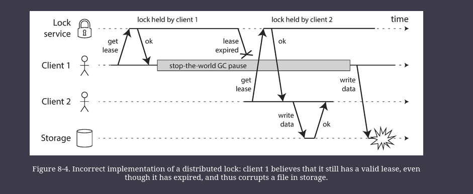
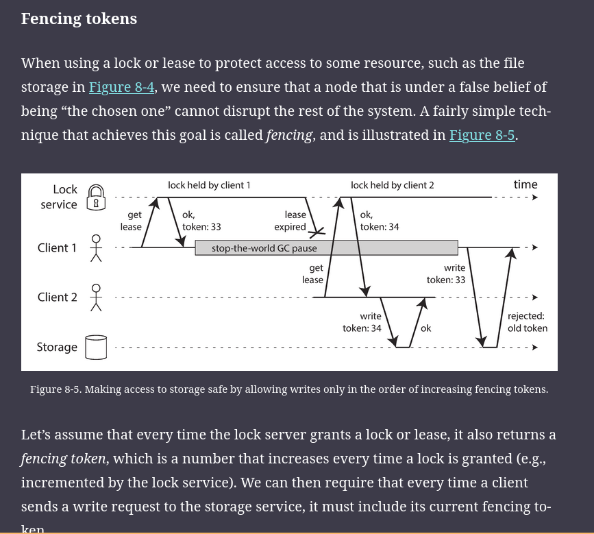

# Problems with Distributed Systems

When you are writing a program on a single computer, it normally behaves in a fairly predictable way: either it works or it doesn’t. It is _Deterministic_

When you are writing software that runs on several computers, connected by a network, the situation is fundamentally different. In distributed systems, we are no longer operating in an idealized system model—we have no choice but to confront the messy reality of the physical world.

In a distributed system, there may well be some parts of the system that are broken in some unpredictable way, even though other parts of the system are working fine. This is known as a _partial failure_. The difficulty is that partial failures are _nondeterministic_

If we want to make distributed systems work, we must accept the possibility of partial failure and build fault-tolerance mechanisms into the software. In other words, we need to build a reliable system from unreliable components.

# Unreliable Networks

The internet and most internal networks in datacenters (often Ethernet) are _asynchronous packet networks_. In this kind of network, one node can send a message (a packet) to another node, but the network gives no guarantees as to when it will arrive, or whether it will arrive at all.

The usual way of handling this issue is a _timeout_: after some time you give up waiting and assume that the response is not going to arrive. However, when a timeout occurs, you still don’t know whether the remote node got your request or not (and if the request is still queued somewhere, it may still be delivered to the recipient, even if the sender has given up on it).

## Network Faults in Practice

Even if network faults are rare in your environment, the fact that faults _can_ occur means that your software needs to be able to handle them. Whenever any communication happens over a network, it may fail—there is no way around it.

Handling network faults doesn’t necessarily mean _tolerating_ them: if your network is normally fairly reliable, a valid approach may be to simply show an error message to users while your network is experiencing problems. However, you do need to know how your software reacts to network problems and ensure that the system can recover from them.   It may make sense to deliberately trigger network problems and test the system’s response (this is the idea behind Chaos Monkey)

## Detecting Faults

Unfortunately, the uncertainty about the network makes it difficult to tell whether a node is working or not. In some specific circumstances you might get some feedback to explicitly tell you that something is not working:

- If we are able to reach the node, but no process is listening on the destination port, the OS will close or refuse TCP connection by sending `RST` or `FIN` packet in reply
- if the node process crashed but the OS is still running, a script can be used to notify other nodes about the crash
- can query mgmt interface of the n/w switches in a datcenter to detect link failures. Ruled out if we are connecting via the internet
- If the router detects that the IP address is unreachable, it may send bac ICMP Destination Unreachable packet.

We can add retries at the application level, wait for a timeout to elapse, and eventually declare a node dead if we don't hear back within the timeout

## Timeouts and Unbounded Delays

If a timeout is the only sure way of detecting a fault, then how long should the timeout be? There is unfortunately no simple answer.

A long timeout means a long wait until a node is declared dead (and during this time, users may have to wait or see error messages). A short timeout detects faults faster, but carries a higher risk of incorrectly declaring a node dead when in fact it has only suffered a temporary slowdown (e.g., due to a load spike on the node or the network).

Imagine a fictitious system with a network that guaranteed a maximum delay for packets—every packet is either delivered within some time _d_, or it is lost, but delivery never takes longer than _d_. Furthermore, assume that you can guarantee that a non-failed node always handles a request within some time _r_. In this case, you could guarantee that every successful request receives a response within time 2_d_ + _r_—and if you don’t receive a response within that time, you know that either the network or the remote node is not working. If this was true, 2_d_ + _r_ would be a reasonable timeout to use.

Unfortunately, most systems we work with have neither of those guarantees: asynchronous networks have _unbounded delays_ (that is, they try to deliver packets as quickly as possible, but there is no upper limit on the time it may take for a packet to arrive), and most server implementations cannot guarantee that they can handle requests within some maximum time

### Network congestion and queueing

Queuing can happen at the destination, but can also happen on the sender (called congestion avoidance or backpressure).

TCP considers a packet to be lost if it is not acknowledged within some timeout (which is calculated from observed round-trip times), and lost packets are automatically retransmitted.

All of these factors contribute to the variability of network delays.

## Synchronous Versus Asynchronous Networks

Variable delays in networks are not a law of nature, but simply the result of a cost/benefit trade-off, between _packet switching_ vs _circuit switching_ as seen in telephone lines.

A circuit is a fixed amount of reserved bandwidth which nobody else can use while the circuit is established, whereas the packets of a TCP connection opportunistically use whatever network bandwidth is available.

A network using circuits is called Synchronous
- in sync n/ws the max end-2-end latency of the n/w is fixed
- called _bounded delay_

Packet switching is optimized for _bursty traffic_.
    - that's why used by internet

A wire b/w telephone lines is divided in a static way
- e.g. if a wire can carry 10k simultaneous calls, and we are the only caller, our bandwidth is fixed and still the same
- Provides latency Guaranteesm but is costly

In contrast, the internet shares n/w bandwidth dynamically
- Senders push and jostle with each other to get their packets over the wire as quickly as possible, and the network switches decide which packet to send
- Provides better utilization, so it is cheaper, but then has variable delays

# Unreliable Clocks

Each machine on the network has its own clock, which is an actual hardware device: usually a quartz crystal oscillator. 

These devices are not perfectly accurate, so each machine has its own notion of time, which may be slightly faster or slower than on other machines. 

It is possible to synchronize clocks to some degree: the most commonly used mechanism is the Network Time Protocol (NTP), which allows the computer clock to be adjusted according to the time reported by a group of servers. 
- The servers in turn get their time from a more accurate time source, such as a GPS receiver.

## Monotonic vs Time-of-Day Clocks

Time-of-day: return the current date and time according to some calendar
- e.g. `clock_gettime(CLOCL_REALTIME)` on linux
- `System.currentTimeMillis()` in Java

Time-of-day clocks are usually synchronized with NTP, which means that a timestamp from one machine (ideally) means the same as a timestamp on another machine.

A monotonic clock is suitable for measuring a duration (time interval), such as a timeout or a service’s response time: `clock_gettime(CLOCK_MONOTONIC)` on Linux and `System.nanoTime()` in Java are monotonic clocks.

You can check the value of the monotonic clock at one point in time, do something, and then check the clock again at a later time. The difference between the two values tells you how much time elapsed between the two checks. 

In a distributed system, using a monotonic clock for measuring elapsed time (e.g., timeouts) is usually fine, because it doesn’t assume any synchronization between different nodes’ clocks and is not sensitive to slight inaccuracies of measurement.

## Clock Synchronization and Accuracy

Monotonic clocks don’t need synchronization, but time-of-day clocks need to be set according to an NTP server or other external time source in order to be useful. Unfortunately, our methods for getting a clock to tell the correct time aren’t nearly as reliable or accurate as you might hope—hardware clocks and NTP can be fickle beasts.

It is possible to achieve very good clock accuracy if you care about it sufficiently to invest significant resources. For example, the MiFID II draft European regulation for financial institutions requires all high-frequency trading funds to synchronize their clocks to within 100 microseconds of UTC, in order to help debug market anomalies such as “flash crashes” and to help detect market manipulation.

Such accuracy can be achieved using GPS receivers, the Precision Time Protocol (PTP) and careful deployment and monitoring. However, it requires significant effort and expertise, and there are plenty of ways clock synchronization can go wrong. If your NTP daemon is misconfigured, or a firewall is blocking NTP traffic, the clock error due to drift can quickly become large.

## Relying on Synchronized Clocks

The problem with clocks is that while they seem simple and easy to use, they have a surprising number of pitfalls: a day may not have exactly 86,400 seconds, time-of-day clocks may move backward in time, and the time on one node may be quite different from the time on another node.

Part of the problem is that incorrect clocks easily go unnoticed. If its quartz clock is defective or its NTP client is misconfigured, most things will seem to work fine, even though its clock gradually drifts further and further away from reality. If some piece of software is relying on an accurately synchronized clock, the result is more likely to be silent and subtle data loss than a dramatic crash.

Thus, if you use software that requires synchronized clocks, it is essential that you also carefully monitor the clock offsets between all the machines. Any node whose clock drifts too far from the others should be declared dead and removed from the cluster. Such monitoring ensures that you notice the broken clocks before they can cause too much damage.

---

## Quorums

A distributed system cannot exclusively rely on a single node, because a node may fail at any time, potentially leaving the system stuck and unable to recover. Instead, many distributed algorithms rely on a _quorum_, that is, voting among the nodes.

That includes decisions about declaring nodes dead. If a quorum of nodes declares another node dead, then it must be considered dead, even if that node still very much feels alive. The individual node must abide by the quorum decision and step down.

Most commonly, the quorum is an absolute majority of more than half the nodes (although other kinds of quorums are possible). A majority quorum allows the system to continue working if individual nodes have failed (with three nodes, one failure can be tolerated; with five nodes, two failures can be tolerated). However, it is still safe, because there can only be only one majority in the system—there cannot be two majorities with conflicting decisions at the same time.

### The leader and the lock

Frequently, a system requires there to be only one of some thing. For example:

* Only one node is allowed to be the leader for a database partition, to avoid split brain
    
* Only one transaction or client is allowed to hold the lock for a particular resource or object, to prevent concurrently writing to it and corrupting it.
    
* Only one user is allowed to register a particular username, because a username must uniquely identify a user.
    

Implementing this in a distributed system requires care: even if a node believes that it is “the chosen one” (the leader of the partition, the holder of the lock, the request handler of the user who successfully grabbed the username), that doesn’t necessarily mean a quorum of nodes agrees! A node may have formerly been the leader, but if the other nodes declared it dead in the meantime (e.g., due to a network interruption or GC pause), it may have been demoted and another leader may have already been elected.

If a node continues acting as the chosen one, even though the majority of nodes have declared it dead, it could cause problems in a system that is not carefully designed. Such a node could send messages to other nodes in its self-appointed capacity, and if other nodes believe it, the system as a whole may do something incorrect.

#### Byzantine Faults

Distributed systems problems become much harder if there is a risk that nodes may “lie” (send arbitrary faulty or corrupted responses)—for example, if a node may claim to have received a particular message when in fact it didn’t. Such behavior is known as a _Byzantine fault_, and the problem of reaching consensus in this untrusting environment is known as the _Byzantine Generals Problem_

A system is _Byzantine fault-tolerant_ if it continues to operate correctly even if some of the nodes are malfunctioning and not obeying the protocol, or if malicious attackers are interfering with the network. This concern is relevant in certain specific circumstances. For example:

* In aerospace environments, the data in a computer’s memory or CPU register could become corrupted by radiation, leading it to respond to other nodes in arbitrarily unpredictable ways. Since a system failure would be very expensive (e.g., an aircraft crashing and killing everyone on board, or a rocket colliding with the International Space Station), flight control systems must tolerate Byzantine faults

## System Model and Reality

Algorithms need to be written in a way that does not depend too heavily on the details of the hardware and software configuration on which they are run. This in turn requires that we somehow formalize the kinds of faults that we expect to happen in a system. We do this by defining a _system model_, which is an abstraction that describes what things an algorithm may assume.

With regard to timing assumptions, three system models are in common use:

##### Synchronous model

The synchronous model assumes bounded network delay, bounded process pauses, and bounded clock error. This does not imply exactly synchronized clocks or zero network delay; it just means you know that network delay, pauses, and clock drift will never exceed some fixed upper bound \[[88](https://learning.oreilly.com/library/view/designing-data-intensive-applications/9781491903063/ch08.html#Dwork1988dr_ch8)\]. The synchronous model is not a realistic model of most practical systems, because (as discussed in this chapter) unbounded delays and pauses do occur.

##### Partially synchronous model

Partial synchrony means that a system behaves like a synchronous system _most of the time_, but it sometimes exceeds the bounds for network delay, process pauses, and clock drift. This is a realistic model of many systems: most of the time, networks and processes are quite well behaved—otherwise we would never be able to get anything done—but we have to reckon with the fact that any timing assumptions may be shattered occasionally. When this happens, network delay, pauses, and clock error may become arbitrarily large.

##### Asynchronous model

In this model, an algorithm is not allowed to make any timing assumptions—in fact, it does not even have a clock (so it cannot use timeouts). Some algorithms can be designed for the asynchronous model, but it is very restrictive.

Moreover, besides timing issues, we have to consider node failures. The three most common system models for nodes are:

##### Crash-stop faults

In the crash-stop model, an algorithm may assume that a node can fail in only one way, namely by crashing. This means that the node may suddenly stop responding at any moment, and thereafter that node is gone forever—it never comes back.

##### Crash-recovery faults

We assume that nodes may crash at any moment, and perhaps start responding again after some unknown time. In the crash-recovery model, nodes are assumed to have stable storage (i.e., nonvolatile disk storage) that is preserved across crashes, while the in-memory state is assumed to be lost.

##### Byzantine (arbitrary) faults

Nodes may do absolutely anything, including trying to trick and deceive other nodes, as described in the last section.

For modeling real systems, the partially synchronous model with crash-recovery faults is generally the most useful model.