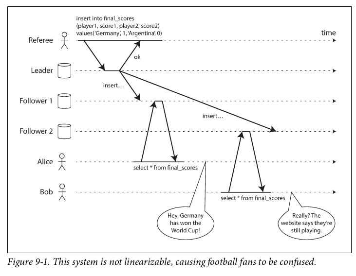
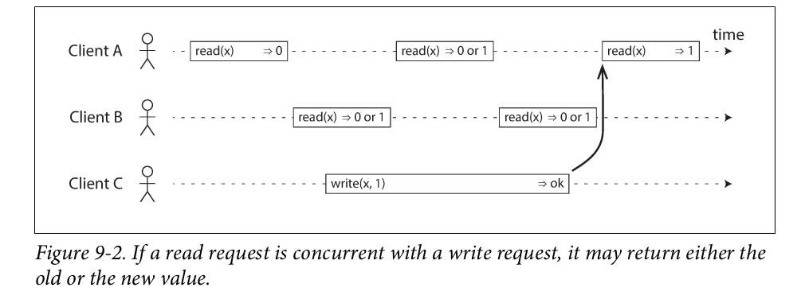
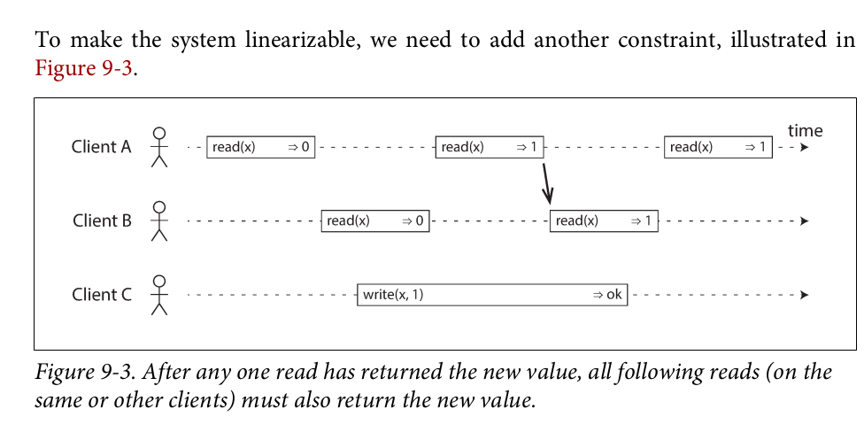
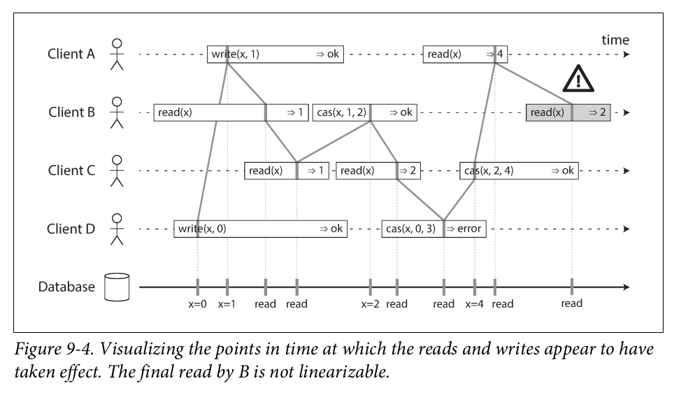
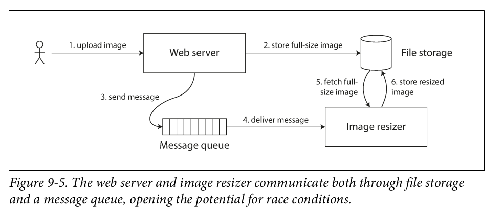
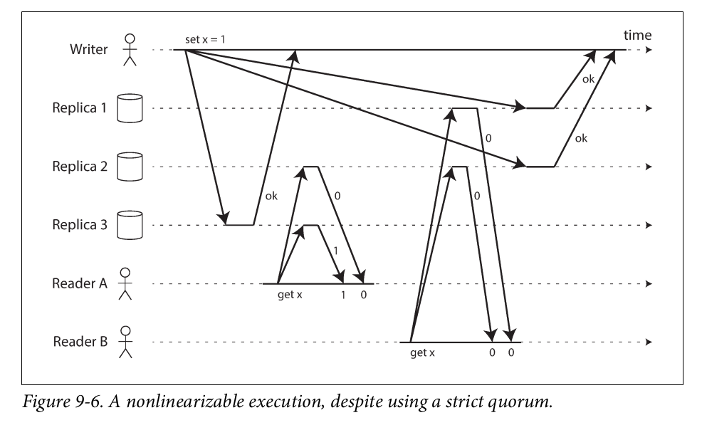
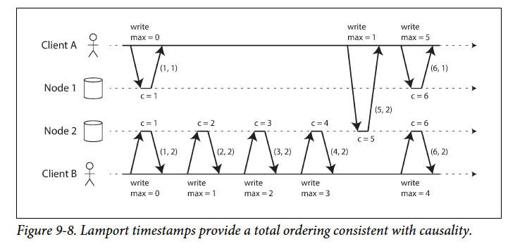

# Consistency & Consensus

In this chapter we examined the topics of consistency and consensus from several different angles.

## Consistency Gaurantees

Most replicated databases provide at least _eventual consistency_, which means that if you stop writing to the database and wait for some unspecified length of time, then eventually all read requests will return the same value.

However, this is a very weak guarantee—it doesn’t say anything about when the replicas will converge.

Eventual consistency is hard for application developers because it is so different from the behavior of variables in a normal single-threaded program.
- When working with a database that provides only weak guarantees, you need to be constantly aware of its limitations and not accidentally assume too much.
- Bugs are often subtle and hard to find by testing

In this chapter we will explore stronger consistency models that data systems may choose to provide. They don’t come for free: systems with stronger guarantees may have worse performance or be less fault-tolerant than systems with weaker guarantees.

## Linearizability

AKA
- atomic consistency
- strong consistency
- immediate consistency
- external consistency

The goal of linearizability is to make replicated data appear as though there were only a single copy, and to make all operations act on it atomically

In a linearizable system, as soon as one client successfully completes a write, all clients reading from the database must be able to see the value just written. 

Maintaining the illusion of a single copy of the data means guaranteeing that the value read is the most recent, up-to-date value, and doesn’t come from a stale cache or replica. 

In other words, linearizability is a _recency guarantee_. To clarify this idea, let’s look at an example of a system that is not linearizable.

If Alice and Bob had hit reload at the same time, it would have been less surprising if they had gotten two different query results, because they wouldn’t know at exactly what time their respective requests were processed by the server. 
- However, Bob knows that he hit the reload button (initiated his query) _after_ he heard Alice exclaim the final score, and therefore he expects his query result to be at least as recent as Alice’s. 
- The fact that his query returned a stale result is a violation of linearizability.

Lets look at another example to see what makes a system Linearizable:

Note:
- bar = request by a client
- start of bar = time when request was sent
- end of bar   = time when response was received
- A client does not know when the DB processed its read/write request
- `read(x) => v` = request to read value `x`, response by db = `v`
- `write(x,v) => r` = request to set the register `x` to value `v`, and the database returned `r` = `ok | error`
- initial value of `x` = 0

- First read by A completes before write begins, so return value 0
- last read by A begins after the write, so must return value 1 if the DB is linearizable
- Any reads that overlap in time with the write operation might return 0 or 1. These operations are _concurrent_
- The above scenario is not sufficient to describe linearizability (if reads that are concurrent with a write can return either the old or the new value, then readers could see a value flip back and forth between the old and the new value several times while a write is going on)

We can further refine this timing diagram to visualize each operation taking effect atomically at some point in time, in the diagram below:

The above diagram introduces another operation
- `cas(x, v_old, v_new) => r` = client requested atomic compare-and-set. If the current value == `v_old`, set it to `v_new` and return `ok`, else return `error`

Notes from diagram above:
- First client B sent a request to read x, then client D sent a request to set x to 0, and then client A sent a request to set x to 1. Nevertheless, the value returned to B’s read is 1 (the value written by A). This is okay: it means that the database first processed D’s write, then A’s write, and finally B’s read.
- Client B’s read returned 1 before client A received its response from the database, saying that the write of the value 1 was successful. This is also okay: it doesn’t mean the value was read before it was written, it just means the ok response from the database to client A was slightly delayed in the network.
- The final read by client B (in a shaded bar) is not linearizable. The operation is concurrent with C’s CAS write, which updates x from 2 to 4. In the absence of other requests, it would be okay for B’s read to return 2. However, client A has  already read the new value 4 before B’s read started, so B is not allowed to read an older value than A.

It is possible (though computationally expensive) to test whether a system’s
behavior is linearizable by recording the timings of all requests and responses, and checking whether they can be arranged into a valid sequential order.

### Linearizability vs Serializability

Both words seem to mean "something that can be arranged in a sequential order"

However:

Serializability 
- is an isolation property of _transactions_, where every transaction may read and write multiple objects (rows, documents, records)
- It guarantees that transactions behave the same as if they had executed in some serial order (each
transaction running to completion before the next transaction starts). 
- It is okay for that serial order to be different from the order in which transactions were actually run

Linearizability
- Linearizability is a recency guarantee on reads and writes of a register (an _individual object_).
- It doesn’t group operations together into transactions, so it does
not prevent problems such as write skew, unless you take additional measures such as materializing conflicts

A database may provide both serializability and linearizability, and this combination is known as _strict serializability_ or _strong one-copy serializability_

However, serializable snapshot isolation is not linearizable: 
- by design, it makes reads from a consistent snapshot, to avoid lock contention between readers and writers. 
- The whole point of a consistent snapshot is that it does not include writes that are more recent than the snapshot, and thus reads from the snapshot are not linearizable.

### Linearizability applications

1. Locking and leader election

One way of electing a leader, in a single leader replication system, is to use a lock: every node that starts up tries to acquire the lock, and the one that succeeds becomes the leader. 

No matter how this lock is implemented, it must be linearizable: all nodes
must agree which node owns the lock; otherwise it is useless.

2. Constraints and uniqueness gaurantees

If we want to enforce Uniqueness constraints in DBs as the data is written (such that if two people try to concurrently create a user or a file with the same name, one of them will be returned an error), we need linearizability.

Similar issues arise if you want to ensure that a bank account balance never goes negative, or that you don’t sell more items than you have in stock in the warehouse, or that two people don’t concurrently book the same seat on a flight or in a theater.

Other kind of constraints, such as foreign key or attribute constraints, can be impemented without requiring linearizability

3. Cross channel timing dependencies

In the example of Alice and Bob withh soccer score, the linearizability violation was only noticed because there was an additional communication channel in the system (Alice's and Bobs mobile phones)

Similar situations can arise in computer systems. For example, say you have a website where users can upload a photo, and a background process resizes the photos to lower resolution for faster download (thumbnails).

If the system is not linearizable, there is a risk of race condition, the msg Q might be faster than the internal replication, resulting in msg Q seeing old image, or no image at all.

This problem arises because there are two different communication channels
between the web server and the resizer: the file storage and the message queue.

### Implementing Linearizable Systems

1. Use a Single copy of the data
    - Linearizable (since single copy)
    - not tolerant to faults (all eggs in one basket)

2. Single-leader replication
    - Potentially Linearizable
        - In case when reads are made from the reader OR replication is synchronoush.
    - however, not every single leader DB is actually linearizable
        - either by design (uses snapshot isolation)
        - OR dure to concurrency bugs
 
3. Consensus Algos
    - Consensus algos (discussed later below) contain measures to prevent split brain and stale replicas
    - thus are linearizable

4. Multi-leader replication
    - Systems with multi-leader replication are generally not linearizable, because they concurrently process writes on multiple nodes and asynchronously replicate them to other nodes.

5. Leaderless replication
    - LWW is almost certainly non-linearizable
    - Even doing Quorum reads and writes (w + r > n) does not gaurantee linearizability (see diagram below)
    - Sloppy quorums are also non-linearizable

In the above diagram, the initial value of x is 0, and a writer client is updating x to 1 by sending the write to all three replicas (n = 3, w = 3). Concurrently, client A reads from a quorum of two nodes (r = 2) and sees the new value 1 on one of the nodes. Also concurrently with the write, client B reads from a different quorum of two nodes, and gets back the old value 0 from both.

The quorum condition is met (w + r > n), but this execution is nevertheless not linearizable: B’s request begins after A’s request completes, but B returns the old value while A returns the new value.

### Cost of Linearizability

There is a trade-off between Linearizability and Availability during a network fault. (When there is no n/w fault systems can be both Liearizable and Available):
- If your application requires linearizability, and some replicas are disconnected from the other replicas due to a network problem, then some replicas cannot process requests while they are disconnected: they must either wait until the network problem is fixed, or return an error (either way, they become unavailable).
- If your application does not require linearizability, then it can be written in a way that each replica can process requests independently, even if it is disconnected from other replicas (e.g., multi-leader). In this case, the application can remain available in the face of a network problem, but its behavior is not linearizable.

This tradeoff is knoow as **CAP Theorem**
- CAP is sometimes presented as Consistency, Availability, Partition tolerance: pick 2 out of 3. 
- Unfortunately, putting it this way is misleading because network partitions are a kind of fault, so they aren’t something about which you have a choice: they will happen whether you like it or not.
- At times when the network is working correctly, a system can provide both consistency (linearizability) and total availability. 
- When a network fault occurs, you have to choose between either linearizability or total availability. Thus, a better way of phrasing CAP would be either Consistent or Available when Partitioned [39]. A more reliable network needs to make this choice less often, but at some point the choice is inevitable.

The reason for dropping linearizability is performance, not fault tolerance, in varied systems like multi-leader DBs and even CPUs.

Can’t we maybe find a more efficient implementation of linearizable storage? It seems the answer is no: 
-  Attiya and Welch prove that if you want linearizability, the response time of read and write requests is at least proportional to the uncertainty of delays in the network. 
-  In a network with highly variable delays, like most computer networks (see “Timeouts and Unbounded Delays” on page 281), the response time of linearizable reads and writes is inevitably going to be high. 
-  A faster algorithm for linearizability does not exist, but weaker consistency models can be much faster, so this trade-off is important for latency-sensitive systems.

## Ordering Guarantees

There are deep connections bw ordering, linearizability and consensus.

Causality imposes an ordering on events: cause comes before effect; a msg is sent before that msg is received; the question comes b4 answer.

These chains of causally dependent operations define the causal order in the system—i.e., what happened before what.

Examples of causality/ordering is important:
- We say that there is a _causal dependency_ bw a question and answer: an answer MUST come after question
- In multi-leader replication, it is possible that some writes "overtake" others due to n/w delays. For a replica it looks like there was an update to a row that does no exist. Causality here means that a row must be created first before it can be updated.
- If we have two operations A and B, then there are 3 possibilies: A happened before B, B happened before A, or A & B are concurrent.
    - the _happened before_ relationship is another expression of causality
    - if A and B are concurrent, there's no causal link b/w them, i.e., we are sure that neither knew about the other
- Consistent, in the context of snapshot isolation for transactions, means that it is _consistent with causality_: if the snapshot contains an answer, it must also contain the question being answered.
- In the case of going off call example, the action of going off call is causally dependent on the observation of who is currently on call.
- In the football news example, the fact that Bob saw a stale score after Alice is a causality violation

#### Causal Order is not a Total Order

**Total Order**
Allows any 2 elements of a set to be compared
- set of Natural numbers if totally ordered

**Partial Order**
- not all elements can be compared and ordered
- e.g. set {a, b} cannot be compared with {b, c}, although it is less than {a, b, c}

Linearizability is a **total order** of operations
- Therefore, there are no concurrent operations in a linearizable system

Causality is a **partial order**

#### Linearizability is stronger than causal consistency

Linearizability implies causality: any system that is linearizable will preserve causality correctly
- The fact that linearizability ensures causality is what makes linearizable systems simple to understand and appealing
- However, making a system linearizable can harm its performance and availability, especially if the system has significant network delays (for example, if it’s geographically distributed). 
- For this reason, some distributed data systems have abandoned linearizability, which allows them to achieve better performance but can make them difficult to work with.

### Sequence Number Ordering

Although causality is an important theoretical concept, actually keeping track of all
causal dependencies can become impractical. In many applications, clients read lots
of data before writing something, and then it is not clear whether the write is causally
dependent on all or only some of those prior reads. Explicitly tracking all the data
that has been read would mean a large overhead.

However, there is a better way: we can use sequence numbers or timestamps to order
events. 
- A timestamp need not come from a time-of-day clock (or physical clock). 
- It can instead come from a logical clock, which is an algorithm to generate a sequence of numbers to identify operations, typically using counters that are incremented for every operation.

Such sequence numbers or timestamps are compact (only a few bytes in size), and they provide a total order: that is, every operation has a unique sequence number, and you can always compare two sequence numbers to determine which is greater (i.e., which operation happened later).

#### Some examples of Non-causal sequence number generators

1. Each node can generate its own independent set of sequence numbers. For example, if you have two nodes, one node can generate only odd numbers and the other only even numbers.
    - However, each node may process a different number of operations per second. Thus, if one node generates even numbers and the other generates odd numbers, the counter for even numbers may lag behind the counter for odd numbers, or vice versa. If you have an odd-numbered operation and an even-numbered operation, you cannot accurately tell which one causally happened first.
2. You can attach a timestamp from a time-of-day clock (physical clock) to each operation. Such timestamps are not sequential, but if they have sufficiently high resolution, they might be sufficient to totally order operations. This fact is used in the LWW conflict resolution method
    - However, timestamps from physical clocks are subject to clock skew, which can make them inconsistent with causality
3. You can preallocate blocks of sequence numbers. For example, node A might claim the block of sequence numbers from 1 to 1,000, and node B might claim the block from 1,001 to 2,000. Then each node can independently assign sequence numbers from its block, and allocate a new block when its supply of sequence numbers begins to run low.
    - In the case of the block allocator, one operation may be given a sequence number in the range from 1,001 to 2,000, and a causally later operation may be given a number in the range from 1 to 1,000. Here, again, the sequence number is inconsistent with causality.

### Lamport timestamps

Although the three sequence number generators just described are inconsistent with
causality, there is actually a simple method for generating sequence numbers that is
consistent with causality. It is called a Lamport timestamp.

A Lamport timestamp bears no relationship to a physical time-of-day clock, but it
provides **total ordering**: if you have two timestamps, the one with a greater counter
value is the greater timestamp; if the counter values are the same, the one with the
greater node ID is the greater timestamp.

In the above diagram, each node has a unique identifier, and each node keeps a counter of the number of operations it has processed. The Lamport timestamp is then simply a pair of (counter, node ID). Two nodes may sometimes have the same counter value, but by including the node ID in the timestamp, each timestamp is made unique.

The key idea about Lamport timestamps, which makes them consistent with causality, is the following: 
- every node and every client keeps track of the maximum counter value it has seen so far, and includes that maximum on every request. 
- When a node receives a request or response with a maximum counter value greater than its own counter value, it immediately increases its own counter to that maximum.
- Example: In the above diagram, client A receives a counter value of 5 from node 2, and then sends that maximum of 5 to node 1. At that time, node 1’s counter was only 1, but it was immediately moved forward to 5, so the next operation had an incremented counter value of 6.
- As long as the maximum counter value is carried along with every operation, this scheme ensures that the ordering from the Lamport timestamps is consistent with causality, because every causal dependency results in an increased timestamp.

vs Version Vectors:

version vectors can distinguish whether two operations are concurrent or whether one is causally dependent on the other, whereas Lamport timestamps always enforce a total ordering

From the total ordering of Lamport time‐stamps, you cannot tell whether two operations are concurrent or whether they are causally dependent. 

The advantage of Lamport timestamps over version vectors is that they are more compact.

Note: in order to implement something like a uniqueness constraint for usernames, it’s not sufficient to have a total ordering of operations— you also need to know when that order is finalized.
    - that is why Lamport timestamps are not suitable for this usecase
    - This idea of knowing when your total order is finalized is captured in the topic of total order broadcast.

### Total Order Broadcast aka Atomic Broadcast

In fault-tolerant distributed computing, an atomic broadcast or total order broadcast is **a broadcast where all correct processes in a system of multiple processes receive the same set of messages in the same order**; that is, the same sequence of messages.

Total order broadcast is usually described as a protocol for exchanging messages
between nodes. Informally, it requires that two safety properties always be satisfied:

1. Reliable delivery
No messages are lost: if a message is delivered to one node, it is delivered to all
nodes.

2. Totally ordered delivery
Messages are delivered to every node in the same order.

A correct algorithm for total order broadcast must ensure that the reliability and
ordering properties are always satisfied, even if a node or the network is faulty.

Of course, messages will not be delivered while the network is interrupted, but an algorithm can keep retrying so that the messages get through when the network is eventually repaired (and then they must still be delivered in the correct order).

Total order broadcast is exactly what you need for database replication: 
- if every message represents a write to the database, and every replica processes the same writes in the same order, then the replicas will remain consistent with each other (aside from any temporary replication lag). 
- This principle is known as **state machine replication**

An important aspect of total order broadcast is that the order is fixed at the time the
messages are delivered: a node is not allowed to retroactively insert a message into an
earlier position in the order if subsequent messages have already been delivered. 
- This fact makes total order broadcast stronger than timestamp ordering.                   
Another way of looking at total order broadcast is that it is a way of creating a log (as in a replication log, transaction log, or write-ahead log): delivering a message is like appending to the log. 
- Since all nodes must deliver the same messages in the same order, all nodes can read the log and see the same sequence of messages.                  