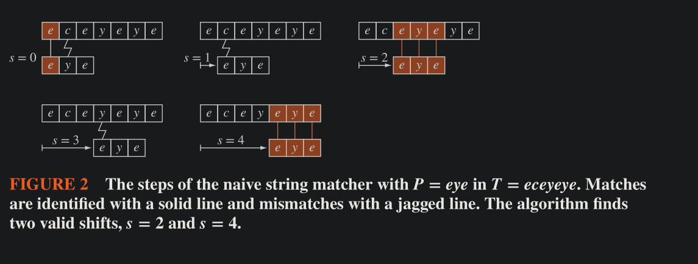

# Algorithms

An algorithm is a finite sequence of precise instructions for performing a computation or for solving a problem.

**Example**: Finding the maximum element in a finite sequence

#### Important points to remember on pseudo code below

1. a `for variable := i to k` loop runs from i to k, both inclusive, it stops when variable becomes > k. 
    - So for example, this loop will run at least once `for i := 0 to 0`, because i for the first iteration is not strictly greater than the final value of the loop. 
    - This loop will not run even once: `for i := 0 to -1`
2. All snippets below are pseudo-code but we use JS/python highlighting

```js
procedure max(a[1], a[2], ..., a[n]: integers)
max := a[1]
for i:= 2 to n 
    if max < a[i]
        then max := a[i]
return max  // max is the largest element
```

### Properties of Algorithms 

- **Input**: An algorithm as input values from a specified set
- **Output**: From each set of input values an algorithm produces output values from a specified set. The output values are the solution to the problem.
- **Definiteness**:  The steps of an algorithm must be defined precisely.
- **Correctness**. An algorithm should produce the correct output values for each set of input values.
- **Finiteness**: An algorithm should produce the desired output after a finite (but perhaps large) number of steps for any input in the set.
- **Effectiveness**. It must be possible to perform each step of an algorithm exactly and in a finite amount of time.
- **Generality**. The procedure should be applicable for all problems of the desired form, not just for a particular set of input values.

## Searching Algorithm

#### Linear / Sequential Search

```python
procedure linear_search(x: integer, a[1], a[2] ... a[n] : distinct integers)
i := 1 
while (i <= n and x != a[i])
    i := i + 1
if i <= n 
then location := i 
else location := 0
return location  # location is the index/subscript of the found item, else it is zero
```

#### Binary Search Algorithm 

```python
procedure binary_search (x : integer; a[1], a[2], ... , a[n] : increasing integers)
i := 1   # i is left endpoint of search interval 
j := n   # j is right endpoint of search interval 
while i < j 
    m := floor( (i + j) / 2)
    if x > a[m]
        then i := m + 1  # move the left index up
        else j := m      # move the right index down
if x = a[i]
then location := i
else location := 0
return location    # location is the subscript of the term a[i] equal to x, or 0 if not found
```

## Sorting Algorithms 

#### Bubble Sort 

The bubble sort needs $n - 1$ passes through a list of length $n$ . (We can use a boolean flag to keep track of when further iterations are not needed to stop early)

```js
function bubbleSort(a[1], a[2], ... a[n] : real numbers with n >= 2)
for i := 1 to (n - 1)
    for j := 1 to (n - 1)
        if a[j] > a [j + 1]
        then interchange(a[j], a[j + 1])

// { a[1], a[2], ... , a[n] } is now in increasing order
```

#### Insertion Sort 

```js
procedure insertion_sort (a[1], a[2], ..., a[n] : real numbers with n >= 2)
for j := 2 to n 
    i := 1   // for each j, start with the leftmost element in the list to see if a[j] fits anywhere
    while a[j] > a[i]
        // keep moving ahead from the left till we find an element a[j] < a[i], or we reach a[j] itself
        i := i + 1  
    // set m to be the a[j], the element which is out of order 
        // (it could also be in order if a[j] was equal to a[i] in the previous step)
    m := a[j]   
    // The next loop swaps each element with an element to its right
    // we are travalling from j towards left upto the place where we found the a[i] > a[j]
    for k := 0 to j - i - 1
        a[j - k] := a[j - k - 1]
    // place the out of order element a[j] to its proper place a[i]
    a[i] := m 

// { a[1] .... a[n] } is in increasing order now
```

The above insertion sort, to find the place of insertion, traverses the list from the beginning each time.

Another approach could be to traverse the list from `j-1` to 0 , when finding the insertion place for element @ `j`

The second approach is better when the elements in the list are almost sorted.

#### Selection Sort 

```js
procedure selection_sort(a[1], a[2], ... , a[n] : real numbers with n >= 2)
    for i := 1 to (n - 1)
        min := i
        for j := i + 1 to n
            if a[j] < a[min]
            then min := j
        // once we have the minimum, we need to swap it with the current element at i
        temp := a[i]
        a[i] = a[min]
        a[min] = a[i]
```

#### Binary Insertion Sort

Same as Insertion sort, except that it uses binary search to find the space for an out of order element to be inserted.

```js
procedure binary_insertion_sort(a[1], a[2], ... , a[n] : real numbers with n >= 2) 
    for j := 2 to n 
        // binary search for insertion location i
        left := 1
        right := j - 1
        while left < right 
            middle := floor( (left + right) / 2 )
            if a[j] > a[middle]
            then left := middle + 1
            else right := middle 
        if a[j] < a[left]
        then i := left 
        else i := left + 1
        // next steps is insert a[j] in location i by moving a[i] through a[j - 1] toward back of list (end)
        m := a[j]
        for k:+ 0 to (j - 1)
            a[j - k] = a[j - k - 1]
        a[i] := m
```


#### Naive String Matcher

- A brute force approach 
- The input to this algorithm is the pattern we wish to find within a string $P = p_1p_2...p_m$ consisting of $m$ characters
- the text/string in which we wish to find this pattern is denoted by $T = t_1t_2...t_n$ consiting of $n$ characters
- When the pattern $P$ begins at position $s+1$ in the text $T$, we say that $P$ occurs in $T$ with a **shift** of $s$
- To find all valid shifts, the naive string matcher algorithm runs thorugh all possible shifts $s$ from $s= 0$ to $s = n - m$ , checking whether $s$ is a valid shift.

```python
procedure string_match (n, m : positive integers where m <= n; P, T : characters of length m and n)
    for s := = to (n - m)
        j := 1
        while (j <= m and T[s + j] = P[j])
            j := j + 1
        if j > m 
        then print "s is a valid shift"
```
##### Visual Representation



## Optimization Problems and Greedy algorithms

The goal of optimization problems is to find a solution to the given problem that either **_minimizes_** or _**maximizes_** the value of some parameter.

Algorithms that make what seems to be the best choice at each step are called **_greedy algorithms**_


### Cashier's Algorithm

Consider the problem of making $n$ cents change with quaters (25 cents), dimes (10 cents), nickels (5 cents), pennies (1 cents)

We can devise a greedy algorithm for making change for $n$ cents by making a locally optimal choice at each step, i.e. at each step we choose the coin of the largest denomination possible to add to the pile of change without exceeding n cents.

```js
procedure change (c[1], c[2], ... , c[r] : values of denomination of coins where c[i] > c[i+1]; n : +ve int)
    for i := 1 to r 
        d[i] := 0  // d[i] counts the coins of denomination c[i] used
        while n >= c[i]
            d[i] := d[i] + 1  // add a coin of denomination c[i]
            n = n - c[i]

// { d[i] is the number of coins of denomination c[i] in the change for i = 1, 2, ... r }
```

###### Note 

In our problem stated earlier, we had $c_1 = 25, c_2 = 10, c_3 = 5, c_4 = 1$ , For this case the algorithm leads to an optimal solution.

But note that if we had only $c_1=25, c_2 = 10, c_3 = 1$ (No nickels of 5 cents), the cashier's algorithm ___would not produce optimum solution always___
    - for example, for 30 cents, it would suggest 6 coints (1 $c_1$ and 5 $c_3$), whereas the optimum solution is $3 \times c_2$ of 10 cents each.

#### Lemma 1

if $n$ is a positive integer, then $n$ cents in change using _quaters, dimes, nickels and pennies_ using the fewest coins possible has at most 2x dimes, at most 1 nickel and at most four pennies, and cannot have two dimes and a nickel (2x10 + 5). The amount of change in dimes, nickels and pennies cannot exceed 24 cents (because 75 is always covered by 3 quarters, and 25 is covered by one quarter)

**Proof** (by contradiction)

- If we had 3x dimes (30 cents), we could replace them with 1 quarter and a nickel (25 + 5)
- if we had two nickels (10 cents), we could replace them with a dime (1 x 10 cents)
- if we had five pennies (5 x 1 cents), we could replace them with a nickel (1 x 5 cents)
- if we had two dimes and a nickel (2 x 10 + 5), we could replace them with 1 quarter (1 x 25 cents)
- Because we can have at most 2 dimes, 1 nickel and four pennies, but we cannot have 2 dimes and a nickel, the most money we could have (excluding quarters) is 24 cents (2 x dimes and four pennies  (24 cents) > 1 dime, 1 nickel, four pennies (19 cents) )

#### Theorem

The Cashier's Algorithm (CA) always makes changes using the fewest coins possible when change is made from quarters, dimes, nickels and pennies

**Proof** (by contradiction)

- suppose that there is a +ve integer $n$, for which it is possible to use fewer coins than $CA$ (lets call the alternate $CA'$ )
- let $q'$ be the number of quarters used by $CA'$ 
- $q' ≤ q$ , because $CA$ uses the most quarters possible (by its definition)
- However $q'$ cannot be less than $q$, because, if it were, the remaining 25 cents would be needed to be made up from dimes, nickels and pennies, but this is impossible by **Lemma 1**
- thus $q' = q$ 
- since $q' = q$, the value of dimes, nickels and pennies in $CA$ and $CA'$ must be the same, and these coins are worth no more than 24 cents (Lemma 1)
- number of dimes in $CA'$ , $d'$ must be equal to $d$ in $CA$ because the greedy algorithm uses the most dimes possible (by its definition), and by Lemma 1, when change is made using the fewest coins possible, at most 1 nickel and 4 pennies are used.
- Hence $d' = d$ is the optimal way to select dimes.
- In a similar way, we can show that $n' = n$ and $p' = p$ for CA' and CA.

### Scheduling Tasks 

Devise a greedy algorithm to schedule as many talks as possible, under the assumption that 
    - once a talk starts, it continues to the end
    - no two talks can occur in parallel
    - a talk can begin at the same time as soon as another one ends

Let for talk j = $t_j$ with start Time $s_t$ and end time $e_j$ 

Three Greedy algorithms possible 
1. Choose that starts the earliest
    - Counter example 
        - t1 : 08 AM - 12 PM
        - t2 : 09 AM - 10 AM
        - t3 : 11 AM - 12 PM 
        - earliest time chooses t1, when optimal is t2 and t3
2. Choose the shortest 
    - Counter example 
        - t1 = 8 AM - 915 AM 
        - t2 = 9AM - 10AM 
        - t3 = 945 AM - 11 AM
        - shortest time selects t2 only, but optimal is t1 and t2
3. Select at each step the talk with earliest ending time
    This is the optimal way.
    
##### Variation

- Devise a greedy algorithm that determines the fewest lecture halls needed to accomodate $n$ talks given the starting and ending time for each talk.

- Solution: 
    - Order the lectures by the start times, earliest to latest
    - For each lecture hall number 1 .. n, place the lecture in the lecture hall with the smallest numbered room available when that lecture starts.
    - In short, first come first served (kind of)

    
### The Halting Problem 

The Halting problems asks whethere a procedure exists that takes a program and its inputs, and determines whether the program will evantually stop when run with this input.

Alan Turing showed that no such procedure exists

**Proof** by contradiction

- Suppose there is a solution to halting problem, a precedure called $H(P, I)$ 
- $H(P, I)$ generates a string "halt" as output if $H$ determines that $P$ stops when given $I$ as input.
- otherwise, $H(P, I)$ generates the string "loops forever"
- Since a program is a sequence of strings, a program can itself be used as data/input. Therefore, a program can be thought of as input to another program, or even itself.
- Thus we can do $H(P,P)$ and $H$ should be able to determine if $P$ halts given $P$ as input.
- let $K(P$) be a procedure which makes use of output of $H(P,P)$ 
    - if output of $H(P,P)$ is "loops forever", then $K(P)$ halts
    - if output of $H(P,P)$ is "halt", then $K(P)$ loops forever
    - i.e. $K(P)$ does the opposite of what the output of $H(P,P)$ specifies
- Now suppose we do $K(K)$
    - If output of $H(K,K)$ is "loops forever", then $K(K)$ halts (by its definition)
        - if $K(K)$ halts, the output of $H(K,K)$ should have been "halts" (by its definition), therefore, a contradiction
    - If output of $H(K,K)$ is "halts", then $K(K$) loops forever (by its definition)
        - if $K(K)$ loops forever, then output of $H(K, K)$ should have been "loops forever" (by its definition), thus, a contradiction.
- Thus, $H$ cannot always give the correct answer. 
- Hence, no procedure exists which gives an answer to Halting problem.   

### Stable Marriage Problem

Given $n$ men and $n$ women, where each person has ranked all members of the opposite sex in order of preference, marry the men and women together such that there are no two people of opposite sex who would both rather have each other than their current partners. 

When there are no such pairs of people, the set of marriages is deemed **stable**.

Suppose we have the following scenario: 
    m1 -> [ w3, w1, w2 ]  ,  w1 -> [ m1, m2, m³ ]
    m² -> [ w1, w2, w3 ]   ,  w2 -> [ m², m1, m³ ]
    m³ -> [ w3, w2, w1 ]   ,  w3 -> [ m³, m2, m1 ]
    
Then, of the Six possible combinations of 3 men and 3 women, only two are stable
    - { m1w1, m2w2, m3w3 } = Stable
    - { m1w2, m2w1, m3w3 } = Unstable (because m1 prefers w1 to w2 and w1 prefers m1 to m2)
    - { m1w1, m2w3, m3w2 } = Unstable 
    - { m1w3, m2w2, m3w1 } = Unstable 
    - { m1w2, m2w3, m3w1 } = Unstable 
    - { m1w3, m2w1, m3w2 } = Stable


#### Deferred Acceptance algorithm (Gale-Shapley algorithm)

In this algorithm, members of one gender are the ___suitors___ and members of the other gender the ___suitees___. 

The algorithm uses a sequence of rounds; in each round every suitor whose proposal was rejected in the previous round proposes to his or her highest ranking suitee who has not already rejected a proposal from this suitor. 

A suitee rejects all proposals except that from the suitor that this suitee ranks highest among all the suitors who have proposed to this suitee in this round or previous rounds. 

The proposal of this highest ranking suitor remains pending and is rejected in a later round if a more appealing suitor proposes in that round.

The series of rounds ends when every suitor has exactly one pending proposal. 

All pending proposals are then accepted

```js
pricedure gale_shapley(M1, M2, ... , Mn; W1, W2, ... , Wn : preference lists)
    // Initialization phase

    // intialize with every man marked as rejected
    for i := 1 to n 
        mark M[i] as rejected
    // every man's rejection list as empty
    for i := 1 to n 
        set M[i] rejection list to be empty
    // every woman's proposal list as empty
    for j := 1 to n 
        set W[j] proposal list to be empty
        
    // while there is a rejected man in the list of men
    while rejected men remain 
        for i := 1 to n
        // each man proposes to his highest suitee he has't proposed to yet, or hasn't been rejected by yet
            if M[i] is marked as rejected
                then 
                    add M[i] to the proposal list of W[j] who ranks highest on his preference list
                    and mark M[i] as not rejected
        for j := 1 to n 
        // women reject all proposals from lower preference men
            if W[j] proposal list is non-empty
                then 
                    remove from W[j] proposal list all M[i] except the highest preferred one
                    mark all the removed men as rejected
    for j := 1 to n 
        match W[j] with one man on W[j] proposal list
```

The algorithm
    - always terminates 
        - if it does not terminate, then at the end there must be a man who is rejected, and a woman whose list is empty. But in the last round this man must have proposed to that woman, and that woman must have accepted his proposal because he was the only suitor.
    - and always results in a matching that is stable
        - If the assigment is not stable, then there is a man $m$ and a woman $w$ such that $m$ prefers $w$ to the woman he is currenly with ($w'$) and $w$ prefers $m$ to the man she is currently with ($m'$)
        - But, $m$ must have proposed to $w$ before he proposed to $w'$, coz he prefers the former
        - Coz he is not with her, $w$ must have rejected him.
        - women reject a suitor only when they get a better proposal, and they eventually get matched with a pending suitor
            - so for $w$, she must have preferred $m'$ to $m$ , a contradiction.
        - Therefore, the result is stable. 

#### Boyer-Moore Majority Vote Algorithm

An element of a sequence is called a **majority element** if it occurs repeatedly for more than half the terms of the sequence.

A sequence can only have at most one majority element.

The Boyer-Moore algorithm finds the majority element of a sequence.

- Maintain a counter initially set to 0
- and a temporary candidate for majority element with no assigned value 
- process the element in order 
- for the first element, make it majority element and set counter to 1
- then for the remaining elements
    - if the counter is 0, the current element becomes the majority candidate and the counter is set to 1
    - if the counter is > 0
            - increment if current element = current majority
            - decrement if current element ≠ current majority
- at the end of the list, the majority candidate is the majority element, if it exists

```js
procedure boyer_moore(a[1], a[2], ... , a[n] : list of comparable items)
    counter := 1
    current_maj := a[1]
    for i := 2 to n 
        if counter == 0 
        then 
            current_maj := a[i]
            counter := 1
        else 
            if a[i] == current_maj
            then counter := counter + 1
            else counter := counter - 1
    return current_maj
```

Even when the input sequence has no majority, the algorithm will report one of the sequence elements as its result. However, it is possible to perform a second pass over the same input sequence in order to count the number of times the reported element occurs and determine whether it is actually a majority.

A version of the algorithm that makes a second pass through the data can be used to verify that the element found in the first pass really is a majority.

This second pass is needed, as it is not possible for a sublinear-space algorithm to determine whether there exists a majority element in a single pass through the input.

If a second pass is not performed and there is no majority, the algorithm will not detect that no majority exists. 

In the case that no strict majority exists, the returned element can be arbitrary; it is **NOT** guaranteed to be the element that occurs most often (the _mode_ of the sequence).

Boyer-Moore always outputs the majority element, if it exists: 
       Proof
           -  Let $m$ be the majority element. 
           -  Let $n$ be a number defined at any step of the algorithm to be either the counter, if the majority candidate is $m$, or the negative of the counter otherwise. 
           -  Then at each step in which the algorithm encounters a value equal to $m$, the value of $n$ will increase by 1, 
           -  and at each step at which it encounters a different value, the value of $n$ may either increase or decrease by one. 
           -  If $m$ truly is the majority element, there will be more increases than decreases, and $n$ will be positive at the end of the algorithm. 
           -  But this can be true only when the final stored element is $m$ , the majority element.