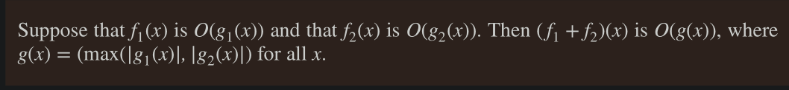

# Growth of Functions 

## Big O Notation

- let $f$ and $g$ be functions from $\Z$ or $\reals$ to $\reals$ , we say that $f(x)$ is $O(g(x))$ if $\exist C$ and $\exist k$ such that: 
    
        $|f(x)| ≤ C|g(x)|$

    whenever x > k. 

- Another way of stating the above: 

    **Upper bound** $f(n) = O(g(n))$ means $c . g(n)$ is an upper bound on $f(n)$
        - In words, there exists some constant $c$ such that $f(n)$ is always $<=c.g(n)$, for large enough $n$ > $n_0$, so once $n$ crosses $n_0$, the upper bound function always remains above $f(n)$.

- The constants $C$ and $k$ are called ___Witnesses___

- if $f(x) = O(g(x))$ and $g(x) = O(f(x))$ , we say that the functions $f$ and $g$ are of the **same order**

Examples

- show that $7x^2$ is $O(x^3)$ 
    - note that when $x > 7$ (means $k = 7$) 
        - multiply both sides by $x^2$
        - we get $x^3 > 7x^2$ 
        - Hence $k = 7$ and $C = 1$ are witnesses
    - also note when $x > 1$ 
        - multiple both side by $7x^2$ 
        - we get $7x^3 > 7x^2$ 
        - thus, $k = 1$ and $C = 7$ are also witnesses
    
- show that $x^3$ is not $O(7x^2)$
    - Using proof by contradiction
        - assume $C$ and $k$ are witnesses 
        - then $x^3 < C.7x^2$ for all $x > k$ 
        - simplifying, we get $x < 7C$ 
        - However, no matter what $C$ is, we can always make $x$ greater than $7C$ (because any arbitrarily large values of $x$ can be chosen, as long as it is > k)
        - It follows that no such witnesses can exist.

### Big-O for Polynomials 

### Other functions 

- Each function in the list below is smaller than the succeeding function

$1$ , $log n$ , $\sqrt{n}$ , $n$ , $n log n$ , $n^{3/2}$ , $n^2$ , $2^n$ , $n!$  

- $x!$ is $O(x^x)$ 
- $log (x!)$ is $O(n log n)$ 

- $x^c$ is $O(x^d)$ (if $d > c > 1$ ) , but $x^d$ is not $O(n^c)$. 
- $(log_b x)^c$ is $O(x^d)$ , but $x^d$ is not $O((log_b x )^c)$ 
- $x^d$ is $O(b^n)$ , but $b^n$ is not $O(x^d)$ 
- $b^x$ is $O(c^x)$ (when $c > b > 1$), but , $c^x$ is not $O(b^x)$ 
- $c^x$ is $O(n!)$ , but $n!$ is not $O(c^x)$  

### Big-O for addition of two functions 

from the above, this corollary follow: 

Example: 

### Big-O for multiplication of two functions 

 
 Example
 
 

## Big-Omega Notation

Big-Omega describes the lower bound of functions, thus below, $g$ is lower bound of $f$ 

Another way of saying it

- **Lower bound** $f(n) = \Omega (g(n))$ means $c.g(n)$ is a lower bound on $f(n)$
    - Thus, there exists some constant $c$ such that $f(n)$ is always >= $c.g(n)$ for all $n > n_0$

There is a strong connection between big-O and big-Omega notation. In particular, f(x) is Ω(g(x)) if and only if g(x) is O(f(x)). 

## Big-Theta Notation 

