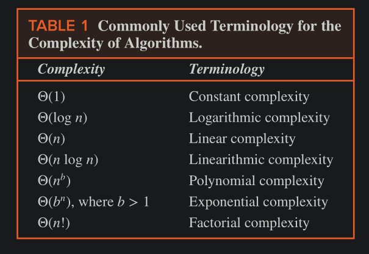

## Tractability

A problem that is solvable using an algorithm with polynomial (or better) worst-case complexity is called _**tractable**_. 
    - Because the expectation is that the algorithm will produce the solution to the problem for reasonably sized input in a relatively short time.

However, if the polynomial in the big-Θ estimate has high degree (such as degree 100) or if the coefficients are extremely large, the algorithm may take an extremely long time to solve the problem.

Consequently, that a problem can be solved using an algorithm with polynomial worst-case time complexity is no guarantee that the problem can be solved in a reasonable amount of time for even relatively small input values. 

Fortunately, in practice, the degree and coefficients of polynomials in such estimates are often small.

The problems not tractable are called **_intractable**.

Some problems even exist for which it can be shown that no algorithm exists for solving them. Such problems are called _**unsolvable**_ (as opposed to _**solvable**_ problems that can be solved using an algorithm). Halting Problem is one such problem.

### P Versus NP

Many solvable problems are believed to have the property that no algorithm with polynomial worst-case time complexity solves them, but that a solution, if known, can be checked in polynomial time.

Problems for which a solution can be checked in polynomial time are said to belong to the class **NP** (tractable problems are said to belong to
class **P**).

The abbreviation **NP** stands for nondeterministic polynomial time. 

The Satisfiability problem, is an example of an NP problem.
    - we can quickly verify that an assignment of truth values to the variables of a compound proposition makes it true. 
    - But no polynomial time algorithm has been discovered for finding such an assignment of truth values.

There is also an important class of problems, called **NP-complete** problems, with the property that if any of these problems can be solved by a polynomial worst-case time algorithm, then all problems in the class NP can be solved by polynomial worst-case time algorithms.

The satisfiability problem is also an example of an NP-complete problem. 
    - It is an NP problem and if a polynomial time algorithm for solving it were known, there would be polynomial time algorithms for all problems known to be in this class of problems (and there are many important problems in this class).
    - This last statement follows from the fact that every problem in NP can be reduced in polynomial time to the satisfiability problem. 
    - Although more than 3000 NP-complete problems are now known, the satisfiability problem was the first problem shown to be NP-complete (known as Cook-Levin Theorem)

The P versus NP problem asks whether NP, the class of problems for which it is possible to check solutions in polynomial time, equals P, the class of tractable problems.

If P ≠ NP, there would be some problems that cannot be solved in polynomial time, but whose solutions could be verified in polynomial time.

The concept of NP-completeness is helpful in research aimed at solving the P versus NP problem, because NP-complete problems are the problems in NP considered most likely not to be in P, as every problem in NP can be reduced to an NP-complete problem in polynomial time.

A large majority of theoretical computer scientists believe that P ≠ NP, which would mean that no NP-complete problem can be solved in polynomial time.