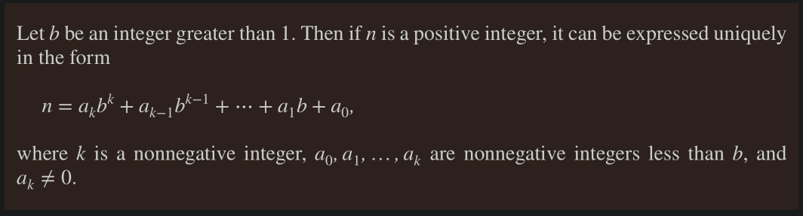
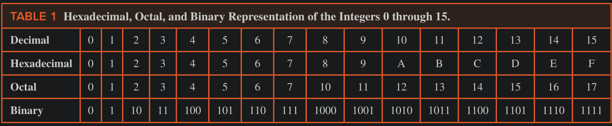
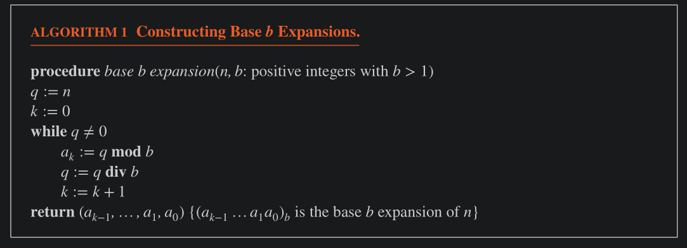
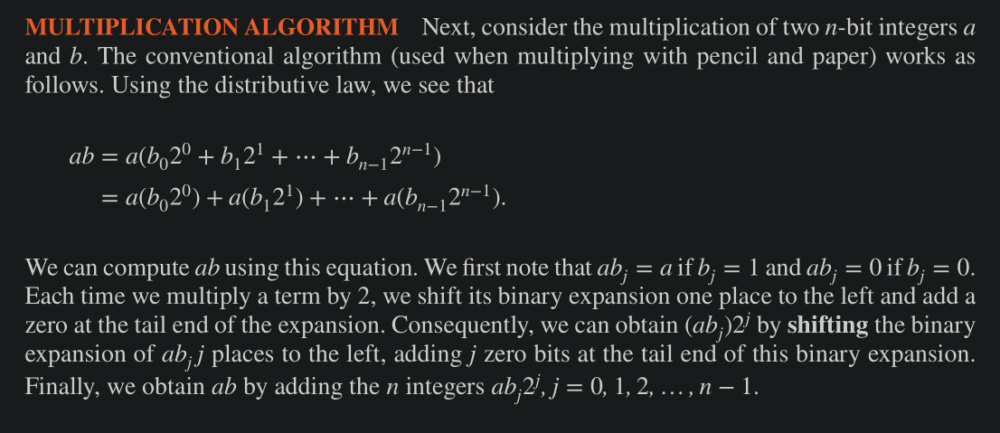
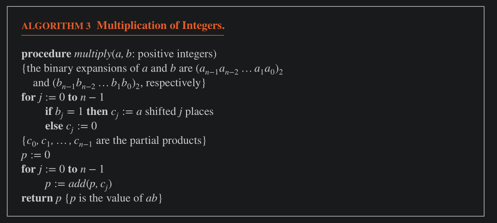
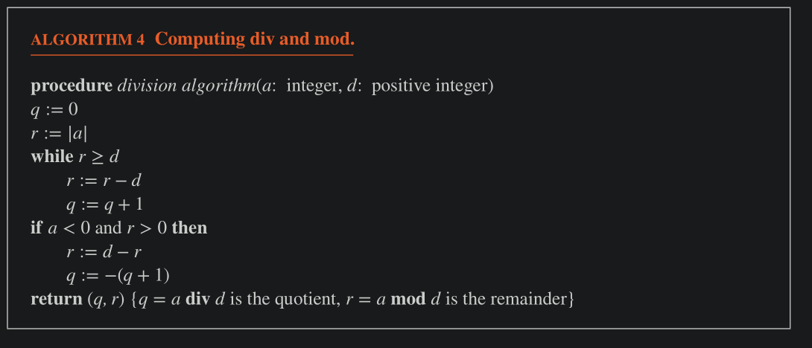
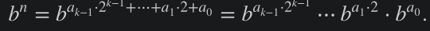
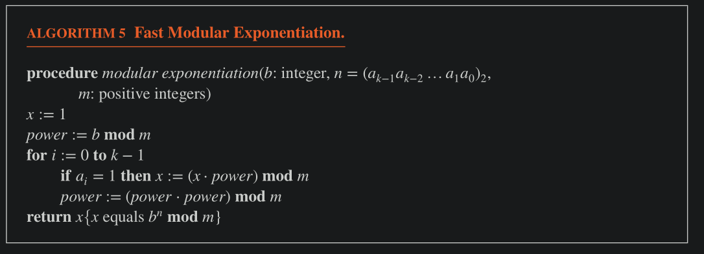
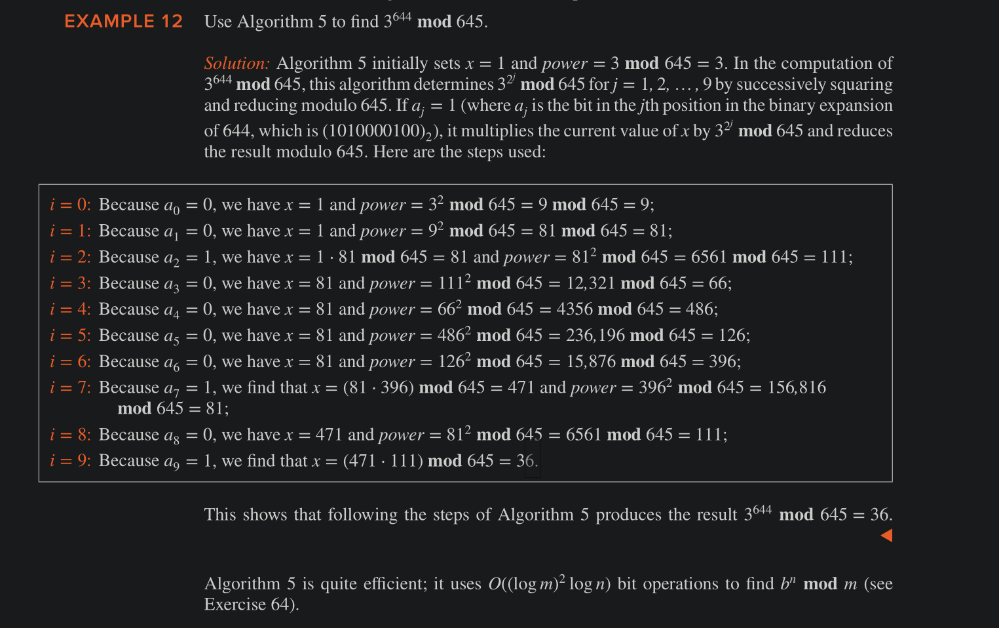

# Integer Representations

- In decimal notation, an integer $n$ is written as a sum of the form $a_k 10^k + a_{k−1} 10^{k−1} + ⋯+ a_1 10 + a_0$ , where $a_j$ is an integer with
$0 ≤ a_j ≤ 9$ for j = 0,1,…,k. For example, 965 is used to denote $9 ⋅ 10^2 + 6 ⋅ 10 + 5$. 

- We can also use base 2, base 8 and base 16

- Each hexadecimal digit can be represented using four bits. 
    - For instance, we see that $(1110 0101)_2$  = $(E5)_{16}$  because $1110_2 = (E)_{16}$  and $(0101)_2 = (5)_{16}$ . 
    - Bytes, which are bit strings of length 8, can be represented by two hexadecimal digits.

### Theorem

- The above is called **base b expansion of x**
- If base is 10, it is called decimal expansion
- if base is 2, it is called binary expansion

In Hexadecimal
    - A = 10
    - B = 11
    - C = 12 
    - D = 13 
    - E = 14
    - F = 15

Example: $(2AE0B)_{16} = 2 . 16^4 + 10 . 16^3 + 14 . 16^2 + 0 . 16 + 11 = 175627_{10}$ 

#### Base Conversion algorithm

For constructing base $b$ expansion of integer $n$ 
- Divide $n$ by $b$ to obtain a quotient and a remainder
    - $n = bq_0 + a_0$   ($0 ≤ a_0 < b$)
- The remainder $a_0$ is the _rightmost_ digit of the answer
- Next, divide $q_0$ by $b$ 
    - $q_0= bq_{-1} + a_1$   ($0 ≤ a_1 < b$) 
- $a_1$ is the second digit from right of the answer
- Continue this process, will we obtain a quotient = 0

Example: Octal Expansion of $(12345)_{10}$ 
    - 12345 = 8 x 1543 + 1
    - 1543 = 8 x 192 + 7
    - 192 = 8 x 24 + 0 
    - 24 = 8 x 3 + 0
    - 3 = 8 x 0 + 3
    - Answer: $30071_8$ 

#### Pseudo code 

#### Conversion between Binary, Octal and Hexadecimal

Conversion between binary and octal and between binary and hexadecimal expansions is extremely easy because each octal digit corresponds to a block of three binary digits and each hexadecimal digit corresponds to a block of four binary digits.

#### Binary Multiplication algorithm

###### Note: 
Each time we multiple a binary number with 2 (10), we shift the bits to the left and add a zero to the right, e.g. $(1010)_2 \times 10_2 = 10100_2$ , so if we multiple with $2^k$, shift bits to the left $k$ spaces and add $k$ zeroes to the right.

pseudocode: 

###### Time Complexity of Multiplication

$O(n^2)$ 

#### Algorithm for `div` and `mod`

Two points to note 
- In the above brute-force algo, when a is +ve, we subtract d from a as many times as necessary until the remainder is less than d (the divisor).
    - the number of times we perform this operation is q, and the remainder is r.
- the `if` condition handles the case when a is negative.
    - the algo finds q and r when $|a|$ is divided by d 
    - but then, to satisfy $a = d(q) + r$ (when a is negative, q is one more than what it is when a is positive, see example below).
    - it adds 1 to q and negates it, and then adjusts r
    - Example1: `-9 divmod 2` =
        - `9 divmod 2` = (4, 2)
        - since a < 0
            - r = d - r = 2 - 1 = 1
            - q = -(4 + 1) = -5 (because $-9 = 2 (-5) + 1)$ ) 
    - Example 2: `-17 divmod 3`
        - `17 div 3` = (5, 2)
        - r = d - r = 3 - 2 = 1 
        - q = - (5 + 1) = -6
        - hence $-17 = 3(-6) + 1$ 

#### Modular Exponentiation 

we want to find: $b^n \bmod m$ 
    - we can't compute $b^n$ directly as it may be a huge number
    - we can use the fact $b^{k + 1} \bmod m = b (b^k \bmod m)$ , but then it will require $n$ multiplcations which may be huge.

Algorithm: 
- first get the binary expansion of $n = a_{k-1}, a_{k-2} … a_2, a_1, a_0$
- using this expansion, we represent $b$ as 

- the above shows that we compute $b^2$ then $(b^2)^2 = b^4$ then $(b^4)^2 = b^8$ all the way to $b^{2^k}$ 
- once we have these terms, we only choose those terms where $a_j = 1$, i.e., ignore all the places where there is $0$ in n's binary repre because b raised to 0 is 1.
- Finally, add all the terms
- To speed up, after each squaring, we take $\pmod m$ for each term

Another Example: 

Calculate $5^{117} \bmod 19$ 
    - Binary Rep of 117 = 1110101
    - wherever the digit is 1, take that position and raise 5 to that power
    - $117 = 2^6 + 2^5 + 2^4 + 2^2 + 2^0$ 
    - $5^{117} \bmod 19 = 5^{1 + 4 + 16 + 32 + 64} \bmod 19 = (5^1 * 5^4 * 5^{16} * 5^{32} * 5^{64}) \bmod 19$
    - Calculate these powers of 5 by squaring 5^1 then 5^2 and so on, e.g. $5^8 \bmod 19 = 5^4 * 5^4 \bmod 19$
    - add the relevant powers
    
### One's Complement and signed binary representation

1's complement is used to represent +ve and -ve integers

In n bits, the leftmost bit is used for signs, (hence a signed binary number can represent $2^{n-1}$ numbers)

If leftmost bit is 0, then remaining number is +ve…

If leftmost bit is 1, the rest of the digits complemented (1 to 0 and 0 to 1) and that's how negative numbers are represented.

### 2's complement and signed binary representation

To represent an integer x with signed n bits, x within the range of $-2^{n-1}≤ x ≤ 2^{n-1} -1$ .

The representation for +ve numbers is the same as 1's complement

For negative numbers, the first bit is 1, and the remaining bits are the binary expansion of $2^{n-1} - |x|$ 

2's complement representation of integers is often used by computers because addition and subtraction is easier. (that is, write the normal binary representation of n-1 bits and add 1)

Example:
    - 11001 = -7
    - 01101 = 13
    - 10001 = -15
    - 11111 = -1