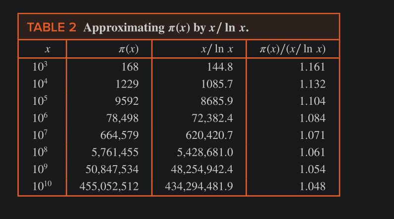
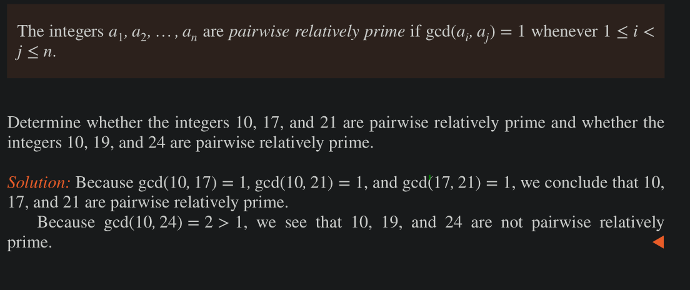
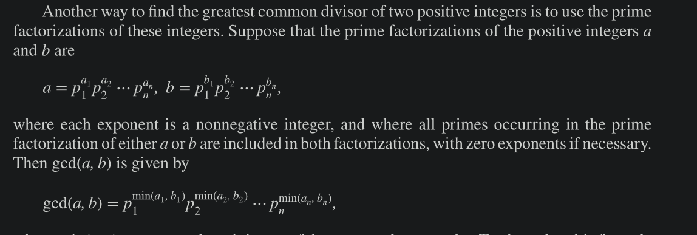
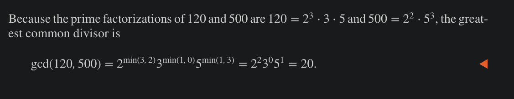
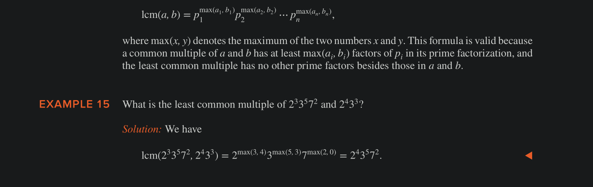
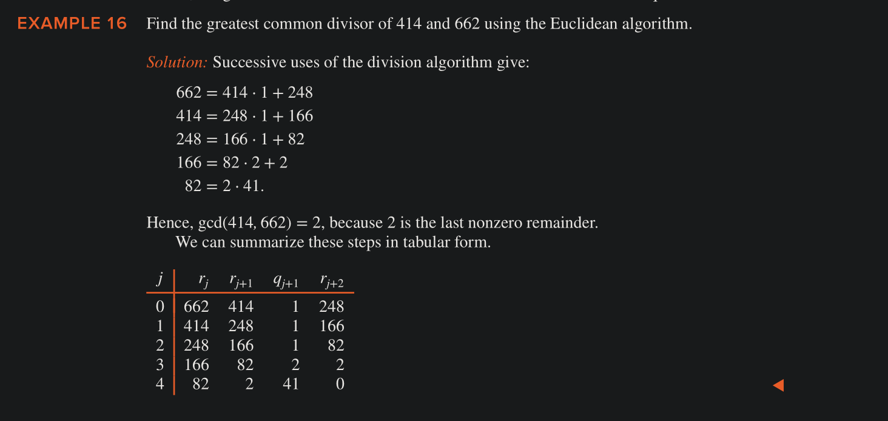
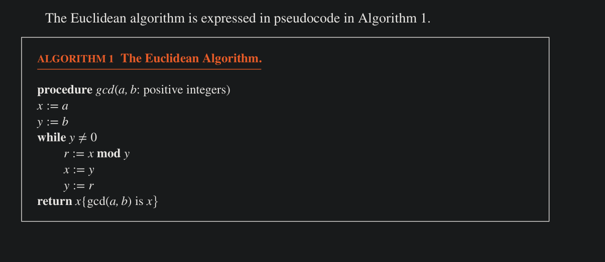
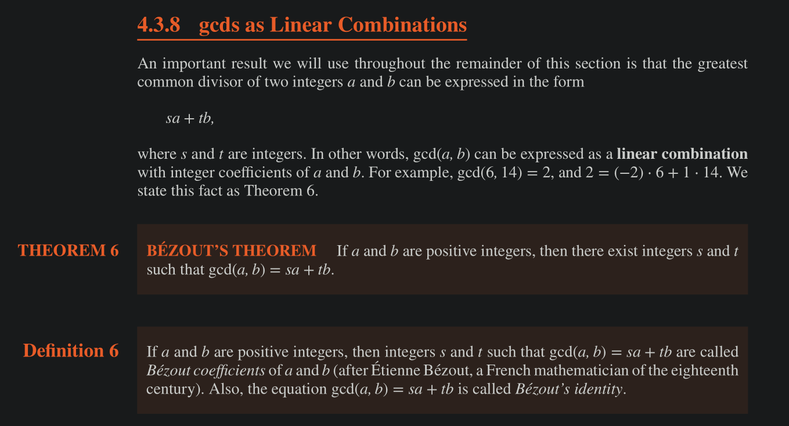
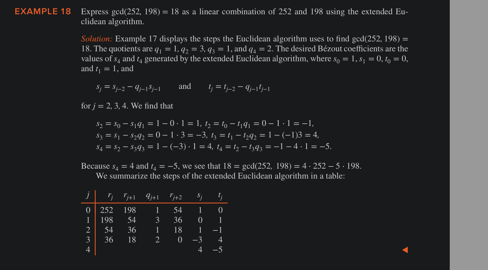

# Primes 

An integer p greater than 1 is called prime if the only positive factors of p are 1 and p.

A positive integer that is greater than 1 and is not prime is called composite.

## Fundamental theorem of Arithmetic

Every integer greater than 1 can be written uniquely as a prime or as the product of two or more primes, where the prime factors are written in order of nondecreasing size.

### Theorem 

If $n$ is a composite integer, then $n$ has a prime divisor less than or equal to $\sqrt{n}$ 

Example: Show that 101 is prime. 

Solution: The only primes not exceeding $\sqrt{101}$  are 2, 3, 5, and 7. Because 101 is not divisible by 2, 3, 5, or 7 (the quotient of 101 and each of these integers is not an integer), it follows that 101 is prime. 

- One of the ways to find prime factors is trial division, keep dividing by primes, starting from 2.

### Theorem

There are infinitely many primes

Because there are infinitely many primes, given any positive integer there are primes greater than this integer.

### Marsenne Primes

Primes of the form $2^p - 1$ , where $p$ is also a prime.

Some of the biggest known primes are Marsenne primes, primarily because there is an extremely efficent test, known as **Lucas-Lehmer test**, for determining when $2^p - 1$ is prime.

### Prime Number Theorem

The ratio of $\pi(x)$ (the number of primes not exceeding $x$), and $x / \ln x$ , approaches to 1 , as $x$ grows without bound.

We can use the prime number theorem to estimate the probability that a randomly chosen number is prime.
    - The Prime number theorem tells us that the number of primes not exceeding $x$ can be approximated as $x / \ln x$ . 
    - Hence, the odds that a randomly selected number  $< n$ is prime are approx. total primes / total numbers = $(n / \ln n) / n = 1 / \ln n$  

Using PNT and Calculus, it can be shown that the probability that an integer $n$ is prime is also approx. $1 / \ln n$. 

### Primes and Arithmetic Progression

Every odd integer is one of two arithmetic progression: $4k + 1$ or $4k + 3$ for $k$ = 1, 2, .… 

Because we know there are infinitely many primes, we can ask whether there are infinitely many primes in both of these arithmetic progressions.

The primes 5,13,17,29,37,41,… are in the arithmetic progression 4k + 1; 
the primes 3,7,11,19,23,31,43,… are in the arithmetic progression 4k + 3; 

Drichlet proved that there are infinitely many primes in arithmetic progressions of form $ak + b$, k = 1, 2..., where no Int > 1 divides both $a$ and $b$.

# GCD and LCM

## GCD 

Let a and b be integers, not both zero. The largest integer d such that d ∣ a and d ∣ b is called the greatest common divisor of a and b. The greatest common divisor of a and b is denoted by gcd(a,b).

One way to find the greatest common divisor of two integers is to find all the positive common divisors of both integers and then take the largest divisor.

- gcd(x, 0) = x

### Relatively Prime

The integers a and b are relatively prime if their greatest common divisor is 1.

### Pairwise relatively Prime

Above in words: min power of all the common prime factors (intersection of prime factors)

### LCM 

The LCM of the positive integers a and b is the smallest positive integer that is divisible by both a and b. The least common multiple of a and b is denoted by lcm(a,b).

- LCM(x, 0) = undefined

Above in words: max power of all the prime factors, be they present in both or not (union of all prime factors)

### Theorem 

$a \times b = gcb (a, b) \times lcm (a, b)$ 

### Euclidean Algo for GCD

Let a = bq + r, where a, b, q, and r are integers. Then gcd(a,b) = gcd(b,r). (r is the remainder when b is divided by a).

Continue till we get $r = 0$ then $q$ at that point will be the GCD

Time complexity of gcd(a, b) where a > b is $O(\log b)$ 

### GCD as Linear Combinations 

We use extended Euclidean theorem to calculate bezout pairs

Some Important results from Bezouts Identity

- if $a b c \in Z^+$ such that gcd(a, b) = 1 and a | bc, then a | c
- if p is prime and p | a1, a2 … an, where each a_i is an Int, then p | a_i for some i
- let m be +ve Int and let a, b, c be Ints, if $ac \equiv bc \pmod m$ and gcd(c, m) = 1, then $a \equiv b \pmod m$ 

### Euler Function

The value for Euler function $\phi$ at n is defined as the number of +ve Ints less than or equal to $n$ that are relatively prime to $n$.

e.g. $\phi(6)=2, \phi(4)=2, \phi(10) = 4, \phi(13) = 12$ 

- for a prime number p, $\phi(p^k) = p^k - p^{k - 1}$ 