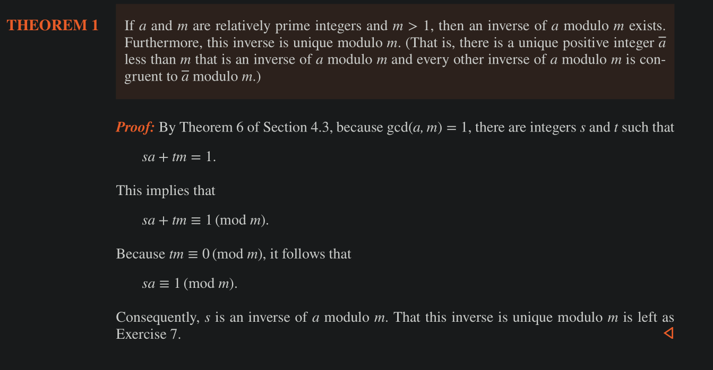
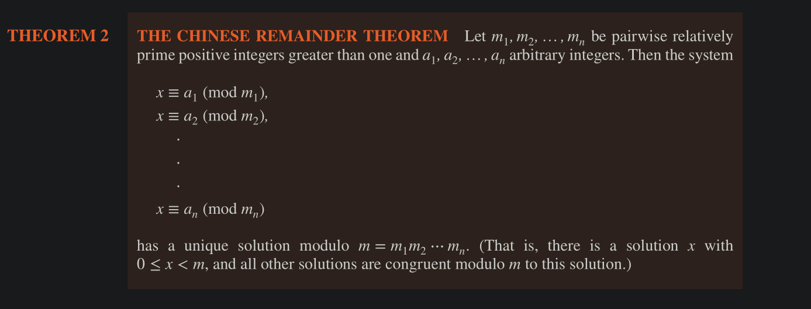
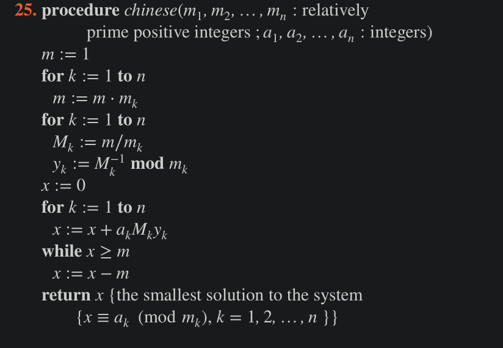
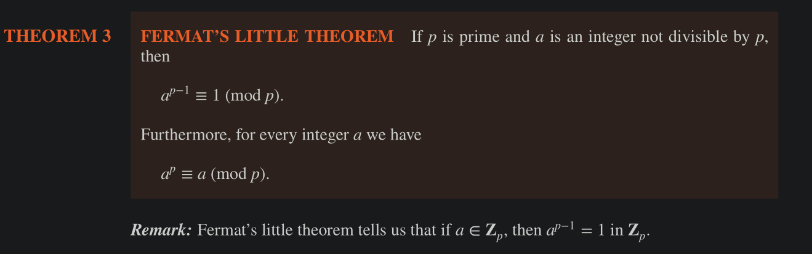
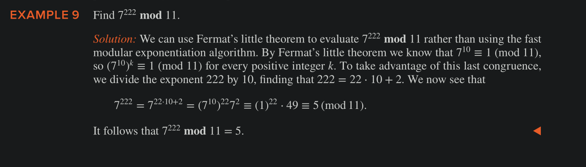
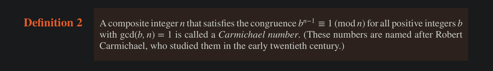
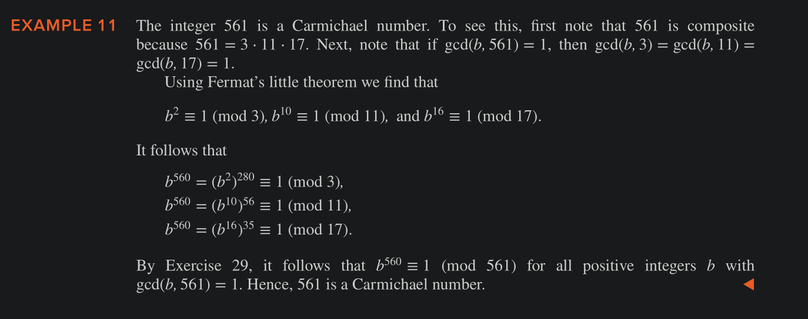
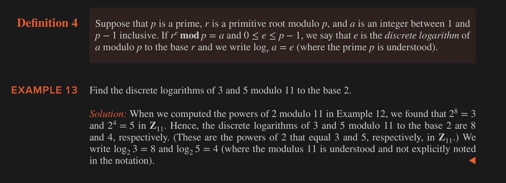

# Linear Congruences

A congruence of the form $ax \equiv b \pmod m$ where m > 0 and x is a variable is called a **linear congrence**

One method of solving linear congruences is finding an inverse of $a$ 

In the above congruence
- If a and m are relatively prime integers (i.e. gcd(a,m) = 1) and m > 1, then an inverse of $a \pmod m$ exists, denoted by $\bar a$ .
- Furthermore, this inverse is unique modulo m
- of gcd(a,m) ≠ 1, then the inverser of a modulo m does not exist

Once we have the inverse, we can find a solution to the linear congruence by multiplying both sides by $\bar a$ .

## Chinese Remainder Theroem

There are two methods for solving the system of linear congruences using CRT 

1. Method 1 
    - calculate m = m1 x m² x m³ x m4 .… 
    - calculate $M_k = m / m_k$ for each of the above m's 
    - Find the inverse of each $M_k$ 
    - solve the equation $x = a_1M_1y_1 + a_2M_2y_2 + .… + a_nM_ny_n$ 
2. Method 2 - Back substitution
    - exapand each modular form
    - substitute variables into the next equation
    - keep solving for x

CRT Algo based on Method 1 

### Representing big numbers using CRT

##### CRT Intuition

By the Chinese remainder theorem, every nonnegative integer less than 99 ⋅ 98 ⋅ 97 ⋅ 95 = 89,403,930 can be represented uniquely by its remainders when divided by these four moduli. 

For example, we represent 123,684 as (33, 8, 9, 89), because 123,684 mod 99 = 33; 123,684 mod 98 = 8; 123,684 mod 97 = 9; and 123,684 mod 95 = 89.
Similarly, we represent 413,456 as (32, 92, 42, 16).  

All these couplings are unique for each integer, as each forms a ssystem of linear congruences and each has a unique solution as per CRT

Particularly good choices for moduli for arithmetic with large integers are sets of integers of the form $2^k − 1$, where k is a positive integer, because it is easy to do binary arithmetic modulo such integers, and because it is easy to find sets of such integers that are pairwise relatively
prime. (The second reason is a consequence of the fact that $gcd(2^a − 1,2^b − 1) = 2^{gcd(a,b)} − 1$   )

### Fermat's Little Theorem

$p$ divides $a^{p-1} - 1$ whenever $p$ is prime and $a$ is an integer not divisible by $p$ .

### PseudoPrimes 

Let $b$ is +ve Int. If $n$ is a composite (i.e. Not prime) +ve Int, and $b^{n-1} \equiv 1 \pmod n$ (That is, Fermat's little theorem holds even though $n$ is not prime), then $n$ is called a pseudoprime to the base $b$.

We can perform this test for bases 2, 3, 4 and so on, and if a number passes all of these tests, than we can surmise that that number is likely to be prime.
    - The above is also bolstered by the fact that, among the +ve Ints not exceeding $x$ , there are relatively few pseudoprimes compared to primes 
        - e.g. for $x < 10^{10}$ , there are 455 milliion primes and only 14k pseudoprimes.

Unfortunately, we cannot distinguish between primes and pseudoprimes just by choosing sufficiently many bases, because there are composite integers $n$ that pass all tests with bases $b$ such that gcd(b,n) = 1. (carmichael numbers)

#### Carmichael Numbers 

### Primitive Roots and Discrete Logarithms 

A primitive root modulo a prime $p$ is an integer $r$ in $Z_p$ such that every nonzero element of $Z_p$ is a power of $r$.

- Example : 2 is a primitive root of 11 
    - $Z_p = {1, 2, 3, 4, 5, 6, 7, 8, 9, 10}$
    - $2^{Z_p} \pmod{11} = {2, 4, 8, 5, 10, 9, 7, 3, 6, 1}$  
    - $2^{Z_p} \pmod{11}  \in Z_p$ 

There is a primitive root for every prime.

No Polynomial type solution for finding discrete logarithm exists (important for cryptography)