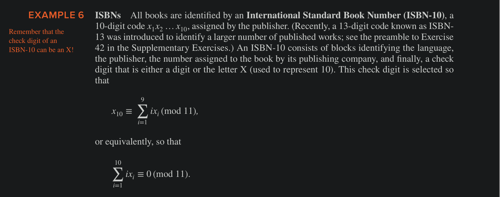
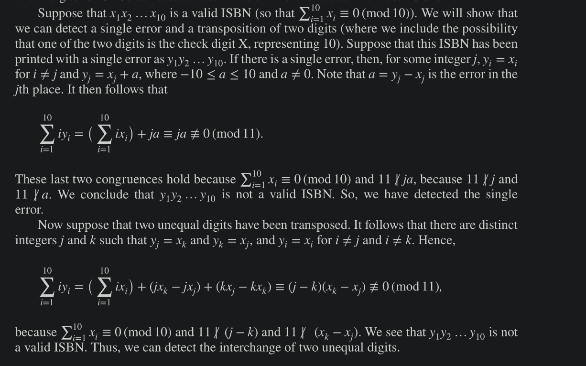

# Applications of Congruences

## Hashing Functions

Memory Locations can be assigned to data for quick retrieval using **hashing functions**.

A hashing function _h_ assigns memory location $h(k)$ to the data record that has $k$ as its key.

One of the most common hashing functions is $h(k) = k \bmod m$ , where $m$ is the number of available memory locations.

Hashing functions should be
    - Easily evaluated so that files can be easily located.
    - an _onto_ function, so that all memory locations are possible.

But, because a Hashing function is not one-to-one (because there are always more possible keys than memory locations), more that one key may be assigned to a memory location, resulting in **collisions**.

One way to resolve a collision is to assign the first free location following the occupied memory location assigned by the hashing function.

*** 

## Pseudo-Random numbers

The most common method for generating pseudo-random numbers is the **linear congruential method**
- We choose four integers 
    - $m$  : modulus
    - $a$   : multiplier
    - $c$    : increment
    - $x_0$  : seed
- with 
    - $2 ≤ a < m$ 
    - $0 ≤ c < m$ 
    - $0 ≤ x_0 < m$ 
- We generate a sequence of pseudo-random numbers $\{x_n\}$ , with $0 ≤ x_n < m$ for all $n$, by successively using the recursively defined function
    - $x_{n + 1} = (ax_n + c) \bmod m$ 
- To generate a number between 0 and 1, we divide the numbers generated by the above formula, by $m$.

Often, a linear congruential generator with increment $c = 0$ is used, such a generator is called a **pure multiplicative generator**.
     - For example, the pure multiplicative generator with module $2^{31} - 1$ and multiplier $7^5 = 16807$ is widely used (it can be shown that $2^{31} - 1$ values are generated before repition begins).

Numbers generated by LCM or PMG methods above do not meet the statistical properties of purely random numbers, so for sensitive tasks, other methods are used.

#### Middle Square Method 

The Middle-Square method for generating pseudo-random number begins with n-digit integer. This number is squared, initial zeroes padded to ensure that the result has 2n digits, and its middle n digits are used to form the next number in the sequence.

#### Power Generator

parameters: $p$ (prime), $d$ (+ve Int), such that p does not divide d, and seed $x_0$ 

The numbers are generated using the formula

$x_{n + 1} =  x_n^d \bmod p$ 

***

## Check Digits

Congruences are used to check for errors in digit strings. 

A common technique for detecting errors in such strings is to add an extra digit at the end of the string.

This final digit, or check digit, is calculated using a particular function. Then, to determine whether a digit string is correct, a check is made to see whether this final digit has the correct value.

### Parity Check bits 

Before each bit string block is stored or transmitted, an extra bit, called a parity check bit, can be appended to each block, defined as 

$x_{n+ 1} = x_1 + x_2 + … + x_n \bmod 2$ 

It follows that 
    - $x_{n+1}$ 
        - is 0 - if there are an even number of 1 bits
        - is 1 - if there are an odd numher of 1 bits

If the parity check bit is wrong, we know for sure that there is an error, but if the parity bit is right, there could still be an error.
A parity check can detect an odd number of errors in the previous bits, but not an even number of errors.

#### Example - ISBN numbers

Several kinds of errors arise in identification numbers. 
   - **singe error** , an  error in one digit of an identification number
   - **transposition error** , when two digits are accidentally interchanged.

