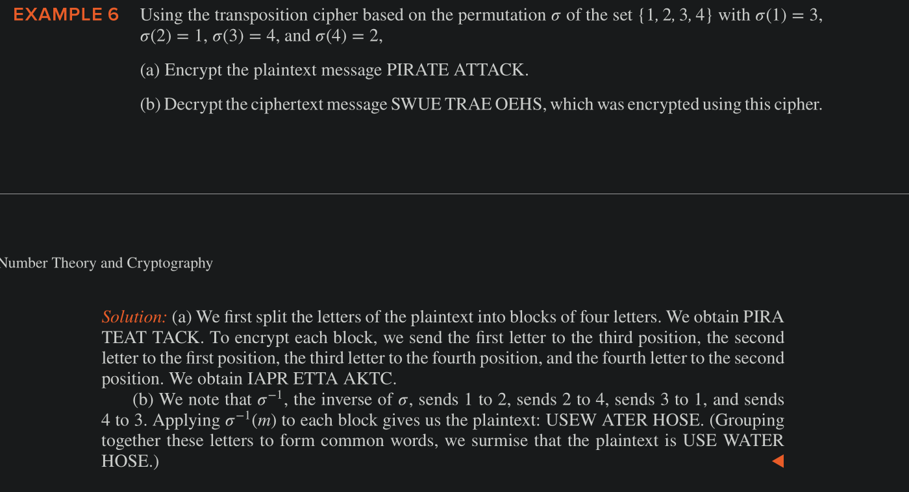

# Cryptography

## Shift Ciphers

Shift ciphers and affine ciphers proceed by replacing each letter of the alphabet by another letter in the alphabet. Because of this, these ciphers are called **character or monoalphabetic ciphers**

### Caesar's cipher

- First replace each letter by an element of $Z_{26}$, i.e., an integer from 0 to 25 equal to one less than its position in the alphabet.
    - Thus A = 0, B = 1, Z = 25
- Then Caesar's encryption method can be represented as, where the integer $k$ is the key 
    - $f(p) = (p + k) \bmod 26$ 
- For Decryption, use 
    - $f^{-1}(p) = (p - k) \bmod 26$ 

### Affine Ciphers

We can generalize shift ciphers to further enhance security by using a function of the form.
    
$f(p) = (ap + b) \bmod 26$ 

where $a$ and $b$ are Integers, chosen so that $f$ is a bijection.
    - The function $f(p) = (ap + b)  \bmod 26$ is a bijection iff gcd(a, 26) = 1
    - Such a mapping is called affine Transformation.
    - and the resulting cipher is called an affine cipher.

***

## CryptAnalysis

The process of recovering plaintext from ciphertext without knowledge of both the encryption method and the key is know as cryptanalysis or breakking codes.

The main tool for cryptanalyzing ciphertext encrypted using shift ciphers is **frequency analysis** of alphabets.

## Block Ciphers

Instead of replacing individual characters with other characters, we can make frequency analysis harder by replacing blocks of letters with other blocks of letters.

### Transposition Cipher

- For key, use some permutation $\sigma$ of the set $\{1, 2, ..., m\}$ for some +ve integer m (i.e.), a one-to-one function from $\{1, 2, … m\}$ to itself.
- To encrypt a message, we first split its letters intro blocks of size $m$
    - If the number of letters is not divisble by $m$ , we add some random letters at the end to fill out the final block.
- we encrypt the block $p_1p_2...p_m$ as $c_1c_2...c_m = p_{\sigma(1)}p_{\sigma(2)}...p_{\sigma(m)}$ (in words, interchange the letters with their new positions indicated by each $\sigma$)
- To decrypt a ciphertext block c1c2...cm, we transpose its letters using the permutation $\sigma^{-1}$ , the inverse of encryption function.

*** 

## Cyptosystems

A general structure for defining new families of ciphers.

A cryptosystem is a five tuple (P, C, K, E, D) , where
    - P is the set of plaintext strings 
    - C is the set of ciphertext strings 
    - K is the keyspace (the set of all possible keys)
    - E is the set of encryption functions
    - D is the set of decryption functions

We denote 
  - by $E_k$ , the encryption function in E corresponding to the key $k$
  - by $D_k$ , the decryption function in D that decrypts ciphertext that was encrypted using $E_k$
  - i.e. $D_k(E_k(p)) = p$ , for all plaintext strings, $p$.

Example, shift cipher as cryptosystem: $(P = Z_{26}, C = Z_{26}, K = Z_{26}, E = E_k(p) = (p + k) \bmod 26, D = D_k(p) = (p - k) \bmod 26 )$ 

*** 

## Public Key Cryptography

When such cryptosystems are used, knowing how to send an encrypted message does not help decrypt messages. In such a system, everyone can have a publicly known encryption key. 

Only the decryption keys are kept secret, and only the intended recipient of a message can decrypt it, because, as far as it is currently known, knowledge of the encryption key does not let someone recover the plaintext message without an extraordinary amount of work (such as billions of
years of computer time).

### RSA Cryptosystem

RSA system is a block cipher.

- In the RSA cryptosystem, each individual has an encryption key $(n, e)$ 
    - where , the modulus , $n = pq$ , (product of two primes with >300 digits)
    - and, exponent, $e$ , that is relatively prime to $(p-1)(q - 1)$ 
- To produce a reusable key, two large primes must be found.
    - Which can be done quickly on a computer using probability primality tests
- However, the product of primes, cannot, as far is currently known, be factored in a reasonable length of time.
- With the steady increase of the speed of computers, the recommended size of the primes $p$ and $q$ used to produce a RSA public key has increased
    - But the larger the $n$ is, the slower the RSA encryption and decryption become.

#### RSA Encryption

To encrypt messages using a particular key $(n, e)$ 
    - first translate a plaintext message M into sequences of integers
        - To do this, translate each plaintext letter into a two digit number (left padded by 0 if necessary).
    - Then concatenate these two-digit numbers into strings of digits.
    - Next, we divide this string into equally sizes blocks of 2N digits
        - where 2N is the largest even number such that the number 2525...25 with 2N digits does not exceed $n$.
        - (When necessary we pad the plaintext message with dummy Xs ti make the last block the same size as all other blocks)
    - After these steps, the plaintext M is now a sequence of integers $m_1, m_2...m_k$ for some integer $k$. 
    - Encryption proceeds by transforming each block $m_i$ to a ciphertext block $c_i$ using the function
        - $c = m^e \bmod n$ 
        - To perform the encryption, we use an algorithm for fast modular exponentiation.
    - We leave the encrypted message as blocks of numbers and send these to the intended recipient.

Example: 

Encrypt message STOP using the RSA cryptosystem with 
    - key (2537, 13).
    - 2537 = 43 . 59,
    - p = 43,
    - q = 59,
    - $gcd(e, (p-1)(q-1)) = gcd(13, 42 . 58) = gcd(13, 2436) = 1$  

To encrypt
    - translate the letters STOP into their numerical equivalents 18191415
    - Then group the numbers into blocks of four digits
    - 1819 1415
        - because 2525 < 2537 < 252525
    - We encrypt each block using the mapping
        - $c = m^{13} \bmod 2537$ 
    - $1819^{13} \bmod 2537 = 2081$ 
    - and $1415^{13} \bmod 2537 = 2182$ 
    - Thus, the encrypted message is $2081 2182$ 

#### RSA Decryption

That plaintext message can be quicky recovered from a ciphertext message when the decryption key $d$ , an inverse of $e$ modulo $(p-1)(q-1)$ is known. (Such an inverse exists because $gcd(e, (p-1)(q-1))) = 1$ 

To see the above, note that 
    - if $de \equiv 1 \pmod{(p-1)(q-1)}$ , there is an integer $k$ such that $de = 1 + k(p-1)(q-1)$ 
    - it follows that
        - $c^d \equiv (m^e)^d = m^{de} = m^{1+k(p-1)(q-1)} \pmod n$ 
    - By Fermat's little theorem
        -  it follows that $m^{p-1} \equiv 1 \pmod p$ 
        -  and $m^{q-1} \equiv 1 \pmod q$ 
    -  Consequently
        -  $c^d \equiv m . (m^{p-1})^{k(q-1)} \equiv m . 1 = m \pmod p$ and
        -  $c^d \equiv m.(m^{q-1})^{k(p-1)} \equiv m . 1 = m \pmod q$ 
    -  Because $gcd(p,q) = 1$ , it follows from the Chinese remainder theorem that 
        -  $c^d \equiv m \pmod{pq}$ 

Example: Decrypt 0981 0461 with the cryptosystem $n = 43.59$ and exponent = 13 (As in the example above)

- since $d$ = 937 (since it is an inverse of 13 modulo 42 x 58 = 2436). 
- We use d = 937 as our decryption exponent
- Thus, to decrypt a block $c$ , we compute 
    - $m = c^{937} \pmod{2537}$ 
- Thus 
    - $0981^{937} \pmod 2537 = 0704$ and
    - $0461^{937} \pmod 2537 = 1115$
- Thus , the original message is 07041115, which translates to HELP

*** 

## Cryptographic Protocols

Exchanges of messages carried out by two or more parties to achieve a particular security goal.

### Key Exchange using Diffie-Hellman Key agreement protocol

Suppose that Alice and Bob want to share a common key, the protocol follows these steps, where the computations are done in $Z_p$ 
- A and B agree to use a prime $p$ and a primitive root $a$ of $p$
- A chooses a secret integer $k_1$ and sends $a^{k_1} \bmod p$ to B.
- B chooses a secret integer $k_2$ and sends $a^{k_2} \bmod p$ to A.
- A computes $(a^{k_2})^{k_1} \bmod p$
- B computes $(a^{k_1})^{k_2} \bmod p$ 
- At the end of this protocol, A and B have computed their shared key, namely
    - $(a^{k_2})^{k_1} \bmod p$ = $(a^{k_1})^{k_2} \bmod p$ 
- Note that the initial messages sent are not assumed to be sent securely.
    - so, $p, a, a^{k_1} \bmod p, a^{k_2}\bmod p$ are assumed to be public info
    - The protocol ensures that k1, k2 and the common key are kept secret.
- To find the secret key from the known info, requires that an adversary solves instance of the discrete logarithm problem
    - because the adversary needs to find k1 and k2 from $a^{k_1} \bmod p$ and $a^{k_2} \bmod p$ 
- No other method is known for finding the shared key.
- With the computing power we have now, this system is considered unbreakable when $p$ has more than 300 digits and k1 and k2 have more than 100 decimal digits each.

### Digital Signatures

Using Digital Signatures, the recipient of the message knows that it came from the person they think it came from.

Example:

Suppose Alice's public RSA cryptosystem is: n = 43 . 59 = 2537, e = 13, decryption key d = 937, She wants to send the message "MEET AT NOON" to her friends so that they are sure it came from her. What should she send?

- Alice first translates the letters into blocks of digits, obtaining 1204 0419 0019 1314
- She then applies her Decryption Transformation $D_{(2537,13)}(x) = x^{937} \bmod 2537$  to each block
- thus she gets 0817 0555 1310 2173 1026 and sends this to her friends
- Her friends apply her encryption algorithm $E_{(2537, 13)}$ to each block to get the digits of the original message.

The above shows that signed messages can be sent using RSA cryptosystem.

We can extend this by sending signed _secret_ messages.

To do this, the sender applies RSA encryption using the publicly known encryption key of an intended recipient to each block that was encrypted using the sender’s decryption transformation. 

The recipient then first applies his private decryption transformation and then the sender’s public encryption transformation.

*** 

## Homomorphic Encryption

It is often necessary to run programs using data from files stored on the cloud.

This data is vulnerable to MITM attacks, or those with access to remote computer.

Could we avoid these vulnerabilities by just running programs directly on encrypted data?

There is a cryptosystem that allowed arbitrary computations to be run on encrypted data that would produce the encryption of the unencrypted output produced by this unencrypted input.

For such a cryptosystem, it would not be necessary to decrypt input data because the program could be run on a remote system without disclosing either the input or the output. 

So, the search began for a **fully homomorphic cryptosystem** that allows arbitrary computations to be run remotely on encrypted data.

RSA system is not fully homomorphic, although it allows some computation to be done on encrypted data.

#### RSA is partially Homomorphic: 

Let (n, e) be a public key for the RSA system and suppose that M1 and M2 are plaintext messages so that 0 ≤ M1 < n and 0 ≤ M2 < n

then

$E_{(n, e)}(M1) \times E_{(n, e)}(M2) \bmod m = (M_1^e \bmod m \times M_2^e \bmod m) \bmod m) = (M_1 M_2)^e \bmod m = E_{(n,e)}(M_1, M_2)$  

Because of the above result, RSA is **multiplicatively homomorphic**

However, it is not **additively homomorphic**

Hence, RSA is partially homomorphic.

In 2009, Craig Gentry described the first fully homomorphic cryptosystem, based on what is know as **lattice-based cryptography**. Unfortunately, no practical fully homomorphic system have been developed yet.
                                                       