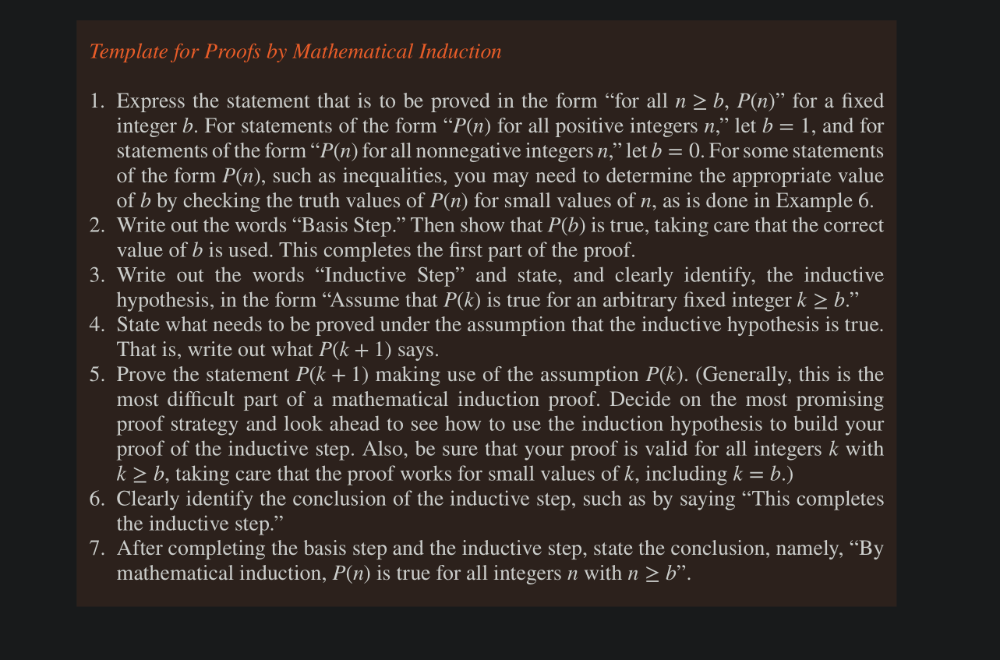
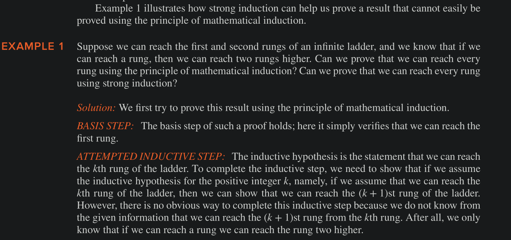
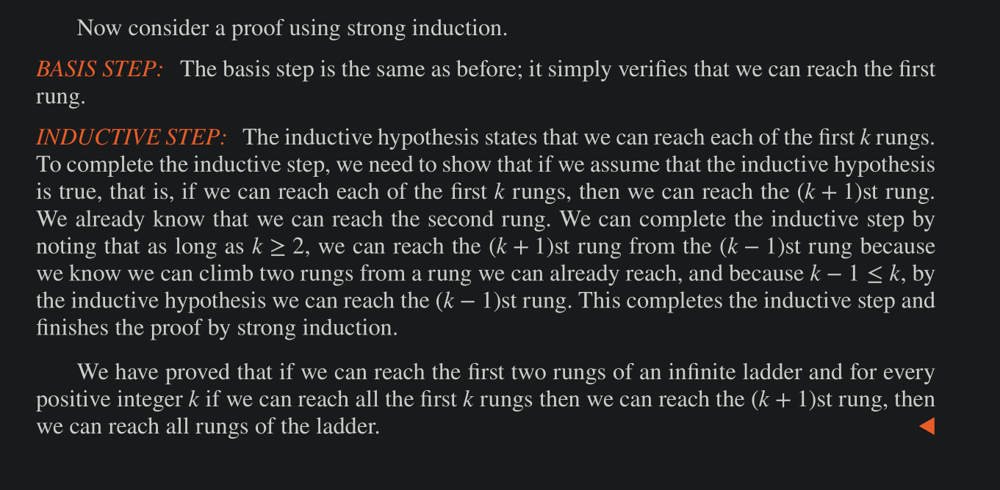
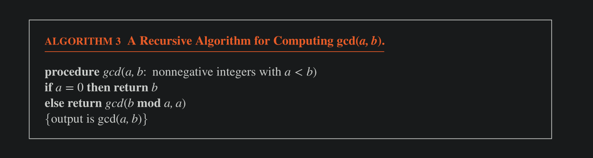

# Mathematical Induction

To prove that $P(n)$ is true for all +ve integers $n$ , where $P(n)$ is a propositional function, we complete two steps: 

**Basis Step**: We verify that $P(1)$ is true.
**Inductive Step**: WE show that the conditional statement $P(k) \to P(k+1)$ is true for all +ve integers k.

The assumption that $P(k)$ is true is called the inductive hypothesis.

Another way to state induction: 

$(P(1) \land \forall k ( P(k) \to P(k + 1))) \implies \forall n P(n)$ where the domain is the set of +ve integers.

### Why is Mathematical Induction valid

It is valid because of the **well-ordering property**, which states that every non-empty subset of the set of +ve integers has a least/minimum element.

Proof: 
- Suppose we know that 
    - (a) $P(1)$ is true, and
    - (b) the proposition $P(k) \to P(k + 1)$ is true for all +ve integers k.
- To show that $P(n)$ is true for all +ve ints $n$, assume there is an $n$ for which $P(n)$ is false.
- Then the set $S$ of +ve ints for which $P(n)$ is false is non-empty.
- Thus, by the well-ordering property, there is a minimum element, denoted by $m$.
- We know that $m$ cannot be 1, because $P(1)$ is true, and we just assumed that $m$ is the minimum element of the set $S$ for which $P(n)$ is false
- Because $m$ is+ve and >1, $m-1$ is a +ve int as well. 
- But since $m-1 < m$ , it is not in $S$, (as $m$ is the least element) so $P(m-1)$ must be true.
- from (b) assumption above, it follows that $P(m-1) \to P(m)$ is also true
- Hence it must be the case that $P(m)$ is true, a contradiction.
- Hence, $m$ cannot exist since it leads to a contradiction.
- Hence, $P(n)$ must be true for all +ve ints. QED

## Strong Induction

To prove that $P(n)$ is true for all +ve integers $n$, where $P(n)$ is a propositional function, we complete two steps: 

**Basis Step**: We verify that the proposition $P(1)$ is true
**Inductive Step**: We show that the conditional statement $[P(1) \land P(2) \land … \land P(k)] \implies P(k+1)$ is true for all +ve integers k.

Mathematical Induction and Strong induction are equivalent, they both follow from well-ordering property.

In fact, mathematical induction, strong induction, and well-ordering are all equivalent principles. 

That is, the validity of each can be proved from either of the other two. This means that a proof using one of these two principles can be rewritten as a proof using either of the other two principles.

#### Mathematical vs Strong Induction comparison 

## Recursively defined functions

We use two steps to define a function with the set of non-negative integers as its domain: 

Basis Step: Specify the value of the function at zero
Recursive step: Give a rule for finding its value at an integer from its values at smaller integers.

## Recursive Algorithm 

An algorithm is called _recursive_ if it solves a problem by reducing it to an instance of the same problem with smaller input.

