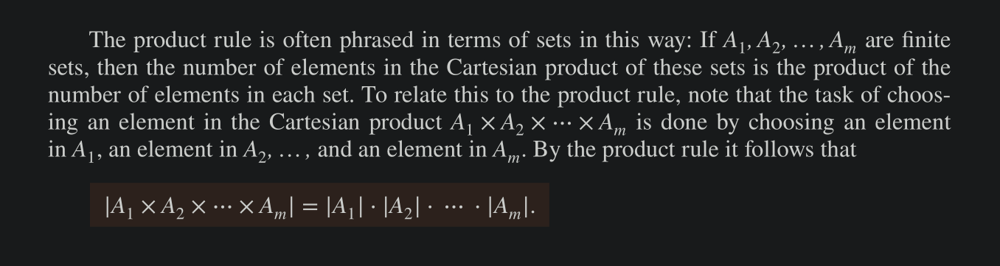
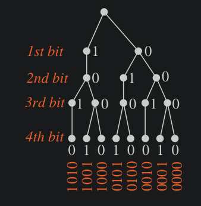

# Basic Counting Principles

## Product Rule

The Product rule applies when a procedure is made up of separate tasks.

##### Definition

Suppose that a procedure can be broken down into a sequence of two tasks. If there are $n_1$ ways to do the first task and for _each of these_ ways of doing the first task, there are $n_2$ ways to do the second task, then there are $n_1 \times n_2$ ways to do the procedure.

- Example 1: Two offices to be appointed to A and B out of 12 offices. 
    - A can take any of the 12 offices, but once he takes an office, B can take any of the rest of the 11 offices, hence total number of ways to assign offices = 12 x 11 =  132
- Example 2: Chairs to be labeled with: an uppercase English letter followed by a +ve Int ≤ 100. 
    - 26 letters x 100 = 2600 ways to label a chair

#### Extended Product Rule

Suppose that a procedure is carried out by performing the tasks T1, T2, … Tm in sequence. If each Task $T_i$ , i =  1, 2 … n can be done in $n_i$ ways, _regardless of how the previous tasks were done_, then there are n1 x n2 x … x n_m ways to carry out the procedure.

- Example: How many different bit strings of length 7 are there 
    - 2 x 2 x 2 x 2 x 2 x 2 x 2 = $2^7$ = 128
- Example: How many different license plates can be made if each plate contains: a sequence of 3 uppercase English letters, followed by 3 digits
    - 26 x 26 x 26 x 10 x 10 x 10 = 17,576,000
- How many functions are there from a set of $m$ elements to a set with $n$ elements
    - each m maps to all n - so $n^m$ 
- How many partial functions are there from set of $m$ to set of $n$?
    - The undefined value is just one more case, so the total functions are: $(n + 1)^m$
- **Counting one-to-one functions**: from a set of $m$ elements to a set of $n$ elements
    - Note that: if $m > n$ , then there are NO 1-2-1 functions from m to n
    - So, m ≤ n
    - Suppose domain = $a_1, a_2 , … a_m$ 
    - There are $n$ ways to pick a value for domain element $a_1$
    - But after having chosen so, there are $n-1$ ways to pick a value for next domain element $a_2$, because the function has to remain 1-2-1
    - Similarly, for $a_3$ , there are $n - 2$ ways
    - In general, for any $a_k$, there are $n - (k - 1) = n - k + 1$ ways 
    - Thus, the total number of 1-2-1 functions = $n \times (n - 1) \times (n - 2) \times … \times (n - m + 1)$
- How many bit strings of length $n$ are palindromes (same forwards and reversed)
     - To see the answer, note that when a bit string is a palindrome, the first half ($n/2$) bits determine the second half (since the two halves must be the same but mirrored)
     - Since each bit can have 2 values, hence total palindromes if n is 
         - even = $2^{n/2}$ 
         - odd = $2^{(n+1) / 2}$ 
         - 
- How many 4 element RNA sequences 
    - contain the base U (RNA have AUCG bases)
        - bases containing U = Total bases - bases not containing any U = $4^4 - 3^3$ = 175
    - do not contain the sequence CUG 
        - 4^4 - 4 (with xCUG) - 4 (with CUGx) = 248
    - do not contain all four bases AUCG
        - 4^4 - 4 x 3 x 2 x 1 = 232 (there are 24 cases which contain all bases at least once)
 

## The Sum Rule

If a task can be done either in one of $n_1$ ways OR in one of $n_2$ ways, there none of the set of $n_1$ ways is the same as any of the set of $n_2$ ways, then there are $n_1 + n_2$ ways to do the task.

(Sum rule applies when the ways of doing things do not have common)

#### Extended Sum Rule 

Suppose that a task can be done in one of $n_1$ ways, in one of $n_2$ ways, … or in one of $n_m$ ways, _where none of the set of $n_i$ ways of doing the task is the same as any of the set of $n_j$ ways_ , then the number of ways to do the task is $n_1 + n_2 + … + n_m$ 

- Example: How many ways of choosing a project from 3 lists of 23, 15, and 19 possible projects, when no project is on more than one list
    - 23 + 15 + 19 = 57 ways

The above equality applies only when the sets are pairwise disjoint.

## Subtraction Rule (Inclusion-Exclusion principle)

If a task can be done in either $n_1$ ways OR $n_2$ ways, then the number of ways to do the task is $n_1 + n_2$ _minus_ the number of ways to do the task that are common to the two different ways.

For sets: $A_1 \cup A_2 = A_1 + A_2 - (A_1 \cap A_2)$  

Example: how many bit strings of length 10 either begin with three 0s or end with two 0s
    - $2^7 + 2^8 - 2^5 = 352$ 

## Division Rule 

There are $n/d$ ways to do a task : if it can be done using a procedure that can be carried out in $n$ ways, and for every way $w$, exactly $d$ of the $n$ ways correspond to way $w$. 

For sets: If the finite set $A$ is the union of $n$ pairwise disjoint subsets each with $d$ elements, then $n = |A| / d$ 

For functions: if $f$ is a function from $A$ to $B$ where $A$ and $B$ are finite sets, and that for every value $y \in B$ there are exactly $d$ values $x \in A$ such that $f(x) = y$ (in which case we say that $f$ is $d$-to-one), then $|B| = |A| / d$ 

Note: The division rule comes in handy when it appears that a task can be done in $n$ different ways, but it turns out that for each way of doing the task, there are $d$ equivalent ways of doing it. Under these circumstances, we can conclude that there are $n/d$ inequivalent ways of doing the task.

- Example: In a field we counted 572 legs, how many cows were there?
    - 572 / 4 = 143 cows
- Example: How many different ways are there to seat 4 people around a circular table, condition: where two arrangements are considered the same when each person has the same left and right neighbour.
    - Labeling the seat 1 - 4 clockwise
    - WIthout the condition: there are 4 ways for seat 1, 3 ways for seat 2, 2 ways for seat 3, therefore, total ways = 4! = 24.
    - With the condition: For each arrangement of the four possible arrangements for seat 1, seat 2, 3, and 4 are equivalent (its just a rotated copy of the arrangement of seat 1)
    - So every seating arrangement has four equivalent versions for all seats.
    - In other words, each of the four choices for sear 1 leads to the same arangement, as we distinguish two arrangements only when one of the people has a different immediate left or immediate right neighbour.
    - Because there are 4 ways to choose the person for seat 1, by the division rule there are 24 / 4 = 6 different seating arrangements of 4 people.
- Example: 434 freshman, 883 sophomores, 43 juniors enrolled in a course. How many sections of this course need to be scheduled to accomodate all these students if each section has 34 students 
    - 434+883+42 / 34 = 40
- Example: # How many ways are there to seat six people around a circular table where two seatings are considered the same when everyone has the same two neighbors without regard to whether they are right or left neighbors?
    - Suppose you always sit in seat number 1.
    - The only thing that matters is the order of the people that sit beside you.
    - Hence there are 5 x 4 x 3 x 2 x 1 ways of choosing people around you = 120
    - But since each seating arrangement has a mirrored version
    - therefore, answer = 120 / 2 = 60
- Example: In how many ways a photographer at a wedding arrange six people in a row, including Bride B and Groom G, if 
    - B must be next to G
        - 5 cases when BG are next to each other 
            - BG - - - - 
            - - BG - - - 
            - - - BG - - 
            - - - - BG - 
            - - - - - BG
            - each case has 4x3x2 possibilities = 120
            - times 2 (since BG and GB are two mirrored cases) = 240
        - B and G are not next to each other 
            - answer = total cases - when BG are together = 6! - 240 = 480 
        - B is positioned to the left of G
            - Since B must either be at the left or to the right of G always, hence half the total cases = 6! / 2 = 360 
       
## Tree Diagrams

We can use Tree Diagrams to count as well.

Example: How many bit strings of lenggth 4 do not have two consecutive 1s?

Example: A playoff win between two teams is 3 wins out of 5, how many different ways can the playoffs occur?

### Combination of Rules 

Example: Suppose the number format is (Country Code 1-3 digits long)-(NXX-NXX-XXXX) where N = 2-9 and X = 0-9. How many different phone numbers
    - $(10 + 10^2 + 10^3)\times(8\times10\times10-8\times10\times10-10^4)$ = 7,104,000,000,000

Example: a Wired Equivalent Privacy (WEP) key for Wifi is a string of either 10, 26 or 58 hexadecimal digits, total WEP keys?
    - $16^{10} + 16^{26} + 16^{58}$ 

Example: how many ways are there to arrange letters a, b, c, d (no repitition) such that a is not followed immediately by b
    - answer = total cases - cases where a followed by b immediately
    - answer = 4 x 3 x 2 x 1 - (ab - - , - ab -, - - ab = 2 + 2 + 2 = 6 cases)
    - answer = 24 - 6 = 18