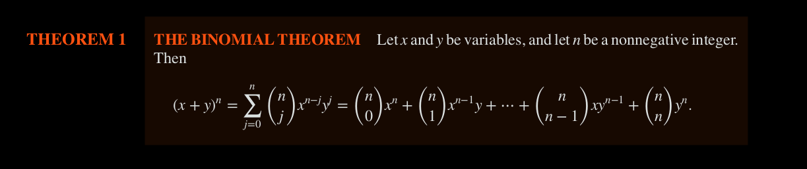
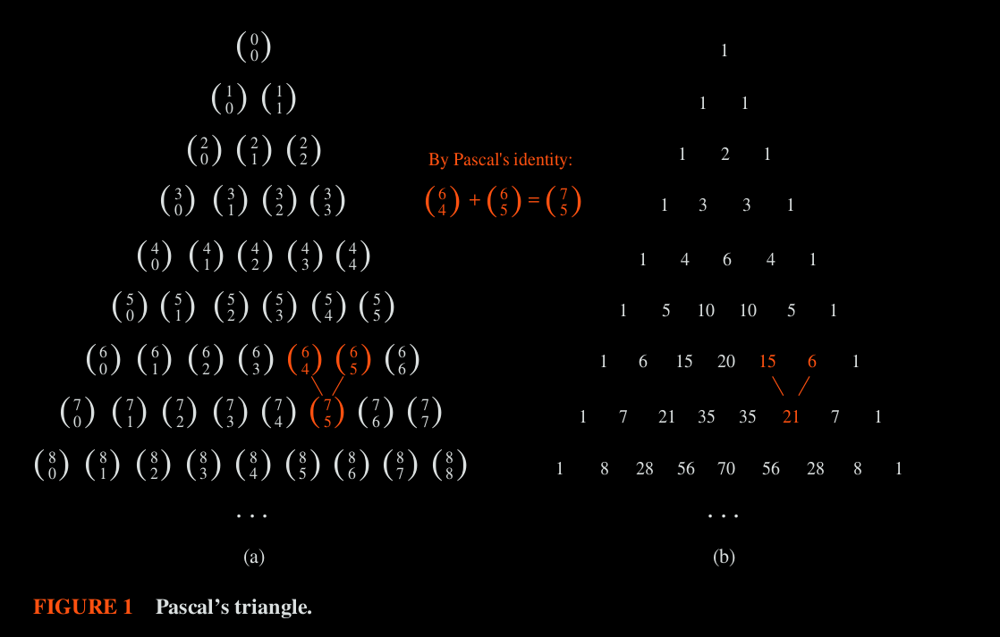

# Binomial Coefficient

The number of r-comb from a set with $n$ elements is often denoted by $\binom{n}{r}$ , and also called **Binomial Coefficient** because these numbers occur as coefficients in the expansion of powers of binomial expressions such as $(a+b)^n$ .

$\binom{n}{k} = n! / (k! \times (n - k)!) = n \times (n-1) \times (n - 2) \times ... (n - k + 1) / k!$ 

## Binomial Theorem

Example: 
- Expansion of $(x+y)^4$ = $\sum_{j=0}^4 \binom{4}{j}x^{4-j}y^j$ = $\binom{4}{0}x^4 + \binom{4}{1}x^3y + \binom{4}{2}x^2y^2 + \binom{4}{3}xy^3 + \binom{4}{4}y^4$ = $x^4 + 4x^3y + 6x^2y^2 + 4xy^3 + y^4$ 

Example: What is the coefficient of $x^{12}y^{13}$ in the expansion of $(x+y)^{25}$ 
    - $\binom{25}{13} = 25!/13!.12! = 5,200,300$ 

Example: What is the coefficient of $x^{12}y^{13}$ in the expansion of $(2x-3y)^{25}$ 
    - Since $(u+v)^{25} = \sum_{j=0}^{25} \binom{25}{j}u^{25-j}v^j$ 
    - Setting u = 2x and v = -3y in the above equation will yield the same result.
    - = $25! / (13! \times 12!) \times 2^{12} \times (-3)^{13}$ 

#### Relationship of Binomal Coefficient and Subsets 

- There are $\binom{n}{k}$ subsets of size k of a set with $n$ elements.
- Total number of subset = $2^n = \sum_{k=0}^n \binom{n}{k}$ 
    - all subsets of 0 elements $\binom{n}{0}$ + all subsets of 1 element $\binom{k}{1}$  + so on

#### Corollaries from Binomial Theorem

1. $\binom{n}{k} = \binom{n}{n - k}$  

2. if $n$ is a non-negative int, then: $\sum_{k=0}^n \binom{n}{k} = 2^n$ 
    
    - $2^n = (1 + 1)^n = \sum_{k=0}^n \binom{n}{k} 1^k 1^{n-k} = \sum_{k=0}^n \binom{n}{k}$ 
    - This relationship is effectively counting the number of subsets of a set with $n$ elements which equals $2^n$ 

3. Let $n$ be +ve Integer, then: $\sum_{k=0}^n(-1)^k\binom{n}{k} = 0$ 

    - $0 = 0^n = ((-1) + 1)^n = \sum_{k=0}^{n} \binom{n}{k} (-1)^k 1^{n-k} = \sum_{k=0}^{n} \binom{n}{k} (-1)^k$ 
    - This corollary implies that $\binom{n}{0} + \binom{n}{2} + \binom{n}{4} + ... = \binom{n}{1} + \binom{n}{3} + \binom{n}{5} + ...$

4. Let $n$ be a non-neg int, then: $\sum_{k=0}^n 2^k\binom{n}{k} = 3^n$

    - $(1 + 2)^n = \sum_{k=0}^n \binom{n}{k} 1^{n-k} 2^k = \sum_{k=0}^n \binom{n}{k} 2^k$ 

5. Number of terms in the expansion of $(x + y)^n$  is $n + 1$  

6. $\binom{n+ 1}{k} = (n + 1)/k \times \binom{n}{k-1}$ 

***

## Pascal's Identity & Triangle

let $n$ and $k$ be +ve integers with $n >= k$ , then 

$\binom{n+1}{k} = \binom{n}{k-1} + \binom{n}{k}$ 

Example: $\binom{7}{5} = \binom{6}{4} + \binom{6}{5}$ 

Pascal's Identity is the basis for a geometric arrangement of the binomial coefficients in a triangle, called Pascal's Triangle.

In a Pascal's Triangle, the $n$th row in the triangle consists of binomial coefficients given by: $\binom{n}{k}$ where k = 0, 1, ... $n$.

***

##  Vandermonde's Identity

Let $m$ , $n$ and $r$ be non-neg integers with $r$ not exceeding either $m$ or $n$ , then 
   
$\binom{m+n}{r} = \sum_{k=0}^{r} \binom{m}{r - k} \binom{n}{k}$ 

###### Corolloary

1. If $n$ is non-neg Int, then $\binom{2n}{n} = \sum_{k=0}^{n} \binom{n}{k}^2$ 
    - $\sum_{k=0}^{n} \binom{n}{n - k} \binom{n}{k} = \sum_{k=0}^n \binom{n}{k}^2$     ( from Vandermonde's Identity & from  $\binom{n}{k} == \binom{n}{n - k}$ )

2. $\binom{n + 1}{r + 1} = \sum_{j=r}^{n} \binom{j}{r}$ 
    - The above identity counts the bit strings of length $n+1$ containing $r+1$ 1s.

