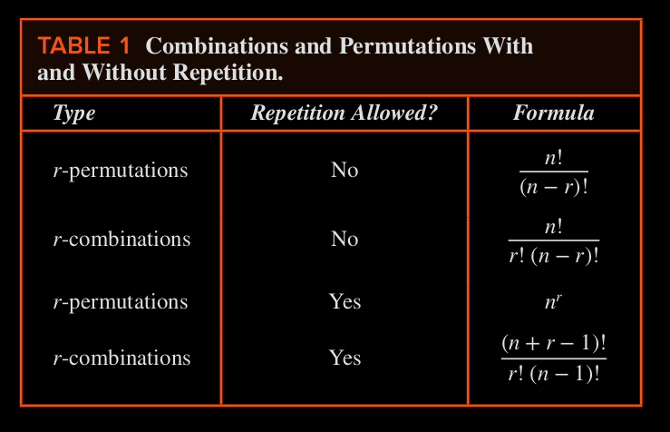
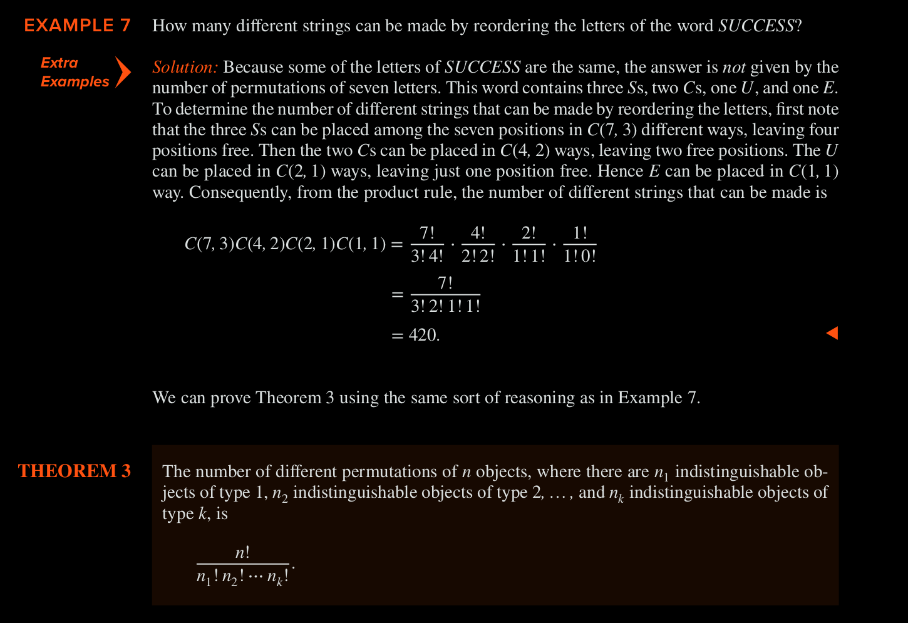

# Generalized Permutations and Combinations 

These include scenarios like counting problems involving indistinguishable elements, or some elements being used repeatedly.

## Permutations with repitition

**The number of $r$-perms of a set of $n$ objects with repitition allowed is $n^r$ 

Example: How many strings of length $r$ can be formed with the uppercase letters of English?
    - 26 x 26 x 26 ... r times (since repitition is allowed)
    - Hence: $26^r$ 

## Combinations with repitition

**There are $C(n + r -1, r) = C(n + r - 1, n - 1)$ r-combs from a set with $n$ elements when repitition of elements is allowed.

Example: How many ways are there to select 4 pieces of fruit from { apples, oranges, pears }, if the order does not matter, only the type of fruit and not the individual piece matters, and there are at least four pieces of each type of fruit in the bowl?
    - Possibilities: 4 apples, 3apples 1Orange, 2A2O, 1A3O... and so on 
    - The solution is the 4-comb with repitition allowed from a 3 element set (n = 3, r = 4) 
    - answer = $C(3 + 4 -1, 4) = C(6, 4) = 6 \times 5 / 2 = 15$ 

Example: Suppose that a cookie shop has 4 different kinds of cookies. How many different ways can 6 cookies be chosen? order and individual cookies do not matter, only type of cookie.
    - here $n = 4, r = 6$ 
    - answer: $C(4 + 6 - 1, 6) = C(9, 3) = 9 \times 8 \times 7 / 3! = 84$ 

Example: How many solutions does the equation (non-neg integers only) $x_1 + x_2 + x_3 = 11$ 
    - note that the solution corresponds to a way of selecting 11 items from a set with 3 elements so that $x_1$ items of type one, $x_2$ items of type two, and $x_3$ items of type 3 are chosen.
    - Hence, the number of solutions = number of 11-combs with repitition allowed from a set with 3 elements.
    - n = 3, r = 11
    - $C(3 + 11 - 1, 11) = C(13, 11) = C(13, 2) = 78$ 

## Permutations with Indistinguishable objects 

Some elements may be indistinguishable in counting problems. When this is the case, care must be taken to avoid counting things more than once.

*** 

## Distributing objects into boxes

Many counting problems can be solved by enumerating the ways objects can be placed into boxes (where the order of these objects does not matter).

The objects can be either _Distinguishable_ (aka labeled) or _in-distinguishable_ (aka unlabeled).

**Closed formula** exists for counting the ways to distribute objects, labeled or unlabeled, into labeled boxes, but _NO_ such formula exists for unlabeled boxes, whethere objects are labeled or unlabeled.
    NOTE: Closed formula is an expression that can be evaluated using a finite number of operations and that includes numbers, variables, and values of functions, where the operations and functions belong to a generally accepted set that can depend on the context.
    
### Distinguishable Objects and Distinguishable Boxes 

- **The number of ways to distribute $n$ distinguishable  objects into $k$ distinguishable boxes so that $n_i$ objects are placed into box $i$, $i = 1, 2, ... k$ equals $n! / (n_1! \times n_2! \times ... \times n_k!)$ **

Example: How many ways are there to distribute hands of 5 cards to each of four players from 52 cards?
    - The distinguishable objects are the 52 cards 
    - 5 distinguishable boxes are the 4 players and the rest of the deck
    - the first player can be dealt $C(52,5)$ ways
    - 2nd = $C(47, 5)$ 
    - 3rd = $C(42, 5)$ 
    - 4th = $C(37, 5)$ 
    - Hence total = $52! / (47!5!) \times 47!/(42!5!) \times 42!/(37!5!) \times 37!/(32!5!) = 52! / (5! \times 5! \times 5! \times 5! \times 32!)$ 

### Indistinguishable Objects and Distinguishable Boxes

- **There are $C(n + r - 1, r) = C(n + r - 1, n - 1)$ ways to place $r$ indistinguishable objects into $n$ distinguishable boxes.

Example: How many ways are there to place 10 indistinguishable balls into 8 bins?
    - The number of ways to place 10 indistinguishable objects into 8 labeled bins equals the number of 10-combs from a set with 8 elements when repitition is allowed
    - n = 8, r = 10
    - Thus: $C(8 + 10 - 1, 10) = C(17, 10) = 19,448$ 

