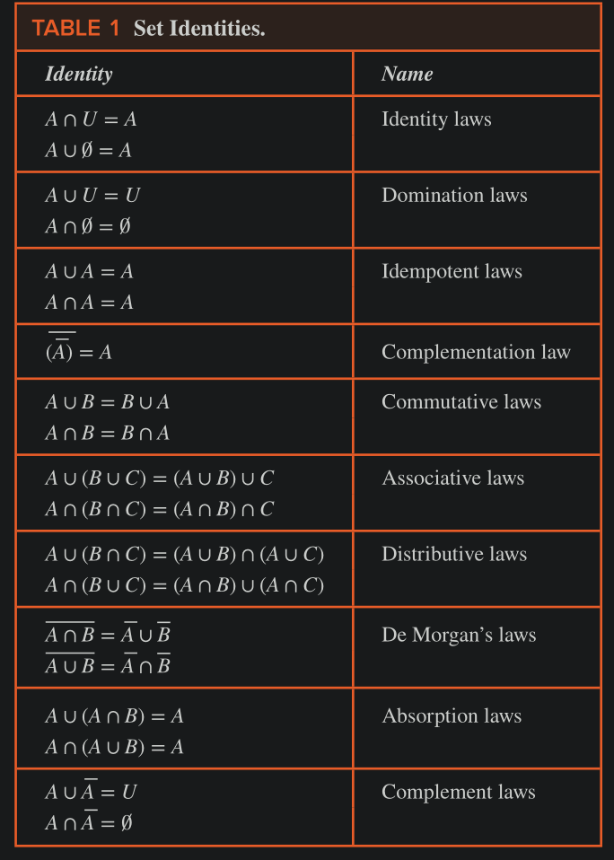

# Sets

### Common sets 

- **Rational Numbers**: $Q = \{ x \in \reals \mid x = \frac{p}{q}, p \in \Z, q \in \Z, q ≠ 0\}$
- **Natural Numbers**: N = $\{0, 1, 2, … \}$ 
- **Real Numbers**: $\reals$ 
- **Positive Real Numbers**: $\reals^+$ 
- **Complex Numbers**: $\Complex$ 
### Subset and Superset

- $A \sube B$  - means: every element in $A$ is a member of $B$
- $A \supe B$ - means $B$ is a superset of $A$
- $A \sube B \equiv \forall x (x \in A \to x \in B)$ 
- For every Set $S$:  $\phi \sube S \land S \sube S$  
- Number of subsets of a set = $2^n$ where $n$ is the `cardinality` of the set
- Proper Subset: all subsets excluding the set itself
    - equivalent to $\forall x (x \in A \to x \in B) \land \exist y (y \in B \land y \notin A)$ 

#### Equality of sets using subset property
- $A \sube B \land B \sube A \implies A = B$ 

### Power set

- set of all subsets of a set $S$
- denoted by $P(S)$ 
- e.g. $P(\{0, 1, 2\}) = \{ \phi, \{0\}, \{1\}, \{2\}, \{0, 1\}, \{0, 2\}, \{1, 2\}, \{0, 1, 2\}\}$ 

### Carteisan Product of set

- $A \times B = \{ (a, b) \mid a \in A \land b \in B \}$ 
- $|A \times B|$ = $m \times n$ where $m$ and $n$ are cardinalities of $A$ and $B$ 
- $A \times B ≠ B \times A$ unless $A=\phi \lor B=\phi$ 
- Cartesian Product of multiple sets: $A_1 \times A_2 \times … A_n = \{ (a_1, a_2, … a_n) \mid a_i \in A_i \space for \space i = 1, 2, … n \}$ 

### Relation

A subset $R$ of the Cartesian Product $A \times B$ is called a relation from set $A$ to set $B$. 

### Quantifiers with sets 

- $\forall x \in S (P(x))$ can also be written as: $\forall x (x \in S \implies P(x))$ 
- $\exist x \in S ( P(x) )$ can also be writtern as: $\exist x (x \in S \land P(x))$ 

### Truth Sets

Given a Predicate $P$ and a domain $D$ , we define truth set of $P$ to be the set of elements $x$ in $D$ for which $P(x)$ is $True$ 
- denoted by $\{ x \in D \mid P(x)\}$ 

- $\forall x P(x)$ is $true$ over the domain $U$ $\iff$ truth set of $P$ is the set U 
- $\exist x P(x)$ is $true$ over the domain $U$ $\iff$ truth set of $P$ is non-empty.

### Set Operations 

- **Union**: $A \cup B = \{ x \mid x \in A \lor x \in B \}$ 
- **Intersection**: $A \cap B = \{ x \mid x \in A \land x \in B \}$ 
    - Disjoint sets: $A \cap B = \phi$ 
- **Difference** $A - B = \{ x \mid x \in A \land x \notin B\}$ 
    - $A - B = A \cap \bar{B}$ 
- **Complement** $\bar{A} = U - A = \{x \in U \mid x \notin A \}$ 
- **Symmetric Difference**: $A \oplus B = (A - B) \cup (B - A) = \{ x \mid x \in A \lor x \in B \land (x \notin A \land x \notin B) \}$  (means either x is an element of A or B but not both)

#### Principle of Inclusion-Exclusion

- Concerns cardinality of two sets and their Union and Intersection
- $|A \cup B | = |A| + |B| - |A \cap B|$ 

### Set Identities 

#### Distributive Laws

- $A \cup (B \cap C) = (A \cup B) \cap (A \cup C)$ 
- $A \cap (B \cup C) = (A \cap B) \cup (A \cap B)$ 

#### DeMorgan's Laws

- $\overline{A\cap B} = \bar{A} \cup \bar{B}$ 
- $\overline{A \cup B} = \bar{A} \cap \bar{B}$ 

#### Complement Laws 

- $A \cup \bar{A} = U$ 
- $A \cap \bar{A} = \phi$ 

#### Other identities 

- $A = (A - B) \cup (A \cap B)$ 

***

- $A_1 \cup A_2 \cup … \cup A_n = \bigcup_{i=1}^n A_i$ 
- $A_1 \cap A_2 \cap … \cap A_n = \bigcap_{i=1}^n A_i$ 

### Multiple Sets

- Multiple set = $\{ m_1.a_1, m_2.a_2, ..., m_n.a_n\}$ 
- Consider $P = \{m_n.a_n\}$ and $Q=\{k_n.a_n\}$ then $\forall a_n$ 
    - $P \cup Q = m_n > k_n ? \space m_n : k_n$  
    - $P\cap Q = m_n < k_n ? \space m_n : k_n$ 
    - $P + Q = m_n + k_n$ 
    - $P - Q = m_n - k_n \text{ if} > 0$ 

### Set Identities Table

***

### Jaccard Similarity

The Jaccard similarity $J(A,B)$ of the finite sets A and B is $J(A,B) = |A ∩ B| ∕ |A ∪ B|$ , with $J(∅,∅) = 1$. The Jaccard distance $d_J (A,B)$ between A and B equals $d_J (A, B) = 1 - J(A, B)$ 

### Fuzzy Sets 

Fuzzy sets are used in artificial intelligence. 

Each element in the universal set U has a degree of membership, which is a real number between 0 and 1 (including 0 and 1), in a
fuzzy set S. 

The fuzzy set S is denoted by listing the elements with their degrees of membership (elements with 0 degree of membership are not listed). 

For instance, we write $\{0.6 Alice, 0.9 Brian, 0.4 Fred, 0.1 Oscar, 0.5 Rita\}$  for the set F (of famous people) to indicate that Alice has a 0.6 degree of membership in F, Brian has a 0.9 degree of membership in F, Fred has a 0.4 degree of membership in F, Oscar has a 0.1 degree
of membership in F, and Rita has a 0.5 degree of membership in F (so that Brian is the most famous and Oscar is the least
famous of these people).
