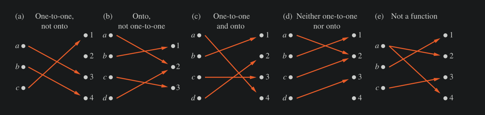
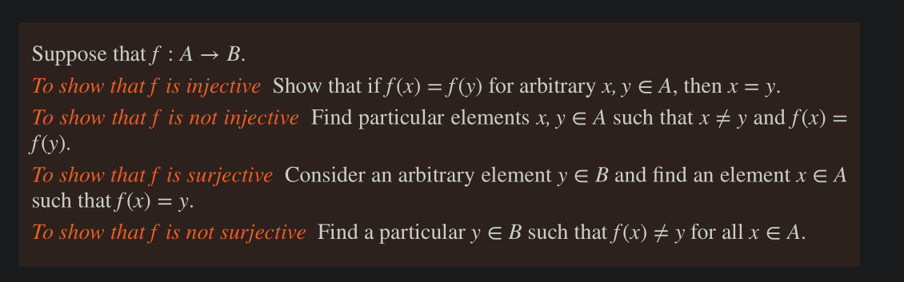
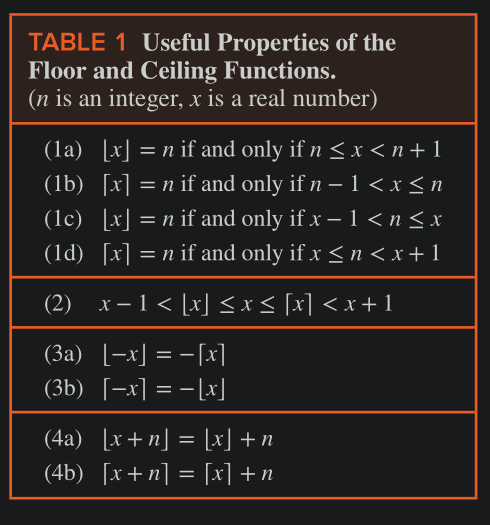

# Functions 

- A function from Set A to Set B is the assignment of exactly one element of B to each element of A
- Also known as mapping / transformation
- in $f: A \to B$ , A is the Domain, B is the Co-Domain (all possible values)
- if $f(a) = b$ , we say that $b$ is the image of $a$, $a$ is pre-image

##### Range vs Co-Domain

- Co-domain is all possible values
- range is the set of actual output values of a function and is a subset of codomain

- Two functions are equal if they have the same domain, and map each element of their common domain to the same element in their common co-domain.

### One-to-One function (Injection)

- A function is said to be a One-to-One Function, if for each element of range, there is a unique domain.
- or, every a in domain A has a unique value in Co-Domain B
- i.e. Domain is "covered" and no two elements in the Domain share a value in the Co-domain.
- $\forall a \forall b (f(a) = f(b) \iff a = b)$ 
- Or: $\forall a \forall b (a ≠ b \implies f(a) ≠ f(b))$ 

#### Strictly Increasing & Decreasing 

- Consider $f: \reals \to \reals$ then 
    - $f$ is increasing $\implies$ $\forall x \forall y (x < y \to f(x) ≤ f(y))$ 
    - $f$ is strictly increasing $\implies$ $\forall x \forall y (x < y \to f(x) < f(y))$ 

    - $f$ is decreasing $\implies$ $\forall x \forall y (x < y \to f(x) ≥ f(y))$ 
    - $f$ is strictly decreasing $\implies$ $\forall x \forall y (x < y \to f(x) > f(y))$   

- A function that is either _Strictly increasing_ or _Strictly decreasing_ is an `injection`

### Onto functions (surjection)

- A function $f$ is surjection, if and only if for every element $b \in B$ there is an element $a \in A$ with $f(a)=b$ . 
- $\forall y \exist x (f(x) = y)$ 
- i.e. Co-Domain is "covered"

### One-to-One Correspondence (Bijection)

- A function is bijective if it is both one-to-one and onto.

#### How to show the above qualities for a function

- to show Not Injection: Find an element in Domain not "covered" by $f$
- to show Not Surjection: Find an element in Co-Domain not "covered" by $f$ 

### Inverse of a function

- Inverse of a function exist only for `bijective` functions 
- if $f$ is one-to-one correspondence, then 
    - $f(a) = b \to f^{-1}(b) = a$ defines the inverse function.

### Composition 

- $(f \bullet g)(x) = f(g(a))$ 
- In other words, $f◦g$ is the function that assigns to the element $a$ of $A$ the element assigned by $f$ to $g(a)$.
- the Domain of the composition if the domain of $g$ .
- The range of the composition is the image of the range of $g$ with respect to the function $f$.
- Note that the composition $f◦g$ cannot be defined unless the range of $g$ is a subset of the domain of $f$. (of course, so that the result of $g(x)$ can be "inputted" into $f$ )

### Important Function 

#### Floor and Ceiling 

- Floor: $\lfloor x \rfloor$ the largest integer ≤ x
- Ceilin: $\lceil x \rceil$ the smallest integer ≥ x

- $⌊ 1 / 2 ⌋ = 0, ⌈1 / 2 ⌉ = 1, ⌊− 1 / 2 ⌋ = −1, ⌈−1 / 2 ⌉ = 0, ⌊3.1⌋ = 3, ⌈3.1⌉ = 4, ⌊7⌋ = 7, ⌈7⌉ = 7$ 

##### Examples 

- How many bytes are required to encode 100 bits of data 
    
    - Given by $\lceil 100 / 8 \rceil = \lceil 12.5 \rceil = 13$ 

- In asynchronous transfer mode (ATM) (a communications protocol used on backbone networks), data are organized into cells of 53 bytes. How many ATM cells can be transmitted in 1 minute over a connection that transmits data at the rate of 500 kilobits per second?
    
    - In one minute, the connection can transmit $500,000 \text{ bits per second} \times 60 \text{ seconds per minute} = 30,000,000$ bits per minute
    - Each ATM cell is $53$ bytes long, which means it is $53 \times 8 = 424$ bits long
    - To determine the number of cells tranmitted in one minute, we determine the largest integer not exceeding the quotient when $30,000,000$ is divided by $24$. 
    - Hence, $\lfloor 30,000,000 / 424 \rfloor = 70,754$ ATM cells can be transmitted.