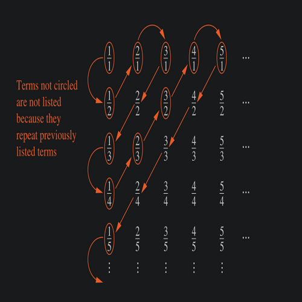

# Cardinality and Countable Sets 

### Cardinality

- Two sets $A$ and $B$ have the same cardinality (i.e. $|A| = |B|$ ) $\iff$ there is a one-to-one correspondence from $A$ to $B$ (a one-to-one and onto function exists)

- If there is a one-to-one function from $A$ to $B$ , the cardinality of $A$ is less than or the same as the cardinality of $B$ ($|A| ≤ |B|$)

### Countable Sets 

- A set is either finite or has the same cardinality as the set of positive integers ($\Z^+$) is called _countable_
- A set that is not countable is called _uncountable_
- When an **infinite** set S is uncountable, we denote the cardinality of $S$ by $\aleph_0$ (the letter aleph, first alphabet of Hebrew)
    - we write $|S| = \aleph_0$  and say the S has cardinality "aleph null"
- A subset of a Countable set is also Countable.

***

##### Example 1

- _Show that the set of odd positive integers is a countable set._

- set of positive integers $f(n) = 2n - 1$ from $\Z^+$ to the set of odd positive integers.
- To show that $f$ is countable, we show that there is one-to-one correspondence between $f$ and $\Z^+$ 
- To show that there is a one-to-one correspondence, we show that $f$ is both one-to-one and onto.
- for one-to-one
    - suppose that $f(n) = f(m)$ , then $2n - 1 = 2m - 1$ , so $m = n$ 
- For onto 
    - suppose $t$ is an odd positive integer 
    - then $t$ is one less thatn some even integer $2k$, where $k \in \N$ 
    - hence $t = 2k - 1 = f(k)$ 

An infinite set is countable if and only if it is possible to list the elements of the set in a sequence, indexed by $\Z^+$.

##### Example 2 

- _Show that set of positive rational number is countable._

- First note that every +ve rational number is the quotient $p/q$ of two +ve integers.
- We arrange the +ve rational numbers by listing those with denominator $q=1$ in the first row
- then those with denominator $q = 2$ on the second row 
- and so on

- To list the rational numbers in a sequence
    - first list the positive rational number $p/q$ with $p+q=2$ 
    - followed by those with $p+q=3$ 
    - and so on
- Whenever we encounter a number $p/q$ that is already listed, we do not list it again.
- The the sequence becomes: $1, 1/2, 2, 2/3, 1/3, 1/4, 2/3, 3/2, 4, 5 ...$ 

- Because all +ve rational numbers are listed once, we have shows that set of +ve rational numbers is countable.

The above technique is called **Cantor diagonalization argument**

### Uncountable Sets 

- Superset of an uncountable set is also uncountable ( if A and B are sets, A is uncountable, and A ⊆ B, then B is uncountable.)

- _Show that the set of Real numbers $\reals$ is uncountable_

- To show that $\reals$ is uncountable, we suppose that $\reals$ is countable and arrive at a contradiction
- if $\reals$ is countable, then the subset of all Real numbers between $0$ and $1$ is also countable.
- Hence, the numbers between 0 and 1 can be listed in some order (since they are countable).
- Let's assume that, the real numbers between 0 and 1 can be listed in some order, say $r_1, r_2, r_3...$ 
- Let the decimal representation of these numbers be 
    - $r_1= 0.d_{11}d_{12}d_{13}d_{14} …$ 
    - $r_2 = 0.d_{21}d_{22}d_{23}...$
    - $r3 = 0.d_{31}d_{32}d_{33}...$ 
    - and so on
    - where $d_{ij}$ is the decimal place digits of $r_i$ at decimal place $j$ (and $d_{ij}$ can only be $\in \{ 0, 1, 2, 3, 4, 5, 6, 7, 8, 9\}$ )
    - thus, for example if $r_1 = 0.23794102...$ then $d_{11} = 2$, $d_{12} = 3$ , $d_{13} = 7$ and so on.
- After representing all numbers in this way, we for a new real number $r$ with decimal expansion given by $r = 0.d_1d_2d_3d_4...$ where the decimal digits are determined by the following rule 
                  $$ 
          d_i = \begin{cases}
              4 &\text{if } d_{ii} ≠ 4 \\ 
              5 &\text{if } d_{ii} = 4
              \end{cases}
              $$
            
    - As an example, suppose that $r_1=0.23794102...$ , $r_2=0.44590138$ , $r_3=0.09118764...$ , $r_4=0.80553900...$ 
    - then we have $r=0.d_1d_2d_3… = 0.4544...$ 
        - where 
        - $d_1 = 4 \text{ because } d_{11} = 2 ≠ 4$ 
        - $d2=5 \text{  becuase } d_{22}=4$ 
        - $d_3=4 \text{ because } d_{33} ≠ 4$ 
        - and so on
   
- Every Real number has a unique decimal expansion
-  but $r$is not equal to any or $r_1$ , $r_2$ … 
-  because decimal expansion of $r$ differs from the decimal expansion of $r_i$ in the $ith$ place to the right of the decimal point, for each $i$.

- Because there is a real numbre $r$ that is not in the list, the assumption that all real numbers between $0$ and $1$ could be listed is false.
- Since all real numbers between 0 and 1 cannot be listed, so the set of real numbers between 0 and 1 is uncountable.
- Any set with an uncountable subset is uncountable 
- $\therefore$ $\reals$ is uncountable.

***

* **_If And and B are countable set, then $A \cup B$ is also countable_**

#### Schroder-Bernstein Theorm

* If A and B are sets with $|A| ≤ |B|$ and $|B| ≤ |A|$ then $|A| = |B|$ . 
* In other words, if there are one-to-one functions $f: A \to B$ and $g: B \to A$ , then there is a one-to-one correspondence between A and B. (i.e., a bijection exists between A and B, and hence $|A| = |B|$ )

- use SB Theroem to show that $|(0,1)| = |(0, 1]|$ (call them A and B)

    - Cardinality of two sets is equal iff we can find a 1-1 correspondence between them.
    - we can use SB Theorem instead, our aim is to show that a 1-1 function $f: A\to B$ and a 1-1 function $g: B \to A$ exist.
    - because $(0,1) \subset (0,1]$ , $f(x) = x$ is a one-to-one function from A to B.
    - the function $g(x) = x / 2$ is a one to one function from B $(0, 1]$ to $(0, 1/2]$ which is a subset of A $(0, 1)$
    - since there exist one-to-one functions from A to B and B to A, SB Theorem tells us that |A| = |B|

#### Uncomputable Functions

- A function is computable if there is a computer program in some programming language that finds the values of this function. 
- If a function is not computable we say it is uncomputable

- To show that there are uncomputable functions, we need to establish two results
    1. We need to show that the set of all computer programs in any particular programming language is countable
        - This can be proved by nothing that a computer program in a particular language can be thought of as a string of characters from a finite alphabet.
    2. We show that there are uncountable many different functions from a particular countably infinite set to iteself
        - The set of functions from the set of $\Z^+$ to itself is uncountable. (This is a consequence of the uncountability of the real numbers between 0 and 1)
    - Putting these two results together shows that there are uncomputable functions.

***

### Cardinal Numbers

In mathematics, **cardinal numbers**, or **cardinals** for short, are a generalization of the natural numbers used to measure the cardinality (size) of sets).

The cardinality of a finite set is a natural number: the number of elements in the set. 

The _**transfinite**_ cardinal numbers, often denoted using the Hebrew symbol ℵ (aleph) followed by a subscript, describe the sizes of infinite sets.

Thus, $\aleph_0$ is the smallest infinite/transfinite cardinal number.

There is a transfinite sequence of cardinal numbers: 

$0, 1, 2, 3 ..., n; \aleph_0, \aleph_1, \aleph_2… \aleph_\alpha ...$ 

This sequence starts with the natural numbers including zero (finite cardinals), which are followed by the aleph numbers (infinite cardinals of ). The aleph numbers are indexed by ordinal numbers.

### The Continuum Hypothesis

- All sets having a bijection (one-to-one correspondence) with $\N$ share the same cardinality. This cardinal number is call "aleph-null" denoted by $\aleph_0$ 
- Cantor showed that the set $\reals$ has a cardinality greater than $\aleph_0$ 
- the cardinality of $\reals$ is denoted by $\mathfrak{c}$ (the letter fraktur)
- Cantor proved that any unbounded subset of $\N$ has the same cardinality as $\N$ (an unintuitive result when compared with finite sets)
- Cantor also proved that the set of all ordered pairs of $\N$ is also denumerable (another term for infinitely countable).
- The above implies that the set of Rational numbers is countable.
- Cantor also proved that for every cardinal number, there is a bigger cardinal number.

- It can be shows that the Power set of $\Z^+$ and the set $\reals$ have the same cardinality.
    - In other words $|P(\Z^+)| = |\reals| = \mathfrak{c}$ 
- An important theorem of Cantor is that the cardinality of a set is always less that the cardinality of its power set.
    - hence, $|\Z^+| < |P(\Z^+)|$ 
    - which can also be writtern as $\aleph_0 < 2^{\aleph_0}$ 
    - From the first theorm, it follows that $2^{\aleph_0} = \mathfrak{c}$ 
- This leads us to the continuum hypothesis, which states that there is no cardinal number between $\aleph_0$ and $\mathfrak{c}$ 
    - In other words, the CH states that there is no set A such that $\aleph_0$ < |A| < $\mathfrak{c}$ 

It can be shown that the smallest infinite cardinal numbers form an infinite sequence $ℵ_0$ < $ℵ_1$ < $ℵ_2$ < …. 
If we assume that the continuum hypothesis is true, it would follow that 𝔠 = $ℵ_1$ , so that $2^{ℵ_0}$ = $ℵ_1$ .

The Continuum Hypothesis is still an open question.