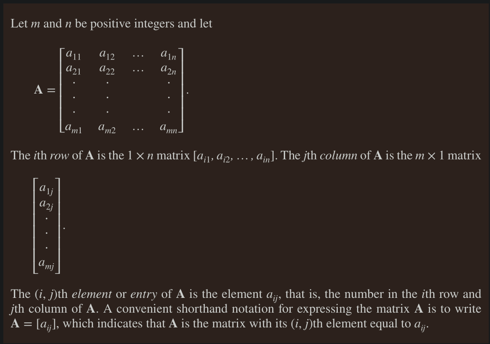

# Matrices 

- A matrix is a rectangular array of numbers 
- A matrix with $m$ rows and $n$ columns is called an $m \times n$ matrix.
- Two matrices are equal if they have the same rows and same columns and equal corresponding entries.

## Matrix Arithmetic

#### Sum of Matrices 

#### Product of Matrices 

- The product of matrix is only defined for matrices with order matching the pattern: $m \times n = n \times p$ 
- The answer will be the matric of order: $m \times p$ 

- Matrix Multiplication is Associative i.e $A \times (B \times C) = (A \times B) \times C$ 
- Matrix Multiplication is **NOT** Commutative, in general: $A \times B ≠ B \times A$  

## Identity Matrix 

- If A is an $m \times n$ matrix, then 
    - $A \times I_n = I_m \times A = A$ 

## Powers of Matrix

- Powers of matrix can be defined because matrix multiplcation is associative
- When A is $n \times n$ matrix, we have 
    - $A^0 = I_n$ 
    - $A^r = AAA … A$ (r times)

## Transpose of a matrix 

Let $A = [a_{ij}]$ be an $m \times n$ matrix. The _Transpose_ of a matrix, denoted by $A^t$ , is the $n \times m$ matrix obtained by interchanging the rows and columns of A.

- if A and B are two $n \times n$ matrices, then 
    - $(A + B)^t = A^t + B^t$ 
    - $(AB)^t = B^tA^t$

## Symmetric matrix 

A square matrix A is called symmetric if $A = A^t$ . Thus, $A = [a_{ij}]$ is symmetric if $a_{ij} = a_{ji}$ for all $i$ and $j$ with $1 ≤ i ≤ n$ and $1 ≤ j ≤ n$.

e.g. $\begin{bmatrix} 1 & 1 & 1 \\ 1 & 0 & 1 \\ 0 & 1 & 0 \end{bmatrix}$ is a symmetric matrix

## Zero-one matrices 

- A matrix all of whose entries are either 0 or 1 is called a zero–one matrix
- Zero–one matrices are often used to represent discrete structures 
- Algorithms using these structures are based on Boolean arithmetic with zero–one matrices. 
- This arithmetic is based on the Boolean operations $∧$ and $∨$, which operate on pairs of bits, defined by
    - 

### Joins and Meets of Zero-one matrices

- $A\lor B$ is the **Join**
- $A \land B$ is the **Meet**
- In short, combine two matrices using addition rules, except join using $\lor$ and $\land$ 

- $A \lor A = A$ 
- $A \land A = A$ 

### Boolean product of Zero-one matrices 

- In short, use multiplication rule, but substitute $\times$ with $\land$ and $+$ with $\lor$ 

### Boolean powers of zero-one matrices 

*** 

## Inverse of a matrix 

For a matrix $A = \begin{bmatrix} a & b \\ c & d\end{bmatrix}$ 
    - The **Determinant** is: $ad-bc$ 
    - if Determinant is not zero 
        - Only then we can calculate $A^{-1}$ , given by 
        - $A^{-1} = \text{Disjoint of Matrix} / \text{Determinant}$ 
        - where Disjoint of Matrix = $\begin{bmatrix} d & -b \\ -c & a \end{bmatrix}$ 