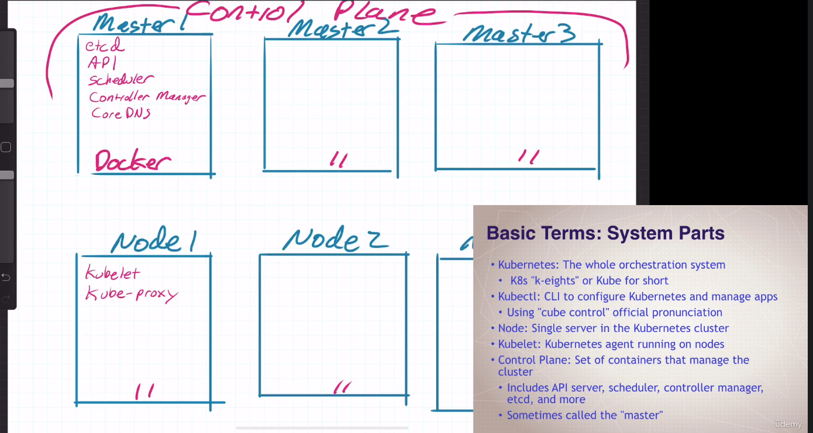
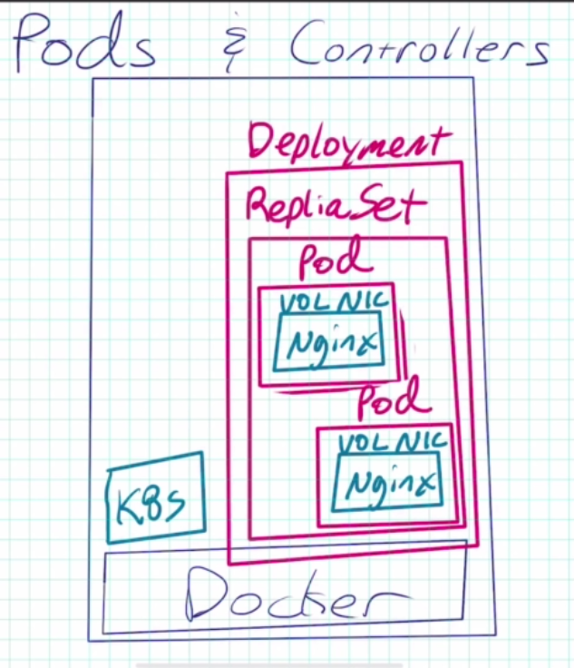

# Kubernetes

Kubernetes is the whole orchestration system, while `kubectl` is the CLI to configure Kubernetes and manager apps

## Definitions

Node: 
    - Single server in the K8s cluster
Kubelet: 
    - Kubernetes agent running on nodes
Control Plane: 
    - Set of containers that manager the cluster
    - Includes API server, scheduler, controller manager, etcd and more
    - Sometimes called the master

### K8s container abstractions

Pod: 
    - One or more containers running together on one Node
    - Basic unit of deployment. Containers are always in pods
Controller: 
    - For creating/updating/controlling pods and other "objects"
    - Many type of controllers including Deployment, ReplicaSet, StatefulSet, DaemonSet, Job, CronJob etc
Service
    - network endpoint to connect to a pod or set of pods at a specific DNS name and port
Namespace: 
    - Filtered group of objects in cluster
    - Not a security feature, not comparable to namespaces in Docker

## Commands

`kubectl run`
    - create single pods

`kubectl create`
    - this command is now used to create deployment
    - `kubectl create deployment my-apache --image httpd`

`kubectl delete deployment my-apache`

`kubectl get all`
 
 `kubectl scale deploy/my-acpache --replicas 2`
 
 `kubectl logs deployment/my-apache`
 
 
 `kubectl describe pod/my-apache-6f45bc5bd9-fj2bl`
 
 ---
 
 
