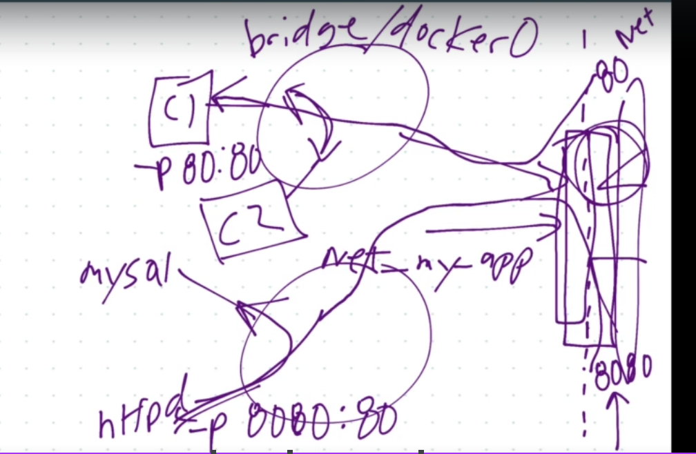

# Networks in Docker

Concepts for Private annd Public communication in containers

- Each container starts connected to a private virtual network call "bridge" or "docker0"
    - bridge is the default Docker virtual network, which is NAT'ed behind the Host IP
    - bridge allows containers to communicate with each other when running on the same docker host
- Each virtual network routes through NAT firewall on host IP
    - Network Address Translation firewall operates on a router to protect private networks
    - It works by allowing internet traffic to pass through if a device on the private network requested it
    - a NAT firewall protects the identity of a network and does not show internal IP addresses to the internet
- All containers on the same virtual networks can talk to each other without `-p` switch which exposes ports.
    - So, for example, network my_web_app for mysql and apache containers, these two services can talk to each other since they are in the same virtual network 
    - similarly, another network my_api for mongo and nodejs containers
    - But these two networks cannot talk to each other without settings things up
- This set up is usually done by docker automatically, but it is configurable, we can for example
    - Make new virtual networks
    - Attach containers to more than one virtual network (or nonw)
    - Skip Virtual networks and use host IP (--net=host)
    - Use different Docker network drivers to gain new abilities

- On the right is our host network
- On the left are two containers
    - one connected to bridge Vn/w
    - another connectd to net_my_app

## Docker networks  - default security

- Create your apps so frontend/backend sit on the same Docker network
- Their inter-communication never leaves host
- All externally exposed ports closed by default
- You must manually expose via -p, which is better default security

## DNS: How container find each other
- Containers should not rely on IPs for inter-communication
- DNS for friendly names is built-in if you use custom networks
- All this network set up gets easier with Docker compose
