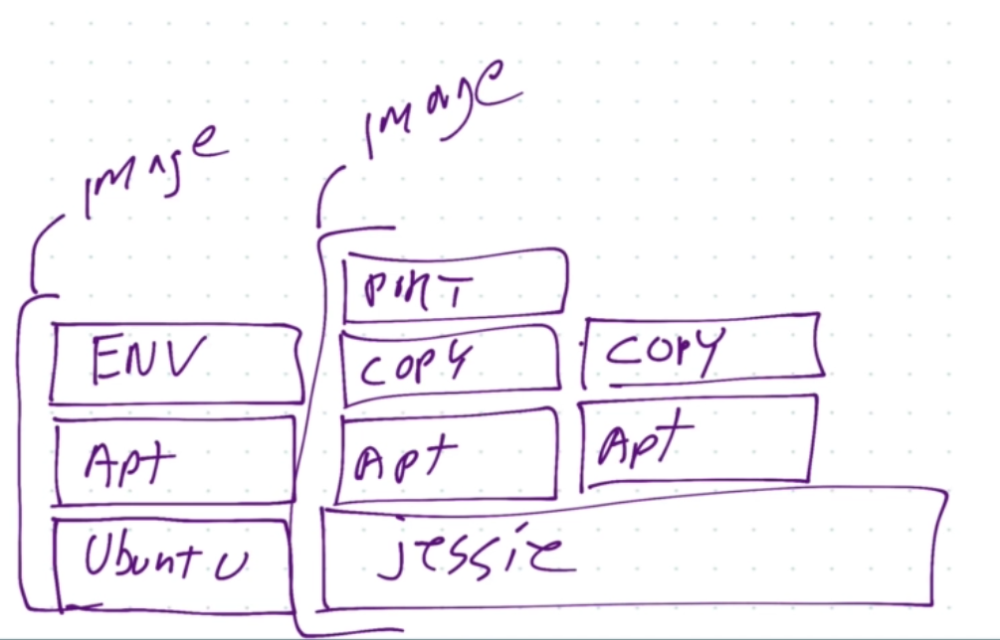
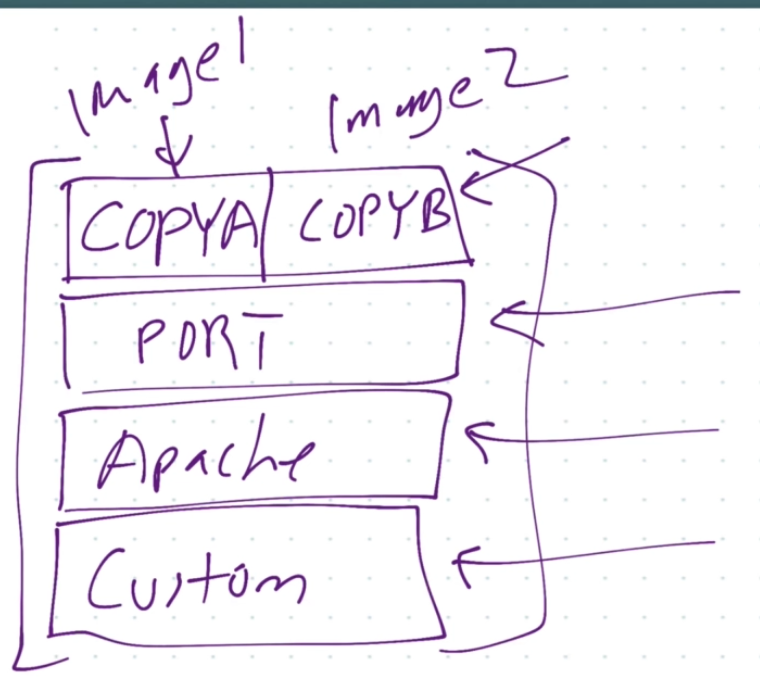

# Docker Images

A Docker image is 
- app binaries and dependencies
- + metadata about the image data and how to run the image
- its NOT a complete OS, No kernel, no kernel modules (e.g. drivers)

## Image layers

`docker image history` shows the history of the image layers
`docker image inspect <image_name>` shows the metadata of the image

Every Image starts with a blank Layer, and then every set of changes that happens to the file system on that image is a Layer. 

We may have one or dozens of layers, some may be 0 byte in size.

Each Layer is given a unique SHA1 id and only stored once on a host

The advantage of using Layers is that these layers are then re-used between images.
- this saves storage space on host and transfer time on push/pull

A container is also a Layer taken from the last Image layer. 
- its just another read/write layer on top of the image
- if a container makes changes to the file system in addition to the last image layer, those changes go in the container along with the container data
- This is known as **Copy on write**

