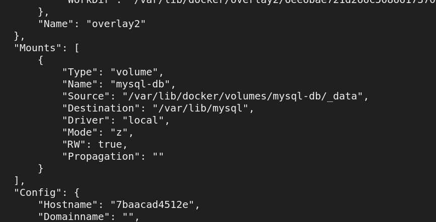
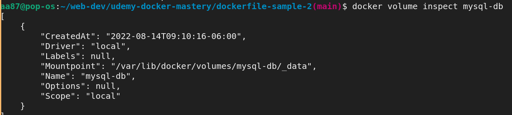

# Container Lifetime and persistent data

Containers are usually immutable and ephemeral.

A good design practice is to have "Immutable infrastructure": only re-deploy, never change.
- what this means is instead of making changes to our containers, we re-deploy them afresh with all our changes
- this improves reliability, and consistency, and making changes reproducable

But then what happens to data that should not change between container deployments.

Docker gives us features to ensure this "separation of concerns" - ability to re-deploy containers afresh, while carrying over unique data across deployments.

Docker has two ways to assist us in this problem of "persistent data"
1. Volumes
2. Bind Mounts

Volumes: create and mark special location outside of container's UFS (Unix File system), which we can then re-attach to any other containers as needed.

Bind Mounts: link container path to host path
- simply: sharing of host directory or file into a container, so that any change that happens to that file/directory in the host is reflected in the container.

## Volumes

Volumes: create and mark special location outside of container's UFS (Unix File system), which we can then re-attach to any other containers as needed.
- i.e. we want these directories to persist across containers

created with `VOLUME` command in Dockerfile
- `VOLUME /usr/lib/mysql`
- this means that any file that we put in the above directory, will outlive the container, until we delete that folder

Volumes need manual deletion, they are not deleted when a container is deleted.

In the above figure, the container has a volume mounted at `/var/lib/mysql`, but actually the data is written to the directory pointed by the "Source" field.

We can do `docker volume inspect <volume_name>` to see this info as well: 

In Linux, the Mountpoint actually points to the directory on the host, while on Mac/Windows it points to a location inside the Linux VM that those OSs use to run Docker.

We can use `-v` switch to create a "named volume"
- `docker container run -d --name mysql -v mysql-db:/var/lib/mysql mysql`

## Bind Mounting

Bind Mounts maps a host file or directory to a container file or directory

Basically just two locations pointing to the same files/directory

Can't use in Dockerfile, must be at runtime with `container run...`

`... run -v /Users/aa87/stuff:/path/container`
`... run $(pwd):/usr/share/nginx/html`
- bind mounts can be created with the `-v` switch
- But the left hand side before the colon must start with `/`

## Quiz: 

Which type of persistent data allows you to attach an existing directory on your host to a directory outside of a container?
- Bind mount

When making a new volume for any official container (e.g. mysql), where could you look to see where the data path should be located in the container?
- Docker Hub
- Look through README.md or Dockerfile of the official image, we could find the database path documented or `VOLUME` stanza

## Assignments

1. Database upgrade with containers

- Create a `postgres` container with names volume psql-data using version `9.6.1`
- use DockerHub to learn VOLUME path and versions needed to run it
- Check logs, stop container
- Create a new `postgres` cotnainrer with same named volume using `9.6.2`
- check logs to validate
- (This works only for minor version db upgrades, as major version upgrades should be handed manually as prescribed by the DB)

Answer: 
- `docker container run -d --name pg1 -v psql-data:/var/lib/postgres/data postgres:9.6.1`
- `docker container logs`
- `docker container stop`
- `docker container run -d --name pg2 -v psql-data:/var/lib/postgres/data postgres:9.6.2`