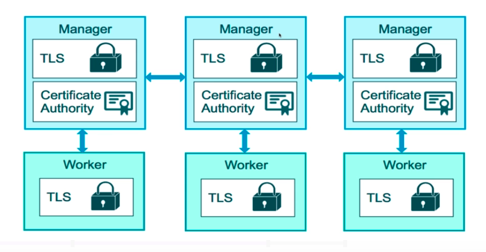
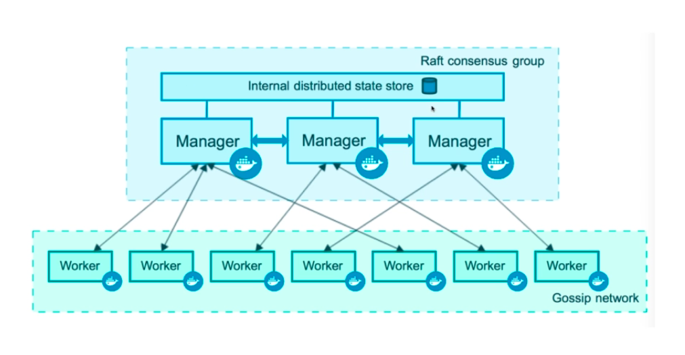
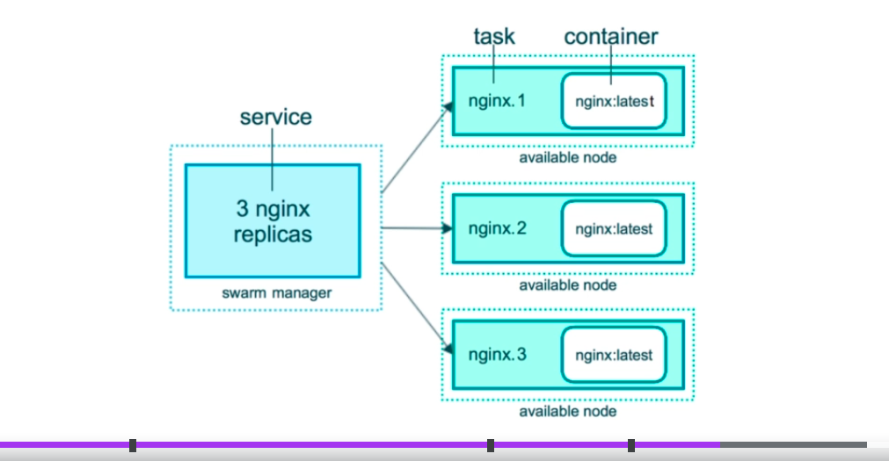
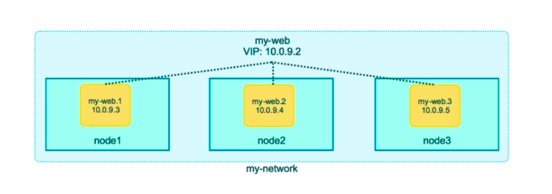
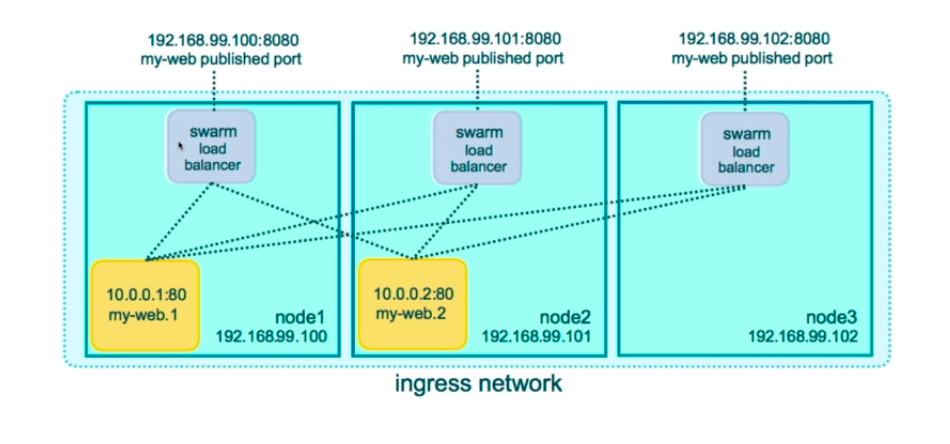
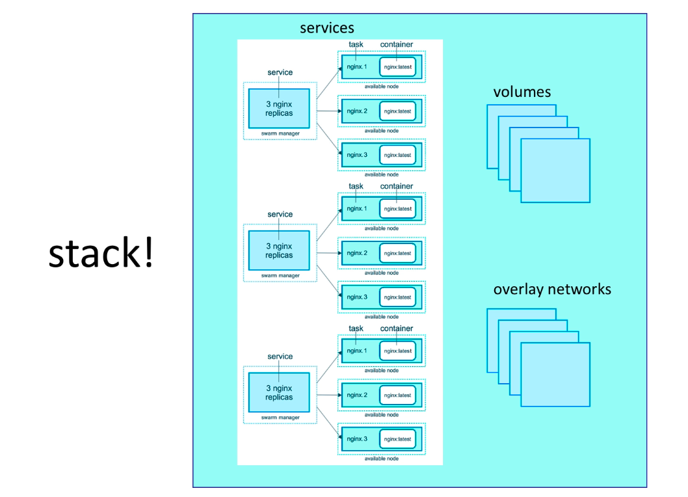

# Swarm mode - Built in orchestration

Swarm mode is a clustering solution build inside Docker

- Not enabled by default

`docker run` command does not know how to scale the containers, and it can only start one container.

Introduces these new commands once enabled
- `docker swarm`
- `docker node`
- `docker service`
- `docker stack`
- `docker secret`




Manager nodes have a db locally, called a raft db. It stores their config, and gives them all the info to be the managers.





## Initializing Swarm mode

`docker swarm init`

`docker node ls`

`docker service` command replaces the `docker run` command for a swarm
- `docker service create alpine ping 8.8.8.8`
- `docker service ls`
- `docker service ps <service_name>`
- `docker service update <service_name> --replicas 3` - update the service to initialize 3 replicas
- `docker service rm <service_name>`

## Creating a 3-node swarm cluster

- `docker swarm init --advertise-addr <ip_address>`
- `docker swarm join <token>` - this command is the output of the command above, we run it in the two nodes we want to be the workers
- workers cannot run swarm commands like `docker node ls`
- `docker node update --role manager node2`
- `docker node ls`
- `docker swarm join-token manager` - to get the join token which will enable a node to join as a manager
- `docker service create --replicas 3 alpine ping 8.8.8.8`
- `docker node ps <node_name>`
- `docker service ps <service_name>`

Once we have a 3-node swarm, we can run most of our commands from the manager node (instead of going to each node to run the commands)

---

## Scaling out with "Overlay" networking

Once we have our services started, we want them to communicate to each other. 

One such way is to use a builtin network driver called `overlay`
- it creates a swarm wide bridge network, and then the nodes communicate with each other

Overlay network is for container-to-container traffic inside a single swarm.

Each service in a swarm can be connected to multiple networks.
    - e.g. front-end, backend

Running a postgres + Drupal combo on a 3 node service:
To create we use `--driver overlay` option when creating a network
- `docker network create --driver overlay <network_name>`

- `docker service create --name psql --network mydrupal postgres` 
- `docker service create --name drupal --network mydrupal -p 80:80 drupal`
- `docker service ps drupal`
- each of these services will be started on a random node
- they communicate over the overlay network
- once drupal is set up, we can use the IP of any of the node (find the IP with `ip addr`) to access our drupal site. This is enabled by the feature "Swarm Routing Mesh"
- While setting up the drupal, we can use `psql` name as a DNS for the postgres database instead of the IP.

### Swarm Routing Mesh

Routing Mesh is in incoming/ingress network that routes packers for a Service to proper Task for that Service

Spans all nodes in the swarm.

Uses IPVS from Linux Kernel

Load balances Swarm Services across their Tasks

Two ways Routing Mesh works: 
- Container-to-Container in a Overlay network (uses VIP: Virtual IP)
    - Virtual IP is a private IP that swarm puts in front of all the nodes
- External traffic incoming to published ports is routed to a proper container (so we do not need to care which IP and the node the container is running on)





To see the Routing mesh in action, below we create an ElasticSearch Service with 3 replicas
- `docker service create --name search --replicas 3 -p 9200:9200 elasticsearch:2`
- `docker service ps search` - we can see that 3 tasks were created on the 3 different nodes
- `curl localhost:9200` - if we do this command multiple times, we will see the `name` property change, showing the names of the service on each node

Routing Mesh
- is stateless load balancing 
    - this means, No Session cookies, and No client can consistently talk to a single container
- acts as the OSI Layer 3 LB (TCP), not Layer 4 (DNS)

To solve both these problems, use nginx, HAProxy

### Assignment

We create a voting app, represented by the diagram below: 


Assuming we already have a 3-node swarm running:
- `docker network create -d overlay frontend`
- `docker network create -d overlay backend`

- `docker service create --name vote --network frontend -p 80:80 --replicas 2 bretfisher/examplevotingapp_vote`

- `docker service create --name redis --network frontend redis:3.2`

- `docker service create --name worker --network frontend --network backend bretfisher/examplevotingapp_worker`

- `docker service create --name db --network backend -e POSTGRES_HOST_AUTH_METHOD=trust --mount type=volume,source=db-data,target=/var/lib/postgresql/data postgres:9.4`

- `docker service create --name result --network backend -p 5001:80 bretfisher/examplevotingapp_result`


## Swarm Stacks

Stacks are production Grade Compose, a new layer of abstraction to swarm.

Stack accepts compose files as their declarative defintion for services, networks, and volumes

We use `docker stack deploy` rather than `docker service create`

Stacks managers all those objects (services, networks, secrets, volumes) for us, including overlay networks per stack.

A new key `deploy:` is available in docker-compose files meant to be used with Stacks, and the key `build:` is not available since Stacks are not supposed to build images.
- Compose ignores `deploy`, Swarm ignores `build`



Once we have the compose file, we can use
- `docker stack deploy -c example-voting-app-stack.yml voteapp` to start a voteapp stack
- `docker stack ls`

## Secrets Storage in Swarm

A secret is
- username and passwords
- TLS certficiates and keys
- SSH keys
- any data you would prefer not to be "on the front page of news"

Secrets solution is built-in the swarm
- supports generic strings or binary content up to 500kb in size
- Doesn't require apps to be re-written

Secrets are files stored on disk on Manager nodes only, and then assigned to a Service(s)
- they look like files in container but are actually in-memory fs
- we can access them with `/run/secrets/<secret_name>` or `/run/secrets/<secret_alis>`
- Local docker-compose can use file-based secrets, but this is only for local-dev and not secure for prod

To create a docker secret
- `docker secret create psql_user psql_user.txt`
- Another way with the commandline
    - `echo "mysecretpassword" | docker secret create psql_pass -`
- use `docker secret ls` to list secrets, use `docker secret inspect <secret_name>` to see metadat on the secret

Both above methods have drawbacks
- as we should not store passwords in a file
- and second one goes into the bash shell history which an attacker can find

Example on how to use the secret when creating a service
- `docker service create 
           --name psql 
           --secret psql_user 
           --secret psql_password 
           -e POSTGRES_PASSWORD_FILE=/run/secrets/psql_pass 
           -e POSTGRES_USER_FILE=/run/secrets/psql_user postgres`
           
The secret assigned to a service is not deleted when the service is deleted, and must be manually deleted
- to remove a secret association to a service, use `docker service update --secret-rm <secret_name>`
- If the secret is removed while the service is alive, the container for the service will be restarted.

### Secrets with stack and docker-compose file

In a directory where was have a `docker-compose.yml` file + `psql_password.txt` `psql_user.txt` file
- `docker stack deploy -c docker-compose.yml mydb`
- if we run `docker stack rm mydb` it will remove everything including secrets, unlike previous section


#### Sample `docker-compose.yml` files

##### Swarm Stack

```yaml
version: "3.9"
services:

  redis:
    image: redis:alpine
    networks:
      - frontend
    deploy:
      replicas: 1
      update_config:
        parallelism: 2
        delay: 10s
      restart_policy:
        condition: on-failure
  db:
    image: postgres:9.4
    volumes:
      - db-data:/var/lib/postgresql/data
    networks:
      - backend
    environment:
      - POSTGRES_HOST_AUTH_METHOD=trust
    deploy:
      placement:
        constraints: [node.role == manager]
  vote:
    image: bretfisher/examplevotingapp_vote
    ports:
      - 5000:80
    networks:
      - frontend
    depends_on:
      - redis
    deploy:
      replicas: 2
      update_config:
        parallelism: 2
      restart_policy:
        condition: on-failure
  result:
    image: bretfisher/examplevotingapp_result
    ports:
      - 5001:80
    networks:
      - backend
    depends_on:
      - db
    deploy:
      replicas: 1
      update_config:
        parallelism: 2
        delay: 10s
      restart_policy:
        condition: on-failure

  worker:
    image: bretfisher/examplevotingapp_worker
    networks:
      - frontend
      - backend
    depends_on:
      - db
      - redis
    deploy:
      mode: replicated
      replicas: 1
      labels: [APP=VOTING]
      restart_policy:
        condition: on-failure
        delay: 10s
        max_attempts: 3
        window: 120s
      placement:
        constraints: [node.role == manager]

  visualizer:
    image: bretfisher/visualizer
    ports:
      - 8080:8080
    stop_grace_period: 1m30s
    networks:
      - frontend
    volumes:
      - /var/run/docker.sock:/var/run/docker.sock
    deploy:
      placement:
        constraints: [node.role == manager]

networks:
  frontend:
  backend:

volumes:
  db-data:

```

##### Swarm Stack with Secrets

For this file: 
- `echo "password" | docker secret create psql-pw -`
- `docker stack deploy -c docker-compose.yml drupal`

```yaml
version: "3.9"

services:
  drupal:
    image: drupal:9
    ports:
      - "8080:80"
    volumes:
      - drupal-modules:/var/www/html/modules
      - drupal-profiles:/var/www/html/profiles
      - drupal-sites:/var/www/html/sites
      - drupal-themes:/var/www/html/themes

  postgres:
    image: postgres:14.3
    secrets:
      - psql-pw
    environment:
      - POSTGRES_PASSWORD_FILE=/run/secrets/psql-pw
    volumes:
      - drupal-data:/var/lib/postgresql/data

volumes:
  drupal-data:
  drupal-modules:
  drupal-profiles:
  drupal-sites:
  drupal-themes:

secrets:
  psql-pw:
    external: true
```

##### Swarm stack with secrets in files

```yaml
version: "3.9"

services:
  psql:
    image: postgres
    secrets:
      - psql_user
      - psql_password
    environment:
      POSTGRES_PASSWORD_FILE: /run/secrets/psql_password
      POSTGRES_USER_FILE: /run/secrets/psql_user

secrets:
  psql_user:
    file: ./psql_user.txt
  psql_password:
    file: ./psql_password.txt
```

# Quiz

In order to spin up multiple services in a Swarm, we can just use 'docker-compose up' and Docker will be able to tell this is a Swarm and will deploy services across all nodes.
    - False
    - `docker-compose` cannot talk to swarm, we have a special command to use YAML files in swarm services
    - `docker stack deploy -c yaml_file <service_name>`


In order to update a service that was initially deployed in a stack command, we would need to do a "docker stack rm", make our changes, then re-deploy.
    - False
    - We can just deploy it again using `docker stack deploy...`


