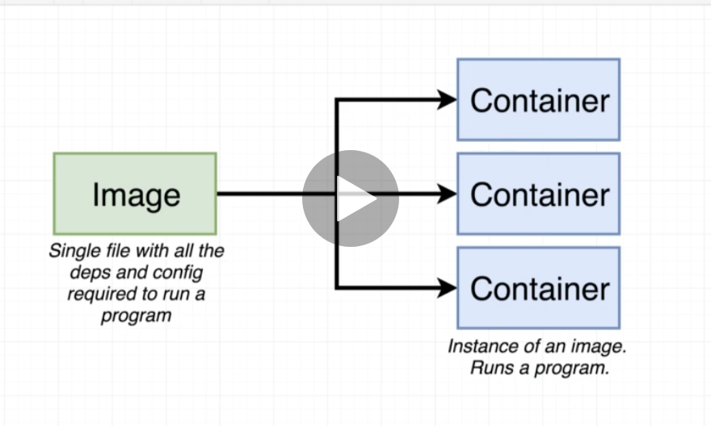
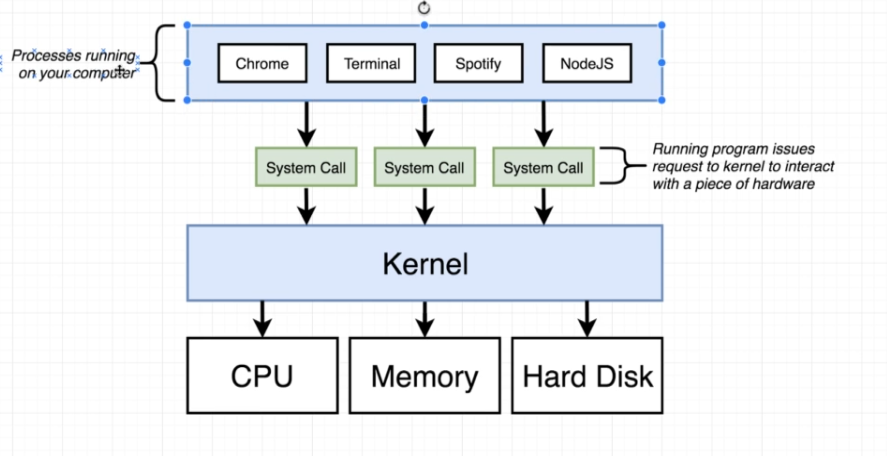
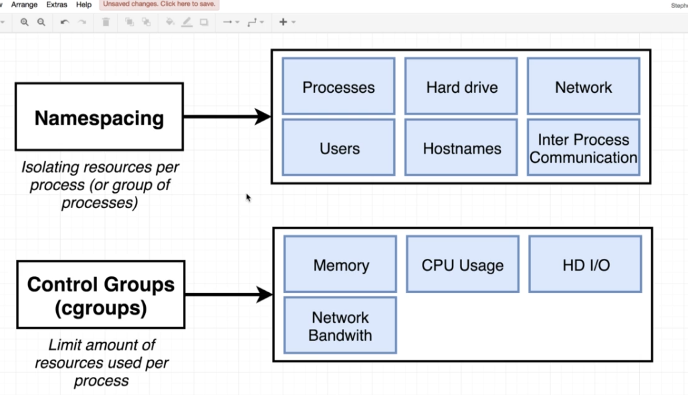
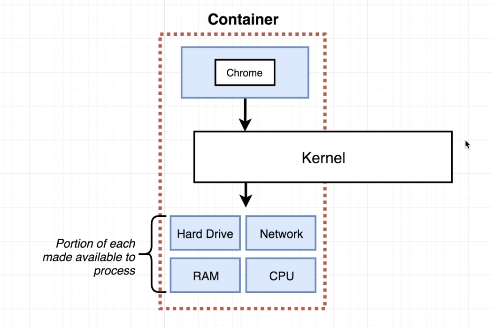
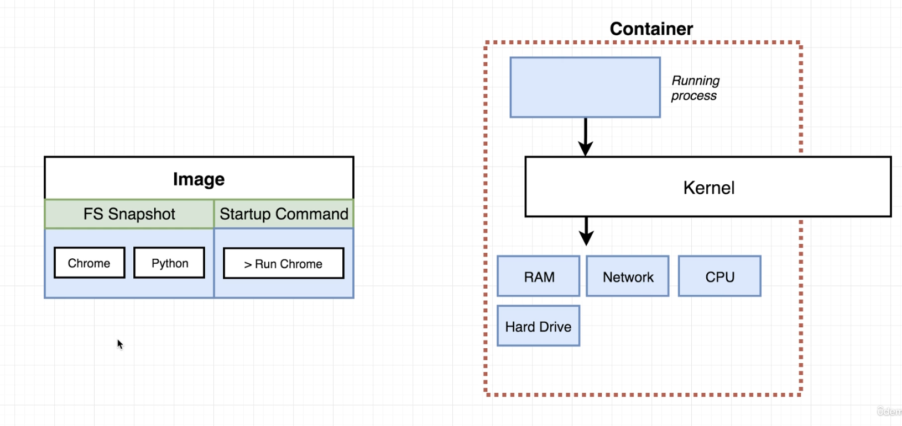
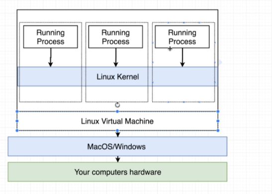
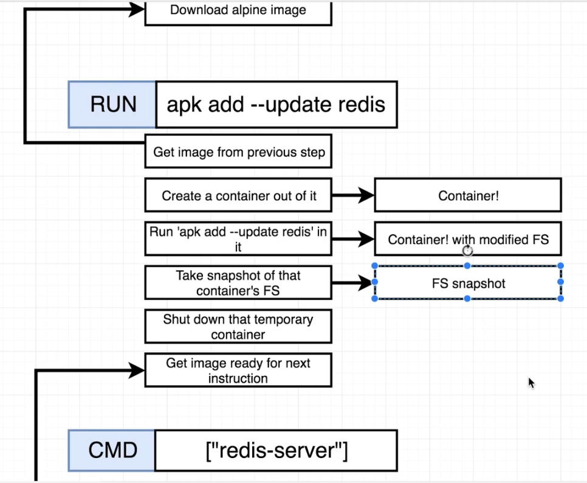

# Docker - How it works 

## Docker Images vs Containers



## How docker works 

Normal computer processes 



Some ways OS can isolate resources required by processes: 




With Docker: 



An Image is a copy/paste of the FileSystem required to run the containers of that images, as shown below: 



Docker runs on Linux, on Windows/MacOS it runs a Linux VM to do so: 




---

### Sample Docker file and how docker executes it 
# Use an existing docker image as a base 

FROM alpine


# Download and install a dependency

```
FROM alpine

RUN apk add --update redis

# Tell the image what to do when it starts as a container

CMD ["redis-server"]

```

