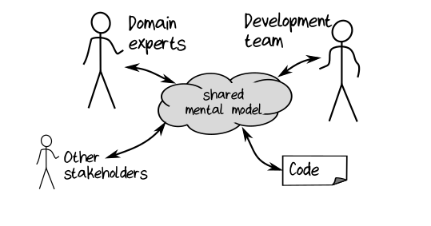
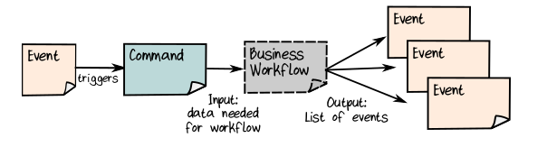
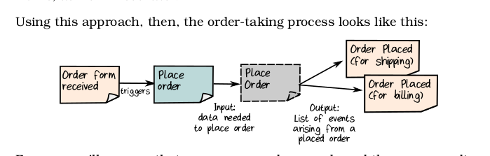
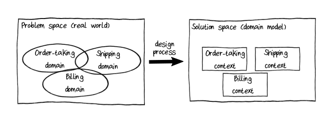
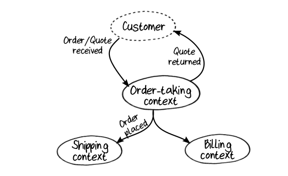

# Domain Driven Design

A developer’s job is to solve a problem through software, and coding is just one aspect of software development. 

Good design and communication are just as important, if not more so.

The goal of DDD is that the development team (devs, UI, UX, Designers, testers), the domain experts, other stakeholders and (most importantly) the source code itself all share the same mental model of the domain.

Guidelines by DDD: 
- Focus on business events and workflows rather than Data Structures
- Partition the problem domain into smaller sub-domains 
- Create a model of each sub-domain in the solution.
- Develop a common language (known as **Ubiquitous Language**) that is shared between everyone involved in the project and is used everywhere in the code.

## Domain 

A “domain” is just that which a “domain expert” is expert in! 

This is much more convenient in practice: rather than struggling to provide a dictionary definition of what “billing” means, we can just say that
“billing” is what people in the billing department—the domain experts—do.

## Domain Model 

A Domain Model is a set of simplifications that represent those aspects of a domain that are relevant to a particular problem. 

The domain model is part of the solution space, while the domain that it represents is part of the problem space.

## Domain Events 

Domain events are the starting point for almost all business processes we want to model. 
    For example: new order form received is a Domain Event that will kick of the order taking process
    
Domain Events are always written in the past tense - something _happened_ - because it's a fact that cannot be changed.

### Event Storming to discover the Domain

Event Storming is a collaborative process for discovering business events and their associated workflows.

In Event Storming, you bring together a variety of people (who understand different parts of the domain) for a facilitated workshop. 

The attendees should include not just developers and domain experts but all the other stakeholders who have an interest in the success of the project: as event stormers like to say, “anyone who has questions and anyone who has answers.”

During the workshop, people write down business events on the sticky notes and post them on the wall. 

Other people may respond by posting notes summarizing the business workflows that are triggered by these events.

### Workflows, Scenarios and Use Cases 

We have many different words to describe business activities: “workflows,” “scenarios,” “use cases,” “processes,” and so on. 

They’re often used interchangeably, but lets be more precise.

• A scenario describes a goal that a customer (or other user) wants to achieve, such as placing an order. It is similar to a “story” in agile development. 
    - A use case is a more detailed version of a scenario, which describes in general terms the user interactions and other steps that the user needs to take to accomplish a goal. 
    - Both scenario and use case are user-centric concepts, focused on how interactions appear from the user’s point of view.
• A business process describes a goal that the business (rather than an individual user) wants to achieve. 
    - It’s similar to a scenario but has a business-centric focus rather than a user-centric focus.
• A workflow is a detailed description of part of a business process. That is, it lists the exact steps that an employee (or software component) needs to do to accomplish a business goal or subgoal. 

## Commands 

The requests that initiate the Domain events are called commands (what made these Domain Events happen?)

Commands are always written in the imerpative - do this for me.

Not all commands may succeed, but if the command does succeed, it will initiate a workflow that in turn will create corresponding Domain Events.

• If the command was “Make X happen,” then, if the workflow made X happen, the corresponding Domain Event would be “X happened.”
• If the command was “Send an order form to Widgets Inc,” then, if the workflow sent the order, the corresponding Domain Event would be “Order form sent.”
• Command: “Place an order”; Domain Event: “Order placed.”
• Command: “Send a shipment to customer ABC”; Domain Event: “Shipment sent.”

## Bounded Contexts

We need to create a distinction betwee a "problem space" and a "solution space" and they must be treated as two different things.

To build the solution, we create a "model" of the problem domain, extracting only the aspects of the domain that are relevant and then re-creating them in solution space.

Thus, domain and sub-domains in problem space map to **Bounded Contexts** in solution-space.

Why _context_? each context represents some specialized knowledge in the solution. Within each context, we share a common language and the design in coherent and unified.

why _bounded_? In the real world, domains have fuzzy boundaries. but in software we want to reduce the coupling between separate subsystems so that they can evolve independently.

A domain in the problem space does not always have a one-to-one relationship to a context in the solution space. Sometimes, for various reasons, a single domain is broken into multiple bounded contexts—or more likely—multiple domains in the problem space are modeled by only one bounded context in the solution space.

Interactions between Bounded Contexts is explained by diagrams called **Context Maps**. We do not care about internal structure of each context, just how they interact with each other.

- Bounded Contexts that are critical to business, directly provide a business advantage, the ones that bring in money are called **Core Contexts**
- The rest are called **Supportive Contexts**

## Ubiquitous Language 

The set of concepts and vocabulary that is shared between everyone on the team is called the Ubiquitous Language—the “everywhere language.” 

This is the language that defines the shared mental model for the business domain.

And, as its name implies, this language should used everywhere in the project, not just in the requirements but in the design and, most importantly, in the source code.

***
