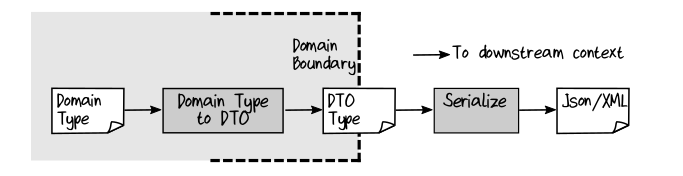
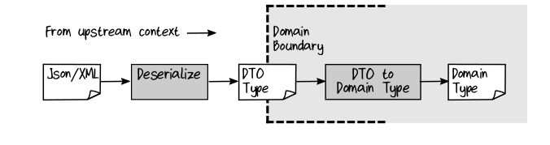
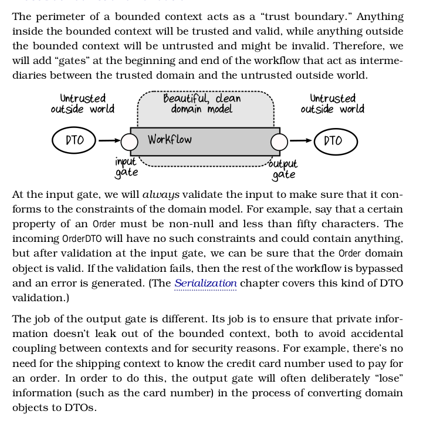
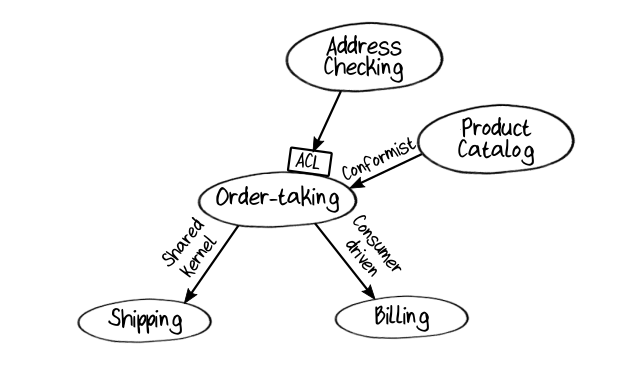
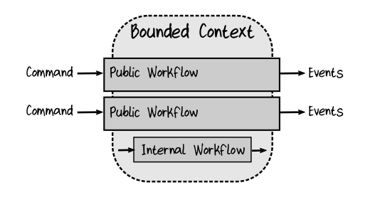
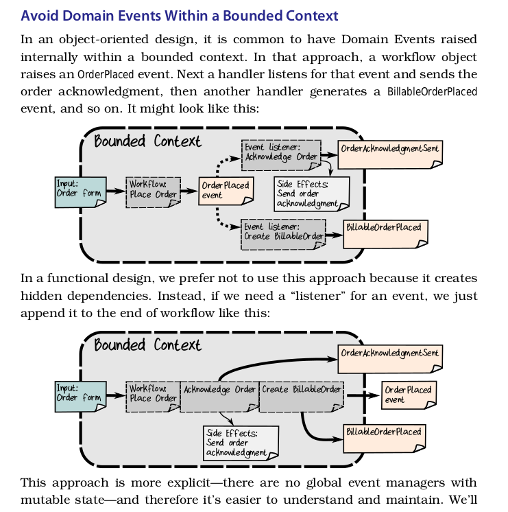
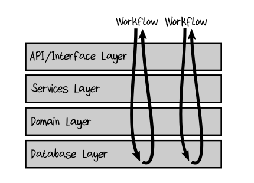
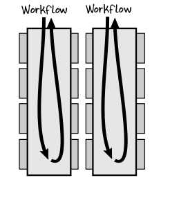
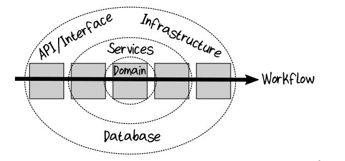

# Transferring data between Bounded Contexts

### Domain Object vs DTO 

A Domain Object is an object designed for use only within the boundaries of a context, as opposed to a Data Transfer Object.

A Data Transfer Object, or DTO, is an object designed to be serialized and shared between contexts.

## Trust Boundaries and Validation

## Contract between Bounded Contexts

#### Shared Kernel 

A Shared Kernel relationship is where two contexts share some common domain design, so the teams involved must collaborate.
    - In our domain, for example, we might say that the order-taking and shipping contexts must use the same design for a delivery address.
    - the order-taking context accepts an address and validates it, 
    - while the shipping context uses the same address to ship the package.

Changing the definition of an event or a DTO must be done only in consultation with the owners of the other contexts that are affected.

#### Consumer Driver Contract (aka Customer/Supplier)

A Customer/Supplier or Consumer Driven Contract 6 relationship is where the downstream context defines the contract that they want the upstream context to provide. T

he two domains can still evolve independently, as long as the upstream context fulfills its obligations under the contract.

In our domain, the billing context might define the contract (“this is what I need in order to bill a customer”) and then the order-taking context
provides only that information and no more.

#### Conformist

A Conformist relationship is the opposite of consumer-driven. The downstream context accepts the contract provided by the upstream context
and adapts its own domain model to match. 

In our domain, the order-taking context might just accept the contract defined by the product catalog and adapt its code to use it as is.

## Anti -Corruption Layers

An Anti-Corruption Layer, or ACL, is a component that translates concepts
from one domain to another in order to reduce coupling and allow domains
to evolve independently.

Often when communicating with an external system, the interface that is available does not match our domain model at all. 

In this case, the interactions and data need to be transformed into something more suitable for use inside the bounded context, otherwise our domain model will become “corrupted” by trying to adapt to the external system’s model.

This extra level of decoupling between contexts is called an **Anti-Corruption Layer** in DDD terminology, often abbreviated as “ACL".

The input gate often plays the role of the ACL.

That is, the Anti-Corruption Layer is not primarily about performing validation or preventing data corruption, but instead acts as a translator between two different languages—the language used in the upstream context and the language used in the downstream context.

## Building a Context Map

## Workflow Inputs and Outputs

## Avoid Domain events within Bounded Contexts

## Onion Architecture

Unlike the 
    - Layered appoach: code divided into layers like core, DB layer, services layer and an API or UI layer
    - Vertical Slices: each workflow contains all the code it needs to get its  job done

the Onion Architecture puts the domain at the core, and then has the other aspects be assemebed around it using the rule that: **each layer can only depend on inner layers, not on further layers out**. i.e. _All dependencies must point inwards_

Onion Architecture keeps I/O at the edges of the codebase, and thus promotes persistence ignorance.