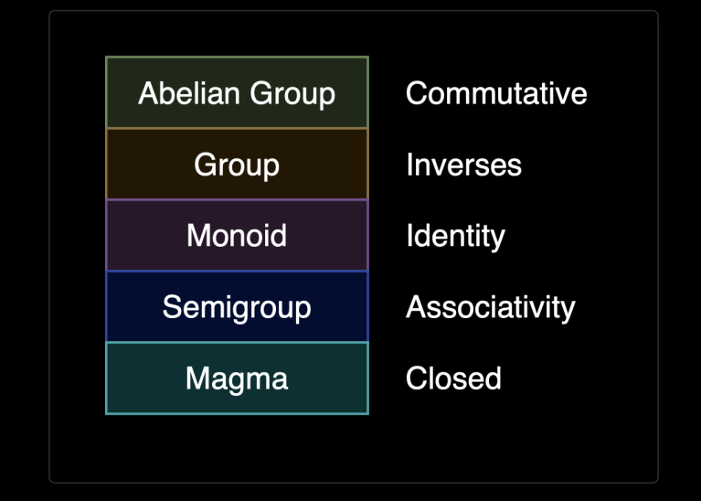
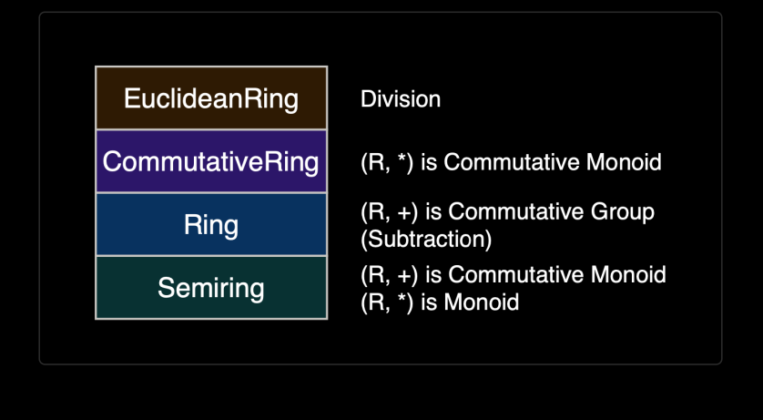

# Abstract Algebra

Summaries






---


### Associative Property

`a * (b * c) = (a * b) * c` where `*` is a Binary Operator

When a Binary Op is associative, we can arrange the parentheses however we like:
- `((a * b) * c) * d` or
- `(a * (b * c)) * d` or
- `(a * b) * (c * d)` and so on

### Commutative Property

`a * b = b * a`


### Closure

When the result of a Binary Op is always a value that's in our domain. 

e.g. the set `{ true, false }`is closed under `&&`

but `{1, 2, 3}`  is not closed under `+` since `2 + 3 = 5` is not a part of the input set.


### Magma

A Magma is a set that is closed under a Binary Op. 
- Formally: $a, b \in M \implies a * b \in M$ when $*$ is the binary op

Example: 

M = { true, false } and op = &&


### Semigroup

A Semigroup is a Magma where the Binary Op is Associative
- Formally: $\forall a, b, c \in S \implies a * (b * c) = (a * b) * c$ 

Example: 
- S = `{ "a", "b", ..., "z", "aa", "ab", ...}
    - and op = `<>`
- S is the set of ALL strings, and `<>` is the concat op

In Purescript, we have a Semigroup Typeclass

```haskell
class Semigroup a where 
    append :: a -> a -> a
    
infixr 5 append <>
```


### Monoid

A Monoid is a Semigroup where the Set has a Neutral Element, e.
- Formally: $e \in M, \forall a \in M \implies a * e = e * a = a$ , hence, $e$ is the identity

Example: 
- M = {0, 1, 2, 3} and op = `+` and `e` = 0

Monoid Typeclass

```haskell
class Semigroup m <= Monoid m where 
  mempty :: m
```

### Group 

A Group is a Monoid where every element of the Set has a Unique Inverse.
- Formally: $a \in G, a' \in G, e \in G \implies a * a' = a' * a = e$ , hence `a` and `a'` are inverses of each other

Example: 
- G = { ..., -3, -2, -1, 0, 1, 2, 3...} and op = `+` and `e` = 0
    - Every element has a unique inverse, and 0 is its own unique inverse
- Integers mod 4 = { 0, 1, 2, 3} is also a group
    - op = `+`, e = `0`, 0 <-> 0, 1 <-> 3, 3 <-> 1, 2 <-> 2 are the inverse pairs

```haskell
class Monoid g <= Group g where 
    ginverse :: g -> g
```

### Abelian Group 

An Abelian Group is a Group where the Binary op is also Commutative

Example: 
- { ..., -3, -2, -1, 0, 1, 2, 3...}, and op = +

In Purescript, Abelian Group is a Type Alias

```haskell
type Abelian a b = Group a => Commutative a => b

-- The Abelian Type Alias above is just a Helper for adding the necessary constraints (of Group and Commutative) to a function's type signature
```


--- 

### Semiring

A Semiring is an Algebraic Structure with Set R and 2 Binary Ops + and x, called addition and multiplication.

Laws: 
- (R, +) is a Commutative Monoid with Identity of 0: 
    - (a + b) + c = a + (b + c) [Associativity] (Semigroup)
    - 0 + a = a + 0 = a [Identity] (Monoid)
    - a + b = b + a [Commutative] (Commutative Monoid)
- (R, x) is a Monoid with Identity of 1: 
    - (a x b) x c = a x (b x c) [Associativity] (Semigroup)
    - 1 x a = a x 1 = a [Identity] (Monoid)
- Multiplicative Distribution across Addition
    - a x (b + c) = (a x b) + (a x c) [Left Distributivity]
    - (a + b) x c = (a x c) + (b x c) [Right Distributivity]
- Multiplication with 0 that Annihilates R: 
    - 0 x a = a x 0 = 0 [Annihilation]

Notice that addition must be commutative, and multiplication need not be. 

Also note, addition, multiplication, 1 and 0 above are all abstract concepts (and not the mathematical 1 and 0)

##### Semiring Typeclass

```haskell
class Semiring a where 
    add :: a -> a -> a 
    zero :: a 
    mul :: a -> a -> a 
    one :: a
    
infixl 6 add as + 
infixl 7 mul as *

-- Semiring Instance for Ints
instance semiringInt :: Semiring Int where 
    add = intAdd
    zero = 0 
    mul = intMul
    one = 1
    
foreign import intAdd :: Int -> Int -> Int 
foreign import intMul :: Int -> Int -> Int

-- Semiring instance for functions

instance semiringFunc :: Semiring b => Semiring (a -> b) where
    add f g x = f x + g x
    add f g = \x -> f x + g x -- alternate way of defining
    zero = \_ -> zero -- returns the zero of b
    mul f g x = f x * g x
    one = \_ -> one -- returns the one of b
    
```

### Ring 

A Ring adds 1 more requirement to Semiring. 

In a Ring, the Set has an Additive Inverse. (thus, Rings support Subtraction)

`a + (-a) = 0` (Additive Inverse)


##### Ring Typeclass

```haskell
class Semiring a <= Ring a where
    sub :: a -> a -> a

infixl 6 sub as -
```

### Commutative Ring Typeclass

Rings are commutative for addition, but Commutative Rings are Commutative for Addition AND Multiplication.

```haskell
class Ring a => CommutativeRing a

-- the above typeclass is simple as we cannot enforce commutative property in PureScript
```

### Euclidean Ring

An Euclidean Ring is a Commutative Ring with 1 more requirement. Euclidean Rings support **Division**

