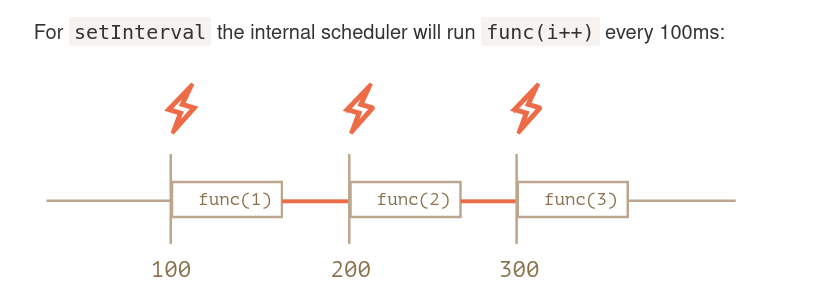
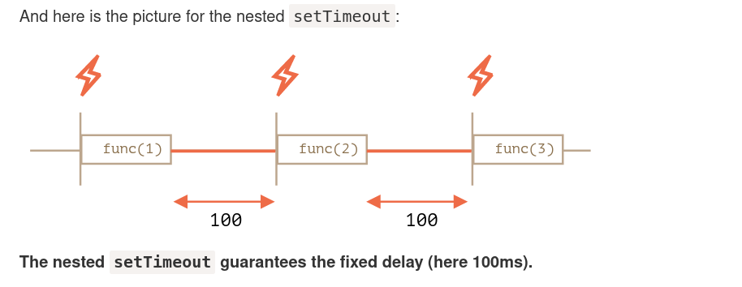

# Concepts

### Scope

Scope is the accessibility of variables, functions, and objects in some particular part of your code during runtime. In other words, scope determines the visibility of variables and other resources in areas of your code.

Scope is a set of rules for storing and looking up variables by their indentifier name.

---

### Closure

when a function remembers and accesses variables from its lexical scope, even when it is executed in a different scope.

---

`in` traverses the whole prototype chain, whether the property is `enumerable` or not

`for..in` loop only check for "enumerable" properties in the whole proto chain

---

### Lazy Expression

not evaluated unless & until when needed, e.g.

```JS
function bar () { console.log("!"); }
function foo(x = bar()) {
  return x;
}
```

- `bar()` will not be called, unless foo is called
- in `foo(1)`, bar() still will not be evaluated, as default parameter was not needed at all.
- only in `foo()`, will `bar()` will be evaluated.

---

### Lexical Environment

In JavaScript, every running function, code block, and the script as a whole have an associated object known as the Lexical Environment.

The Lexical Environment object consists of two parts:

1.  Environment Record – an object that has all local variables as its properties (and some other information like the value of this).
2.  A reference to the outer lexical environment, usually the one associated with the code lexically right outside of it (outside of the current curly brackets).

---

### Lexical Scope

- Lexical scope means that scope is defined by author-time decisions of where functions are declared.
- No matter where a function is invoked from, or even how it is invoked, its lexical scope is only defined by where the function was declared.

---

### `Eval` & `With`

- The former can modify existing lexical scope (at runtime) by evaluating a string of "code" which has one or more declarations in it.
- The latter essentially creates a whole new lexical scope (again, at runtime) by treating an object reference as a "scope" and that object's properties as scoped identifiers.
- `eval` and `with` hurt performance optimizationsc carried out by JS engine.

---

### IIFE

IIFE allows us to not pollute the global scope with a "named" function, and it automatically executes the code without doing that.

---

### Anonymous Functions

Function declaration cannot be anonymous, only function Expressions can be

**Drawbacks of Anonymous Functions**

1. Anonymous functions have no useful name to display in stack traces, which can make debugging more difficult.

2. Without a name, if the function needs to refer to itself, for recursion, etc., the deprecated `arguments.callee` reference is unfortunately required. Another example of needing to self-reference is when an event handler function wants to unbind itself after it fires.

3. Anonymous functions omit a name that is often helpful in providing more readable/understandable code. A descriptive name helps self-document the code in question.

---

### try/catch

JavaScript in ES3 specified the variable declaration in the catch clause of a try/catch to be block-scoped to the catch block.

---

### Hoisting

- The Engine actually will compile your JavaScript code before it interprets it. Part of the compilation phase was to find and associate all declarations with their appropriate scopes.
- When you see `var a = 2;` you probably think of that as one statement. But JavaScript actually thinks of it as two statements: `var a;` and `a = 2;`. The first statement, the declaration, is processed during the compilation phase. The second statement, the assignment, is left in place for the execution phase.
- **Declaration comes before Assignment**
- Important to note that hoisting is **per-scope**.
- Functions are hoisted first, and then variables.

```js
foo(); // 1

var foo;

function foo() {
	console.log(1);
}

foo = function() {
	console.log(2);
};
```

- While multiple/duplicate var declarations are effectively ignored, subsequent function declarations do override previous ones.

```js
foo(); // 3

function foo() {
	console.log(1);
}

var foo = function() {
	console.log(2);
};

function foo() {
	console.log(3);
}
```

---

##### Why is `0.1 + 0.2 !== 0.3`?

A number is stored in memory in its binary form, a sequence of ones and zeroes. But fractions like 0.1, 0.2 that look simple in the decimal numeric system are actually unending fractions in their binary form.

In other words, what is 0.1? It is one divided by ten 1/10, one-tenth. In decimal numeral system such numbers are easily representable. Compare it to one-third: 1/3. It becomes an endless fraction 0.33333(3).

So, division by powers 10 is guaranteed to work well in the decimal system, but division by 3 is not. For the same reason, in the binary numeral system, the division by powers of 2 is guaranteed to work, but 1/10 becomes an endless binary fraction.

There’s just no way to store exactly 0.1 or exactly 0.2 using the binary system, just like there is no way to store one-third as a decimal fraction.

The numeric format IEEE-754 solves this by rounding to the nearest possible number. These rounding rules normally don’t allow us to see that “tiny precision loss”, so the number shows up as 0.3. But beware, the loss still exists.

---

#### Why 6.35.toFixed(1) === 6.3? while 1.35.toFixed(1) === 1.4?

In JS, 0-4 round down, while 5-9 round up.
Internall, 6.35 is an endless binary
`6.35.toFixed(20) // 6.34999999999999964473`
while
`1.35.toFixed(20) // 1.35000000000000008882`
hence, 1.35 rounds up, while 6.35 rounds down.

To Counter this, we can multiply and divide by 10
`Math.round((6.35 * 10) / 10)` // 6.35 -> 63.5 -> 64
(63.5 has 0.5 as decimal part, Fractions divided by power of 2 are exactly represented in Binary)

---

### `this` Binding Rules

The only thing that matters for `this` is the function call-site. Call-site is the previous function call on the current call-stack, so if `foo` calls `bar`, which calls `baz`, which calls `qux`, the call sites are foo:global, bar:foo, baz:bar, qux: baz

#### 1. Default Binding

If the call-site is the global scope, then `this` defaults to

- `undefined` in strict-mode
- global object in non-strict mode

e.g.

```js
function foo() {
	console.log(this.a);
}

var a = 2;

foo(); // 2
```

However, only the contents of the function declaration need to be in strict-mode, global strict-mode does not matter if the contents of the function's declaration are in sloppy mode.

```js
function foo() {
	'use strict';

	console.log(this.a);
}

var a = 2;

foo(); // TypeError: `this` is `undefined`
```

vs

```js
function foo() {
	console.log(this.a);
}

var a = 2;

(function() {
	'use strict';

	foo(); // 2
})();
```

#### Implicit Binding

Does the call site have a context object.

```js
function foo() {
	console.log(this.a);
}
var obj = {
	a: 2,
	foo: foo
};
obj.foo(); // 2
```

Firstly, notice the manner in which foo() is declared and then later added as a reference property onto obj. **Regardless of whether foo() is initially declared on obj, or is added as a reference later (as this snippet shows), in neither case is the function really "owned" or "contained" by the obj object.**

At the point that foo() is called, it's preceded by an object reference to obj. When there is a context object for a function reference, the implicit binding rule says that it's that object which should be used for the function call's this binding.

- Only the top/last level of an object property reference chain matters to the call-site. For instance:

```js
function foo() {
	console.log(this.a);
}

var obj2 = {
	a: 42,
	foo: foo
};

var obj1 = {
	a: 2,
	obj2: obj2
};

obj1.obj2.foo(); // 42 -> from obj2
```

###### Sometimes the binding is implicitly lost:

```js
function foo() {
	console.log(this.a);
}

var obj = {
	a: 2,
	foo: foo
};

var bar = obj.foo; // function reference/alias!

var a = 'oops, global'; // `a` also property on global object

bar(); // "oops, global"
```

Even though bar appears to be a reference to obj.foo, in fact, it's really just another reference to foo itself. Moreover, the call-site is what matters, and the call-site is `bar()`, which is a plain, un-decorated call and thus the default binding applies.

Similarly

```js
let obj = {
	a: 2,
	foo() {
		console.log(this.a);
	}
};
let a = 'global';
let bar = obj.foo;
bar(); // 'global'
```

Or, more subtly

```js
function foo() {
	console.log(this.a);
}

function doFoo(fn) {
	// `fn` is just another reference to `foo`

	fn(); // <-- call-site!
}

var obj = {
	a: 2,
	foo: foo
};

var a = 'oops, global'; // `a` also property on global object

doFoo(obj.foo); // "oops, global"
```

Parameter passing is just an implicit assignment, and since we're passing a function, it's an implicit reference assignment, so the end result is the same as the previous snippet.

```js
function foo() {
	console.log(this.a);
}

var obj = {
	a: 2,
	foo: foo
};

var a = 'oops, global'; // `a` also property on global object

setTimeout(obj.foo, 100); // "oops, global"
```

**So, whenever we pass a reference of a function to another variable, `this` binding is lost.**

---

#### Explicit Binding

using `call(..)`, `apply()` & `bind()` available on `Function.prototype`.

```js
function foo() {
	console.log(this.a);
}

var obj = {
	a: 2
};
foo.call(obj); // 2
```

`bind()` created hard-binding

```js
function foo(something) {
	console.log(this.a, something);
	return this.a + something;
}

var obj = {
	a: 2
};

var bar = foo.bind(obj);

var b = bar(3); // 2 3
console.log(b); // 5

bar.name = 'bound foo';
```

###### Note: As of ES6, the hard-bound function produced by bind(..) has a .name property that derives from the original target function. For example: bar = foo.bind(..) should have a `bar.name` value of "bound foo", which is the function call name that should show up in a stack trace.

---

### `new` Binding

```js
function foo(a) {
	this.a = a;
}

var bar = new foo(2);
console.log(bar.a); // 2
```

---

**`new` Binding > hard binding > implicit binding > default**

Now, we can summarize the rules for determining this from a function call's call-site, in their order of precedence. Ask these questions in this order, and stop when the first rule applies.

    1. Is the function called with new (new binding)?
       If so, this is the newly constructed object.

        var bar = new foo();

    2. Is the function called with call or apply (explicit binding),
       even hidden inside a bind hard binding?
       If so, this is the explicitly specified object.

        var bar = foo.call( obj2 )

    3. Is the function called with a context (implicit binding),
       otherwise known as an owning or containing object?
       If so, this is that context object.

        var bar = obj1.foo()

    4. Otherwise, default the this (default binding).
       If in strict mode, pick undefined, otherwise pick the global object.

        var bar = foo()

---

It should be clear that the default binding is the lowest priority rule of the 4. So we'll just set that one aside.

Which is more precedent, implicit binding or explicit binding? Let's test it:

```js
function foo() {
	console.log(this.a);
}

var obj1 = {
	a: 2,
	foo: foo
};

var obj2 = {
	a: 3,
	foo: foo
};

obj1.foo(); // 2
obj2.foo(); // 3

obj1.foo.call(obj2); // 3
obj2.foo.call(obj1); // 2
```

**So, explicit binding takes precedence over implicit binding, which means you should ask first if explicit binding applies before checking for implicit binding.**

Now, we just need to figure out where new binding fits in the precedence.

```js
function foo(something) {
	this.a = something;
}

var obj1 = {
	foo: foo
};

var obj2 = {};

obj1.foo(2);
console.log(obj1.a); // 2

obj1.foo.call(obj2, 3);
console.log(obj2.a); // 3

var bar = new obj1.foo(4); // despite calling as obj1.foo, new takes precedence and creates a new object for bar
console.log(obj1.a); // 2
console.log(bar.a); // 4
```

OK, new binding is more precedent than implicit binding. But do you think new binding is more or less precedent than explicit binding?

```js
function foo(something) {
	this.a = something;
}

var obj1 = {};

var bar = foo.bind(obj1);
bar(2);
console.log(obj1.a); // 2

var baz = new bar(3); // bar is  bound to obj1, so "this" would refer to obj1, or will new create a wholly new object for baz?
console.log(obj1.a); // 2
console.log(baz.a); // 3
```

Whoa! bar is hard-bound against obj1, but new bar(3) did not change obj1.a to be 3 as we would have expected. Instead, the hard bound (to obj1) call to bar(..) is able to be overridden with new. Since new was applied, we got the newly created object back, which we named baz, and we see in fact that baz.a has the value 3.

---

### Exceptions

#### Passing null to call, bind or apply

If you pass null or undefined as a this binding parameter to call, apply, or bind, those values are effectively ignored, and instead the default binding rule applies to the invocation.

```js
function foo() {
	console.log(this.a);
}

var a = 2;

foo.call(null); // 2
```

#### Indirect reference

Another thing to be aware of is you can (intentionally or not!) create "indirect references" to functions, and in those cases, when that function reference is invoked, the default binding rule also applies.

```js
function foo() {
	console.log(this.a);
}

var a = 2;
var o = { a: 3, foo: foo };
var p = { a: 4 };

o.foo(); // 3
(p.foo = o.foo)(); // 2
```

#### Arrow Functions

Arrow-functions adopt the this binding from the enclosing (function or global) scope.

```js
function foo() {
	// return an arrow function
	return a => {
		// `this` here is lexically adopted from `foo()`
		console.log(this.a);
	};
}

var obj1 = {
	a: 2
};

var obj2 = {
	a: 3
};

var bar = foo.call(obj1);
bar.call(obj2); // 2, not 3!
```

```js
function foo() {
	setTimeout(() => {
		// `this` here is lexically adopted from `foo()`
		console.log(this.a);
	}, 100);
}

var obj = {
	a: 2
};
foo.call(obj); // 2
```

- Arrow functions do not have their own `this`
- They also don't have `arguments` array-like object inside them.

---

### `let` is not attached to `global` object

```js
let user = 'John';
alert(user); // John

alert(window.user); // undefined, don't have let
alert('user' in window); // false
```

The global object is not a global Environment Record

In versions of ECMAScript prior to ES-2015, there were no let/const variables, only var. And global object was used as a global Environment Record (wordings were a bit different, but that’s the gist).

But starting from ES-2015, these entities are split apart. There’s a global Lexical Environment with its Environment Record. And there’s a global object that provides some of the global variables.

As a practical difference, global let/const variables are definitively properties of the global Environment Record, but they do not exist in the global object.

Naturally, that’s because the idea of a global object as a way to access “all global things” comes from ancient times. Nowadays is not considered to be a good thing. Modern language features like let/const do not make friends with it, but old ones are still compatible.

---

### Recursive setTimeout

Recursive setTimeout guarantees a delay between the executions, setInterval – does not.

Let’s compare two code fragments. The first one uses setInterval:

```js
let i = 1;
setInterval(function() {
  func(i);
}, 100);

The second one uses recursive setTimeout:

let i = 1;
setTimeout(function run() {
  func(i);
  setTimeout(run, 100);
}, 100);

```

**The real delay between `func` calls for `setInterval` is less than in the code!**

That’s normal, because the time taken by `func`'s execution “consumes” a part of the interval.

It is possible that `func`'s execution turns out to be longer than we expected and takes more than 100ms.

In this case the engine waits for `func` to complete, then checks the scheduler and if the time is up, runs it again _immediately_.

In the edge case, if the function always executes longer than `delay` ms, then the calls will happen without a pause at all.




The recursive setTimeout guarantees the fixed delay (here 100ms).

That’s because a new call is planned at the end of the previous one.

###### Another Example

```js
let timerId = setTimeout(function tick() {
	alert('tick');
	timerId = setTimeout(tick, 2000); // (*)
}, 2000);
```

###### Recursive setTimeout guarantees a delay between the executions, setInterval – does not.

---

### SetTimeouts and Garbage Collection

When a function is passed in setInterval/setTimeout, an internal reference is created to it and saved in the scheduler. It prevents the function from being garbage collected, even if there are no other references to it.

```js
// the function stays in memory until the scheduler calls it
setTimeout(function() {...}, 100);
```

For `setInterval` the function stays in memory until clearInterval is called.

There’s a side-effect. A function references the outer lexical environment, so, while it lives, outer variables live too. They may take much more memory than the function itself. So when we don’t need the scheduled function anymore, it’s better to cancel it, even if it’s very small.

---

### Strict Mode

JavaScript's strict mode, introduced in ECMAScript 5, is a way to opt in to a restricted variant of JavaScript, thereby implicitly opting-out of "sloppy mode". Strict mode isn't just a subset: it intentionally has different semantics from normal code.

Strict mode introduces three kinds of breaking changes:

**Syntactic changes**: some previously legal syntax is forbidden in strict mode. For example:

- The with statement is forbidden. It lets users add arbitrary objects to the chain of variable scopes, which slows down execution and makes it tricky to figure out what a variable refers to.
- Deleting an unqualified identifier (a variable, not a property) is forbidden.
- Functions can only be declared at the top level of a scope.
- More identifiers are reserved: implements interface let package private protected public static yield
  **More errors**. For example:
- Assigning to an undeclared variable causes a ReferenceError. In non-strict mode, a global variable is created in this case.
- Changing read-only properties (such as the length of a string) causes a TypeError. In non-strict mode, it simply has no effect.
  **Different semantics**: Some constructs behave differently in strict mode. For example:
- arguments doesn’t track the current values of parameters, anymore.
- `this` is undefined in non-method functions. In non-strict mode, it refers to the global object (window), which meant that global variables were created if you called a constructor without new.

---

## Can you name two programming paradigms important for JavaScript app developers?

JavaScript is a multi-paradigm language, supporting _imperative/procedural_ programming along with **OOP** (Object-Oriented Programming) and **functional programming**. JavaScript supports **OOP** with **prototypal inheritance**.

Good to hear:

    Prototypal inheritance (also: prototypes, OLOO).
    Functional programming (also: closures, first class functions, lambdas).

Red flags:

    No clue what a paradigm is, no mention of prototypal oo or functional programming.

## What is Functional Programming

Functional programming (often abbreviated FP) is the process of building software by composing **pure functions**, avoiding **shared state**, **mutable data**, and **side-effects**. Functional programming is **declarative** rather than **imperative**, and application state flows through pure functions. Contrast with object oriented programming, where application state is usually shared and colocated with methods in objects.

Functional programming is a programming paradigm, meaning that it is a way of thinking about software construction based on some fundamental, defining principles (listed above). Other examples of programming paradigms include object oriented programming and procedural programming.

## What is the difference between classical inheritance and prototypal inheritance?

**Class Inheritance**: instances inherit from classes (like a blueprint — a description of the class), and create sub-class relationships: hierarchical class taxonomies. Instances are typically instantiated via constructor functions with the `new` keyword. Class inheritance may or may not use the `class` keyword from ES6.

**Prototypal Inheritance**: instances inherit directly from other objects. Instances are typically instantiated via factory functions or `Object.create()`. Instances may be composed from many different objects, allowing for easy selective inheritance.

## What are the pros and cons of functional programming vs object-oriented programming?

**OOP Pros**: It’s easy to understand the basic concept of objects and easy to interpret the meaning of method calls. OOP tends to use an imperative style rather than a declarative style, which reads like a straight-forward set of instructions for the computer to follow.

**OOP Cons**: OOP Typically depends on shared state. Objects and behaviors are typically tacked together on the same entity, which may be accessed at random by any number of functions with non-deterministic order, which may lead to undesirable behavior such as race conditions.

**FP Pros**: Using the functional paradigm, programmers avoid any shared state or side-effects, which eliminates bugs caused by multiple functions competing for the same resources. With features such as the availability of point-free style (aka tacit programming), functions tend to be radically simplified and easily recomposed for more generally reusable code compared to OOP.

FP also tends to favor declarative and denotational styles, which do not spell out step-by-step instructions for operations, but instead concentrate on what to do, letting the underlying functions take care of the how. This leaves tremendous latitude for refactoring and performance optimization, even allowing you to replace entire algorithms with more efficient ones with very little code change. (e.g., memoize, or use lazy evaluation in place of eager evaluation.)

Computation that makes use of pure functions is also easy to scale across multiple processors, or across distributed computing clusters without fear of threading resource conflicts, race conditions, etc…

**FP Cons**: Over exploitation of FP features such as point-free style and large compositions can potentially reduce readability because the resulting code is often more abstractly specified, more terse, and less concrete.

More people are familiar with OO and imperative programming than functional programming, so even common idioms in functional programming can be confusing to new team members.

FP has a much steeper learning curve than OOP because the broad popularity of OOP has allowed the language and learning materials of OOP to become more conversational, whereas the language of FP tends to be much more academic and formal. FP concepts are frequently written about using idioms and notations from lambda calculus, algebras, and category theory, all of which requires a prior knowledge foundation in those domains to be understood.

**Good to hear**:

    Mentions of trouble with shared state, different things competing for the same resources, etc…
    Awareness of FP’s capability to radically simplify many applications.
    Awareness of the differences in learning curves.
    Articulation of side-effects and how they impact program maintainability.
    Awareness that a highly functional codebase can have a steep learning curve.
    Awareness that a highly OOP codebase can be extremely resistant to change and very brittle compared to an equivalent FP codebase.
    Awareness that immutability gives rise to an extremely accessible and malleable program state history, allowing for the easy addition of features like infinite undo/redo, rewind/replay, time-travel debugging, and so on. Immutability can be achieved in either paradigm, but a proliferation of shared stateful objects complicates the implementation in OOP.

## When is classical inheritance an appropriate choice?

The answer is never, or almost never. Certainly never more than one level. Multi-level class hierarchies are an anti-pattern.

Good to hear:

    Rarely, almost never, or never.
    A single level is sometimes OK, from a framework base-class such as React.Component.
    “Favor object composition over class inheritance.”

## When is prototypal inheritance an appropriate choice?

There is more than one type of prototypal inheritance:

    **Delegation** (i.e., the prototype chain).
    **Concatenative** (i.e. mixins, `Object.assign()`).
    **Functional** (Not to be confused with functional programming. A function used to create a closure for private state/encapsulation).

Each type of prototypal inheritance has its own set of use-cases, but all of them are equally useful in their ability to enable composition, which creates has-a or uses-a or can-do relationships as opposed to the is-a relationship created with class inheritance.

Good to hear:

    In situations where modules or functional programming don’t provide an obvious solution.
    When you need to compose objects from multiple sources.
    Any time you need inheritance.

## What does “favor object composition over class inheritance” mean?

This is a quote from “Design Patterns: Elements of Reusable Object-Oriented Software”. It means that code reuse should be achieved by assembling smaller units of functionality into new objects instead of inheriting from classes and creating object taxonomies.

In other words, use can-do, has-a, or uses-a relationships instead of is-a relationships.

Good to hear:

    Avoid class hierarchies.
    Avoid brittle base class problem.
    Avoid tight coupling.
    Avoid rigid taxonomy (forced is-a relationships that are eventually wrong for new use cases).
    Avoid the gorilla banana problem (“what you wanted was a banana, what you got was a gorilla holding the banana, and the entire jungle”).
    Make code more flexible.

## What are two-way data binding and one-way data flow, and how are they different?

Two way data binding means that UI fields are bound to model data dynamically such that when a UI field changes, the model data changes with it and vice-versa.

One way data flow means that the model is the single source of truth. Changes in the UI trigger messages that signal user intent to the model (or “store” in React). Only the model has the access to change the app’s state. The effect is that data always flows in a single direction, which makes it easier to understand.

One way data flows are deterministic, whereas two-way binding can cause side-effects which are harder to follow and understand.

Good to hear:

    React is the new canonical example of one-way data flow, so mentions of React are a good signal. Cycle.js is another popular implementation of uni-directional data flow.
    Angular is a popular framework which uses two-way binding.

## What are the pros and cons of monolithic vs microservice architectures?

<details>

A monolithic architecture means that your app is written as one cohesive unit of code whose components are designed to work together, sharing the same memory space and resources.

A microservice architecture means that your app is made up of lots of smaller, independent applications capable of running in their own memory space and scaling independently from each other across potentially many separate machines.

Monolithic Pros: The major advantage of the monolithic architecture is that most apps typically have a large number of cross-cutting concerns, such as logging, rate limiting, and security features such audit trails and DOS protection.

When everything is running through the same app, it’s easy to hook up components to those cross-cutting concerns.

There can also be performance advantages, since shared-memory access is faster than inter-process communication (IPC).

Monolithic cons: Monolithic app services tend to get tightly coupled and entangled as the application evolves, making it difficult to isolate services for purposes such as independent scaling or code maintainability.

Monolithic architectures are also much harder to understand, because there may be dependencies, side-effects, and magic which are not obvious when you’re looking at a particular service or controller.

Microservice pros: Microservice architectures are typically better organized, since each microservice has a very specific job, and is not concerned with the jobs of other components. Decoupled services are also easier to recompose and reconfigure to serve the purposes of different apps (for example, serving both the web clients and public API).

They can also have performance advantages depending on how they’re organized because it’s possible to isolate hot services and scale them independent of the rest of the app.

Microservice cons: As you’re building a new microservice architecture, you’re likely to discover lots of cross-cutting concerns that you did not anticipate at design time. A monolithic app could establish shared magic helpers or middleware to handle such cross-cutting concerns without much effort.

In a microservice architecture, you’ll either need to incur the overhead of separate modules for each cross-cutting concern, or encapsulate cross-cutting concerns in another service layer that all traffic gets routed through.

Eventually, even monolthic architectures tend to route traffic through an outer service layer for cross-cutting concerns, but with a monolithic architecture, it’s possible to delay the cost of that work until the project is much more mature.

Microservices are frequently deployed on their own virtual machines or containers, causing a proliferation of VM wrangling work. These tasks are frequently automated with container fleet management tools.

Good to hear:

    Positive attitudes toward microservices, despite the higher initial cost vs monolthic apps. Aware that microservices tend to perform and scale better in the long run.
    Practical about microservices vs monolithic apps. Structure the app so that services are independent from each other at the code level, but easy to bundle together as a monolithic app in the beginning. Microservice overhead costs can be delayed until it becomes more practical to pay the price.

</details>

## What is asynchronous programming, and why is it important in JavaScript?

Synchronous programming means that, barring conditionals and function calls, code is executed sequentially from top-to-bottom, blocking on long-running tasks such as network requests and disk I/O.

Asynchronous programming means that the engine runs in an event loop. When a blocking operation is needed, the request is started, and the code keeps running without blocking for the result. When the response is ready, an interrupt is fired, which causes an event handler to be run, where the control flow continues. In this way, a single program thread can handle many concurrent operations.

User interfaces are asynchronous by nature, and spend most of their time waiting for user input to interrupt the event loop and trigger event handlers.

Node is asynchronous by default, meaning that the server works in much the same way, waiting in a loop for a network request, and accepting more incoming requests while the first one is being handled.

This is important in JavaScript, because it is a very natural fit for user interface code, and very beneficial to performance on the server.

## Aren’t classical inheritance and prototypal inheritance really the same thing, just a stylistic preference?

### **NO**

Classical and prototypal inheritance are fundamentally and semantically distinct.

In class inheritance, instances inherit from a blueprint (the class), and create sub-class relationships. In other words, you can’t use the class like you would use an instance. You can’t invoke instance methods on a class definition itself. You must first create an instance and then invoke methods on that instance.

In prototypal inheritance, instances inherit from other instances. Using delegate prototypes (setting the prototype of one instance to refer to an examplar object), it’s literally Objects Linking to Other Objects, or OLOO, as Kyle Simpson calls it. Using concatenative inheritance, you just copy properties from an exemplar object to a new instance.

TL;DR:

    A class is a blueprint.
    A prototype is an object instance.

## Aren’t classes the right way to create objects in JavaScript?

### **NO**

## Don’t you need a constructor function to specify object instantiation behavior and handle object initialization?

    No.

Any function can create and return objects. When it’s not a constructor function, it’s called a factory function.

## Don’t you need constructor functions for privacy in JavaScript?

No, we can use closures for data privacy

```js
let animal = {
	animalType: 'animal',

	describe() {
		return `An ${this.animalType} with ${this.furColor} fur,
      ${this.legs} legs, and a ${this.tail} tail.`;
	}
};

let mouseFactory = function mouseFactory() {
	let secret = 'secret agent';

	return Object.assign(Object.create(animal), {
		animalType: 'mouse',
		furColor: 'brown',
		legs: 4,
		tail: 'long, skinny',
		profession() {
			return secret;
		}
	});
};

let james = mouseFactory();
```

---

### Concatenative Inheritence

Concatenative inheritance is the process of combining the properties of one or more source objects into a new destination object. Believe it or not, it is the most commonly used form of inheritance in JavaScript.

You can use `Object.assign()` to compose any number of objects together with last-in priority:

```js
import ninja from 'ninja'; // ES6 modules
import mouse from 'mouse';

let ninjamouse = Object.assign({}, mouse, ninja);
```

This technique is called **concatenative inheritance**, and the prototypes you inherit from are sometimes referred to as **exemplar prototypes**, which differ from **delegate prototypes** in that you copy from them, rather than delegate to them.
