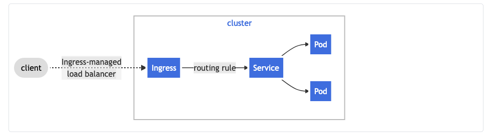
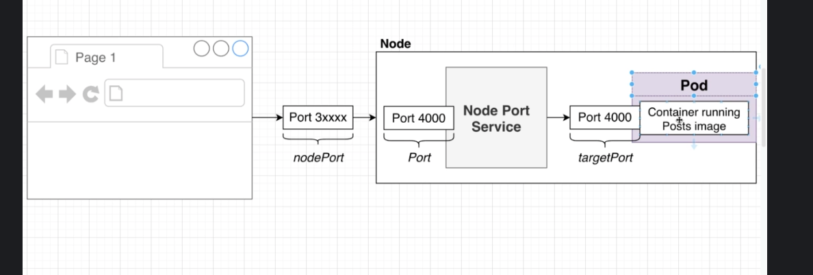
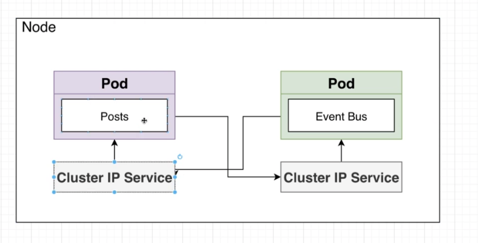
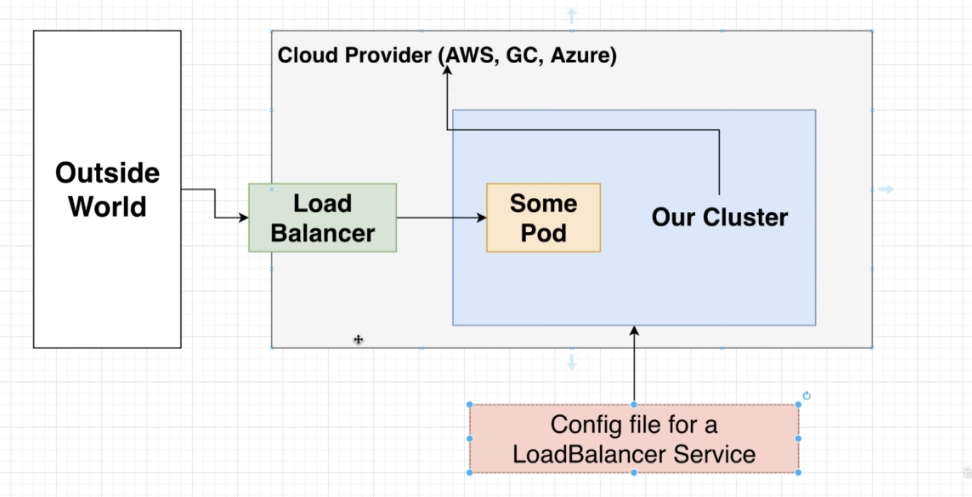
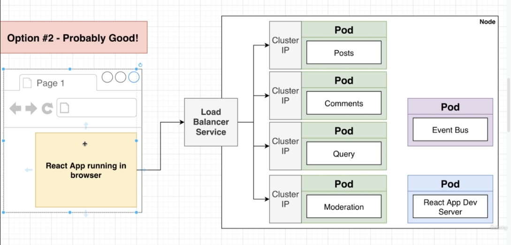
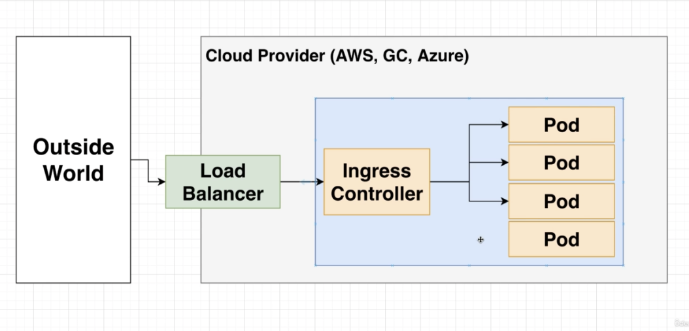
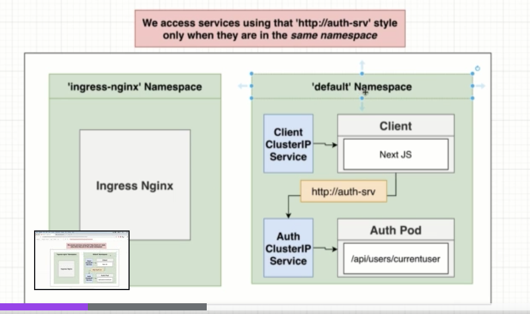

# Kubernetes

## Terminology

1. Kubernetes Cluster 
    - A collection of nodes + a master to manage them
    - Nodes in a cluster are not part of the public internet
2. Node 
    - A virtual Machine that will run our containers
    - A worker machine in K8s, part of a cluster
3. Pod - More or less a running container. Technically, a pod can run multiple containers.
4. Deployment - Monitors a set of pods, make sure they are running and restarts them if they crash.
5. Service aka Object
    - An abstract way to expose an application running on a set of [Pods](https://kubernetes.io/docs/concepts/workloads/pods/) as a network service.
    - A K8s Service that identifies a set of Pods using "label" selectors. 
    - Provides an easy-to-remember URL to access a running container
6. Ingress - an API object that manages external access to the services in a cluster, typically HTTP
7. Edge Router - A router that enforces the firewall policy for your cluster
    - Could be a gateway managed by a cloud provider or a physical piece of h/w
8. Cluster network: A set of links, logical or physical, that facilitate communication within a cluster according to the Kubernetes [networking model](https://kubernetes.io/docs/concepts/cluster-administration/networking/).

An Ingress sending all its traffic to one Service: 

### Kubernetes Config files

Config files tell kubernetes about the different Deployments, Pods and Services (referred to as Objects) that we want to create.

Written in YAML.

We can create Services/Objects directly w/o Config files - but only do this when testing.

## Commands 

- Create a pod 
    - `kubectl apply -f <configFileName>.yaml`

List all pods
- `kubectl get pods`

Running a command inside a pod
- `kubectl exec -it <podName> -- <command>`

Show logs 
- `kubectl logs <podName>`

Delete Pod 
- `kubectl delete pod <podName>`

Describe a pod (Print some information about a pod)
- `kubectl describe pod <podName>`

Create a Secret in k8s
- `kubectl create secret generic <name> --from-literal=key1=value1`

List all secrets
- `kubectl get secrets`

Forward a port
- `kubectl port-forward <pod_name> 4222:4222

***

#### Pod Spec

- `apiVersion` 
    - k8s comes with a preset list of Objects we can create
    - But k8s is extensible, we cn add in our own custom objects
    - This specifies the set of objects we want k8s to look at
    - `v1` means, look at the default list of Object that comes with K8s
- `kind`
    - the tye of object we want to create
- `metadata`- config options for the object we are abt to create
    - name: posts - to refer to the pod
- `spec` - the exact attributes we want to apply to the object we are about to create
    - containers: - we can create many containers in a single pod
        - name: 
        - image:

#### Deployment Commands 

List all running deployments 
    - `kubectl get deployments`

Print out details about a specific deployment
    - `kubectl describe deployment <deploymentName>`

Create a deployment out of a config file
    - `kubectl apply -f <configFileName>`

Delete a deployment 
    - `kubectl delete deployment <deploymentName>`

Restart a deployment 
    - `kubectl rollout restart deployment <deploymentName>`

Restart ALL deployments
    - `kubectl rollout restart deploy`

Describe a service 
- `kubectl describe service <serviceName>`

List of all services in the default namespace 
- `kubectl get services`

List of all services in a particular namespace
- `kubectl get services -n <namespace_name>`

List all namespaces
- `kubectl get namespace`

*** 

## Types of Services

- Cluster IP - Sets up an easy-to-remember URL to access a pod. Only exposes pods in the cluster.
- Node Port - Makes a pod accessible from outside the cluster. Usually only used for dev purposes.
- Load Balancer - Makes a pod accessible from outside the cluster. This is the right way to expose a pod to the outside world.
- External Name - Redirects an in-cluster request to a CNAME url

*** 

### Node Ports 

Pods in a Node communicate using Cluster IPs, never directly

—

## Load Balancers and Ingress

Load Balancer Service 
- Tells k8s to reach out to its "provider" (Cloud Service) and provision a load balancer. Gets Traffic in to a single pod

Ingress or Ingress Controller
- A pod with a set of routing rules to distribute traffic to other services
- There's a technical diff b/w the two, but can be ignored for the most part

^ Load Balancer service is the k8s Object that provisions the Load balancer (green), they both reside outside our cluster.

^ Ingress Controller "routes" traffic within cluser to different pods based on the defined rules

## Namespaces

_namespaces_ provide a mechanism for isolating groups of resources within a single cluster. 

Names of resources need to be unique within a namespace, but not across namespaces.

Namespace-based scoping is applicable only for namespaced objects _(e.g. Deployments, Services, etc)_ and not for cluster-wide objects _(e.g. StorageClass, Nodes, PersistentVolumes, etc)_

 For cross namespace communication, the domain should be formatted like this: 
 
 `http://NAME_OF_SERVICE.NAMESPACE.svc.cluster.local`
 
 e.g. `http://ingress-nginx.ingress-nginx.svc.cluster.local`
 
 To avoid the long URLs, k8s has "external name service" that maps one url to another.