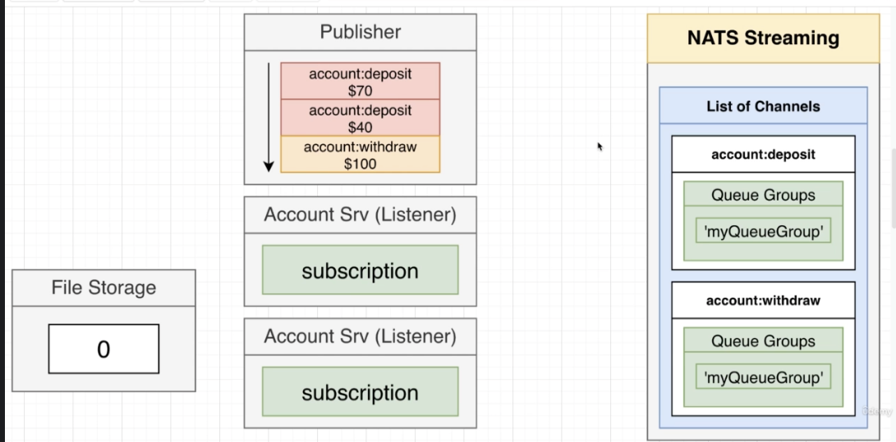
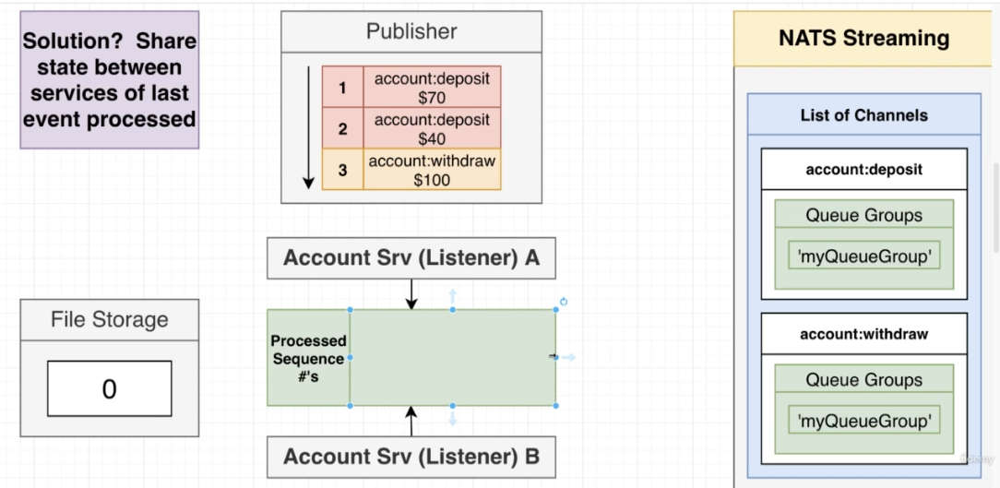
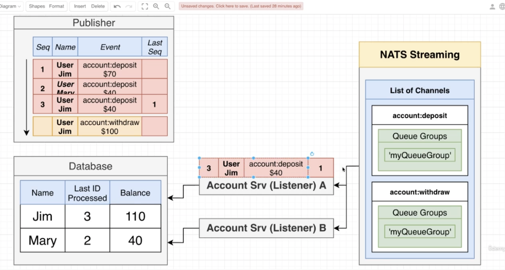
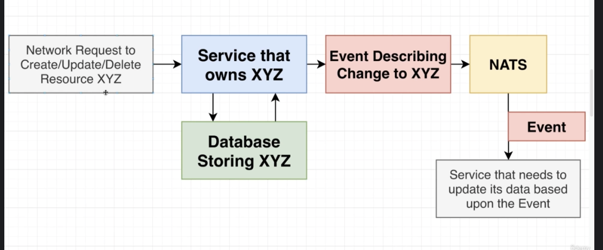
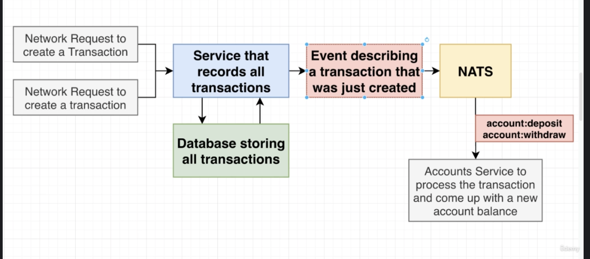
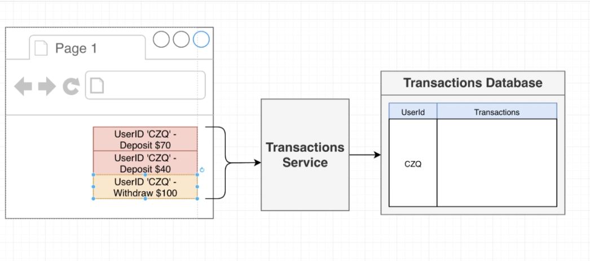
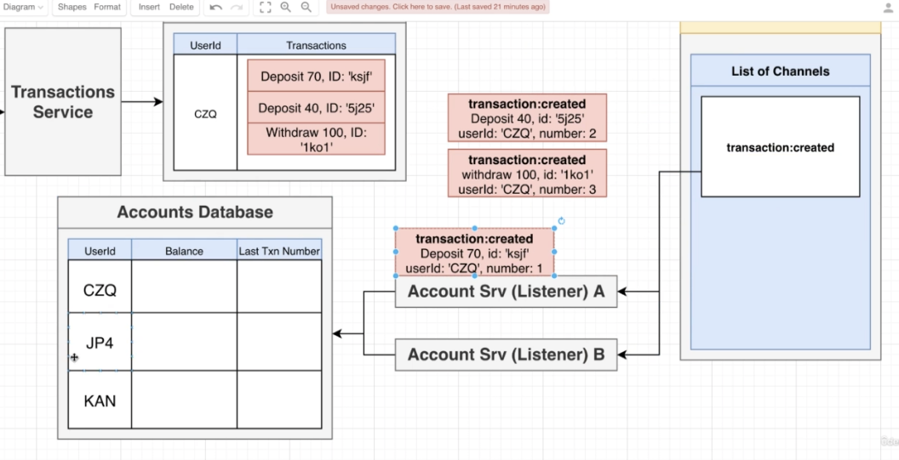

# Concurrency Issues in Pub/Sub systems

The problems listed below are not unique to microservices, they happen in "synchronous" systems, as well as monolith

In the above system
1. A Listener/Subscriber can fail to process the event
    - results in events processed out of sequence 
    - can result in critical business error (e.g. -ve balances)
2. One listener runs more quickly than another
    - can happen when one listener is overloaded
    - While some events are being processed slowly, the server may send previous events to other listeners which are faster
    - again, out of order execution of events becomes a risk
3. Server (NATS Streaming Server in the example aboove) might think that a client is alove when it is dead
    - The server erroneously sends an event to a dead listener
    - and it may take some time for the server to realize that the listener is dead
    - by the time it realizes it, it may already have published later events to other listeners
4. We might receive the same event twice
    - may result in an invalid system state or critical business error

Solutions: 

- Solution 1: Run only 1 Account-Srv (Listener)
    - Won't work as that service will become a serious bottleneck
    - plus, errors might still happen in that lone listener and we must handle those errors
- Solution 2: Figure out every possible error case and write code to handle it
    - Won't work as well
    - as there are an infinite number of things that can fail
    - Out of orders event processing is not a critical errors for some systems, e.g. tweets
- Solution 3: Share state between services of last event processed (See diagram below)
    - Won't work 
    - benefit is that it guarantees that events are processed in order
    - downside is that requires the events to be processed in sequential fashion which will have a severe performance penalty
- Solution 4: Last event processes tracked by its resource id (see diagram below)
    - e.g. keeping a separate channel for separate users 
    - Won't work, as it does not scale
    - another example - store events by their ids on the publisher, and services also store the last processed events id
        - Also does not quite work, as the server does not usually send publisher the event id back on every event published

                        ^Solution 3                        

                                ^Solution 4, example 2: storing event ids in publisher, listener, message, database
                    
                    
Solution 5: Transaction based design with incrementing serial transaction ids/number used to process events in sequence.
    - In the above examples/solutions, we are working with a poorly designed system that relies too much on NATS to somehow save us
    - We should revisit the service design

In the transaction based sysem
    - A transaction `n` is only executed if the last transaction that was process was numbered `n - 1`
    - otherwise, that event goes back to the server to be processed later
    - This ensures transactions are processed in order

Old System: 

New System: 

