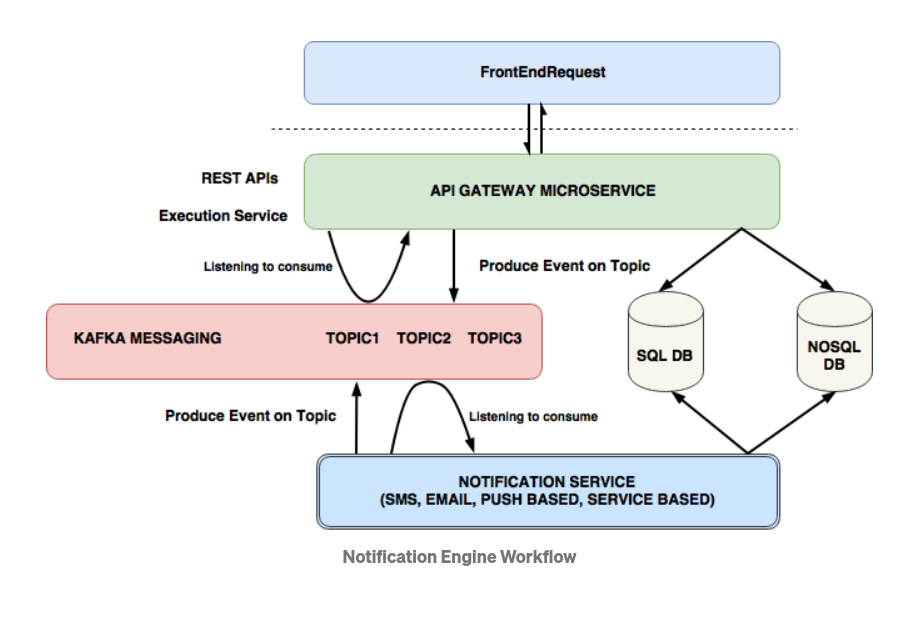

# Notifications

https://softwareengineering.stackexchange.com/questions/334658/notifications-in-a-microservice-architecture-in-application-logic-vs-database

 Do we adopt the philosophy that every microservice should handle their own notifications or should all notifications belong to a service unto themselves and rely on database triggers?
 
 ### The argument for notifications in service
 
 Microservices should be self contained. Each is responsible for its own state, its own model and should \[as much as possible\] not be dependent on another service to function. Notifications are an essential feature for many services. What good is a chat service if you have to open it up every time to check for new chats? On actions, the microservice should fire off notifications - whether directly or by enqueuing it with some mail delivery service. This also helps with mitigation and further development. While iterating on the service, the developer is always aware of what notifications may be sent out depending on changes to the application state.
 
 ### The case for database triggers

Considering the volume of notifications being sent out, it is best to have them centralized. Any updates, additions or deletions of notifications should occur in a single place. Furthermore, having notifications sent from the controller (or actions in flux) is risky, since it is possible that after the action is taken place, the DML operation fails. This would result in a user receiving a notification which is out of sync with the source of truth - the database. By having the notification service solely rely on triggers in the database, it also keeps to service encapsulation. The notification service does not care which service updated which model, only that the model _did_ indeed update. Another risk is multiple applications operating on the same table (while this may seem like poor architecture, you may have an admin app and a user app). If there are multiple services updating a table, you may have multiple notifications going off to users with conflicting entries. By centralizing it, you are able to ensure that only a single notification goes off (perhaps by throttling how many notifications go off in a single interval, thus only notifying the last of the changes).

### Notification as its own microservice 

Make notifications its own microservice. Each microservice can utilize its own internal rules for communicating to the notification microservice. The notification microservice can focus on executing its own internal set of rules for pushing notifications given any of the various validation rules that need to be checked before pushing.

If notifications is its own microservice, then the events that trigger it can originate from multiple sources depending on what is best for the given situation - whether a microservice or a db or any other potential source. If any additional work is needed surrounding sending a particular notification, the microservice can encapsulate it.

--- 

https://medium.com/@prateek.259/notification-engine-as-a-microservice-764bf952f12d

---

Three Options: 

1. A queue where all other services send messages to. The notification microservice would then listen to this queue and send messages accordingly. If the notification service was restarted or taken down, we would not lose any messages as the messages will be stored on the queue.
2. Add a notification message API on the notifications microservice. This would make it easier for all other microservices as they just have to call an API as opposed to integrate with the queue. The API would then internally send the message to the notification Kafka queue and send the message. The only issue here is if the API is not available or there is an error, we will lose messages.
3. Another service that fronts the Queue (separate from the actual service that handles the messages)
    - **Hide the implementation.** This gives you the flexibility to change Kafka out later for something else. Your wrapper API would only respond with a 200 once it has put the notification request on the queue. I also see giving services direct access to "your" queue similar to allowing services to directly interact with a database they don't own. If you allow direct-access to Kafka and Kafka proves to be inadequate, a change to Kafka will require all of your clients to change their code.
    - **Enforce the notification request contract** (ensure the body of the request is well-formed). If you want to make sure that all of the items put on the queue are well-formed according to contract, an API can help enforce that. That will help prevent issues later when the "notifier" service picks notifications off the queue to send.
  

The first design is simple and will work. 

#3 would unfold like:

1.  Client 1 needs to put out a notification and calls Service A POST /notifications
2.  Service A that accepts POST /notifications
3.  Service A checks the request, puts it on Kafka, responds to client with 200
4.  Service B picks up notification request from Kafka queue.

Service A should be run as multiple instances for reliability.