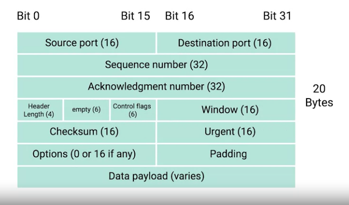
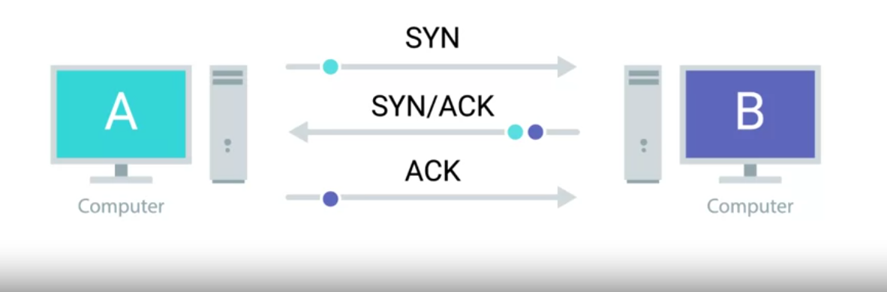
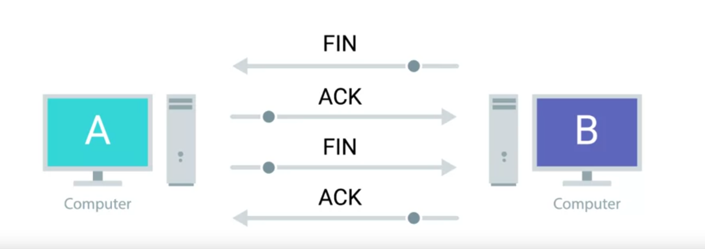

# Networks

## The TCP/IP 5 layer Network Model

| #   | Layer                 | Protocol          | Protocol Data unit | Addressing   |
| --- | --------------------- | ----------------- | ------------------ | ------------ |
| 5   | Application           | HTTP, SMTP, FTP   | Messages           | n/a          |
| 4   | Transport             | TCP, UDP          | Segment            | Port numbers |
| 3   | Network               | IP                | Datagram           | IP Address   |
| 2   | Data Link / Nw Access | Ethernet, WiFi    | Frames             | MAC Address  |
| 1   | Physical              | 10 Base T, 802.11 | Bits               | n/a          |

## Network Switches vs Hubs

- A **hub** is a physical layer device that allows for connections from many computers at once.
- In a hub, all devices talk to ALL other devices all the time.
- This results in a lot of noise on the network callec **collision domain**.
- Hubs are mostly historical artifact today.
- A **network switch** is a level 2 (or data link layer) device (in 5 layer model).
- This means that a switch can actually inspect the contents of the Ethernet
  protocol data being sent around the network, determine which system
  the data is intended for and then only send that data to that one system.

## Routers

- A router is a device that knows how to forward data between independent networks.
- While a hub is a layer one device and a switch is a layer two device. A router operates at layer three, a network layer.
- A Router can inspect IP data to determine where to send things.
- Routers store internal tables containing information about how to route traffic
  between lots of different networks all over the world.
- The most common type of router you'll see is one for a home network, or
  a small office. These devices generally don't have very detailed routing tables.

## Ethernet

- Ethernet, the Data Link layer for wired connections, was first proposed in 1983.
- Ethernet solved the Data collision problems, present in hubs, by using a tecnique known as **Carrier Sense Multiple Access with Collision Detection**. (CSMA/CD)
- CSMA/CD is used to determine when the communications channel is clear, and when a device is free to transmit data.
- The way CSMA/CD works is that
  - if there's no data currently being transmitted on the network segment, a node will feel free to send data.
  - If it turns out that two or more computers end up trying to send data at the same time, the computers detect this collision and stop sending data.
  - Each device involved with the collision then waits a random interval of time before trying to send data again.
  - This random interval helps to prevent all the computers involved in the collision from colliding again the next time they try to transmit anything.

### MAC Addresses

- To Identify which node a transmission is actually meant for, we use **MAC addresses**
- A MAC address is a globally unique identifier attached to an individual network interface.
- It's a 48-bit number normally represented by six groupings of two hexadecimal numbers.
- The first three octets of a MAC address are known as the Organizationally Unique Identifier or OUI.
- These are assigned to individual hardware manufacturers by the IEEE or the Institute of Electrical and Electronics Engineers. This is a useful bit of information to keeping your back pocket because it means that you can always identify the manufacturer of a network interface purely by its MAC address.
- The last three octets of MAC address can be assigned in any way that the manufacturer would like with the condition that they only assign each possible address once to keep all MAC addresses globally unique.
- Ethernet uses MAC addresses to ensure that
  - the data it sends has both an address for the machine that sent the transmission, as well as the one that the transmission was intended for.
  - In this way, even on a network segment, acting as a single collision domain, each node on that network knows when traffic is intended for it.

### IP Addresses

- IP addresses are 32-bit long numbers made up of 4 octets, and each octet is normally described in decimal numbers.
- 8 bits of data, or a single octet,can represent all decimal numbers from 0 to 255.
- This format is known as dotted decimal notation.
- It's important to call out that IP addresses belong to the networks, not the devices attached to those networks. So your laptop will always have the same MAC address, no matter where you use it. But it'll have a different IP address assigned to it on different networks.
- IP address will be assigned to it automatically through a technology known as Dynamic Host Configuration Protocol.
- An IP address assigned this way is known as a dynamic IP address.
- The opposite of this is known as a static IP address, which must be configured on a node, manually.
- In most cases, static IP addresses are reserved for servers and
  network devices, while dynamic IP addresses are reserved for clients.
  But there are certainly situations where this might not be true.

### Classes

- IP addresses can be split into two sections, the network ID, and the host ID.
- There are three primary types of address classes.
  Class A, class B, and class C.
- Class A addresses are those where the first octet is used for the network ID,
  and the last three are used for the host ID.
- Class B addresses are where the first two octets are used for the network ID,
  and the second two, are used for the host ID.
- Class C addresses, are those where the first three octets are used for the network ID, and only the final octet is used for the host ID.

### Address Resolution Protocol (ARP)

- ARP is a protocol used to discover the hardware address of a node with a certain IP address.
- Once an IP datagram has been fully formed, it needs to be encapsulated inside an Ethernet frame. This means, that the transmitting device needs a destination MAC address to complete the Ethernet frame header.
- Almost all network connected devices retain local ARP table. An ARP table is just a list of IP addresses and the MAC addresses associated with them.
- Let's say we want to send some data to the IP address `10.20.30.40`. It might be the case that this destination doesn't have an entry in the ARP table.
- When this happens, the node that wants to send data sends a broadcast ARP message to the Mac broadcast address which is all Fs. These kinds of broadcast ARP messages are
  delivered to all computers on the local network.
- When the network interface that's been assigned an IP of 10.20.30.40 receives this ARP broadcast, it sends back what's known as an ARP response.
- This response message will contain the MAC address for the network interface in question.
- Now, the transmitting computer knows what MAC address to put in the destination hardware address field and the Ethernet frame is ready for delivery.
- It will also likely store this IP address in its local ARP table so that it won't have to send an ARP broadcast the next time he needs to communicate with this IP.
- ARP table entries generally expire after a short amount of time to ensure changes in the network are accounted for

### Subnetting

- Subnetting is the process of taking a large network and splitting it up into many individual smaller subnetworks or subnets.
  - address classes give us a way to break the total global IP space into discrete networks.
    If you want to communicate with the IP address 9.100.100.100, core routers on the Internet know that this IP belongs to the 9.0.0.0 class A network.
  - They then route the message to the gateway router responsible for the network by looking at the network ID. A gateway router specifically serves as the entry and exit path to a certain network. You can contrast this with core Internet routers, which might only speak to other core routers.
  - Once your packet gets to the gateway router for the 9.0.0.0 class A network, that router is now responsible for getting that data to the proper system by looking at the host ID.
  - This all makes sense until you remember that a single class A network contains 16,777,216 individual IPs.
  - That's just way too many devices to connect to the same router.
  - This is where subnetting comes in. With subnets, you can split your large network up into many smaller ones. These individual subnets will all have their own gateway routers serving as the ingress and egress point for each subnet.

### Subnet Masks and Subnet IDs

- Subnet Masks and Ids are to be considered for two cases, for Network Classes and CIDR. Below is for Network Classes.

- IP Address :: 9 - 100 - 100 - 100
- IP Address (Binary) :::: 0000 1001 . 0110 0100 . 0110 0100 . 0110 0100
- Subnet Mask :::::::::::: 1111 1111 . 1111 1111 . 1111 1111 . 0000 0000 (255.255.255.0) (24 1s 8 0s)

- Since `9` is the network class, the remaining bits after it and corrsponding to `1s` in subnet masks are subnet id, hence above `0110 0100 . 0110 0100`, the last octet is the host id
- Since we only have one octet for hosts, we have 2^8 hosts available, and out of those, the first `0000 0000` and `1111 1111` are reserved (latter for broadcast)

- Subnet mask like 255.255.255.224 translates to 27 `1s`, the shorthand can be `/27`, hence the above IP will be `9.100.100.100/27`.

### Problem with Network classes

- Address classes were the first attempt at splitting up the global Internet IP space.
- Subnetting was introduced when it became clear that address classes themselves weren't as efficient way of keeping everything organized.
- But as the Internet continued to grow, even traditional subnetting just couldn't keep up.
- With traditional subnetting and the address classes, the network ID is always either 8 bit for class A networks, 16 bit for class B networks, or 24 bit for class C networks.
- This means that there might only be 254 classing networks in existence, but it also means there are 2,970,152 potential class C networks.
- That's a lot of entries in a routing table.
- To top it all off, the sizing of these networks aren't always appropriate for the needs of most businesses
- 254 hosts in a class C network is too small for many use cases, but the 65,534 hosts available for use in a class B network is often way too large.
- Many companies ended up with various adjoining class C networks to meet their needs. That meant that routing tables ended up with a bunch of entries for a bunch of class C networks that were all actually being routed to the same place.

### CIDR (Classless Inter-domain routing)

- CIDR is an even more flexible approach to describing blocks of IP addresses.
- It expands on the concept of subnetting by using subnet masks to demarcate networks. To demarcate something means to set something off. (demarcation means where one network or system ends and another one begins)
- In our previous model, we relied on a network ID, subnet ID, and host ID to deliver an IP datagram to the correct location. With CIDR, the network ID and subnet ID are combined into one.
- CIDR basically just abandons the concept of address classes entirely,
  allowing an address to be defined by only two Individual IDs
- Earlier, network sizes were static. Think only class A, class B or, class C, and only subnets could be of different sizes.
- CIDR allows for networks themselves to be differing sizes. Before this, if a company needed more addresses than a single class C could provide, they need an entire second class C.
- With CIDR, they could combine that address space into one contiguous chunk with a net mask
  of /23 or 255.255.254.0.
- This means, that routers now only need to know one entry in their routing table to deliver traffic to these addresses instead of two.
- So, For Example, if a /24 network has two to the eight or 256 potential hosts, you really only have 256 minus two, or 254 available IPs to assign. If you need two networks of this size, you have a total of 254 plus 254 or 508 hosts. A single /23 network, on the other hand, is two to the nine or 512. 512 minus two, 510 hosts.

#### Routing Tables

Each Router stores a Routing table with at least the following four columns (with millions of rows)

- Destination N/w
  - This column would contain a row for each N/w the router know about, consists of usually a network IP and a net mask.
  - There usually also is a catcha-all entry that matches any IP address that does not have an explicit listing for.
- Net Hop
  - IP Address of the next router that should receive data intended for the destination networking question. OR this could just state that the network is directly connected and that there arent any additional hops.
- Total hops
  - The total hops needed to reach that router.
  - Thus, the router keeps trach of how far away that destination network is,
  - this number can change at any time.
- Interface
  - this is the anme of the interface on the router, which the router should forward the traffic that matches this row's network destination.

#### Routing Protocols

These protocols help routers keep up to date information about the routers next to them or far away.

There are two main Categories

- Interior gateway protocols
  - Distance Vector routing
  - Link State Routing
- Exterior Gateway protocols

##### Interior gateway protocol

- Used by routers to share information within a single autonomous system
  - an autonomous system is a collection of networks that all fall under the control of a single network operator. e.g. large corporation or a nation wide ISP
- In contrast, exterior gateway protocols are used for exchange of info b/w independent autonomous systems.

##### Distance Vector protocol

- A now outdated system, in which a router takes its routing table and shares it with every router immediately adjacent to it.
- since a list is known as vector in CS, that's why this sharing of Routing tables (list) is so named.
- This protocol does not allow for a router to have much information about the state of the world outside of their own direct neighbours.
- Because of this a router might be slow to react to changes in the network that happen far away from it.

##### Link State Protocol

- Here, each router advertises the state of the link of each of its interfaces.
- These interfaces can be connected to other routers or they could be direct connections to networks.
- The information about each router is propagated to every other router on the autonomous system.
- This means that every router on the system knows every detail about every other router in the system.
- Each router then uses this info and runs complicated algos against it to determine the best path to any destination network.
- Link state protocols require both more memory in order to hold all of this data
  and also much more processing power. This is because it has to run algorithms against this data in order to determine the quickest path to update the routing tables.
- As computer hardware has become more powerful and cheaper over the years, link state protocols have mostly made distance vector protocols outdated.

##### Exterior Gateway Protocols

- are used to communicate data between routers representing the edges of an autonomous system.
- Routers use this protocol when they need to share information across different organizations.
- the **IANA**, or Internet Assigned Numbers Authority, is a non-profit organization that helps manage things like IP Address allocation. Along with managing IP Addresses, the IANA is also responsible for **ASN** or Autonomous System Number allocation
- ANSs are 32-bit numbers just like IP addresses, assigned to individual autonomous systems.
- They're normally referred to as a single decimal number.
  - Because ASNs dont need to change
  - They arent meant to be human readable often
- AS19604 for example, belongs to IBM.

##### Examples of above protocols

- The most common distance vector protocols are
  - RIP (Routing Information protocol)
  - EIGRP (Enhanced Interior Gateway Routing Protocol)
- The most common Link state protocol is
  - OSPF (Open Shortest Path First)
- There's only one exterior gateway protocol, called BGP (Border Gateway Protocol)

#### Non-Routable Address Space

- RFC 1918 outlined a number of networks that would be defined as non-routable addresses.
- Non-routable address space are a range of IPs set aside for use by anyone that cannot be routed to.
- No every computer connected to the internet needs to communicate with every other computer, so these address space allow for nodes on such a network to commmunicate with each other but no gateway router will attempt to forward traffic to this type of network.
- RFC 1918 defined three ranges of IP addresses that will never be routed anywhere by co-routers. That means that they belong to no one and that anyone can use them. In fact, since they are separated from the way traffic moves across the internet, there's no limiting to how many people might use these addresses for their internal networks.
- The primary range of these non-routable address space are
  - 10.0.0.0/8
  - 172.16.0.0/12
  - 192.168.0.0/16

## Transport Layer

- Multiplexing in the transport layer means that nodes on the network have the ability to direct traffic toward many different receiving services.
- De-multiplexing is the same concept, just at the receving end. It;s taking traffic that's all aimed at the same node and delivering it to the proper receiving service.
- The Transport layer handles Multiplexing and demultiplexing through ports.
- A port is a 16-bit number that's used to direct traffic to specific services running on a networked computer.
- Different network services run while listening on specific ports for
  incoming requests.
  - Ports are normally denoted with a colon after the IP address.
  - For example, the traditional port for HTTP or unencrypted web traffic is port 80.
    If we want tor request the webpage from a web server running on a computer listening
    on IP 10.1.1.100, the traffic would be directed to port 80 on that computer.
  - So the full IP and port in this scenario could be described as 10.1.1.100:80.
    When written this way, it's known as a socket address or socket number.
- The same device might also be running an FTP or file transfer protocol server.
  FTP is an older method used for transferring files from one computer
  to another, but you still see it in use today.
  - FTP traditionally listens on port 21, so if you wanted to establish a connection to
    an FTP server running on the same IP that our example web server was running on,
    you direct traffic to 10.1.1.100 port 21

### TCP Segment

Just like how an Ethernet frame encapsulates an IP datagram,
an IP datagram encapsulates a TCP segment.
Remember that an Ethernet frame has a payload section
which is really just the entire contents of an IP datagram.
Remember also that an IP datagram has
a payload section and this is made up of what's known as a TCP segment.
A TCP segment is made up of a TCP header and a data section.
This data section, as you might guess,
is just another payload area for where the application layer places its data

- Destination Port: The destination port is the port of the service the traffic is intended for.
- A source port is a high numbered port chosen from a special section of ports known as ephemeral ports.
  - a source port is needed so that when the web server replies,
    the computer making the original request can send
    this data to the program that was actually requesting it
- Sequence Number: a 32-bit number that's used to keep track of where in a sequence of TCP segments this one is expected to be.
  - You might remember that lower on our protocol stack, there are limits to the total size of what we send across the wire.
  - In Ethernet frame, it's usually limited in size to 1,518 bytes, but we usually need to send way more data than that.
  - At the transport layer, TCP splits all of this data up into many segments.
  - The sequence number in a header is used to keep track of which segment out of many this particular segment might be.
- The acknowledgment number is the number of the next expected segment.
  - In very simple language, a sequence number of one and an acknowledgement number of
    two could be read as this is segment one,
    expect segment two next.
- Data offset field: four-bit number that communicates how long the TCP header for this segment is
- six bits that are reserved for the six TCP control flags
- A TCP window specifies the range of sequence numbers that might be sent before an acknowledgement is required.
  - TCP is a protocol that's super reliant on acknowledgements.
    This is done in order to make sure that all expected data is actually being
    received and that the sending device doesn't
    waste time sending data that isn't being received.
- The next field is a 16-bit checksum.
  - It operates just like the checksum fields at the IP and Ethernet level.
- Urgent pointer fields and options field are rarely used.
- padding is a sequence of zeroes to ensure that the payload section begins at the expected location

#### TCP Control Flags

- As a protocol, TCP establishes connections used to send long chains of segments of data.
  - contrasted with the protocols that are lower in the networking model. These include IP and Ethernet, which just send individual packets of data.
- The way TCP establishes a connection, is through the use of different TCP control flags,
  used in a very specific order.
- There are 6 TCP Control Flags
  1. URG (Urgent)
     - A value of one here indicates that the segment is considered urgent and that the urgent pointer field has more data about this. (Not used often)
  2. ACK, (Acknowledge).
     - A value of one in this field means that the acknowledgment number field should be examined.
  3. PSH (Push)
     - This means, that the transmitting device wants the receiving device to push currently buffered data to the application on the receiving end as soon as possible.
     - A buffer is a computing technique, where a certain amount of data is held somewhere,
       before being sent somewhere else.
     - In terms of TCP, it's used to send large chunks of data more efficiently.
     - By keeping some amount of data in a buffer, TCP can deliver more meaningful chunks of data to the program waiting for it. But in some cases, you might be sending a very small amount of information, that you need the listening program to respond to immediately.This is what the push flag does.
  4. RST (Reset)
     - This means, that one of the sides in a TCP connection hasn't been able to properly recover from a series of missing or malformed segments.
     - It's a way for one of the partners in a TCP connection to basically say, "Wait, I can't put together what you mean, let's start over from scratch."
  5. SYN (Synchonize)
     - It's used when first establishing a TCP connection and make sure
       the receiving end knows to examine the sequence number field
  6. FIN (Finish)
     - When this flag is set to one, it means the transmitting computer doesn't have
       any more data to send and the connection can be closed.

#### Three way Handshake (to initiate a connection)

  
Three way Handshake diagram

#### Four way Handshake (to close a connection)

  
Four way Handshake diagram

### TCP Sockets and Socket States

- A socket is the instantiation of an endpoint in a potential TCP connection. An instantiation is the actual implementation of something defined elsewhere.
- TCP sockets require actual programs to instantiate them.
- You can contrast this with a port which is more of a virtual descriptive thing.
- In other words, you can send traffic to any port you want, but you're only going to get a response if a program has opened a socket on that port.
- TCP sockets can exist in lots of states

  - Listen
    - Listen means that a TCP socket is ready and listening for incoming connections.
      You'd see this on the server side only.
  - SYN_SENT.
    - This means that a synchronization request has been sent,
      but the connection hasn't been established yet.
      You'd see this on the client side only
  - SYN_RECEIVED.
    - This means that a socket previously in a listener state,
      has received a synchronization request and sent a SYN_ACK back.
      But it hasn't received the final ACK from the client yet.
      You'd see this on the server side only.
  - ESTABLISHED. This means that the TCP connection is in working order, and both sides are free to send each other data. You'd see this state on both the client and server sides of the connection.
  - FIN_WAIT. This means that a FIN has been sent,
    but the corresponding ACK from the other end hasn't been received yet.
  - CLOSE_WAIT. This means that the connection has been closed at the TCP layer, but that the application that opened the socket hasn't released its hold on the socket yet.
  - CLOSED. This means that the connection has been fully terminated,
    and that no further communication is possible.
    There are other TCP socket states that exist.

- Additionally, socket states and their names, can vary from operating system to operating system. That's because they exist outside of the scope of the definition of TCP itself.

### Connection Oriented (TCP) vs Connectionless Protocols (UDP)

- A connection-oriented protocol is one that establishes a connection, and uses this to ensure that all data has been properly transmitted.
- A connection at the transport layer implies that every segment of data sent is acknowledged.
  This way, both ends of the connection always know which bits of
  data have definitely been delivered to the other side and which haven't
- Connection-oriented protocols are important because the Internet is a vast and busy place,
  and lots of things could go wrong while trying to get data from point A to point B.
- Anything can go wrong when transmitting packets . Connection-oriented protocols like TCP protect against this by forming connections and through the constant stream of acknowledgements.
- Our protocols at lower levels of our network model like IP and Ethernet do use checksums to ensure that all the data they received was correct.And they do not resend data. Re-sending of data is decided by TCP layer.
- At the IP or Ethernet level, if a checksum doesn't compute, all of that data is just discarded.
- It's up to TCP to determine when to resend this data since TCP expects an ACK for every bit of data it sends, it's in the best position to know what data successfully got
  delivered and it can make the decision to resend a segment if needed.
- This is another reason why sequence numbers are so important. While TCP will generally send all segments in sequential order, they may not always arrive in that order.
- If some of the segments had to be resent due to errors at lower layers, it doesn't matter if they arrive slightly out of order. This is because sequence numbers allow for all of the data to be put back together in the right order. It's pretty handy.
- there's a lot of overhead with connection-oriented protocols like TCP. You have to establish the connection, you have to send a stream of constant streams of acknowledgements,
  you have to tear the connection down at the end. That all accounts for a lot of extra traffic.
  While this is important traffic, it's really only useful if you absolutely positively have to be sure your data reaches its destination.
- You can contrast this with connectionless protocols. The most common of these is known as UDP, or **User Datagram Protocol**
- Unlike TCP, UDP doesn't rely onconnections and it doesn't even support the concept of an acknowledgement.
- With UDP, you just set a destination port and send the packet. This is useful for messages that aren't super important. A great example of UDP is streaming video. Where even of one or two frames are missed here or there, it doesn't really matter.
- By getting rid of all the overhead of TCP, you might actually be able to send higher quality video with UDP.

#### System Ports vs Ephemeral Ports

- https://www.youtube.com/watch?v=mykX2YONRwE

Transportation layer protocols use a concept of ports and multiplexing/demultiplexing to deliver data to individual services listening on network nodes. These ports are represented by a single 16-bit number, meaning that they can represent the numbers 0-65535.

This range has been split up by the IANA (**Internet Assigned Numbers Authority**) into independent sections:

Port 0 isn’t in use for network traffic, but it’s sometimes used in communications taking place between different programs on the same computer.

Ports 1-1023 are referred to as **system ports**, or sometimes as **“well-known ports.”** These ports represent the official ports for most well-known network services. HTTP normally communicates over port 80, while FTP usually communicates over port 21. In most operating systems, administrator-level access is needed to start a program that listens on a system port.

Ports 1024-49151 are known as **registered ports**. These ports are used for lots of other network services that might not be quite as common as the ones that are on system ports. A good example of a registered port is 3306, which is the port that many databases listen on. Registered ports are sometimes officially registered and acknowledged by the IANA, but not always. On most operating systems, any user of any access level can start a program listening on a registered port.

Finally, we have ports 49152-65535. These are known as **private or ephemeral ports**. Ephemeral ports can’t be registered with the IANA and are generally used for establishing outbound connections. You should remember that all TCP traffic uses a destination port and a source port. When a client wants to communicate with a server, the client will be assigned an ephemeral port to be used for just that one connection, while the server listens on a static system or registered port.

Not all operating systems follow the ephemeral port recommendations of the IANA. In this lesson, we’ll continue to assume that the ephemeral ports used for outbound connections consist of the ports 49152 through 65535. But it’s important to know that this exact range can vary depending on the platform you’re working on. Sometimes portions of the registered ports range are used, but no modern operating system will ever use a system port for outbound communication

### Firewalls

- A firewall is just a device that blocks traffic that meets certain criteria.
  Firewalls are a critical concept to keeping a network secure since they
  are the primary way you can stop traffic you don't want from entering a network.
- Firewalls can actually operate at lots of different layers of the network.
  There are firewalls that can perform inspection of application layer traffic,
  and firewalls that primarily deal with blocking ranges of IP addresses.
- Firewalls that operate at the transportation layer
  will generally have a configuration that enables them to block traffic
  to certain ports while allowing traffic to other ports
- Firewalls are sometimes independent network devices, but
  it's really better to think of them as a program that can run anywhere.
  For many companies and almost all home users, the functionality of a router and
  a firewall is performed by the same device.
  And firewalls can run on individual hosts instead of being a network device.
  All major modern operating systems have firewall functionality built-in.

## Application Layer

- There are many application protocols, but for each application type, the protocol is still standardized.
  - The same is true for most other classes of application.
    You might have dozens of choices for an FTP client, but
    they all need to speak the FTP protocol in the same way.
- In the more commonly used in academia, the OSI (Open Systems Iterconnection) model, there are two more layers between application layer and transport layer, namely, Session and Presentation Layer
  - Session: sits above transport, The concept of a session layer is that it's responsible for
    things like facilitating the communication between actual applications and
    the transport layer.
    It's the part of the operating system that takes the application layer data
    that's been unencapsulated from all the layers below it, and
    hands it off to the next layer in the OSI model, the presentation layer.
  - Presentation layer: The presentation layer is responsible for
    making sure that the unencapsulated application layer data
    is actually able to be understood by the application in question.
    This is the part of an operating system that might handle encryption or
    compression of data.

#### NOTE: Watch the video to see how all the layers work together to perform the task of sending data over a network.
