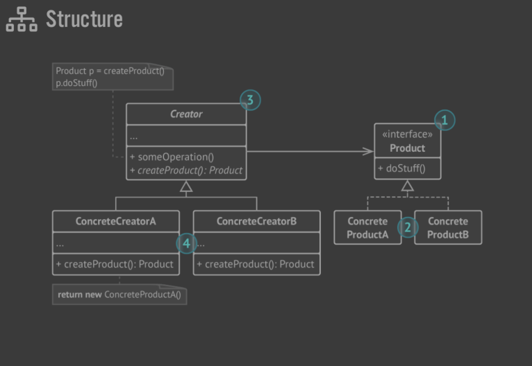

# Creational Design Patterns

## Factory Method (aka Virtual Contructor)

- Factory Method is a creational design pattern that provides an interface for creating objects in a superclass, but allows subclasses to alter the type of objects that will be created.

### Structure

1. The `Product` declares the interface, which is common to all objects that can be produced by the creator and its subclasses.
2. `Concrete Products` are different implementations of the product interface.
3. The `Creator` class declares the factory method that returns new product objects. It’s important that the return type of this method matches the product interface.
4. Concrete Creators override the base factory method so it returns a different type of product.

- Note, despite its name, product creation is not the primary
  responsibility of the creator. Usually, the creator class already
  has some core business logic related to products. The factory
  method helps to decouple this logic from the concrete prod-
  uct classes.

### Applicability

- used when we dont know beforehand the exact types and dependencies of the objects your code should work with.
- The Factory Method separates product construction code from the code that actually uses the product. Therefore it’s easier to extend the product construction code independently from the rest of the code.
- used when we want to provide the users of our library or f/w with a way to extend its internal components
- Used when we want to save System resources by reusing existing objects instead of rebuilding each time.

### Pros and Cons

- Avoids tight coupling between creator and concrete products.
- Single Responsibility Principle
- Open Closed Principle - we can introduce new types of products without breaking existing code.

* The code becomes complicated since we need to introduce a lot of new subclasses
