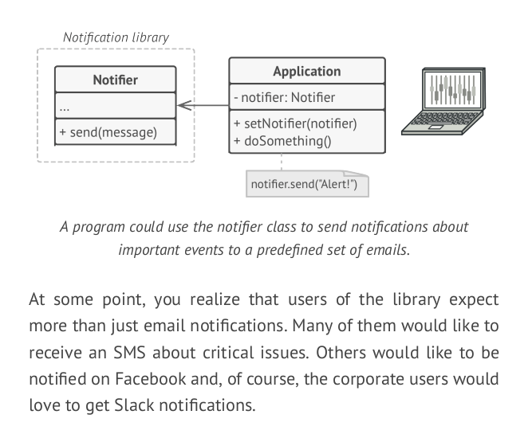
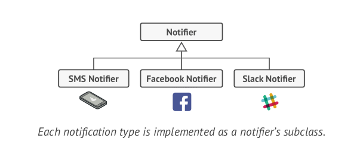
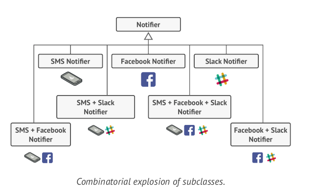
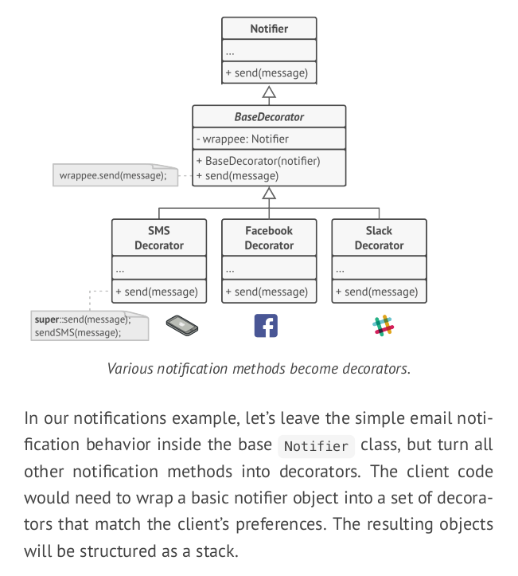
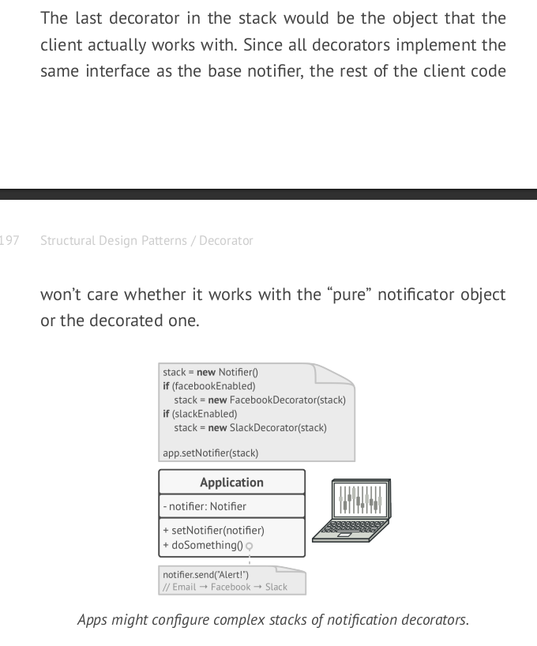
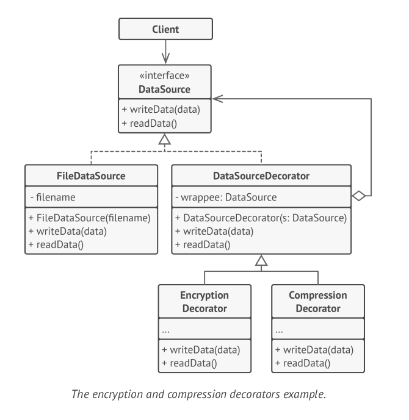

# Decorator Pattern

Decorator is a structural design pattern that lets you attach new behaviors to objects by placing these objects inside special wrapper objects that contain the behaviors.

Example: 







If we keep extending classes for each notification type and possible notification combinations, we will soon run into trouble.
    - Inheritance is static, it cannot alter the behaviour of an object at runtime
    - Subclasses can have just one parent class

One of the ways to overcome these caveats is by using _Composition_ instead of _Inheritance_.
- With composition one object has a reference to another and delegates it some work 
- whereas withinheritance, the object itself is able to do that work, inheriting the behavior from its superclass.

Wrapper is the alternative nickname for the Decorator pattern that clearly expresses the main idea of the pattern.
  - A “wrapper” is an object that can be linked with some “target” object.
  - The wrapper contains the same set of methods as the target and delegates to it all requests it receives. 
  - However, the wrapper may alter the result by doing something either before or after it passes the request to the target.
  
##### Implementation: 
 
 



 ##### Another Example
 
 


 
*** 

### Code 

```csharp
interface IMessage 
{
    void PrintMessage();
}

abstract class Message : IMessage 
{
    protected string _text;
    public Message(string text) 
    {
        _text = text;
    }
    
    abstract public void PrintMessage();
}


class SimpleMessage : Message
{
    public SimpleMessage(string text) : base(text) { }
    
    public override void PrintMessage()
    {
        Console.WriteLine(_text);
    }
}

class AlertMessage : Message 
{
    public AlertMessage(string text) : base(text) { }
    public override void PrintMessage()
    {
        Console.Beep(); // extra functionality
        Console.WriteLine(_text);
    }
}

```

We create a generic Decorator to cater to all of different types of message printers

```csharp
abstract class MessageDecorator : IMessage 
{
    protected Message _message;
    public MessageDecorator(Message msg)
    {
        _message = msg;
    }
    
    public abstract void PrintMessage();
}

class NormalDecorator : MessageDecorator
{
    public NormalDecorator(Message message) : base(message) { }
    
    public override void PrintMessage()
    {
        Console.ForegroundColor = ConsoleColor.Green;
        _message.PrintMessage();
        Console.ForegroundColor = Console.Color.White;
    }

}

class ErrorDecorator : MessageDecorator
{
    public ErrorDecorator(Message message) : base(message) { }
    public override void PrintMessage()
    {
        Console.ForegroundColor = ConsoleColor.Red;
        _message.PrintMessage();
        Console.ForegroundColor = ConsoleColor.White;
    }
}


static void Main(string[] args)
{
    var messages = new List<IMessage>
    {
        new NormalDecorator(new SimpleMessage("First Message!")),
        new NormalDecorator(new AlertMessage("Second Message with a beep!")),
        new ErrorDecorator(new AlertMessage("Third Message with a beep and in red!")),
        new SimpleMessage("Not Decorated...")
    };
    
    foreach (var message in messages)
    {
    message.PrintMessage();
    }
    
    Console.Read();
}

```


