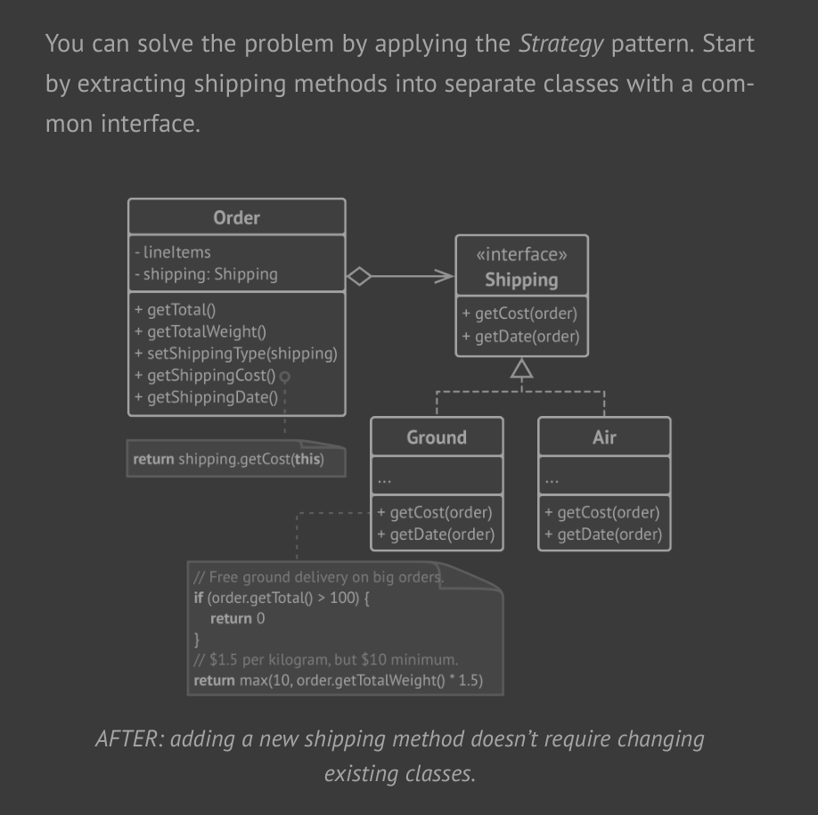
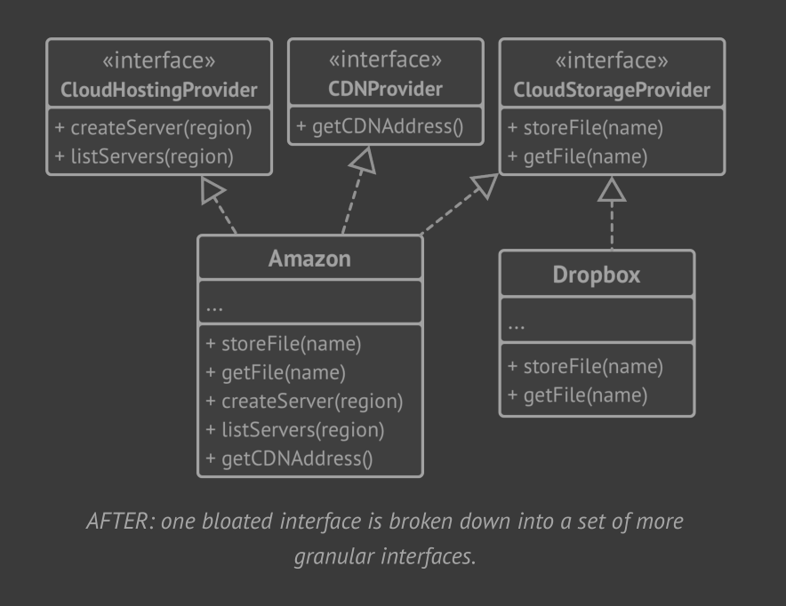
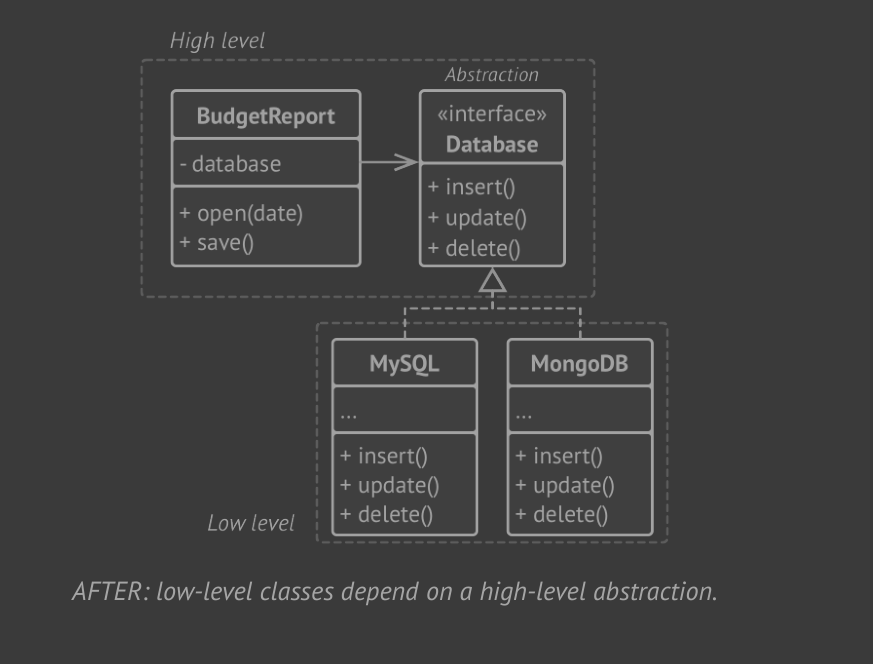

# SOLID Principles

## Single Responsibility Principle

A class should have only one reason to change

- Try to make every class responsible for a single part of the
  functionality provided by the software, and make that respon-
  sibility entirely encapsulated by (you can also say hidden with-
  in) the class.

### Example

## Open Closed Principle

**Classes should be open for extension but closed for modification.**

The main idea of this principle is to keep existing code from breaking when you implement new features.

A class is open if you can extend it, produce a subclass and do whatever you want with it—add new methods or fields, override base behavior, etc.

Some programming languages let you restrict further extension of a class with special keywords, such as `final` . After this, the class is no longer open.

At the same time, the class is closed (you can also say complete) if it’s 100% ready to be used by other classes—its interface is clearly defined and won’t be changed in the future.

In terms of this principle, a class can be both open (for extension) and closed (for modification) at the same time.

### Example

## Liskov's Substitution Principle

When extending a class, remember that you should be able to pass objects of the subclass in place of objects of the parent class without breaking the client code.

This means that the subclass should remain compatible with the behavior of the superclass. When overriding a method, extend the base behavior rather than replacing it with something else entirely.

The substitution principle is a set of checks that help predict whether a subclass remains compatible with the code that was able to work with objects of the superclass. This concept is critical when developing libraries and frameworks because your classes are going to be used by other people whose code you can’t directly access and change.

### Guidelines

- Parameter types in a method of a subclass should match or be more abstract than parameter types in the method of the superclass.
  - Say theres a method with signature `feed(Cat c)`
  - Good: we create a subclass that overrode the method to feed any `Animal` a (superclass of `Cat`), i.e. `feed(Animal a)`, this works fine becase all `Cats` are `Animals`.
  - Bad: we create a subclass that overrode the method to feed `BengalCat`, a sub class of `Cat`, i.e. `feed(BengalCat c)`, this breaks the code.
- The return type in a method of a subclass should match or be a subtype of the return type in the method of the superclass.
  - This is inverse of the above
  - so you can return a `BengalCat` in place of `Cat`, but not `Animal`
- A method in a subclass shouldn’t throw types of exceptions which the base method isn’t expected to throw.
- A subclass shouldn’t strengthen pre-conditions.
  - eg. A class has a method that returns `int`, a subclass should not have a method that says that `int` return should not be negative, this strengthens the preconditions. The client code, which used to work fine when passing negative numbers into the method, now breaks if it starts working with an object of this subclass.
- A subclass shouldn’t weaken post-conditions
  - say, a class's method uses and disposes db connection
  - a subclass, however, implements a method which does not close the db connection
- Invariants of a superclass must be preserved
  - This is probably the least formal rule of all.
  - Invariants are conditions in which an object makes sense. For example, invariants of a cat are having four legs, a tail, ability to meow, etc.
  - The confusing part about invariants is that while they can be defined explicitly
    in the form of interface contracts or a set of assertions within methods, they could also be implied by certain unit tests and expectations of the client code.
- A subclass shouldn’t change values of private fields of the superclass.
  - Possible in some languages, not all
  - in C#, a private field is not directly accessible by the sub class, however, it can be used indirectly, for example, if a `base` class's member uses it.

## Interface Segregation Principle

Clients shouldn’t be forced to depend on methods they do not use.

- Try to make your interfaces narrow enough that client classes don’t have to implement behaviors they don’t need.

### Example

## Dependency Inversion Principle

High-level classes shouldn’t depend on low-level classes. Both should depend on abstractions. Abstractions shouldn’t depend on details. Details should depend on abstractions.

Usually when designing software, you can make a distinction between two levels of classes.
• Low-level classes implement basic operations such as working with a disk, transferring data over a network, connecting to a database, etc.
• High-level classes contain complex business logic that directs low-level classes to do something.

### Example

