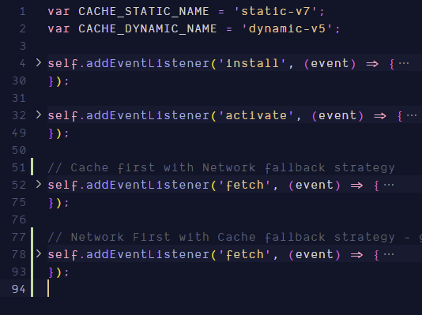

# Progressive Web Apps

Progressively enhanced web apps look and feel like native apps on smaller devices.

They aim to be: 
- reliable: Load fast and provide offline functionality
- Fast: Respond quickly to user actions.
- Engaging: Feels like a native app on mobile devices.


## PWAs vs Native Apps vs Traditional Web Apps 

|                      | Capability                           | Reach                                                          |
|----------------------|--------------------------------------|----------------------------------------------------------------|
| Native Apps          | Across Devices (Leverage OS)         | Top 3 apps in search results win, rest lose                    |
| Traditional Web Apps | Highly Limited Device feature access | High Reach, No Borders                                         |
| PWAs                 | Access Device Feature (Leverage OS)  | High Reach, No Borders (Not limited by any app store as well). |

## Core Building blocks of PWA 

- Service Workers
    - Background Sync
    - Caching / offline support 
    - Web Push (Mobile like Push Notifications)
    - Enable other PWA features
- App Manifest 
    - Allows addition to Homescreen (make an app "Installable")
- Responsive Design
    - App/Layout should work and look good across Devices
- GeoLocation API
- Media API
- Camera API

—

## App Manifest JSON file 

- `appmanifest.json` file allows a wen app to become installable.
- To use App Manifest files, we go to each "page" (each html file) in our app, and add it in `<head>` tag as a `<link>`
    - For SPAs, that will usually be the main `index.html` file 
    - but if we have multiple html pages, need to add the app manifest link to each of them.

### Browser Support 

https://caniuse.com/web-app-manifest


### Manifest Properties 

```json
{
    "name": "Instagram", // Long name of the app (e.g. On Splash Screen)
    "short_name": "Insta", // short name of the app (e.g. below icon)
    "start_url": "/index.html", // the page to load on start-up 
    "scope": ".",  // which pages are included in "PWA experience"
    "display": "standalone", // Should it look like a Standalone app
    "background_color": "#fff",  // while loading and splash screen
    "theme_color": "#abc123",
    "description": "any",
    "dir": "ltr", // Read direction
    "orientation": "portrait-primary", // Set and enforce default orientation
    "icons": [{
        "src": "/../..",
        "type": "image/png",
        "sizes": "48x48"
    }],
    "related_applications": [{  // a local/native app related to our app we want the user to install
        "platform": "play",
        "url": "https//..",
        "id": "com.example.app1"
    }]
}
```

More details here: https://developer.mozilla.org/en-US/docs/Web/Manifest

and here: https://web.dev/add-manifest/

—

## Service Workers 

JS code in browser runs on a single thread and can access DOM

Service workers also run on a single, but separate thread, decoupled from HTML pages.
    - Thus, SW cannot access DOM.
    - Manages all pages of a given scope (e.g. all pages of a domain)
    - Lives on even after pages have been closed.
    - Sit in the background, listen and react to events happening in main JS code.

### Listenable events in Service workers

| Event                    | Source                                                                    |
|--------------------------|---------------------------------------------------------------------------|
| Fetch                    | Browser or Page-related JS initiates a fetch / HTTP request               |
| Push Notifications       | SW receives Web Push Notification (from Server)                           |
| Notification interaction | User interacts with displayed Notification                                |
| Background Sync          | SW receives Background Sync Event (e.g. internet connection was restored) |
| Service Worker Lifecycle | Service Worker phase changes                                              |


### Service Worker Browser Support

https://jakearchibald.github.io/isserviceworkerready/

### Registering a Service Worker 

In your main Javascript file (app.js or index.js when in React)


In `sw.js`



### Service Worker FAQs

- **Is the Service Worker installed everytime I refresh the page?**
    - No, the browser won't install the SW unless the code changed (though it does execute the `regisster()` function on every refresh).

- **Can I unregister a Service Worker**
    - Yes

- **Can I have multiple 'fetch' listeners in a service worker?***
    - Yes

- **Can I have multiple service workers on a page?**
    - Yes, but only with different **scopes**. So, e.g. we can have one separate SW for the "/help" directory and one for the rest of the app.
        - The more specific service worker (=> /help) overwrites the other one for its scope.

- **Can Service Workers communicate with my Page/ the "normal" JavaScript code there?**
    - Yes, that's possible using messages.
    - This is actually not Service Worker specific, it applies to all Web Workers.

- **What's the difference between Web Workers and Service Workers?**
    - Service Workers are a special type of Web Workers.
    - Web Workers also run on a background thread, decoupled from the DOM. 
        - They don't keep on living after the page is closed though. 
    - The Service Worker on the other hand, keeps on running (depending on the operating system) and also is decoupled from an individual page.

—

## Browser Cache API 

Both SW and Normal JS on a page can access the Browser Cache API. 

Browser Cache is a key-value storage.

In PWA, we often check the Cache for a request before actually making that request on the network.

### Browser Support 

https://developer.mozilla.org/en-US/docs/Web/API/Cache


— 

## Caching in PWAs

Caching in PWAs revolves around following 
    
- Static Caching 
    - Caching App Shell
    - things like `index.html`, JS bundles, css files, fonts etc
    


- Dynamic Assets
    - We can cache custom routes that the user visit by handling fetch events in SW
- On Demand 
    - User can opt to store pages in cache, for later access (e.g. a news article)
- Offline Fallback Page
    - When the user is offline and goes to a page we have not cached yet, we should show this page

### Caching Strategies

### Strategy 1: Network Only 


The default, with no caching, app is online only

#### Strategy 2: Cache Only


Makes the app offline only


#### Strategy 3: Cache with Network Fallback 


Pros 
    - Faster - because we fetch a page from the cache whenever it's available 

Cons 
    - Some resources could get old which should be up to date


### Strategy 4: Network with Cache Fallback 


Pros 
    - Best of both worlds?

Cons
    - We don't take advantage of the faster responds time of the cache if a page is available in cache
    - Leads to far worse UX when the network connection is poor and fails after some time (instead of failing instantly). 

### Strategy 5: Cache, then Network


 This strategy is useful in a lot of cases.
     Steps: 
         - The page directly access the cache in (1), and we get the value back, no SW installed here
             - Need to be careful about not overwriting the network response if the network response happends to be faster than cache access.
         - At the same time to (1), we send a request to SW, which sends a network request to fetch the page. 
         - The response goes back to SW, which stores the response in cache (cache updated)
         - SW returns the data to the page
 
- In this startegy, the saving to Cache part (#4 in the diagram) is done in the sw.js file by handling the fetch event fired for the network request in (#3).

- One drawback of this strategy is that if we use it for all requests (without proper care/handling), offline stops working. 
 
- When the network returns quicker than cache (in step 2), some mechanism should be in place to then not show the cached page).