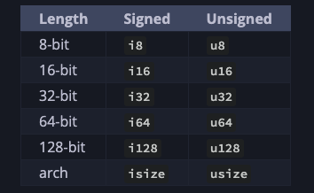
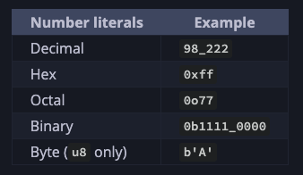

# Rust - Common Concepts

### Constants

Like immutable variables, _constants_ are values that are bound to a name and are not allowed to change, but there are a few differences between constants and variables.

First, 
- you aren’t allowed to use `mut` with constants. 
- Constants aren’t just immutable by default— they’re always immutable. 
- You declare constants using the `const` keyword instead of the `let` keyword, and the type of the value _must_ be annotated.
- Constants can be declared in any scope, including the global scope, which makes them useful for values that many parts of code need to know about.
- The last difference is that constants may be set only to a constant expression, not the result of a value that could only be computed at runtime.

```rust
const THREE_HOURS_IN_SECONDS: u32 = 60 * 60 * 3;
```

### Shadowing

You can declare a new variable with the same name as a previous variable. 

Rustaceans say that the first variable is _shadowed_ by the second, which means that the second variable’s value is what the program sees when the variable is used. 

We can shadow a variable by using the same variable’s name and repeating the use of the `let` keyword as follows:

```rust
fn main() {
    let x = 5;

    let x = x + 1;

    {
        let x = x * 2;
        println!("The value of x in the inner scope is: {}", x);
    }

    println!("The value of x is: {}", x);
}
```

Shadowing is different from marking a variable as `mut`, because we’ll get a compile-time error if we accidentally try to reassign to this variable without using the `let` keyword. 

By using `let`, we can perform a few transformations on a value but have the variable be immutable after those transformations have been completed. 

The other difference between `mut` and shadowing is that because we’re effectively creating a new variable when we use the `let` keyword again, we can change the type of the value but reuse the same name.

```rust
fn main() {
    let spaces = "   ";
    let spaces = spaces.len();
}
```

However, if we try to use `mut` for this, as shown here, we’ll get a compile-time error:

```rust
fn main() {
    let mut spaces = "   ";
    spaces = spaces.len();  // compile time error
}
```


### Scalar Types

A _scalar_ type represents a single value. Rust has four primary scalar types: integers, floating-point numbers, Booleans, and characters.




### [Compound Types](https://doc.rust-lang.org/book/ch03-02-data-types.html#compound-types)

_Compound types_ can group multiple values into one type. Rust has two primitive compound types: tuples and arrays.

Tuples: 

```rust
fn main() {
    let tup: (i32, f64, u8) = (500, 6.4, 1);
}

// Accessing elements of tuple

fn main() {
    let x: (i32, f64, u8) = (500, 6.4, 1);

    let five_hundred = x.0;

    let six_point_four = x.1;

    let one = x.2;
}

```

Arrays

Arrays are useful when you want your data allocated on the stack rather than the heap.

However, arrays are more useful when you know the number of elements will not need to change. (Compared to a vector which can change size)

```rust
fn main() {
    let a = [1, 2, 3, 4, 5];
}
```

You can also initialize an array to contain the same value for each element by specifying the initial value, followed by a semicolon, and then the length of the array in square brackets, as shown here:

```rust
fn main() {
    let a = [3; 5];
}
```