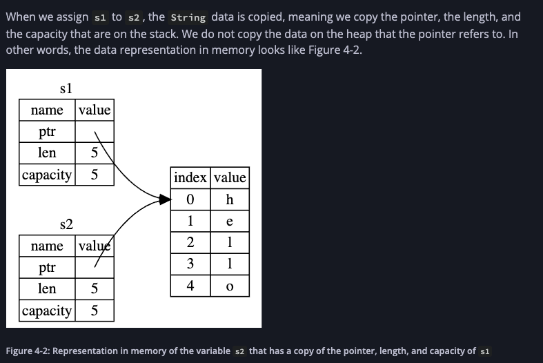
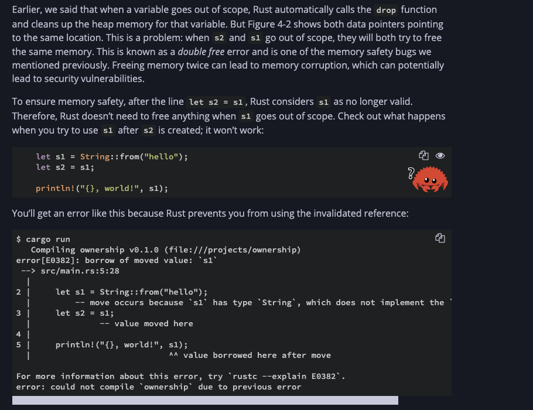
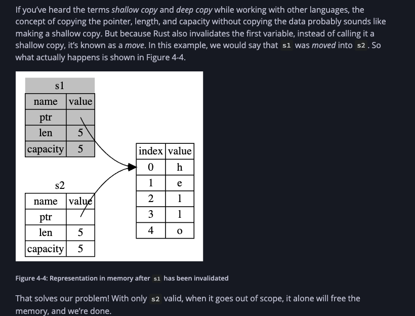

# Ownership

_Ownership_ is a set of rules that governs how a Rust program manages memory. 

All programs have to manage the way they use a computer’s memory while running. Some languages have garbage collection that constantly looks for no-longer used memory as the program runs; in other languages, the programmer must explicitly allocate and free the memory. 

Rust uses a third approach: memory is managed through a system of ownership with a set of rules that the compiler checks. 

If any of the rules are violated, the program won’t compile. None of the features of ownership will slow down your program while it’s running.

### Ownership Rules

* Each value in Rust has a variable that’s called its _owner_.
* There can only be one owner at a time.
* When the owner goes out of scope, the value will be dropped.

Rust approach: The memory assigned to a value on heap is automatically returned once the variable that owns it goes out of scope.

```rust
fn main() {
    {
        let s = String::from("hello"); // s is valid from this point forward

        // do stuff with s
    }                                  // this scope is now over, and s is no
                                       // longer valid
}
```

There is a natural point at which we can return the memory our `String` needs to the allocator: when `s` goes out of scope. 

When a variable goes out of scope, Rust calls a special function for us. This function is called [`drop`](https://doc.rust-lang.org/std/ops/trait.Drop.html#tymethod.drop), and it’s where the author of `String` can put the code to return the memory. Rust calls `drop` automatically at the closing curly bracket.


### Move

Consider:

```rust
fn main() {
    let s1 = String::from("hello");
    let s2 = s1;
}
```







The Following types implement Copy trait: 

* All the integer types, such as `u32`.
* The Boolean type, `bool`, with values `true` and `false`.
* All the floating point types, such as `f64`.
* The character type, `char`.
* Tuples, if they only contain types that also implement `Copy`. For example, `(i32, i32)` implements `Copy`, but `(i32, String)` does not.


—

### References

A _reference_ is like a pointer in that it’s an address we can follow to access data stored at that address that is owned by some other variable. 

Unlike a pointer, a reference is guaranteed to point to a valid value of a particular type.


```rust
fn main() {
    let s1 = String::from("hello");

    let len = calculate_length(&s1);

    println!("The length of '{}' is {}.", s1, len);
}

fn calculate_length(s: &String) -> usize {
    s.len()
}
```
The `&s1` syntax lets us create a reference that _refers_ to the value of `s1` but does not own it. Because it does not own it, the value it points to will not be dropped when the reference stops being used.

### Mutable References

We can't modify a normal reference, as shown below. Just as variables are immutable by default, so are references. We’re not allowed to modify something we have a reference to.

```rust
fn main() {
    let s = String::from("hello");

    change(&s); 
}

fn change(some_string: &String) {
    some_string.push_str(", world");  // compiler error
}
```

Mutable Reference: 

```rust
fn main() {
    let mut s = String::from("hello");

    change(&mut s);
}

fn change(some_string: &mut String) {
    some_string.push_str(", world");
}
```

#### Restrictions: 

Mutable references have one big restriction: you can have only one mutable reference to a particular piece of data at a time.

Moreover: We _also_ cannot have a mutable reference while we have an immutable one to the same value. 

Users of an immutable reference don’t expect the value to suddenly change out from under them! However, multiple immutable references are allowed because no one who is just reading the data has the ability to affect anyone else’s reading of the data.

### Rules of References: 

* At any given time, you can have _either_ one mutable reference _or_ any number of immutable references.
* References must always be valid.


—

## Slice Type

_Slices_ let you reference a contiguous sequence of elements in a collection rather than the whole collection. 

A slice is a kind of reference, so it does not have ownership.

### String Slices

String slices have type `&str` (as opposed to the regular `String`)

We create slices using a range within brackets by specifying `[starting_index..ending_index]`, where 
    `starting_index` is the first position in the slice and 
    `ending_index` is one more than the last position in the slice.

```rust
fn main() {
    let s = String::from("hello world");

    let hello = &s[0..5];  // slice
    let world = &s[6..11];
    let slice = &s[..2];
    let slice = &s[3..];
}
```

### Other slices

```rust

#![allow(unused)]
fn main() {
let a = [1, 2, 3, 4, 5];

let slice = &a[1..3]; // this slice has type &[i32]

}
```