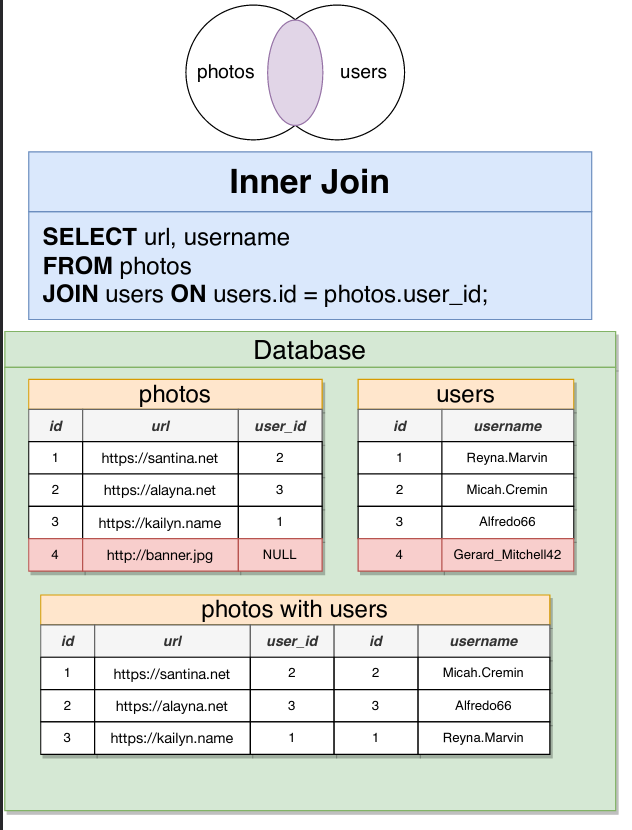

# SQL 

## Many-to-One & One-to-Many relationships 

Whenever we say, x has many y's, that indicates a one-to-many relationship.

Whenever we say, y belongs to an x, or y has one x, that indicates a many-to-one relationship.

Example: 

Imagine you are building a database for a large company.  The company has multiple offices around the country, and each employee must be assigned to work at a single office.

You decide to create a table of `offices` and table of `employees` .

From the perspective of the office, how would you describe the relationship between an office and an employee?

Answer:
    An Office has many employees (One-to-Many)
    An Employee has one office (Many-to-One)

## Many-to-Many & One-to-One relationships 

These relationships do not exist directly in a SQL database.

**One-to-One**
Examples: 
    A Boat has only one Captain, and a Captain can only operate one Boat
    CEO-Company
    Capital City - Country 
    Student - Desk 
    Person - Driver's License
    
**Many-to-Many**
Examples: 
    Students - Classes 
    Tasks - Engineers 
    Players - Football Matches 
    Movies - Actors
    Conference Calls - Employees
   
## Foreign Keys 
 
In one-to-many relationships, the "many" side holds the foreign key to the "one" side. 

Example: An Office has many Employees
    - In the Employees table, we will put the Foreign Key of OfficeId

In postgres, we define foreign keys like this: 

`user_id INTEGER REFERENCES users(id)`
 
### Deleting a record that is Foreign Key to another record - DELETE constraints

We set these Delete constraints like this 

`user_id INTEGER REFERENCES users(id) ON DELETE CASCADE`

Example: `photos` table has a `user_id` column which references `users`

| On Delete Option      | What happens when you try to delete a user when a photo is still referencing it |
|-----------------------|---------------------------------------------------------------------------------|
| ON DELETE RESTRICT    | Throw an error                                                                  |
| ON DELETE NO ACTION   | Throw an error                                                                  |
| ON DELETE CASCADE     | Delete the photo too!                                                           |
| ON DELETE SET NULL    | Set the `user_id` of the photo to NULL                                          |
| ON DELETE SET DEFAULT | Set the `user_id` of the photo to a default value, if one is provided           |

## Primary Keys

Postgres has `SERIAL` datatype to indicate to the database that we need a unique Foreign Keys. 

We use `id SERIAL PRIMARY KEY` to define Primary keys

*** 

## Joins & Aggregates 

### Joins 

- Produces vales by merging together rows from different related tables 
- Use a join most times that you're asked to find data that involves multiple resources

### Aggregation 

- Looks at many rows and calculates a single value 
- Words like 'most', 'average', 'least' are a sign that we need to use aggregation

### Different Joins

#### Inner Join

#### Left Outer Join 

#### Right Outer Join

#### Full Join

### A gotcha with `COUNT`

`COUNT` does not count null values

For Example: 

`SELECT COUNT(user_id) FROM photos`, if there is a photo without a `user_id` (where the user_id is NULL), it will not be counted.

However, if we do `SELECT COUNT(*) FROM photos`, it will then count all rows.

*** 

## Data Types 

### Numeric Types 

| Numeric Types Fast Rules                                      |                  |                                                      |
|---------------------------------------------------------------|------------------|------------------------------------------------------|
| "id" column of any table                                      | serial           |                                                      |
| Need to store a number without a decimal                      | Integer          |                                                      |
| Need to store a number with decimal, but HIGH ACCURACY needed | numeric          | Bank Balance, grams of gold, scientific calculations |
| Need to store a decimal number, LOW accuracy                  | double precision | kilograms of trash, liters of water, air pressure    |

### Character Types 

In postgres, Character types DO NOT hamper/enhance performance, therefore, use the best type suited for your needs without worrying about optimization.

|             |                                                                                      |
|-------------|--------------------------------------------------------------------------------------|
| CHAR(5)     | Store some characters, length will always be 5, even if PG has to insert spaces      |
| VARCHAR     | Store any length of string                                                           |
| VARCHAR(40) | Store a string up to 40 characters, auto remove extra characters, no spaces inserted |
| TEXT        | Store any length of string                                                           |

### Boolean Types 

|                                                          |       |
|----------------------------------------------------------|-------|
| 'true', 'yes', 'on', 1, 't', 'y'  (strings and a number) | true  |
| 'false', 'no', 'off', 0, 'f', 'n'                        | false |
| null                                                     | null  |

### Times, Dates & Timestamps

#### Date

Given in almost any format, Postgres can successfully parse most date strings, examples: 

All these will be parsed as `1980-11-20` type date

- '1980-11-20'
- 'Nov-20-1980'
- '20-Nov-1980'
- '1980-November-20'
- 'November 20, 1980'
- 'Nov 20 1980'
- '20 NOv 1980'

#### Time, with or without timezone

Postgres stores `time without timezone` in 24-hour format.

Examples: 

- '05:23 PM'  - stored as `17:23:00` (type: time without time zone) 
- '05:23PM'
- '20:34'

Postgres can also store `time with time zone`

Examples

- '01:23 AM MDT' = `01:23:00-06:00` (type: time with time zone)
- '01:23 AM z' OR '01:23 AM UTC' = `01:23:00+00:00`

#### Timestamps

Full DateTime along with OR without Time zone offset information

Example:

- 'June 30 2021 10:00 AM MDT' (type: TIMESTAMP WITH TIME ZONE) = "2021-06-30 10:00:00-06"

### Intervals

Think of an interval as a duration of time 

- `1 day` or `1 D`represented as `1 day`
- `1D 1M 1S` = `1 day 00:01:01`

We can add/subtract intervals 

- `1 D 20 H 30 M 45 S :: Interval - 1 D :: Interval` = `20:30:45` (type interval)

We can add/subtract intervals from timestamps

- `July 1 2021 9:15 AM MDT :: TIMESTAMP with time zone` - `1 D' :: interval` = `2021-06-30 09:15:00-06`

If we addd/substract two timestamps, we get the difference back in interval

- `July 1 2021 9:15 AM MDT'::TIMESTAMP with time zone` - `June 30 2021 10:15 AM MDT' :: TIMESTAMP with time zone` = `23:00:00`

---
