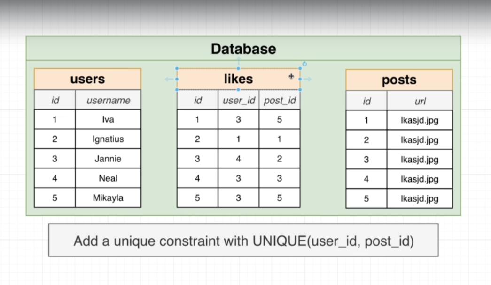
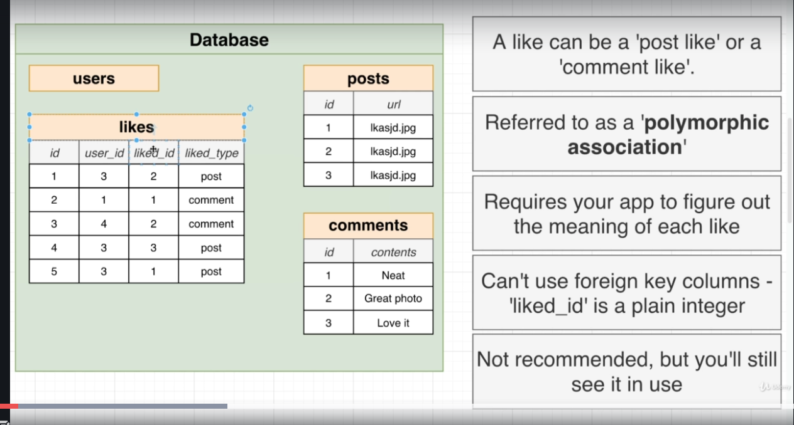
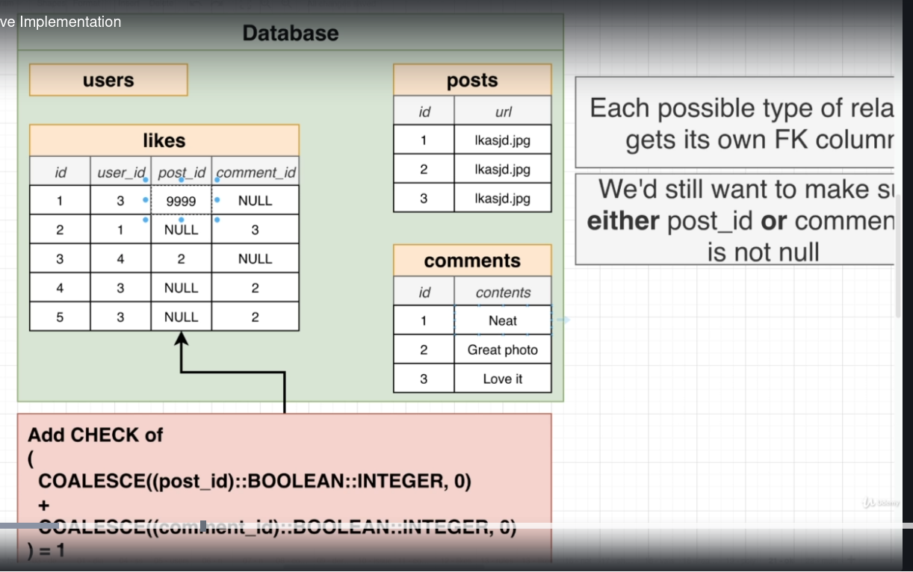
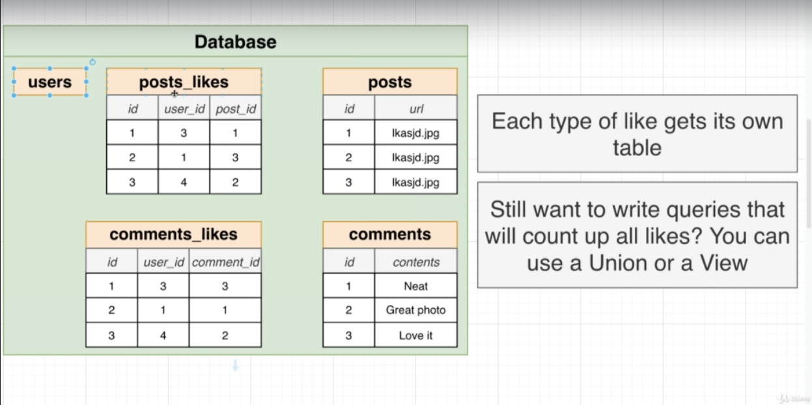

## DB Structure Design patterns

1. One way to implement a "Like" system - (a user can like multiple posts, a post can be liked by multiple users)

2. However, if we have more than one "Reaction" type (e.g. "Like", "Frown", "love", "care" etc.), then a technique called `polymorphic associations` is used.

The major problem with polymorphic associations is that we cannot use "foreign keys" for each entry in the polymorphic table, this data consistency becomes difficult.

3. Alternate way to implement `polymorphic associations`

We can now use foriegn keys.

The main problem here is that for each reaction type, we have to add a new column and initiate with null values.

Plus, the check/validation must be modified so that no more than 1 column has a non-null value at any given row.

4. Simplest alternative is to have an xref table for each reaction type.

The main drawback here is that the number of table increases, and querying becomes difficult.