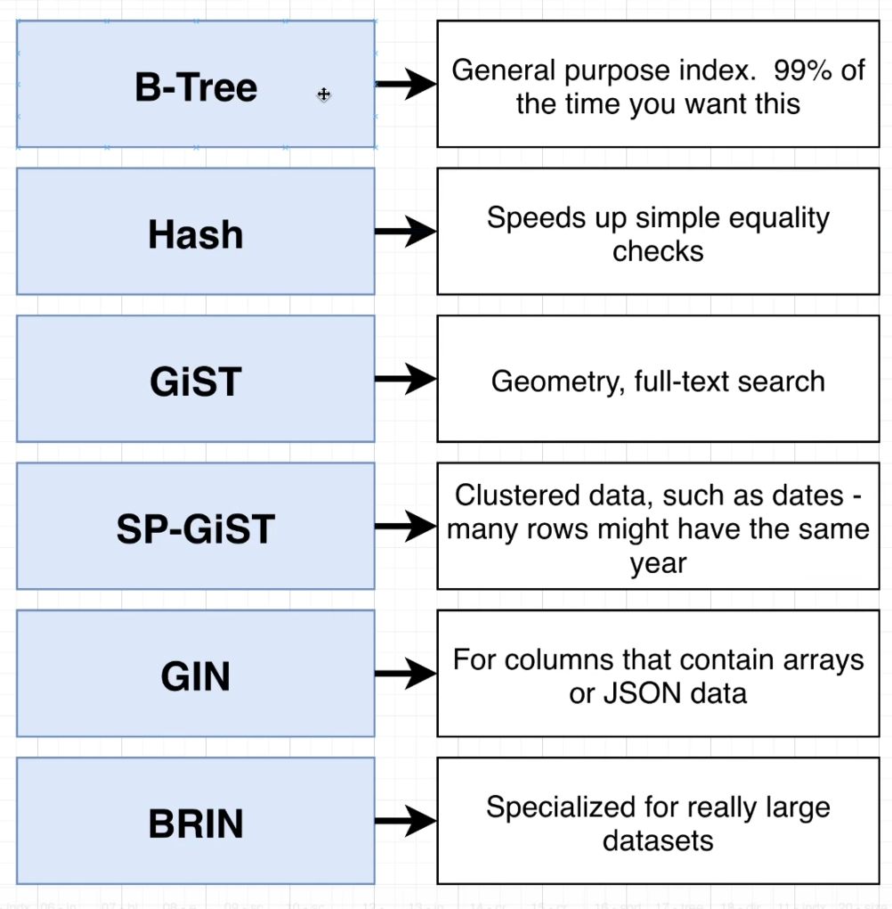

# Postgres Internals


- Query: `SHOW data_directory;` will show the directory where postgres is installed. (e.g. `var/lib/postgresql/12/main`)

Inside the above directory, there is a `/base` directory, where each database is stored in individual folders with unique number indentifiers.

- Query: `SELECT oid, datname FROM pg_database;` will show the list of the database with their ids


- Inside each database folders, there are tons of files storing raw data stored inside the database.

Query: `SELECT * FROM pg_class;` shows all these files.


### Heaps, Blocks and Tuples


Each Block/Page can store 0 or more Items.

Each Block is 8kb large.


The right hand side shows the byte map (a representation for actual bits stored on the hard drive) for each block as shown below.


Documentation on the above page format: https://www.postgresql.org/docs/current/storage-page-layout.html

### Full Table Scans 

Full Table Scans occur when Postgres has to load many (or all) rows from the heap file (stored on HD) in to Memory. 

Full Table scans, frequently, but not always, result in poor performance, and whenever we find a FTS, we should investigate further to find an alternative way of querying data.

Example FTS Query:


### Index

Indexes are one way to avoid FTS.

Index are a Data Structure (a B-Tree) that efficiently tells us what block/index a record is stored at.


We can create an index with query: `CREATE INDEX ON users (username);`, this creates an index on `username` column of `users` table.

By default, the index is named in this format: `name of table_name of column_ idx`, e.g `users_username_idx`

To delete an index, we query: `DROP INDEX users_username_idx;`

Postgres creates the following indexes automatically
- Postgres automatically creates an index for the Primary Key column of every table.
- Postgres automatically creates an index for any `unique` constraints.

Note: these auto indexes don't get listed under the `indexes` menu item in PGAdmin. We can use the following query to list all indexes: 

`SELECT relname, relkind FROM pg_class WHERE relkind = 'i';`

Indexing on a column can greatly increase performance, but it comes with its own cost.

1. Since index store a tree data structure for speed, the memory footprint of the database increases. 
2. Indexing slows down insert/update/delete - since the index needs to be updated everytime
3. Index might not actually get used after all - just because an index exist, does not mean the Postgres is actually going to use it. 
4. Some queries are faster without indexes.

Index are of several different types in Postgres (Just be aware of this fact).




#### Index under the hood


Index files are indentical in structure to the Heap files.

---

### The Query processing pipeline


- Parser: figuring out the meaning of the query, and validate that the query is valid. This step builds a Query Tree.
- Rewrite: Decompose views into underlying table references. This checks the Query Tree and modifies it to speeden things.
- Planner: Important piece: takes a look at Query Tree and come up with different plans to fetch that data.
- Execute: Run the plan given by the planner.

### EXPLAIN and EXPLAIN ANALYZE

EXPLAIN shows a query plan without executing it.
EXPLAIN ANALYZE shows a query plan, executes it and shows statistics about the execution.


The two numbers for the cost (8.31 .. 1756.11) are not a range.

The first number is the Cost for this step to produce the first row. **Startup Cost**

The second number is the Cost for this step to produce all rows. **Total Cost**

The reason is that in case of multiple processing steps, sometimes, as soon as the first row is processed, its result is passed to the next step (kinda like a stream).


Another point to note about costs in the second diagram below is that the costs flow up, i.e. a parent's cost is the sum of the cost of all its children + its own cost.

That is why the last HashJoin (blue) has a cost of 8.3, when in fact its own cost is close to zero. That cost is coming from the child Hash.


### How query cost is calculated 


More detailed: 


Official docs for each of these costs: https://www.postgresql.org/docs/9.5/runtime-config-query.html

These costs are all comapred to the baseline cost `seq_page_cost`


#### Quiz 

The formula for calculating the cost of a processing step in a query plan is: 

```
COST = (# pages read sequentially) * seq_page_cost
            + (# pages read at random) * random_page_cost
            + (# rows scanned) * cpu_tuple_cost 
            + (# index entries scanned) * cpu_index_tuple_cost 
            + (# times function/operator evalutated) * cpu_operator_cost

where 

seq_page_cost = 1.0 
random_page_cost = 4.0 
cpu_tuple_cost = 0.01 
cpu_index_tuple_cost = 0.005 
cpu_operator_cost = 0.0025
```

1. What is the cost for a query node that has to open 5 pages of data sequentially and then process 100 rows total? 

Answer: 5 x 1 + 100 x 0.01 = 6

2. What is the cost for a query node that has to open 4 pages of an index (probably at random), process 75 tuples from the index, then open 20 different pages from a heap file (also at random) and process 214 tuples?

Answer: 4 x 4 + 75 x 0.005 + 20 x 4 + 214 x 0.01 = 98.515